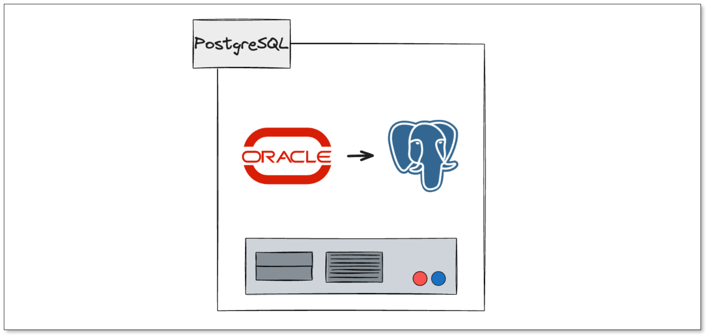
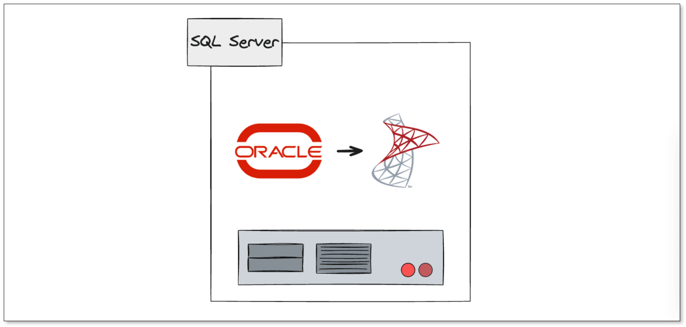
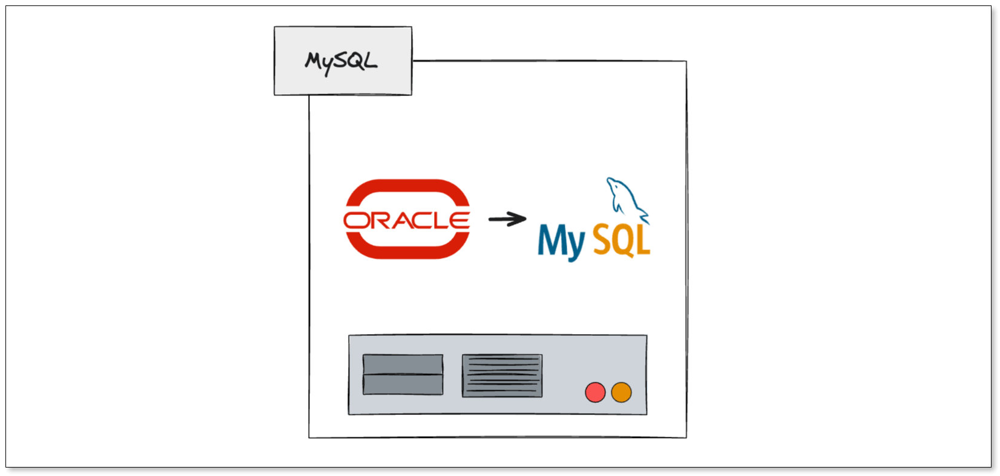
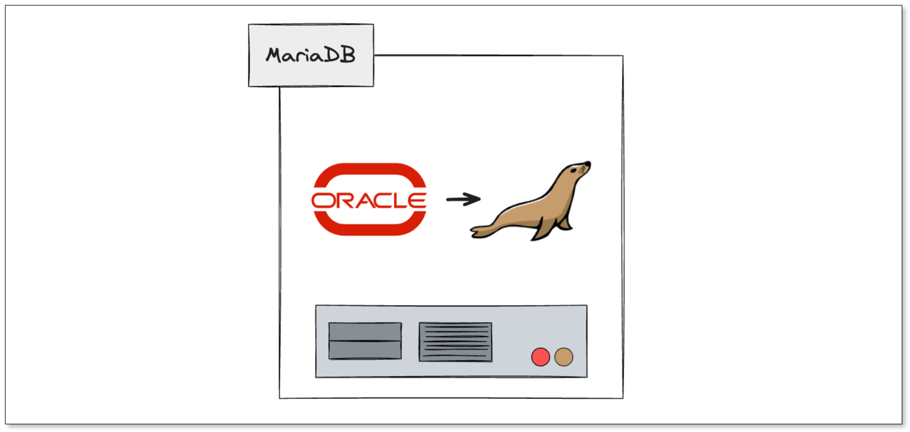
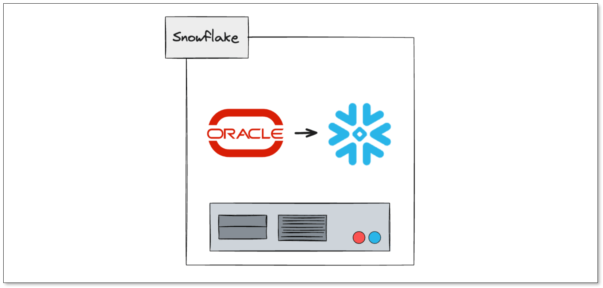
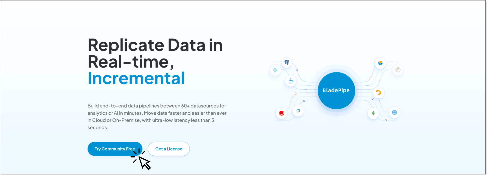

For decades, **Oracle Database** has been one of the most widely adopted enterprise database platforms in the world. It powers mission-critical applications across industries including finance, healthcare, manufacturing, telecommunications, and government.

However, many organizations are now reevaluating their database strategies. Rising licensing fees, complex licensing models, increasing cloud adoption, and the desire to avoid vendor lock-in have encouraged businesses to explore Oracle database alternatives.

The good news is that modern database technologies have matured significantly. Today, organizations can choose from powerful open-source databases, cloud-native platforms, and managed services that offer enterprise-grade reliability while reducing licensing and operational costs.

In this guide, we'll examine **five Oracle database alternatives** that can help organizations reduce expenses while maintaining performance, scalability, and availability. We'll also compare each option against Oracle and discuss how to migrate Oracle workloads with minimal disruption.

## Oracle Database Alternatives Comparison

The following table provides a quick overview of the five Oracle alternatives covered in this guide.

| Database   | Open Source | Best For                                                                     | Licensing Model                                                         | Cloud Support | Migration Complexity |
| ---------- | ----------- | ---------------------------------------------------------------------------- | ----------------------------------------------------------------------- | ------------- | -------------------- |
| PostgreSQL | Yes         | Enterprise OLTP, cloud modernization, workloads needing advanced SQL features | PostgreSQL License; optional paid support from vendors and cloud providers | Excellent     | Medium               |
| SQL Server | No          | Microsoft-centric organizations, business applications                       | Commercial licensing; per-core or Server + CAL depending on edition     | Excellent     | Medium               |
| MySQL      | Yes         | Web applications, SaaS platforms, e-commerce systems                         | Open source under GPL; commercial support available                     | Excellent     | Medium               |
| MariaDB    | Yes         | Cost-conscious organizations, MySQL users seeking more flexibility           | Open source under GPL; commercial subscriptions available                | Good          | Medium               |
| Snowflake  | No          | Data warehousing, analytics, business intelligence                           | Consumption-based pricing, including compute and storage usage          | Excellent     | Medium to High       |

While all five platforms can help reduce Oracle-related costs, they address different use cases. PostgreSQL is often considered the closest open-source alternative to Oracle for enterprise workloads. SQL Server remains a strong commercial competitor, while MySQL and MariaDB appeal to organizations prioritizing simplicity and affordability. Snowflake is best suited for companies modernizing analytics and reporting environments rather than replacing transactional databases directly.

When evaluating Oracle database alternatives, focus on your workload requirements, scalability expectations, operational expertise, and long-term cloud strategy rather than licensing costs alone.

For licensing details, it is always worth checking the vendor's official pages before making a final decision.

Quick take:

* Best open-source Oracle alternative: PostgreSQL
* Best Microsoft stack alternative: SQL Server
* Best analytics alternative: Snowflake

## How to Evaluate Oracle Database Alternatives

Before choosing a replacement for Oracle Database, it's important to understand what you're optimizing for.

Different organizations have different priorities. Some want to reduce licensing costs. Others want better cloud integration, simplified operations, or improved scalability.

When evaluating Oracle alternatives, consider the following factors:

* Licensing and subscription costs
* Performance under transactional workloads
* High availability and disaster recovery capabilities
* Cloud compatibility
* Ecosystem and community support
* Migration complexity
* Operational overhead
* Long-term scalability

The best Oracle alternative depends on your specific workload, technical expertise, compliance requirements, and business goals.

## 1. PostgreSQL

### Why Choose PostgreSQL?

PostgreSQL has become the most popular Oracle replacement for enterprises seeking a powerful open-source database.

Unlike many traditional open-source databases, PostgreSQL offers advanced enterprise features such as ACID compliance, sophisticated indexing, partitioning, replication, JSON support, stored procedures, and strong extensibility.

Major cloud providers including AWS, Microsoft Azure, and Google Cloud all provide managed PostgreSQL services, making it easier for organizations to modernize their infrastructure.

Because PostgreSQL is open source, companies can eliminate Oracle licensing fees while still maintaining a highly capable relational database platform.

### Strengths

* No licensing costs
* Strong SQL compliance
* Large global community
* Extensive cloud support
* Advanced replication capabilities
* Excellent performance for transactional workloads

### Potential Limitations

* Oracle-specific features may require redesign
* PL/SQL code often needs conversion
* Some enterprise tools require alternatives

### PostgreSQL vs Oracle

When comparing Oracle vs PostgreSQL, the most significant difference is cost. Oracle typically requires substantial licensing investments, while PostgreSQL can be deployed without database licensing fees.

Oracle still maintains advantages in certain enterprise environments through features such as Real Application Clusters (RAC) and decades of enterprise tooling. However, PostgreSQL has significantly narrowed the feature gap and is now widely used for mission-critical workloads.

For organizations prioritizing cost reduction and cloud adoption, PostgreSQL is often the first alternative considered during Oracle modernization projects.

Official references: [PostgreSQL license](https://www.postgresql.org/about/licence/?lang=en) and [PostgreSQL documentation](https://www.postgresql.org/docs/).

## 2. Microsoft SQL Server

### Why Choose SQL Server?

Microsoft SQL Server remains one of Oracle's strongest commercial competitors.

Organizations already invested in the Microsoft ecosystem often find SQL Server attractive because of its integration with Windows Server, Active Directory, Azure services, Power BI, and other Microsoft technologies.

SQL Server offers enterprise-grade security, performance optimization features, advanced analytics capabilities, and mature administration tools.

For many enterprises, SQL Server delivers comparable functionality at a lower overall cost than Oracle.

### Strengths

* Mature enterprise platform
* Strong Microsoft ecosystem integration
* Excellent management tools
* Advanced analytics features
* Hybrid cloud support

### Potential Limitations

* Licensing costs still exist
* Less flexible than open-source alternatives
* Some advanced features require premium editions

### SQL Server vs Oracle

Oracle and SQL Server have competed for enterprise workloads for decades.

Oracle often excels in very large-scale deployments and certain specialized enterprise environments. SQL Server, however, is frequently easier to manage and can provide lower total cost of ownership, particularly for organizations already standardized on Microsoft technologies.

Businesses running ERP systems, internal business applications, and data-intensive workloads often evaluate SQL Server as a direct Oracle replacement.

Official reference: [Microsoft SQL Server licensing guidance](https://www.microsoft.com/licensing/guidance/SQL).

## 3. MySQL

### Why Choose MySQL?

MySQL remains one of the most recognized database platforms in the world.

It powers countless web applications, SaaS products, content management systems, and e-commerce platforms. Its simplicity, broad adoption, and large talent pool make it an attractive option for organizations seeking a lower-cost alternative to Oracle.

Many development teams already have experience with MySQL, reducing training requirements and accelerating adoption.

### Strengths

* Open-source foundation
* Large user community
* Extensive hosting support
* Easy administration
* Strong ecosystem

### Potential Limitations

* Fewer enterprise features than Oracle
* Less suitable for highly complex workloads
* Advanced scalability often requires additional architecture

### MySQL vs Oracle

Oracle Database and MySQL serve somewhat different markets.

Oracle is designed primarily for complex enterprise applications, while MySQL is often preferred for web-scale applications and SaaS environments.

For organizations with moderate transactional workloads and a strong focus on cost reduction, MySQL can provide substantial savings while maintaining reliability and performance.

Companies modernizing legacy Oracle applications frequently evaluate whether their workload actually requires Oracle-level complexity. In many cases, MySQL proves sufficient.

## 4. MariaDB

### Why Choose MariaDB?

MariaDB originated as a community-driven fork of MySQL and has evolved into a mature enterprise database platform.

It offers compatibility with many MySQL applications while introducing additional performance enhancements, storage engines, and enterprise capabilities.

Organizations seeking an open-source database with commercial support options often consider MariaDB a strong candidate.

MariaDB is especially attractive for teams that want MySQL compatibility with more flexibility in deployment and licensing strategy.

### Strengths

* Open-source licensing model
* MySQL compatibility
* Commercial support available
* Flexible deployment options
* Strong performance improvements

### Potential Limitations

* Smaller ecosystem than MySQL
* Some compatibility considerations
* Fewer enterprise deployments than Oracle

### MariaDB vs Oracle

Compared with Oracle, MariaDB dramatically reduces licensing expenses while providing a familiar relational database experience.

Although Oracle still offers broader enterprise functionality in certain areas, MariaDB is often sufficient for organizations prioritizing cost control, flexibility, and open-source adoption.

For small and mid-sized enterprises looking to move away from expensive proprietary platforms, MariaDB can be a compelling alternative.

## 5. Snowflake

### Why Choose Snowflake?

Not every organization replaces Oracle with another transactional database.

Many businesses are modernizing their analytics infrastructure and moving reporting, business intelligence, and data warehousing workloads to cloud-native platforms.

Snowflake has emerged as one of the most popular choices for this transformation.

Its architecture separates storage and compute resources, enabling organizations to scale workloads independently while paying only for the resources they consume.

### Strengths

* Cloud-native architecture
* High scalability
* Strong analytics performance
* Simplified management
* Multi-cloud deployment support

### Potential Limitations

* Not a direct OLTP database replacement
* Consumption-based pricing requires monitoring
* Analytics-focused rather than transaction-focused

### Snowflake vs Oracle

When comparing Snowflake vs Oracle, it is important to understand the workload being evaluated.

If the goal is replacing transactional Oracle applications, PostgreSQL or SQL Server may be better choices.

If the goal is modernizing data warehouses, reporting environments, and analytics platforms, Snowflake often provides significant advantages in scalability, flexibility, and operational simplicity.

Many organizations now migrate analytical workloads from Oracle to Snowflake while maintaining separate operational databases.

Official reference: [Snowflake pricing](https://www.snowflake.com/en/pricing-options/).

## How to Migrate Away from Oracle Without Downtime

Selecting a new database platform is only the first step.

The real challenge is moving production workloads without disrupting business operations.

A successful Oracle migration typically involves:

1. Assessing schemas and dependencies
2. Migrating historical data
3. Synchronizing ongoing changes
4. Validating data consistency
5. Performing cutover with minimal downtime

For mission-critical systems, downtime is often unacceptable. Traditional export/import approaches can require lengthy maintenance windows and introduce operational risk.

This is why many organizations adopt [Change Data Capture (CDC) technologies](/blog/data_insights/change_data_capture_cdc.md) to continuously replicate changes from Oracle to the target platform during migration.

CDC enables businesses to keep source and target systems synchronized while testing applications and validating data before final cutover.

## How BladePipe Simplifies Oracle Migration and Real-Time Data Streaming

Whether you're migrating from Oracle to [PostgreSQL](/blog/tech_share/migrate_oracle_to_postgresql.md), [SQL Server](/blog/tech_share/oracle_sqlserver_sync.md), MySQL, MariaDB, [Snowflake](/blog/tech_share/migrate_oracle_to_snowflake.md), [Kafka](/blog/tech_share/stream_data_from_oracle_to_kafka.md), or other modern platforms, one of the biggest challenges is keeping data synchronized throughout the migration process.

**[BladePipe](https://www.bladepipe.com/)** helps organizations simplify Oracle migration and real-time data integration through a CDC-based approach to enable efficient and secure data movement.

Key capabilities include:

* **Real-time Oracle Change Data Capture**: Millisecond-level change data capture with sub-3-second latency
* **Full Load + Incremental Sync**: Supports both full data migration and real-time incremental sync, dramatically reducing migration downtime
* **DDL Synchronization**: Automatically propagates schema changes, eliminating manual maintenance overhead
* **Data Validation**: Built-in full data validation ensures data consistency after migration
* **High-Throughput Architecture**: Handles large-scale concurrent data synchronization to meet enterprise performance requirements
* **Broad Target Support**: Migrate to [60+ mainstream data sources and platforms](https://www.bladepipe.com/connector/) including PostgreSQL, SQL Server, MySQL, MariaDB, Snowflake, Kafka, [Elasticsearch](/blog/tech_share/oracle_es_sync.md), and more
* [**Flexible Deployment**](https://www.bladepipe.com/docs/price/plans_diff/): Available in Community Edition (free, self-hosted) and Commercial Edition (multi-tenancy, RBAC, audit logging, enterprise SLA), supporting both cloud and on-premises deployments.

Instead of relying on manual exports or [scheduled ETL jobs](/blog/data_insights/etl_steps_explained.md), organizations can continuously stream changes from Oracle into downstream systems. This reduces risk and accelerates migration timelines, while helping teams modernize their data infrastructure with greater confidence.

If you'd like to see Oracle CDC migration in action, [**try BladePipe free**](https://www.bladepipe.com/register/) and get started in minutes. **No Code, No Credit Card.**

## FAQ

### What is the best Oracle database alternative?

There is no single best Oracle alternative for every organization. PostgreSQL is often considered the leading choice because it combines enterprise-grade capabilities with an open-source licensing model. However, SQL Server may be a better fit for Microsoft-centric environments, while Snowflake is often preferred for analytics and data warehousing workloads.

### Oracle Database vs PostgreSQL: which is cheaper?

PostgreSQL is usually cheaper on direct licensing because it does not require a traditional database license fee, while Oracle typically involves commercial licensing and support costs. The real total cost still depends on infrastructure, support, migration effort, and operational overhead.

### Is PostgreSQL a good replacement for Oracle?

Yes. PostgreSQL is widely regarded as one of the strongest Oracle replacements available today. It supports advanced SQL features, replication, partitioning, JSON processing, and extensibility while eliminating expensive database licensing fees. Many enterprises have successfully migrated mission-critical workloads from Oracle to PostgreSQL.

### Can Snowflake replace Oracle Database?

It depends on the workload. Snowflake can replace Oracle data warehouses and analytical environments, but it is not typically used as a direct replacement for transactional Oracle databases that power operational applications. Many organizations move reporting and analytics workloads from Oracle to Snowflake while adopting another database platform for transactional processing.

### Why are companies moving away from Oracle?

Organizations often explore Oracle alternatives to reduce licensing costs, avoid vendor lock-in, simplify cloud adoption, lower operational overhead, and modernize legacy infrastructure. The growth of mature open-source databases and cloud-native platforms has created more options than ever before.

### Which Oracle alternative has the lowest licensing costs?

Open-source platforms such as PostgreSQL, MySQL, and MariaDB generally have the lowest licensing costs because they can be deployed without traditional database license fees. Organizations may still incur infrastructure, support, and operational expenses, but overall costs are often significantly lower than Oracle.

### How can I migrate from Oracle with minimal downtime?

Many organizations use Change Data Capture (CDC) technology to continuously replicate changes from Oracle to the target platform during migration. This approach keeps source and target databases synchronized, allowing teams to validate data and applications before performing a final cutover with minimal downtime.

## Conclusion

Oracle Database remains a powerful enterprise platform, but it is no longer the only viable option for organizations that require reliability, scalability, and performance.

**PostgreSQL is the strongest open-source choice for most transactional workloads. SQL Server fits Microsoft-centric environments, while Snowflake is better for analytics and data warehousing modernization.**

A good migration plan and CDC-based replication strategy still matter more than the database brand itself when the goal is to reduce risk and downtime.
