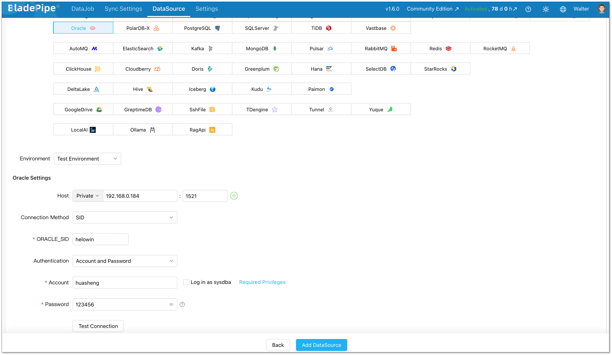
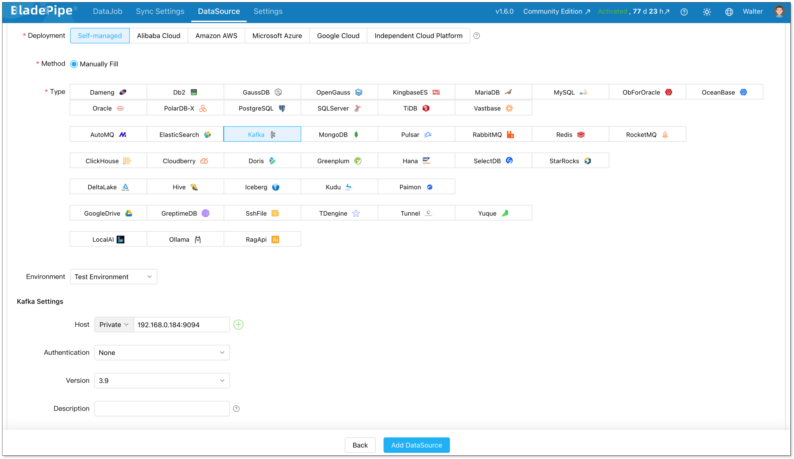
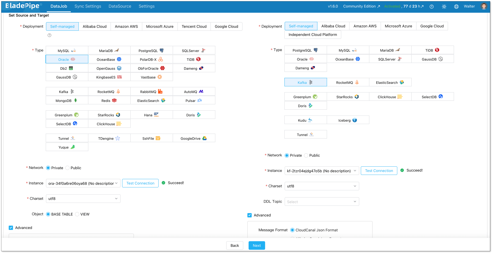
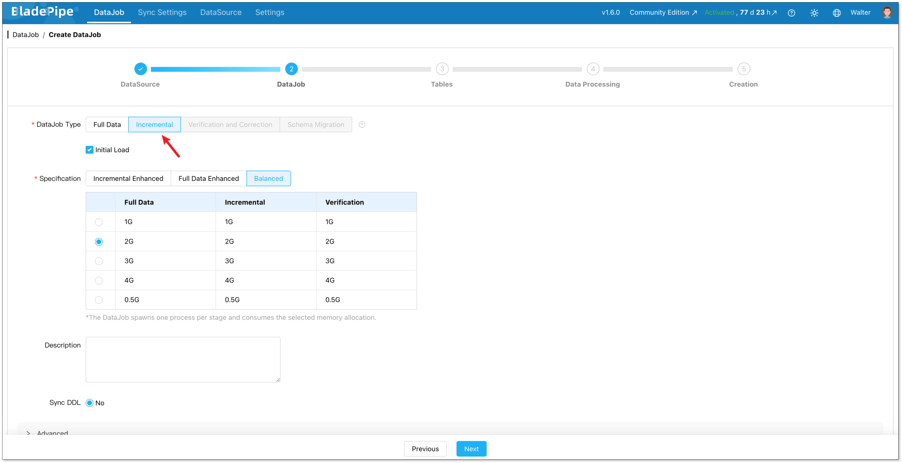
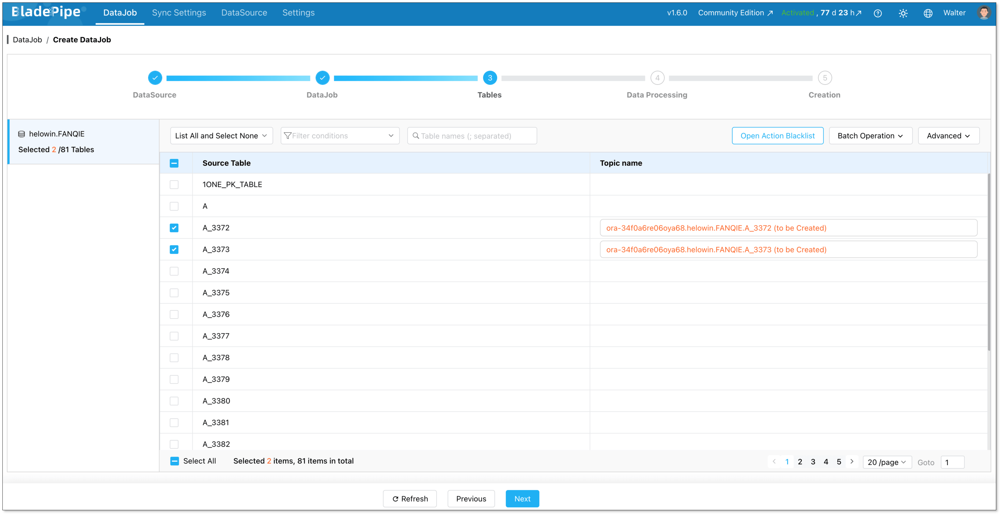
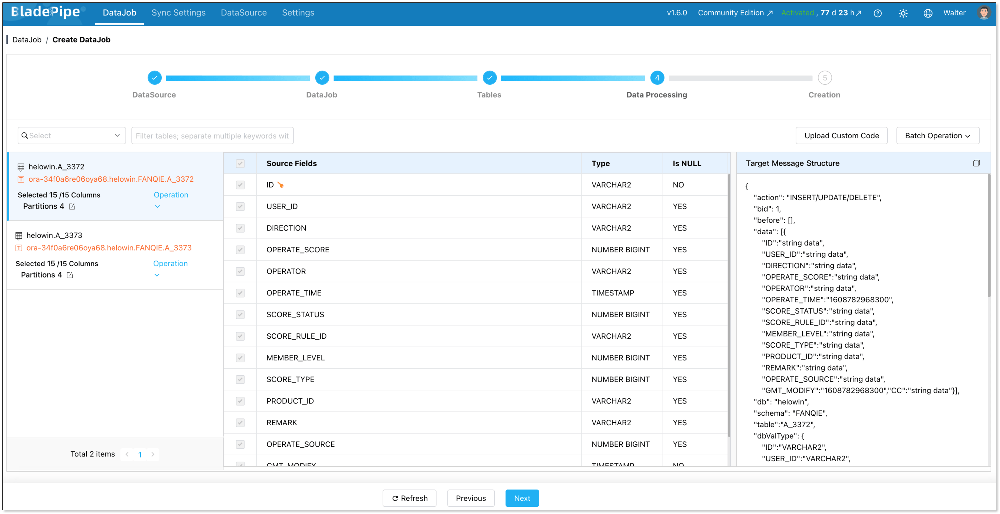
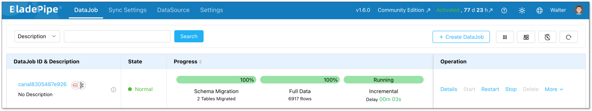

If your core business data still lives in Oracle, you are not alone.

Many teams still rely on Oracle for ERP, CRM, finance, and other critical systems. But the data often needs to go somewhere else too. Maybe your analytics team wants it in Snowflake. Maybe your data team wants it in Kafka. Maybe you need a standby Oracle database for disaster recovery.

That is where **Oracle database replication** comes in.

In simple terms, Oracle replication keeps Oracle data synchronized with another system, such as another Oracle database, a cloud data warehouse, or a real-time analytics database.

In this guide, we will look at what Oracle database replication means, why teams use it, which Oracle replication tools are commonly used, and how different replication methods work.

## What Is Oracle Database Replication?

[Oracle database replication](https://www.bladepipe.com/connector/oracle/) means copying data from an Oracle database and keeping the target system in sync with the source.

In a simple migration project, replication may happen once. A team exports Oracle data, loads it into another system, and switches the application later.

In a real-time data pipeline, replication is continuous. The system captures inserts, updates, and deletes from Oracle and applies them to the target with low latency. This is often done through Change Data Capture, or CDC.

Read more about [Oracle CDC](https://www.bladepipe.com/blog/data_insights/oracle_change_data_capture/).

### Why Move Data Between Oracle Databases?

Oracle-to-Oracle replication is common in traditional enterprise environments. It is usually used when teams want to improve availability, protect critical workloads, or reduce pressure on the primary database.

For example, a company may keep a standby Oracle database in another data center. If the primary database fails, the standby database can take over. Another team may replicate data to a read-only Oracle database so reporting queries do not affect production workloads.

Common Oracle-to-Oracle replication scenarios include:

- Disaster recovery
- Standby database
- Read scaling
- Data center migration
- Oracle version upgrade
- Hardware replacement

For these scenarios, Oracle-native tools such as Oracle Data Guard and Oracle GoldenGate are often considered.

### Why Move Data from Oracle to Non-Oracle Systems?

More Oracle replication projects today are Oracle-to-non-Oracle.

This happens because many companies still use Oracle as the system of record, but their analytics and data platforms have changed. Business teams may want fresh Oracle data in a warehouse. Data teams may want to stream Oracle changes into Kafka. Analytics teams may want to query Oracle data in ClickHouse or StarRocks.

Common Oracle-to-non-Oracle replication scenarios include:

- Oracle to Snowflake or Redshift for BI and reporting
- Oracle to [Kafka](https://www.bladepipe.com/connector/kafka/) for event-driven systems
- Oracle to [StarRocks](https://www.bladepipe.com/connector/starrocks/), [ClickHouse](https://www.bladepipe.com/connector/clickhouse/), or [Doris](https://www.bladepipe.com/connector/doris/) for [real-time analytics](https://www.bladepipe.com/real-time-analytics/)
- Oracle to [Iceberg](https://www.bladepipe.com/connector/iceberg/), [Paimon](https://www.bladepipe.com/connector/paimon/), or Delta Lake for lakehouse architecture
- Oracle to [PostgreSQL](https://www.bladepipe.com/connector/postgresql/) or [MySQL](https://www.bladepipe.com/connector/mysql/) for migration or application modernization

This kind of replication is more complex than copying data between two Oracle databases. The tool needs to handle schema conversion, data type mapping, full loading, incremental changes and more. That is why teams often choose dedicated Oracle replication tools instead of writing custom scripts.

## Main Types of Oracle Replication

Before comparing tools, it helps to understand the main types of Oracle replication.

### Physical Replication

Physical replication copies database blocks or files at the database level. It keeps a standby Oracle database physically consistent with the primary database.

This method is mainly used for Oracle-to-Oracle disaster recovery and high availability. Oracle Data Guard is a typical example.

Physical replication is strong for standby databases and failover. But it is not designed for sending selected Oracle tables to Kafka, warehouses, lakehouses, or analytics databases.

### Logical Replication

Logical replication copies data changes at the row, table, or transaction level. It is more flexible than physical replication because it can support selected tables and heterogeneous targets.

This approach is commonly used when teams replicate Oracle data to non-Oracle systems. It is also useful when the target schema is different from the source schema.

Tools such as BladePipe, Oracle GoldenGate, and Debezium are often associated with logical replication or CDC-style replication.

### Real-Time Change Capture

Real-time change capture usually means CDC, or Change Data Capture.

For Oracle, CDC often reads redo logs or archive logs to capture inserts, updates, and deletes. Compared with repeated full-table scans, log-based CDC can reduce source load and deliver changes with lower latency.

For modern Oracle database replication, especially Oracle-to-analytics or Oracle-to-lakehouse replication, CDC is often the preferred approach.

## Oracle Replication Tools Compared

There is no single Oracle replication tool that fits every case. Some tools are better for disaster recovery. Some are better for cloud migration. Some are better for real-time replication to modern data platforms.

Here is a quick comparison.

| Tool              | Best For                                                         | Main Strength                                                           |
| ----------------- | ---------------------------------------------------------------- | ----------------------------------------------------------------------- |
| BladePipe         | Oracle to warehouses, lakehouses, Kafka, and analytics databases | End-to-end CDC, full load, schema migration, validation, and monitoring |
| Oracle Data Guard | Oracle-to-Oracle disaster recovery                               | Mature Oracle-native standby database replication                       |
| Oracle GoldenGate | Complex enterprise replication                                   | Powerful and flexible replication for large environments                |
| AWS DMS           | Oracle migration into AWS                                        | Managed migration and replication for AWS workloads                     |
| Debezium          | Open-source Oracle CDC with Kafka                                | Flexible CDC for engineering teams                                      |

### BladePipe

[BladePipe](https://www.bladepipe.com/) is a real-time data replication platform for moving Oracle data to modern data systems. It is especially useful when the target is not another Oracle database, but a warehouse, lakehouse, Kafka, or real-time analytics database.

**Strengths:**

* Supports schema migration, full load, and incremental CDC in one workflow
* Maintains extreme low latency to keep Oracle data always fresh in downstream systems
* Provides data validation and correction
* Supports monitoring, alerts, checkpoint resume, and flexible deployment

**Best for:**
Teams that need production-grade Oracle replication to non-Oracle systems with less manual pipeline work.

### Oracle Data Guard

Oracle Data Guard is an Oracle-native solution for maintaining standby Oracle databases. It is mainly used for disaster recovery, high availability, and Oracle-to-Oracle migration.

**Strengths:**

* Mature and reliable for Oracle standby databases
* Supports failover and disaster recovery
* Can reduce pressure on the primary database when used with read-only standby workloads

**Best for:**
Teams that need Oracle-to-Oracle disaster recovery or standby database architecture.

### Oracle GoldenGate

Oracle GoldenGate is a mature enterprise replication tool for complex database environments. It can support low-latency replication and advanced replication patterns.

**Strengths:**

* Powerful and flexible for large enterprise environments
* Supports low-latency replication
* Can support Oracle-to-Oracle and some heterogeneous replication scenarios

**Best for:**
Large enterprises with complex replication needs, strong Oracle expertise, and enough resources to manage a more advanced setup.

### AWS DMS

[AWS Database Migration Service](https://www.bladepipe.com/blog/data_insights/aws_dms_vs_bladepipe/) is a managed service for database migration and replication into AWS. It is often used when teams move Oracle workloads to AWS services.

**Strengths:**

* Fully managed by AWS
* Useful for Oracle to Amazon RDS, Aurora, and Redshift
* Practical for AWS-centered migration projects

**Best for:**
Teams whose Oracle replication project is mainly part of an AWS migration.

### Debezium

[Debezium](https://www.bladepipe.com/blog/data_insights/debezium_alternatives/) is an open-source CDC platform commonly used with Kafka and Kafka Connect. It gives engineering teams flexibility when building event-driven data pipelines.

**Strengths:**

* Open source and Kafka-native
* Flexible for engineering teams
* Good fit for event-driven architectures

**Best for:**
Teams that already use Kafka and have the engineering resources to manage connectors, target writes, monitoring, schema changes, and data validation.

## Common Oracle Replication Methods

After understanding the tools, the next question is how Oracle replication is usually implemented.

Here are three common methods that are usually used in Oracle replication:

- **Method 1**: Automatic Oracle replication using BladePipe
- **Method 2**: Oracle replication using full dump and load
- **Method 3**: Continuous Oracle replication using Oracle GoldenGate

### Method 1: Automatic Oracle Replication with BladePipe

BladePipe is suitable for teams that need real-time Oracle database replication to modern data platforms.

The value of BladePipe is that it covers the full replication workflow. In many Oracle replication projects, CDC is only one part of the job. Teams also need to migrate schemas, load historical data, monitor latency, recover from failures, and validate data consistency.

BladePipe brings these steps into one platform, which reduces the need to build and maintain separate scripts, CDC jobs, connectors, monitoring tools, and validation processes.

Other features include:
- **Low-latency CDC**: BladePipe captures ongoing Oracle changes and applies them to the target system with latency less than 3 seconds, so downstream applications can use fresher data.
- **Multiple connectors**: BladePipe supports replication from Oracle and other sources to many modern systems, including warehouses, lakehouses, message queues, real-time analytics databases, and relational databases.
- **Schema evolution**: When Oracle table structures change, BladePipe helps handle schema changes automatically in the replication workflow, reducing manual maintenance.
- **Data transformation**: Teams can apply transformation logic during replication, so the target data can better fit downstream analytics or application needs.
- **[Flexible deployment](https://www.bladepipe.com/pricing/)**: BladePipe supports SaaS, BYOC, and private deployment, which is useful for teams with security, compliance, or network requirements.

A typical workflow looks like this:

#### Step 1: Connect to the Oracle Source

Download and [Install BladePipe](https://www.bladepipe.com/docs/productOP/onPremise/installation/install_all_in_one_docker/).

Log in to the Console. Go to **DataSources** > **Add DataSources**.

Configure the Oracle source connection in BladePipe. This includes the database address, service name, credentials, and required permissions.

#### Step 2: Choose the Target System

Select the target system and add it as a DataSource. Here we choose Kafka. Also configure Kafka connection.

#### Step 3: Build a Pipeline
Go to **DataJob** > **Create DataJob**

Select the source Oracle and target Kafka, and test the connection for both.

Configure the DataJob as **Incremental** plus **Initial Load**.

Select the tables to be replicated.

Select the columns to be replicated. You can also configure data transformation here.

Create the DataJob, and it runs automatically.

### Method 2: Oracle Replication Using Full Dump and Load

Full dump and load is the simplest way to move Oracle data. It is usually used for one-time migration, small datasets, or low-frequency batch movement.

This method is easy to understand and does not require a long-running replication pipeline.

The limitation is that it is not real time. If the Oracle source keeps changing, the target can quickly become outdated. For large databases, the export and import process can also be slow, and downtime may be required.

The workflow is straightforward:

#### Step 1: Export Data from Oracle

Export the required tables, schemas, or full database from Oracle. Common options include Oracle Data Pump, SQL export, or custom scripts.

#### Step 2: Move the Exported Files to the Target Environment

Transfer the exported files to the target database server or cloud storag. Check storage space, network stability, and file access permissions before loading.

#### Step 3: Convert Schemas and Data Types

If the target is not Oracle, convert Oracle schemas and data types to the target format. Pay attention to number precision, timestamps, CLOB/BLOB fields, character sets, indexes, and constraints.

#### Step 4: Import Data into the Target System

Load the exported data into the target system using the target database, warehouse, or lakehouse import method. For large tables, import in batches and monitor failed rows or load errors.

#### Step 5: Check Row Counts and Sample Records

Compare row counts between Oracle and the target system. Then sample key records and check primary keys, important fields, timestamps, and numeric values.

### Method 3: Oracle Replication with Oracle GoldenGate

Oracle GoldenGate is commonly used in large enterprise environments that need powerful and low-latency replication.

It can support complex Oracle replication scenarios and is often used by teams with strong Oracle expertise. Compared with full dump and load, GoldenGate is better suited for continuous replication. Compared with simpler platforms, it gives more control but also requires more operational effort. Teams should consider whether they have the skills, budget, and time to operate it well.

A typical GoldenGate workflow includes:

#### Step 1: Enable Required Logging and Permissions

Enable the required supplemental logging for change capture. Create or configure the GoldenGate user with the permissions needed to read Oracle logs and metadata.

#### Step 2: Configure Extract

Configure the Extract process to capture changes from Oracle redo logs or archive logs. Define the source tables and capture rules.

GoldenGate writes captured changes to trail files. These files store the change data before it is delivered and applied to the target.

#### Step 3: Configure Delivery to the Target Environment

Set up the delivery process to move trail files or captured changes to the target environment. Check network connectivity, file paths, and target access.

#### Step 4: Configure Replicat

Configure Replicat to read trail files and apply the changes to the target database. Define table mappings, conflict handling, and apply rules if needed.

#### Step 5: Monitor Lag, Errors, and Trail File Growth

Monitor Extract, delivery, and Replicat status. Track replication lag, apply errors, disk usage, and trail file growth.

## Conclusion

Oracle database replication now supports much more than disaster recovery. It helps teams move Oracle data into standby databases, warehouses, lakehouses and more systems.

For Oracle-to-Oracle protection, Oracle Data Guard is a strong choice. For complex enterprise replication, Oracle GoldenGate is mature but harder to operate. For real-time Oracle replication to modern data platforms, BladePipe provides a simpler end-to-end workflow.

If you need real-time Oracle replication to modern data platforms, BladePipe can help you simplify the process from schema migration and full load to CDC, monitoring, and data validation.

Start your Oracle replication project with [BladePipe](https://www.bladepipe.com/login/) and build a more reliable data pipeline from day one.

Read more:
- [Oracle to Snowflake](https://www.bladepipe.com/blog/tech_share/migrate_oracle_to_snowflake)
- [Oracle to PostgreSQL](https://www.bladepipe.com/blog/tech_share/migrate_oracle_to_postgresql)
- [Oracle to SQL Server](https://www.bladepipe.com/blog/tech_share/oracle_sqlserver_sync)
- [Oracle to ClickHouse](https://www.bladepipe.com/blog/tech_share/oracle_clickhouse_sync)
- [Oracle to Elasticsearch](https://www.bladepipe.com/blog/tech_share/oracle_es_sync)

## FAQ

**Q: What is Oracle database replication?**

Oracle database replication is the process of copying and keeping Oracle data synchronized with another system. The target can be another Oracle database, a data warehouse, Kafka, a lakehouse, or a real-time analytics database.

**Q: What is Oracle replication used for?**

Oracle replication is used for disaster recovery, standby databases, read scaling, reporting, real-time analytics, cloud migration, and data platform modernization.

**Q: What are the main types of Oracle replication?**

The main types include physical replication, logical replication, and real-time change capture. Physical replication is common for Oracle-to-Oracle standby databases, while logical replication and CDC are often used for Oracle-to-non-Oracle replication.

**Q: What are the best Oracle replication tools?**

Common Oracle replication tools include BladePipe, Oracle Data Guard, Oracle GoldenGate, AWS DMS, and Debezium. The best choice depends on your target system, latency needs, deployment model, and team resources.

**Q: What is the best method for real-time Oracle replication?**

For real-time Oracle replication, log-based CDC is usually the preferred method. It captures inserts, updates, and deletes from Oracle redo logs or archive logs with lower impact than repeated full-table scans.
