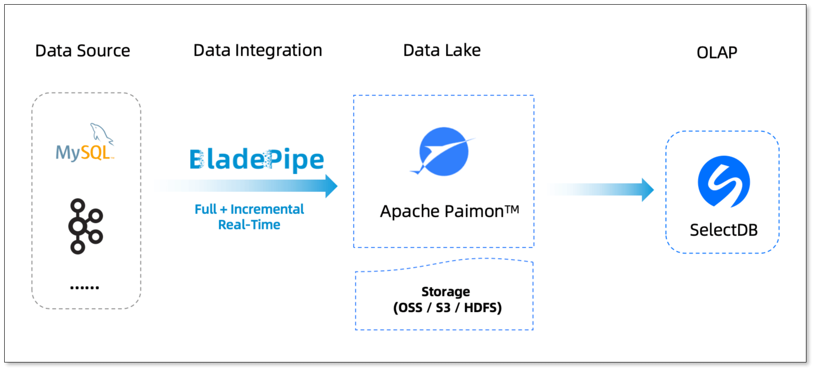
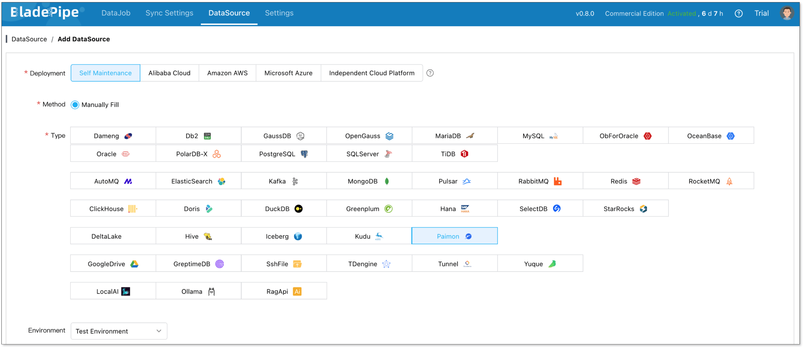
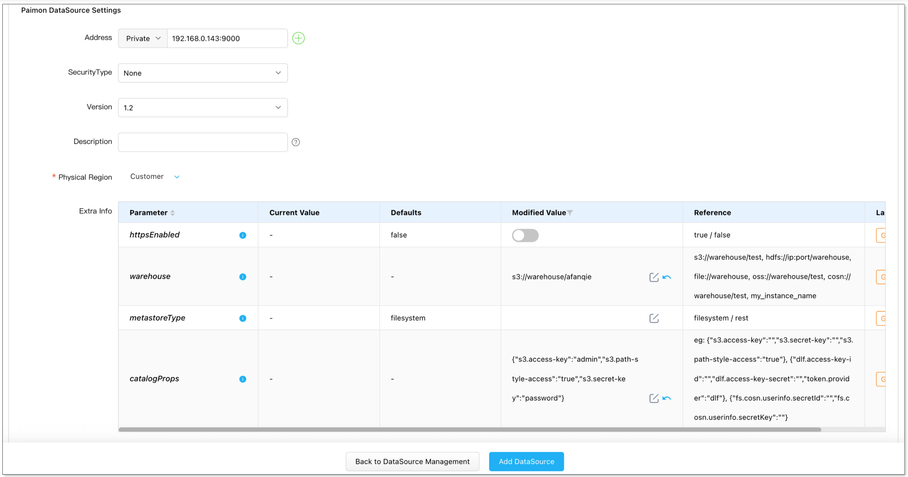
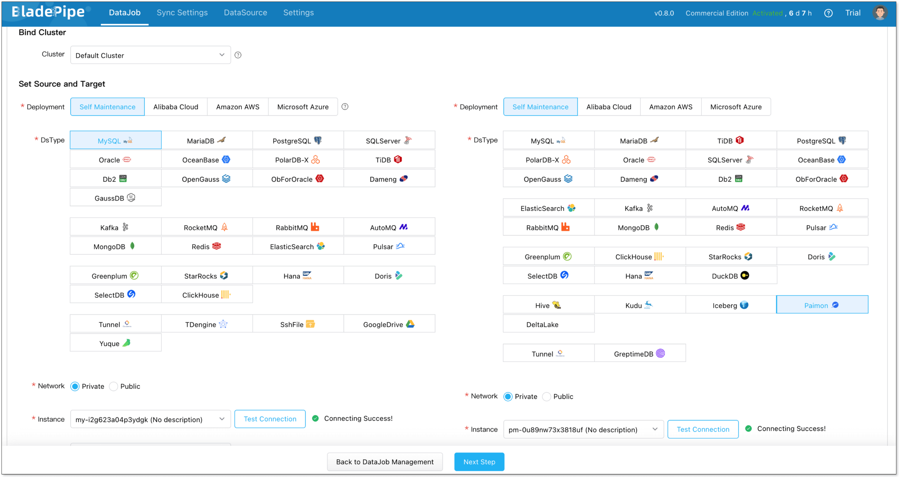
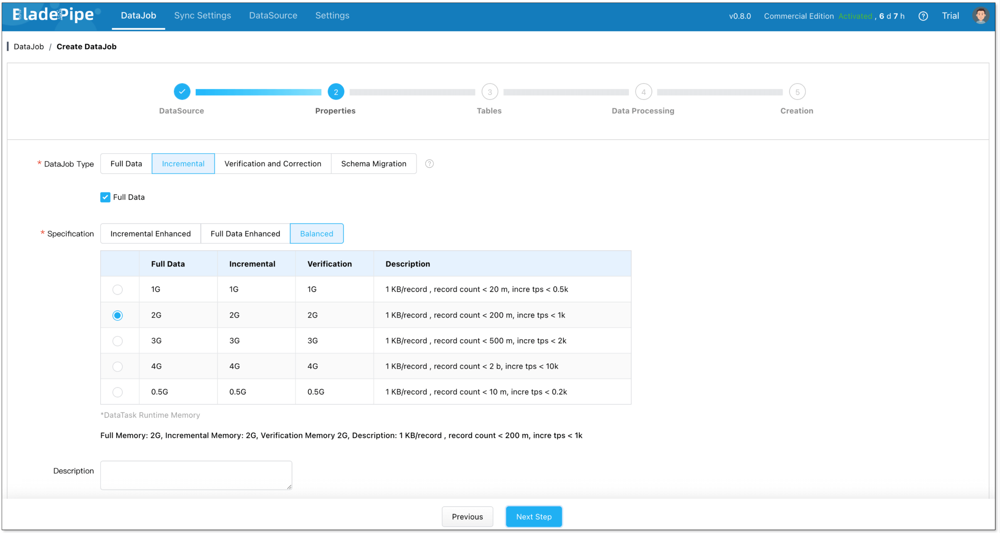
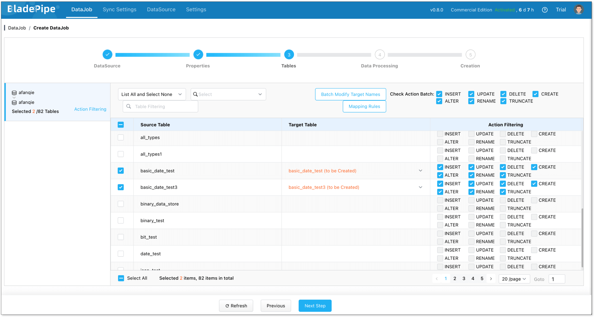
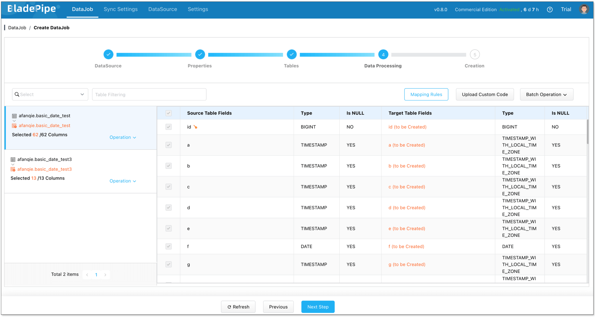
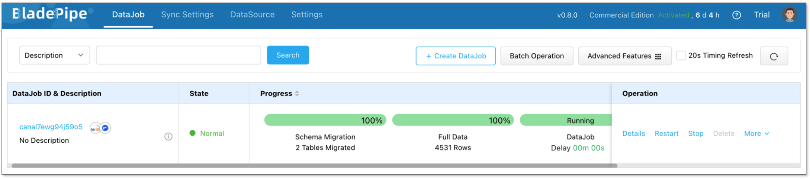
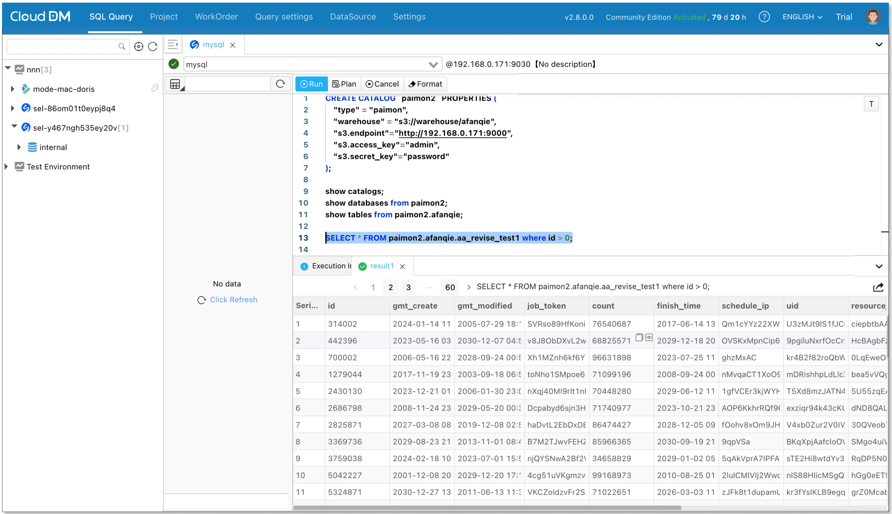

Why are so many teams still juggling both a data lake and a warehouse, only to end up with slow pipelines, stale dashboards, and skyrocketing costs? 

Data lakes are cheap and flexible for storage but fall short when it comes to fast queries. Warehouses deliver strong analytics but at the price of higher costs and limited adaptability. This split forces companies into a tradeoff they shouldn’t have to make.

The **real-time lakehouse** offers a way out. In this post, we’ll show how to build a real-time lakehouse from the ground up using **BladePipe**, **Paimon**, and **SelectDB**. By the end, you’ll see how the three work together to deliver an end-to-end pipeline, making data flow easier than ever.

## Why Real-Time Lakehouses Matter

Traditional “lake + warehouse” setups have three recurring pain points:
- **Slow pipelines**: data must first land in the lake, then get transformed via ETL before reaching the warehouse.
- **High latency**: analytics or dashboards are often delayed by minutes or hours.
- **Inconsistent data**: what you query in the warehouse doesn’t always match what’s in the lake, discouraging decision-making.

A real-time lakehouse removes these bottlenecks. By combining the low-cost durability of a data lake with the performance of a warehouse, it makes data queryable in seconds instead of hours. Teams can finally have **real-time** and **cost-efficient** analytics, without the complexity of running two separate systems.

## BladePipe + Paimon + SelectDB: The Core Building Blocks
To bring a real-time lakehouse to life, you need three things: **real-time ingestion**, **unified lake storage**, and **a fast query engine**. Here’s how they come together:



+ **BladePipe: Real-Time Ingestion**
    - Capture database changes with **CDC (Change Data Capture)**
    - Support both **full data loads** and **incremental data sync**
    - Work with **60+** data sources
    - Maintain **sub-second** latency
    - Provide a visual UI for setup and monitoring
+ **Paimon: Unified Lake Storage**
    - Deliver efficient lake storage
    - Support **primary-key tables** to avoid duplicate data
    - Enable **schema evolution**, compatible with Online DDL
+ **SelectDB: Fast Analytical Engine**
    - **Seamlessly integrate with Paimon** to query lake data directly
    - Support **real-time analytics** and **interactive queries**
    - Optimized for large-scale, multi-dimensional business analysis
Together, these tools create an end-to-end pipeline: BladePipe ingests, Paimon stores, SelectDB analyzes.

**A Real-World Example: E-Commerce Analytics**

Think about an e-commerce platform. Every second, users are browsing, adding items to their carts, placing orders, and making payments. These events are scattered across transactional databases, user systems, and log services.

With a traditional warehouse-based pipeline, this data doesn’t show up until hours later, making it useless for real-time recommendations.

With **BladePipe + Paimon + SelectDB**, the process becomes:

+ **Real-Time Ingestion**: BladePipe streams changes from multiple databases into Paimon with second-level latency.
+ **Unified Storage**: Paimon organizes orders, users, and logs in a unified, consistent storage layer.
+ **Real-Time Querying**: SelectDB queries Paimon directly, returning results in milliseconds. Recommendation systems and dashboards reflect changes in real time.

As a result, the platform can deliver personalized recommendations while a user is still browsing, or promptly detect high-risk transactions.

## Lakehouse From Zero to Real-Time

Here’s how you can build it yourself.

### Prepare Tools
1. Install BladePipe SaaS: [https://www.bladepipe.com/](https://www.bladepipe.com/)
2. Install Paimon: [https://paimon.apache.org/](https://paimon.apache.org/)
3. Install SelectDB: [https://www.selectdb.com/](https://www.selectdb.com/)  

### Ingest Data with BladePipe
#### Add Data Sources

1. Log in to the [BladePipe Cloud](https://cloud.bladepipe.com).
2. Click **DataSource** > **Add DataSource**, and add MySQL and Paimon instances.

2. When adding a Paimon instance, special configuration is required. See [Add a Paimon DataSource](https://www.bladepipe.com/docs/dataMigrationAndSync/datasource_func/Paimon/props_for_paimon_ds).


#### Create a Sync Task
1. Click **DataJob** > [**Create DataJob**](https://www.bladepipe.com/docs/operation/job_manage/create_job/create_full_incre_task/).
2. Select the source and target DataSources, and click **Test Connection** to ensure the connection to the source and target DataSources are both successful.

3. Select **Incremental** for DataJob Type, together with the **Full Data** option.

4. Select the tables to be replicated.

5. Select the columns to be replicated.

6. Confirm the DataJob creation.


Then, BladePipe loads full data and then streams ongoing changes into Paimon automatically.

### Query in SelectDB
SelectDB natively supports the [Paimon Catalog](https://doris.apache.org/docs/3.0/lakehouse/catalogs/paimon-catalog). That means you can query Paimon directly, no ETL required.

Next, we will use the database management tool [CloudDM](https://www.cdmgr.com/) to query the data.  

1. Create Paimon catalog. 
    ```shell
    CREATE CATALOG catalog_name PROPERTIES (
        'type' = 'paimon',
        'warehouse' = '<paimon_warehouse>'
        "s3.access_key" = "your-access-key",
        "s3.secret_key" = "your-secret-key",
        "s3.endpoint" = "http://minio.example.com:9000"
    );
    ```  
2. Once the Catalog is created, you can start querying data in Paimon:


As MySQL data changes, BladePipe syncs it to Paimon, and SelectDB picks it up immediately. That’s true end-to-end real-time analytics with a single pipeline.

## Wrapping Up
The choice between a data lake and a warehouse is no longer a choice you need to make. With BladePipe, Paimon, and SelectDB, you can unify ingestion, storage, and analytics into one architecture.

The result is a real-time lakehouse: low-latency, cost-efficient, and built for modern data-driven applications.