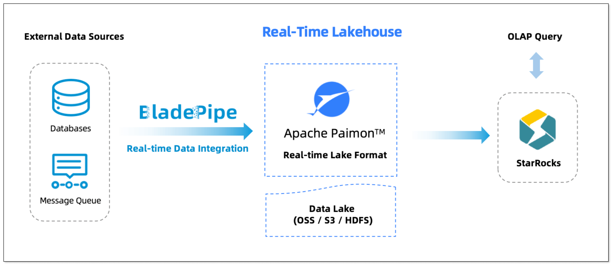
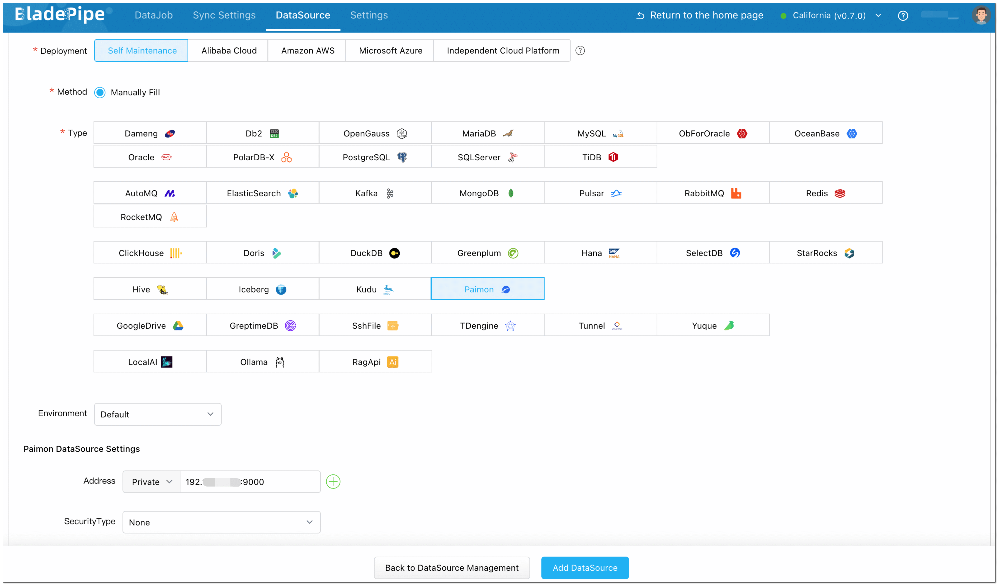
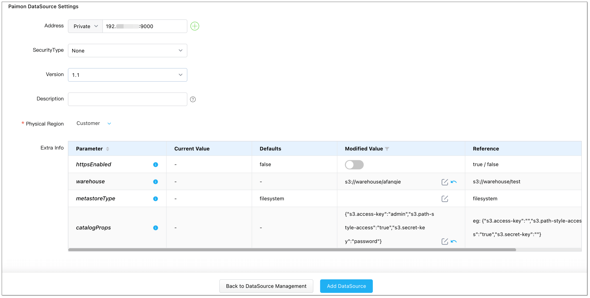
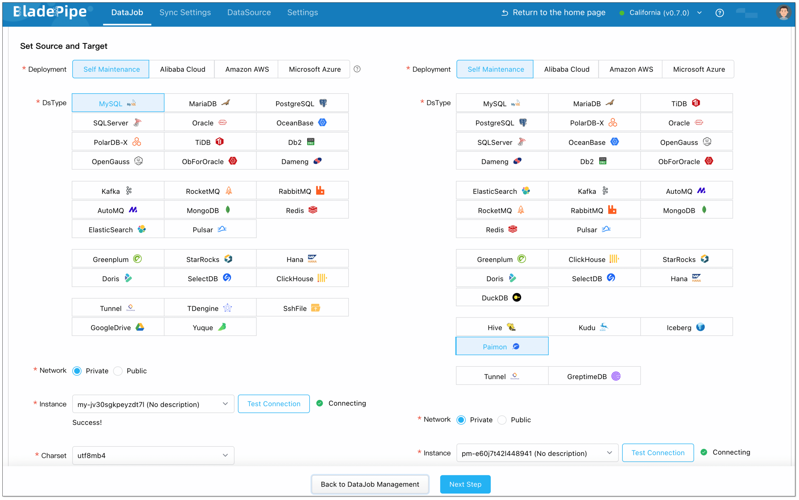
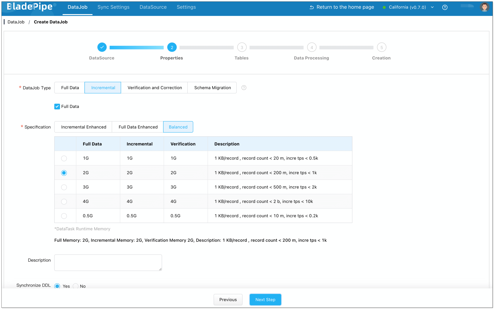
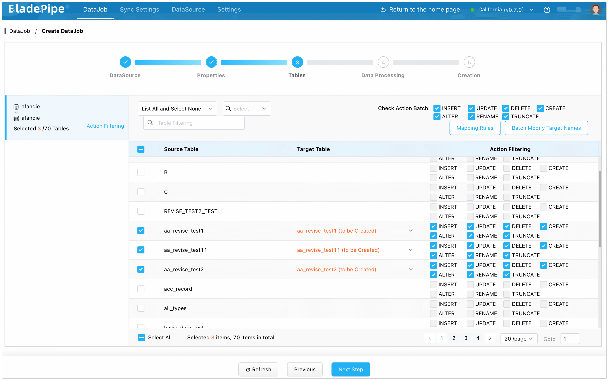
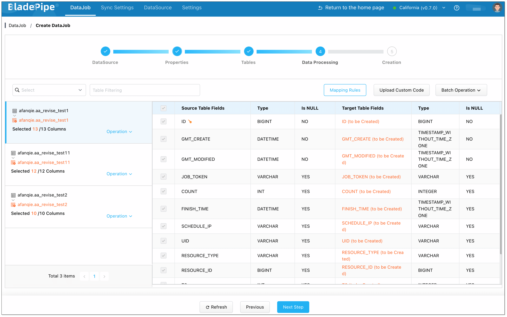
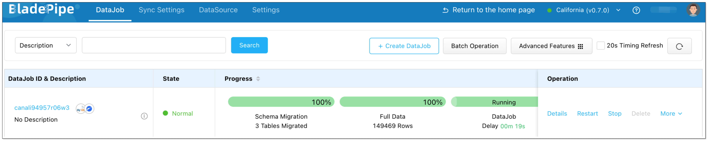
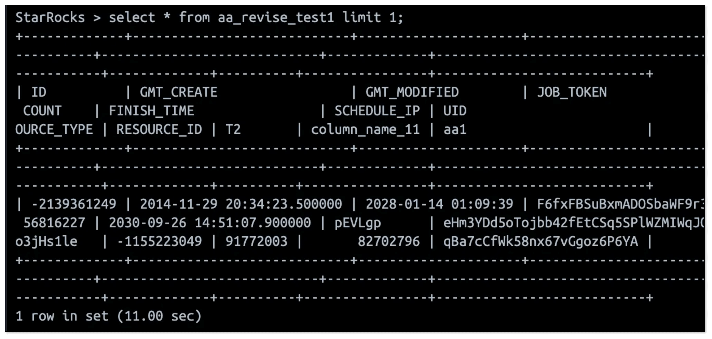

In the age of real-time analytics, more businesses want to ingest data into their data lake with low latency and high consistency, and run unified analysis downstream. [Apache Paimon](https://paimon.apache.org/), a next-gen lakehouse table format born from the Apache Flink community, is built for exactly this. With fast writes, real-time updates, and strong compatibility, Paimon is an ideal foundation for building a streaming lakehouse architecture.

In this article, we’ll walk through how to build a fully real-time, flexible, and easy-to-maintain lakehouse stack using BladePipe, Apache Paimon, and StarRocks.

## What is Apache Paimon?
Apache Paimon is a lakehouse storage format designed for stream processing. It innovatively combines lake format and LSM-tree (Log-Structured Merge Tree), enabling real-time data updates, high-throughput ingestion, and efficient change tracking.

**Key Features:**    
- **Streaming and batch processing**: Support streaming write and snapshot read.
- **Primary key support**: Enable fast upserts and deletes.
- **Schema evolution**: Add, drop, or modify columns without rewriting old data.
- **ACID compliance**: Ensure consistency in concurrent reads and writes.
- **Extensive ecosystem**: Work with Flink, Spark, StarRocks, and more.
- **Object storage compatibility**: Support S3, OSS, and other file systems.

**Example: Real-Time Order Tracking**    
Imagine a large e-commerce platform with a real-time dashboard. The order status changes (e.g. from "Paid" to "Shipped") are supposed to be reflected on the dashboard instantly. How to realize the real-time data ingestion?

**Traditional Approach (Merge-on-Read):**    
- Changes are appended to log files and merged later in batch jobs.
- Updates are delayed until the merge is complete — often several minutes.

**With Paimon (LSM-tree):**   
Paimon tackles this issue by introducing a capability similar to primary key. 
- When order statuses change in a transactional database (e.g., MySQL), updates (like UPDATE orders SET status='Shipped' WHERE order_id='123') are immediately written to Paimon.
- Paimon uses LSM-tree to allow these updates to be read within seconds.

**Result:**
Downstream systems like StarRocks can query updated results in seconds.


## Paimon vs. Iceberg: What’s the Difference?
Both Apache Paimon and Apache Iceberg are modern table formats for data lakes, but optimized for different needs.

Paimon is designed for stream processing with a LSM-tree architecture, suitable for cases requiring high-frequency updates and real-time data ingestion. Iceberg focuses on snapshot mechanisms with emphasis on data consistency. But it is evolving to support near real-time ingestion.

| **Feature**         | **Paimon**               | **Iceberg**                         |
| ------------------- | ------------------------ | ------------------------------- |
| Update mechanism    | LSM-tree                 | Copy-on-Write / Merge-on-Read   |
| Primary key support | Native support for upsert| Support upsert via Merge-on-Read     |
| Streaming write     | Yes                      | Yes                           |
| Update latency      | Seconds or less          | Minutes (typically)             |
| Ecosystem           | New, Flink-native        | More mature, broad ecosystem    |
| Best for            | Real-time data warehouse, CDC, unified streaming and batch processing | Data warehouse, large batch processing, general data lake |

In short, Paimon is better suited for real-time, high-frequency updates. Iceberg is ideal for general-purpose batch workloads and governance.

## Building a Real-Time Lakehouse Stack
While you can use Flink to ingest data into Paimon, it often requires managing job state, recovery, and checkpoints, which is a high barrier for many teams.

[BladePipe](https://www.bladepipe.com) solves this with a lightweight, fully automated solution for real-time ingestion into Paimon.



**How it Works:**   
- **Data sources:** Core transaction databases (e.g. MySQL, PostgreSQL), logs (Kafka) and more.

- **BladePipe:**
  - Capture changes via log-based CDC, bringing sub-second latency.
  - Support automated structure migration and DDL sync.
  - Offer built-in verification, monitoring, alerting and recovery.

- **Apache Paimon:**
  - Ingest real-time data as the lakehouse base.
  - Handle deduplication, partitioning, and compaction using LSM-tree.
  - Store data in S3, OSS, etc., separating storage and computation.

**StarRocks:** Read real-time data directly from Paimon without the need of transformation.

## Hands-on Guide
Here’s how to set up a real-time pipeline from MySQL to Paimon and query the results via StarRocks.

### Step 1: Install BladePipe
Follow the instructions in [Install Worker (Docker)](https://www.bladepipe.com/docs/productOP/byoc/installation/install_worker_docker) or [Install Worker (Binary)](https://www.bladepipe.com/docs/productOP/byoc/installation/install_worker_binary) to download and install a BladePipe Worker.

Alternatively, you can deploy BladePipe [on-premises](https://doc.bladepipe.com/productOP/onPremise/installation/install_all_in_one_binary). 

### Step 2: Add Data Sources
1. Log in to the [BladePipe Cloud](https://cloud.bladepipe.com).
2. Click **DataSource** > **Add DataSource**, and add MySQL and Paimon instances.

3. When adding a Paimon instance, special configuration is required. See [Add a Paimon DataSource](https://www.bladepipe.com/docs/dataMigrationAndSync/datasource_func/Paimon/props_for_paimon_ds).


### Step 3: Create a Sync DataJob
1. Click **DataJob** > [**Create DataJob**](https://doc.bladepipe.com/operation/job_manage/create_job/create_full_incre_task).
2. Select the source and target DataSources, and click **Test Connection** to ensure the connection to the source and target DataSources are both successful.

3. Select **Incremental** for DataJob Type, together with the **Full Data** option.

4. Select the tables to be replicated.

5. Select the columns to be replicated.

6. Confirm the DataJob creation.


BladePipe will perform full data migration and continue capturing real-time changes to write into Paimon.

### Step 4: Query Data from StarRocks
The final step is to query and analyze the data in Paimon. [StarRocks](https://www.starrocks.io/) supports [Paimon Catalog](https://docs.starrocks.io/docs/data_source/catalog/paimon_catalog/) natively. It can query real-time data in Paimon without data transformation or importing.    

**1. Create External Catalog**     
Run CREATE EXTERNAL CATALOG statement in StarRocks, and all Paimon data will be mapped to StarRocks.
```sql
CREATE EXTERNAL CATALOG paimon_catalog
PROPERTIES
(
    "type" = "paimon",
    "paimon.catalog.type" = "filesystem",
    "paimon.catalog.warehouse" = "<s3_paimon_warehouse_path>",
    "aws.s3.use_instance_profile" = "true",
    "aws.s3.endpoint" = "<s3_endpoint>"
);
```

**2. Query Real-Time Data**

```sql
-- Show available databases
SHOW DATABASES FROM paimon_catalog;

-- Switch catalog 
SET CATALOG paimon_catalog;

-- Switch to a specific database
USE your_database;

-- Query data
SELECT COUNT(*) FROM your_table LIMIT 10;
```


Now, any update in MySQL is reflected in Paimon in real time and instantly queryable in StarRocks. No ETL is needed.

## Final Thoughts
Apache Paimon unlocks real-time capabilities for modern data lakes. With BladePipe, teams can automate ingestion without writing a single line of code. And when paired with StarRocks, the full pipeline from source to query is truly real-time and production-ready.

If you're building a streaming lakehouse, this stack is worth trying.