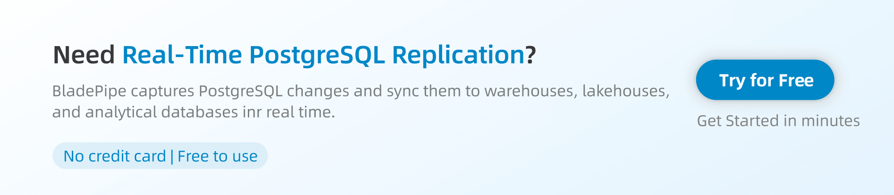

PostgreSQL often stores critical business data, such as orders, payments, user profiles, and transactions. As teams grow, this data usually needs to move into warehouses, lakehouses, message queues, or analytical databases.

PostgreSQL change data capture, or PostgreSQL CDC, captures inserts, updates, and deletes from Postgres and delivers them to downstream systems in near real time. Instead of waiting for hourly or daily batch jobs, CDC keeps data flowing continuously.

In this guide, we’ll explain what PostgreSQL CDC is, compare common CDC methods, cover key challenges, and show how tools like Debezium, AWS DMS, and BladePipe help build real-time PostgreSQL replication pipelines.

## What Is PostgreSQL Change Data Capture（CDC）?

PostgreSQL [change data capture](https://www.bladepipe.com/blog/data_insights/change_data_capture_cdc/) is the process of detecting row-level changes in a PostgreSQL database and sending those changes to another system. These changes usually include new rows, updated rows, and deleted rows.

At a high level, a PostgreSQL CDC pipeline does three things:

- Captures changes from the source PostgreSQL database
- Converts those changes into a format the target system can understand
- Delivers them continuously to a downstream database, warehouse, lakehouse, or queue

This is different from traditional batch synchronization. A batch job usually runs at fixed intervals, such as every hour or every day. It scans the source database, extracts data, and writes it to the target. That approach can work for simple reporting, but it always creates delay.

CDC reduces that delay. When a row changes in PostgreSQL, the change can be captured and delivered much sooner. For teams that depend on fresh data, this can make dashboards, alerts, search indexes, and analytical systems much more useful.

Of course, PostgreSQL CDC can be implemented in different ways. Before choosing a tool, it helps to understand the main CDC methods and their trade-offs.

## Common PostgreSQL CDC Methods

There are three common ways to implement PostgreSQL CDC: **query-based CDC**, **trigger-based CDC**, and **log-based CDC**.

### Query-Based CDC

Query-based CDC usually relies on a timestamp column, such as `updated_at` or `modified_at`. A sync job periodically queries the source table and fetches rows that changed after the last run. 

For example:

```sql
SELECT * FROM orders
WHERE updated_at > '2026-07-01 10:00:00';
```

**Pros**:

- Easy to understand and implement
- Does not require complex PostgreSQL configuration
- Works for small tables and simple reporting workloads
- Can be enough when near real-time sync is not required

**Cons**:

- Batch-based, not truly real time
- May miss deletes unless soft deletes are used
- Depends on reliable timestamp columns
- Can add query load to the source database
- Becomes less efficient as tables grow

Query-based CDC can be a good starting point, but it is rarely the best option for production-grade real-time replication.

### Trigger-Based CDC

Trigger-based CDC uses database triggers to record changes when they happen. When a row is inserted, updated, or deleted, a trigger can write the change into an audit table or changelog table.

A downstream process then reads from that changelog and applies the changes to the target system.

**Pros**:

- Can capture inserts, updates, and deletes
- Provides a clear changelog inside the database
- Useful for audit scenarios or controlled workloads

**Cons**:

- Adds overhead to the source database write path
- Requires triggers to be created and maintained
- Can become hard to manage across many tables
- Schema changes may require trigger updates
- May affect production write performance

Trigger-based CDC gives more change visibility than query-based CDC, but the maintenance cost can grow quickly in large systems.

### Log-Based CDC
Log-based CDC reads changes from the database transaction log. In PostgreSQL, this usually means reading from the Write-Ahead Log, or WAL.

PostgreSQL writes changes to the WAL before applying them to data files. With logical decoding, these WAL changes can be decoded into row-level change events and consumed through replication slots.

**Pros**:

- Captures inserts, updates, and deletes reliably
- Does not require custom triggers on source tables
- Avoids repeated scans on large tables
- Better suited for low-latency replication
- Works well for high-volume production pipelines

**Cons**:

- Requires logical replication or logical decoding setup
- Needs replication slot and WAL retention monitoring
- Can cause WAL buildup if the consumer falls behind
- Requires careful handling of schema changes
- Usually needs a dedicated CDC tool or platform

Log-based CDC is usually preferred for production use. It is less intrusive than triggers, more reliable than timestamp polling, and better suited for low-latency replication.

[](https://www.bladepipe.com/)

### PostgreSQL CDC Methods Compared

| Dimension            | Query-Based CDC          | Trigger-Based CDC           | Log-Based CDC          |
| ---------------------- | --------------- | ------------------- | ---------------- |
| Latency                | Medium to high       | Low to medium        | Low                |
| Source impact          | Read load from polling queries     | Write overhead from triggers   | Lower table-level impact  |
| Delete capture         | Difficult          | Supported                | Supported                   |
| Setup complexity       | Low             | Medium           | Medium to high                   |
| Scalability            | Limited                | Medium                   | High           |
| Schema change handling | Manual          | Trigger maintenance needed         | Tool-dependent          |
| Best for               | Simple reporting or low-frequency sync | Audit logs or controlled workloads | Real-time production replication |

## PostgreSQL CDC Challenges

PostgreSQL CDC sounds simple, but production pipelines need to handle several challenges.

### Replication Slot Lag and WAL Buildup

Replication slots help PostgreSQL keep WAL changes until the CDC consumer reads them. But if the CDC job stops or falls behind, PostgreSQL may keep WAL files for too long. Over time, this can increase disk usage on the source database.

This is one of the most important things to monitor in PostgreSQL CDC. Teams should watch replication slot lag, WAL growth, CDC task status, and target write latency.

### Schema Changes

Source schemas change over time. Teams may add columns, change data types, or update table structures.

A CDC pipeline needs to handle these changes correctly. Otherwise, schema changes can break downstream writes or cause data mismatches.

### Initial Load and Incremental Sync

Most CDC projects need both full load and incremental sync. The full load copies existing data, while CDC captures new changes.

The handoff between these two stages must be handled carefully. If the pipeline switches too early or too late, it may miss changes or write duplicate records.

This is why a complete CDC solution should support both full load and incremental replication in a coordinated workflow.

### Large Transactions

Large transactions can increase CDC latency. They may also create pressure on the source database, CDC tool, and target system.

For high-volume environments, teams should test CDC behavior under bulk updates, peak traffic, and long-running transactions.

### Data Consistency

CDC is only useful if the target data is trustworthy. If updates are applied incorrectly, deletes are missed, or retries create duplicates, downstream users may lose confidence in the system.

This is why data validation and repair matter. Without them, teams may need to manually compare tables, reload data, or rebuild pipelines.

## PostgreSQL CDC Tools

Different tools solve PostgreSQL CDC in different ways. Here are three common options.

### Debezium

[Debezium](https://www.bladepipe.com/blog/data_insights/debezium_alternatives/) is a popular open-source CDC platform. Its PostgreSQL connector reads changes from the WAL through logical decoding and replication slots, then usually streams those changes into Kafka.

It is a strong choice for teams that already use Kafka and want a flexible CDC foundation. It fits well into event-driven architectures and gives engineers a high level of control.

The trade-off is operational complexity. Teams usually need to manage Kafka Connect, connectors, topics, schema handling, monitoring, and failure recovery. For engineering-heavy teams, this may be fine. For teams that want a simpler replication workflow, it may be too much to maintain.

### AWS DMS

AWS Database Migration Service, or AWS DMS, is commonly used for database migration and replication in AWS environments. It supports PostgreSQL as a source and can run full-load and CDC tasks.

[AWS DMS](https://www.bladepipe.com/blog/data_insights/aws_dms_vs_bladepipe/) is useful when your data stack is mainly on AWS. It can help teams move PostgreSQL data to AWS targets and keep the target updated during migration.

However, for more complex real-time pipelines, teams may need more flexibility around schema evolution, transformation, target support, or multi-cloud deployment. AWS DMS is often a practical migration tool, but it may not cover every long-term CDC pipeline requirement.

### BladePipe

[BladePipe](https://www.bladepipe.com/) is a real-time data replication platform that supports PostgreSQL CDC as part of a complete workflow. It combines schema migration, full load, incremental CDC, monitoring, and data validation in one platform.

This is useful for teams that want PostgreSQL CDC without building and maintaining a full Kafka-based stack. Instead of assembling multiple tools, teams can create and manage the pipeline in BladePipe.

With BladePipe, [PostgreSQL](https://www.bladepipe.com/connector/postgresql/) changes can be replicated to different types of targets, including:

- Data warehouses
- Analytical databases
- Message queues
- Lakehouse systems
- Other operational databases

For step-by-step guidance to move data from PostgreSQL to a target system, read:
- [PostgreSQL to Snowflake](https://www.bladepipe.com/blog/tech_share/sync_postgresql_to_snowflake/)
- [PostgreSQL to StarRocks](https://www.bladepipe.com/blog/tech_share/sync_postgresql_to_starrocks/)
- [PostgreSQL to PostgreSQL](https://www.bladepipe.com/blog/tech_share/pg_pg_sync/)

## What to Look for in a PostgreSQL CDC Tool

Choosing a PostgreSQL CDC tool is not only about whether it can read changes from Postgres. In production, teams also need to consider how the whole pipeline is created, monitored, and maintained.

A good PostgreSQL CDC tool should support:

- Full load and incremental CDC in one workflow
- Low-latency replication
- Schema migration and schema evolution
- Reliable handling of inserts, updates, and deletes
- Replication lag monitoring
- Error handling and retry
- Data validation and repair
- [Flexible deployment options](https://www.bladepipe.com/pricing/), such as SaaS, BYOC, or private deployment

This is where BladePipe can be useful. Instead of treating PostgreSQL CDC as just a connector, BladePipe manages it as an end-to-end data replication workflow. Teams can use it to move existing data, capture ongoing changes, monitor pipeline health, and validate consistency between source and target.

For teams that do not want to build and maintain a full Kafka Connect or Debezium stack, this can make PostgreSQL CDC easier to operate in real production environments.

## Conclusion

PostgreSQL change data capture helps teams move from slow batch sync to real-time data replication. Query-based CDC is easy to start with, trigger-based CDC can capture more changes, and log-based CDC is usually the better choice for production pipelines.

The real challenge is not only capturing changes, but also handling WAL growth, replication slot lag, schema changes, initial load, monitoring, and data consistency. BladePipe provides a practical way to build PostgreSQL CDC pipelines with full load, incremental sync, schema handling, monitoring, and validation in one platform.

Ready to see PostgreSQL CDC in action? [Try BladePipe for free now](https://www.bladepipe.com/login/).

Read more:
- [Oracle CDC](https://www.bladepipe.com/blog/data_insights/oracle_change_data_capture/)
- [MySQL CDC vs PostgreSQL CDC](https://www.bladepipe.com/blog/data_insights/mysql_cdc_vs_postgres_cdc/)
- [SQL Server CDC](https://www.bladepipe.com/blog/data_insights/sql_server_change_data_capture/)

## FAQ

**Q: What is Change Data Capture (CDC) and why use it with PostgreSQL?**    
Change Data Capture, or CDC, captures inserts, updates, and deletes from a database and sends them to downstream systems. With PostgreSQL, CDC is often used for real-time analytics, database migration, event-driven applications, and data warehouse or lakehouse replication.

**Q: Does PostgreSQL CDC require Kafka?**    
No. Kafka is commonly used with tools like Debezium, but it is not required. Tools like BladePipe can replicate PostgreSQL changes to downstream systems without requiring teams to manage Kafka infrastructure.

**Q: How do I set up real-time data replication using PostgreSQL change data capture?**     
A typical setup includes preparing the PostgreSQL source, choosing a CDC tool, selecting a target system, running a full load, starting incremental CDC, and monitoring latency and data consistency. With BladePipe, these steps can be managed in one DataJob.

**Q: What are the best tools for PostgreSQL change data capture?**    
Common options include Debezium, AWS DMS, and BladePipe. Debezium is flexible and open source, AWS DMS is useful for AWS-based migration, and BladePipe is a practical option for real-time PostgreSQL CDC with full load, incremental sync, schema handling, monitoring, and validation.

**Q: Which cloud services support PostgreSQL change data capture?**    
AWS DMS supports PostgreSQL CDC, especially for AWS-based migration and replication. Managed PostgreSQL services such as Amazon RDS for PostgreSQL and Amazon Aurora PostgreSQL can also support CDC when the required replication settings and permissions are available. BladePipe supports PostgreSQL CDC across SaaS, BYOC, and private deployment options.
