In scenarios such as cross-data-center deployments, master-slave failover, and hybrid cloud architectures, bidirectional Redis sync is a common requirement. The hardest part isn’t setting up the sync itself, but **preventing data from bouncing endlessly between two instances**.

This blog will walk you through why loops happen, two approaches to stop them, and show you how to set up an anti-loop bidirectional pipeline step by step.

## Why Loops Happen in Bidirectional Sync？
Take two Redis instances, A and B, as an example, with sync tasks configured in both directions: A→B and B→A.

Data written to A will be synchronized to B. Once B receives it, the data will be sent back to A. Without a loop detection mechanism, the same event just “ping-pong” between A and B endlessly.

[BladePipe](https://www.bladepipe.com/) already solves this for MySQL and PostgreSQL using incremental [event tags](https://www.bladepipe.com/docs/bestPractice/mysql_loop_data_sync/) and [transaction records](../tech_share/pg_pg_sync.md#bidirectional-sync-loop-prevention) separately to filter loop events. Each sync task checks whether a transaction contains a marker, and if so, filters it out, breaking the data loop.

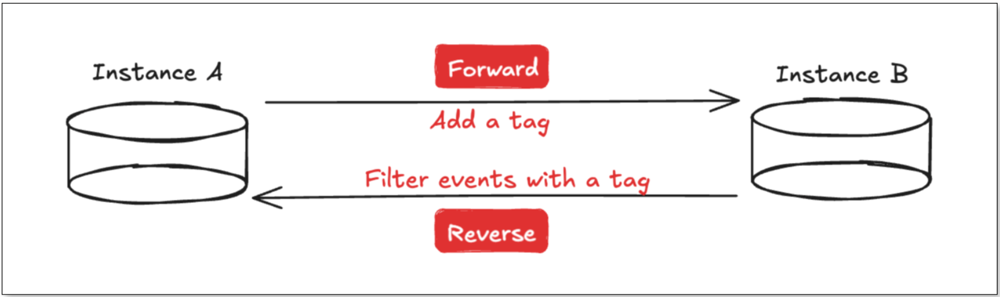

But Redis makes things trickier:
+ Redis commands can be very granular (e.g.`INCR key`) and are not always executed within a transaction.
+ Redis transactions (`MULTI/EXEC`) differ from traditional relational database transactions and do not have full atomicity.

So, how can we design Redis bidirectional sync?

## Solution 1: Auxiliary Tags
Based on the approach used in traditional database bidirectional sync, a straightforward loop-prevention method in Redis is **to use auxiliary commands for loop detection**. When a normal command is received, its hash value is calculated, and an auxiliary command key is generated. By checking whether the corresponding auxiliary key exists in the opposite direction, BladePipe can determine if a loop has occurred; if it exists, the event is filtered.

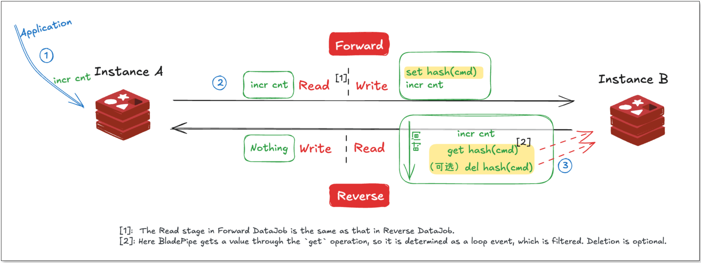

The advantages of this approach are:

+ **Simplicity**: It's straightforward and simple to implement.
+ **High adaptability**: It works for both standalone and clustered Redis deployments.

However, there are also drawbacks:

+ **High performance overhead**: For each event, the number of commands is theoretically increased by 3 to 4 times, adding write pressure on Redis.
+ **Ambiguity in edge cases**: In certain extreme scenarios, such as when an application performs similar write operations on the target instance, the reverse sync task may have difficulty distinguishing the source of the commands, which could lead to false positives or even a lost update.

## Solution 2: Transaction Tags
Another approach **leverages Redis transactions**.

Redis transactions (`MULTI ... EXEC`) differ from those in relational databases: they do not support rollback as part of transaction atomicity, but they do have a key feature: **all commands within a transaction are executed in order, and no commands from other clients are interleaved during execution**.

Based on this feature, for a forward sync task, wrap a source command in a transaction, and insert a marker command as the first operation. When the reverse task encounters a transaction, it indicates a potential loop event from the forward task. By checking if **the first command** in the transaction is a marker, BladePipe can determine if the entire transaction is part of a loop. If it is, the transaction is filtered entirely.

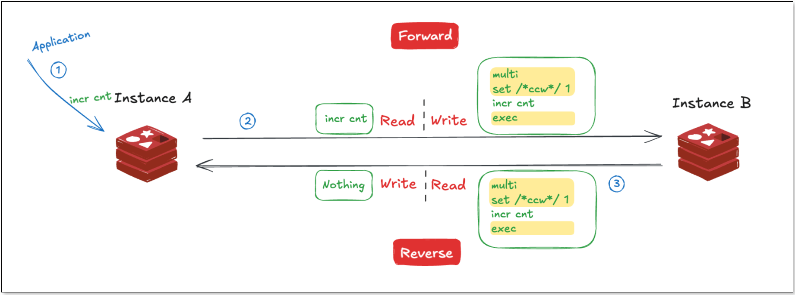

The advantages of this approach are:

+ **Better performance**: There is no need to maintain additional markers for each command, reducing system overhead.
+ **Simple logic**: By checking the beginning of a transaction, BladePipe can quickly determine loop events without comparing commands one by one.
+ **Lower Redis pressure**: Filtering is handled within BladePipe, reducing the load on Redis.

However, it is important to note that in sharded cluster mode, Redis transactions don’t work across shards.  Therefore, the transaction-tag approach is **best suited for standalone or master-slave scenarios**.

## Hands-On Demo with BladePipe
[BladePipe](https://www.bladepipe.com/) supports both approaches mentioned above. You can adjust the filtering mode via the `deCycleMode` parameter in the console.

Let’s look at how to quickly set up Redis bidirectional sync with the transaction tag method using BladePipe.

### Step 1: Install BladePipe
Follow the instructions in [Install Worker (Docker)](https://www.bladepipe.com/docs/productOP/byoc/installation/install_worker_docker/) or [Install Worker (Binary)](https://www.bladepipe.com/docs/productOP/byoc/installation/install_worker_binary/) to download and install a BladePipe Worker.

### Step 2: Add DataSources

Log in to the [BladePipe Cloud](https://cloud.bladepipe.com/). Click **DataSource** > **Add DataSource**. 

It is suggested to modify the DataSource description to prevent mistaking the instances when you configure two-way DataJobs.

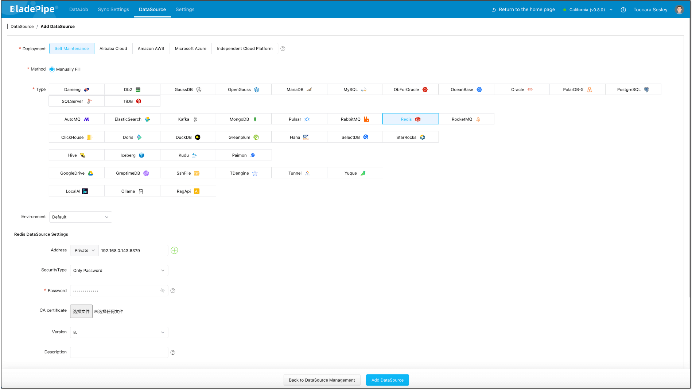

### Step 3: Create Forward DataJob
  1. Click **DataJob** > **Create DataJob**.
  2. Select the source and target DataSources, and click **Test Connection** to ensure the connection to the source and target DataSources are both successful.

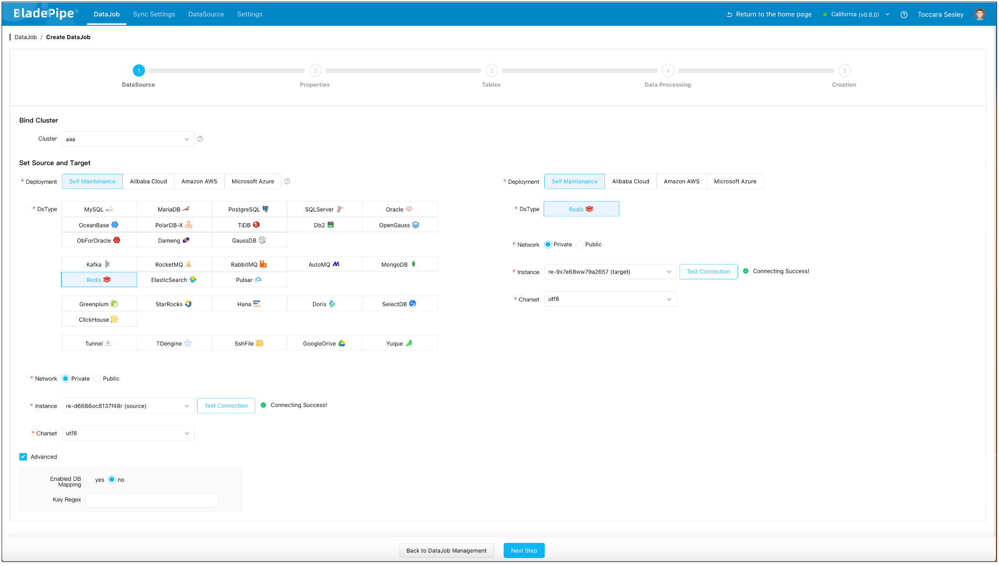
  
  3. In **Properties** Page:  
     1. Select **Incremental** for DataJob Type, together with the **Full Data** option.  
     2. Grey out **Start Automatically** to set parameters after the DataJob is created.

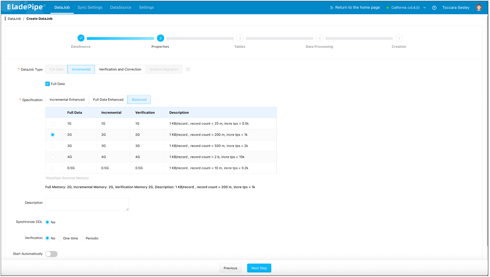

  4. Confirm the DataJob creation.
  5. Click **Details** > **Functions** > **Modify DataJob Params**.  
     1. Choose **Source** tab, and set **deCycle** to `true` and **deCycleMode** to `TX_SIGN`.  
     2. Click **Save**.

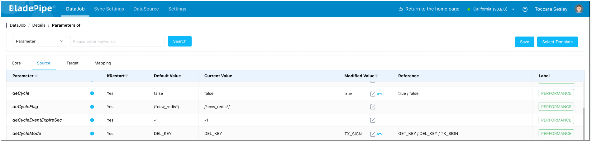

  6. Start the DataJob. 

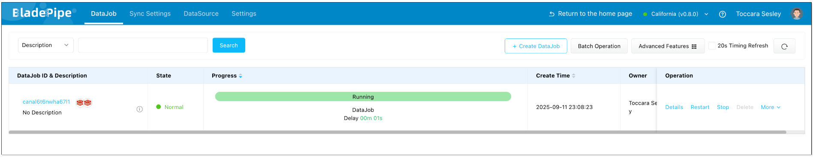

### Step 4: Create Reverse DataJob
  1. Click **DataJob** > **Create DataJob**.
  2. Select the source and target DataSources(**reverse selection of Forward DataJob**), and click **Test Connection** to ensure the connection to the source and target DataSources are both successful.

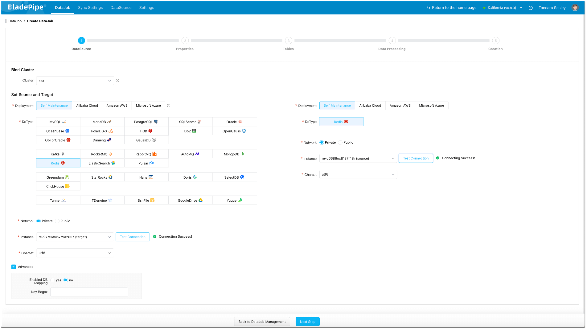

  3. In **Properties** Page:
     1. Select **Incremental**, and **DO NOT** check **Full Data** option.
     2. Grey out **Start Automatically** to set parameters after the DataJob is created. 

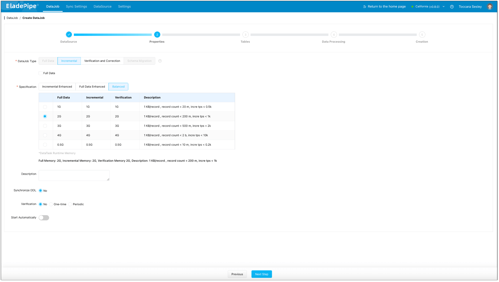

  4. Confirm the DataJob creation.
  5. Click **Details** > **Functions** > **Modify DataJob Params**.  
     1. Choose **Source** tab, and set **deCycle** to `true` and **deCycleMode** to `TX_SIGN`.  
     2. Click **Save**.

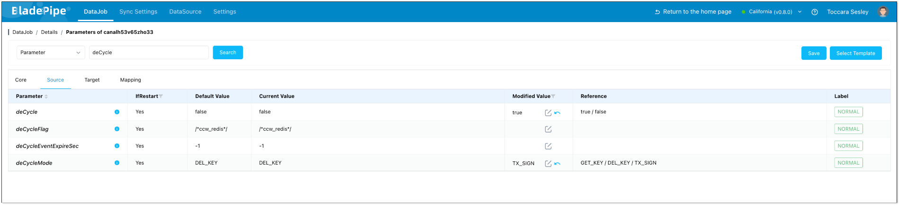

  6. Start the DataJob. Forward and reverse DataJobs are running with sub-second latency.

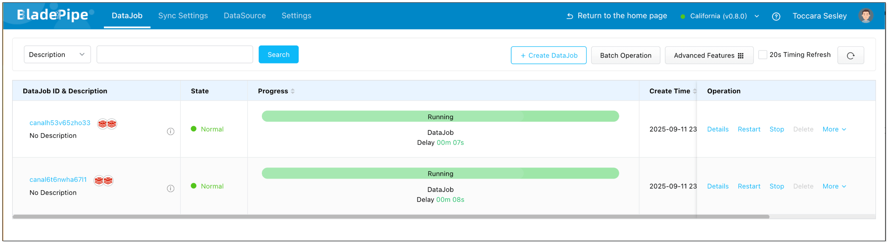

### Step 5: Verify the Results

Make changes in the source Redis and check the monitoring charts. You'll find that the forward DataJob registers the changes, while the reverse one does not, indicating that no data loop has occurred.

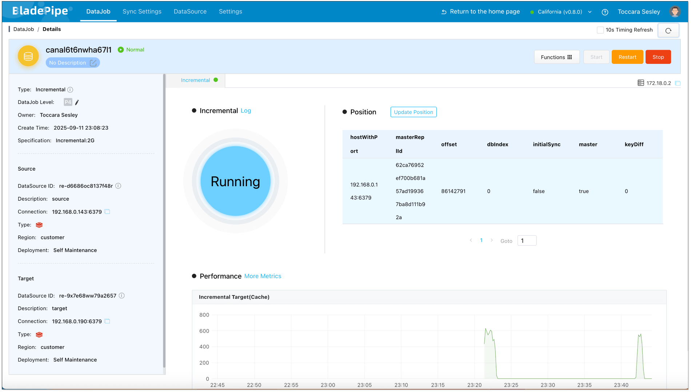
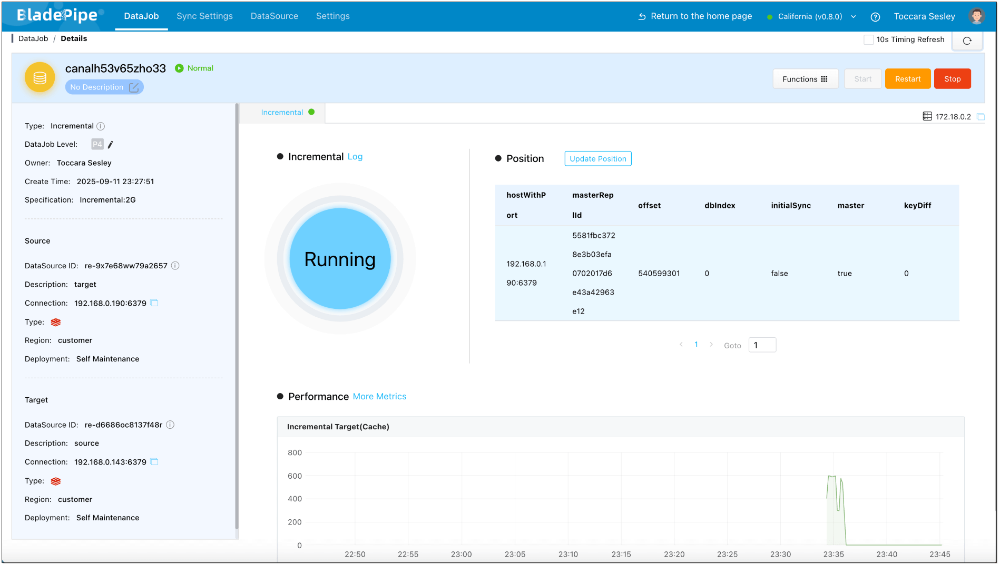

Make changes in the target Redis and check the monitoring charts. You'll find that the reverse DataJob registers the change, while the forward one does not, indicating that no data loop has occurred.

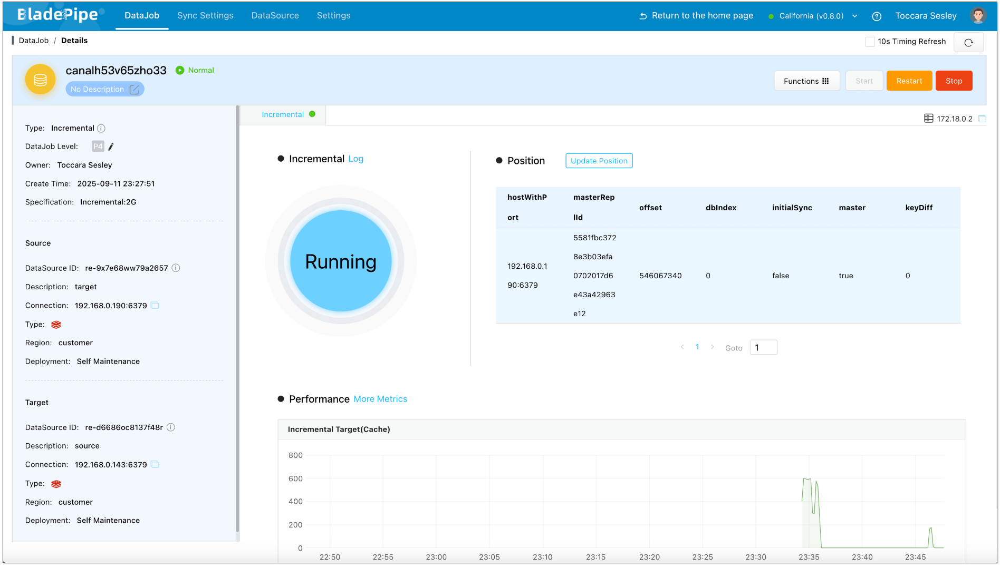
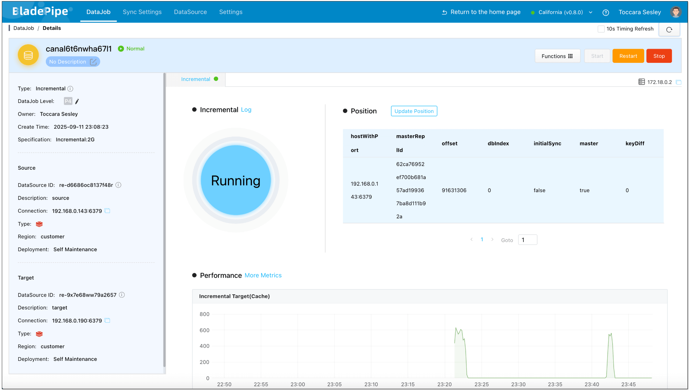

Create a [data verification task](https://www.bladepipe.com/docs/operation/job_manage/create_job/create_period_verification_correction_job), and you can see that the data in both instances remains consistent.

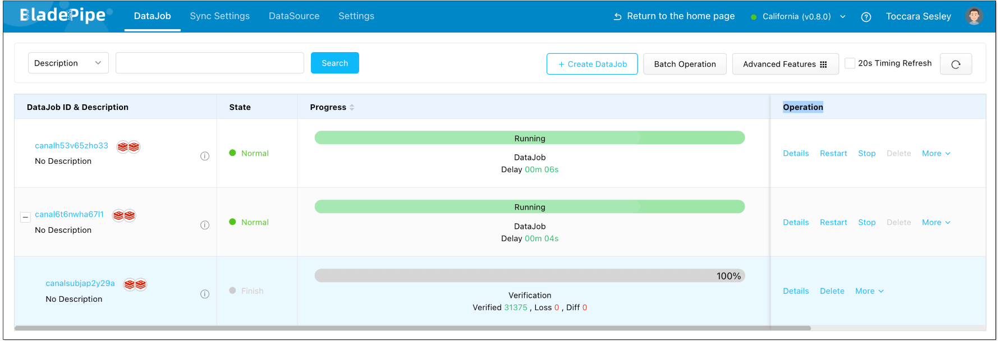

## Conclusion

The hardest part of Redis bidirectional sync isn’t syncing. It’s **stopping the endless loop of changes**. We analyzed two approaches: 
- **Auxiliary tag**: simple and universal, but with performance overhead. For sharded clusters, auxiliary markers may still be the practical choice.
- **Transaction tag**: lightweight and efficient, recommended for most **standalone and master-slave setups**.

If you are planning or designing Redis bidirectional sync, have a try of [BladePipe](https://www.bladepipe.com) to get started quickly. If you have further questions about bidirectional data sync, feel free to join the discussion.