In modern data systems, “too many tables” has quietly become a common problem.

It’s not unusual to find thousands or even tens of thousands of tables in a single database. Once you reach that scale, missing just one table in a data pipeline can silently break downstream analytics, data warehouses, or reporting systems.

The question is no longer how to sync a table, but how to reliably sync a massive and constantly changing set of tables.

In this post, we’ll break down this issue, and introduce a different idea: defining tables by rules, not by enumeration, using **regex(regular expression)-based table matching**.

## Why syncing thousands of tables is challenging?
The challenge of multi-table synchronization isn’t just about volume. The real pain comes from the sync performance once the table count reaches the thousands.

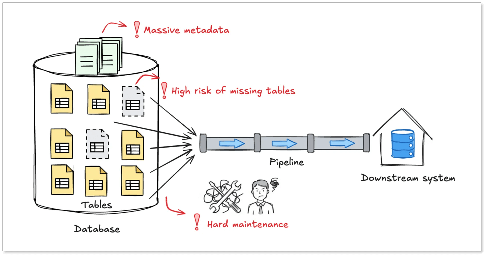

+ **Missing tables is almost inevitable**: Most sync tools rely on a whitelist model, where you explicitly select the tables you want to sync. At small scale, this works fine. At large scale, it becomes fragile. Miss one table, and downstream data is incomplete. What's even worse is that these issues often surface late, while tracing the root cause is already painful.
  
+ **Metadata grows faster than your data**: Traditional sync tools store full schema metadata for every table, like columns, types, primary keys, mappings, and transformations. With thousands of tables, configuration files can easily grow to megabytes in size, increasing memory usage and hurting performance before any data even flows. 
  
+ **New tables never stop coming**: In log-based or event-driven systems, creating dozens of new tables per day is normal. Under a whitelist model, every new table means updating configs or creating new jobs with the risk of human error. 

## Common approaches and their limits
Teams usually fall back on one of two strategies:

+ **Manual whitelisting**: It's the most common practice, which defines a clear scope, and you have fine-grained control over transformations and mappings. But it's easy to miss table, and you have to bear high operational burden. 
+ **Full-database replication**: To avoid missing tables, some teams replicate everything. In this case, no table will miss. However, you have no flexibility to filter out unnecessary tables. Besides, it still requires tacking schema metadata for every table, and metadata size grows linearly with table count. 
  
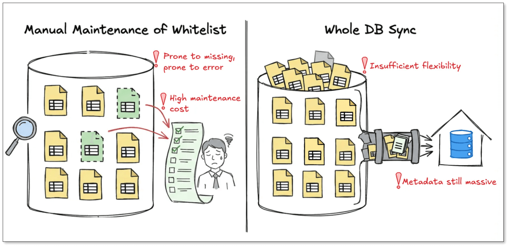

At their core, both approaches rely on the same idea: enumerating tables. As the number of tables grows, so does configuration complexity and maintenance cost.

## A different approach: match tables by expression
[BladePipe](https://www.bladepipe.com/) takes a different path: **stop enumerating tables, and start describing them**.

Based on this principle, BladePipe supports regex-based table name matching. Any table whose name matches the expression is automatically included in the sync task. That means, one expression can cover thousands or tens of thousands of tables.

Examples:
- Tables like AAAA_1, AAAA_2, AAAA_123: `^AAAA_\d+$`
- All tables in a schema: `.*`

This design has several advantages:

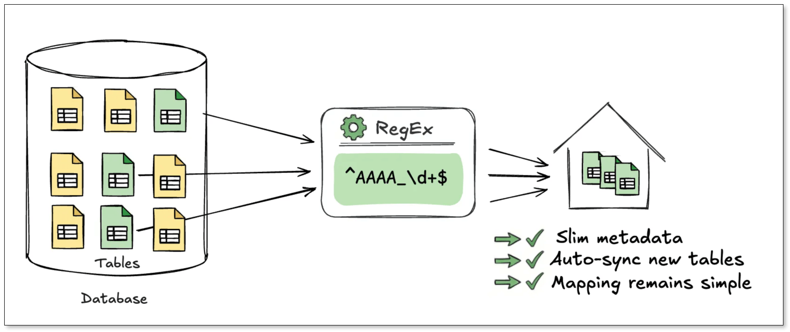

1. **Minimal metadata size**    
Unlike whitelist-based jobs, expression-based tasks do not load or store schema metadata for every table.    
Only the expression itself is persisted. Even when syncing tens of thousands of tables, the configuration stays at a few kilobytes.

2. **Automatic tables update**    
When DDL events like `CREATE TABLE` or `DROP TABLE` occur, BladePipe evaluates the table name against the expression. If it matches, **the table is automatically added (or removed) from the pipeline**. No manual intervention is required.    
This is especially useful for daily partitioned tables, log and event systems, sharded or multi-tenant schemas.

3. **One rule, one mapping**    
In traditional setups, every table generates its own mapping rules. More tables means more config.    
**With expression-based tasks, one expression corresponds to one mapping rule, no matter how many tables it covers**. This makes it a natural fit for data aggregation, data lakes, and warehouse ingestion.

## Quick walkthrough: syncing 10K tables with one rule
Below is a walkthrough showing how to set up an expression-based sync task.

### Prerequisites
1. Have a MySQL instance.
2. Access to the [**BladePipe Cloud**](https://cloud.bladepipe.com/) and switch to **SaaS Managed** mode. 

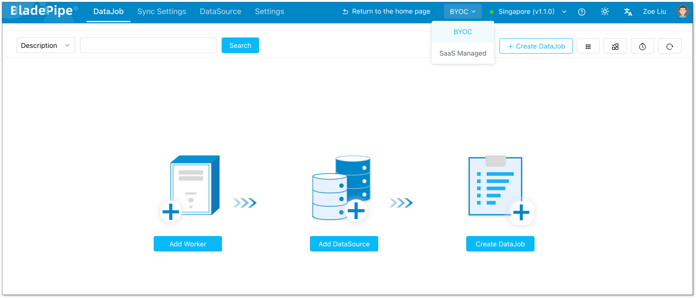

### Add a data source
1. Click **DataSource** > **Add DataSource**.
2. Configure:
    - **Deployment:** Self-managed
    - **Type:** MySQL
    - **Host:** Database IP and host
    - **Authentication:** Choose the method and fill in the info. 
3. Click **Add DataSource**.

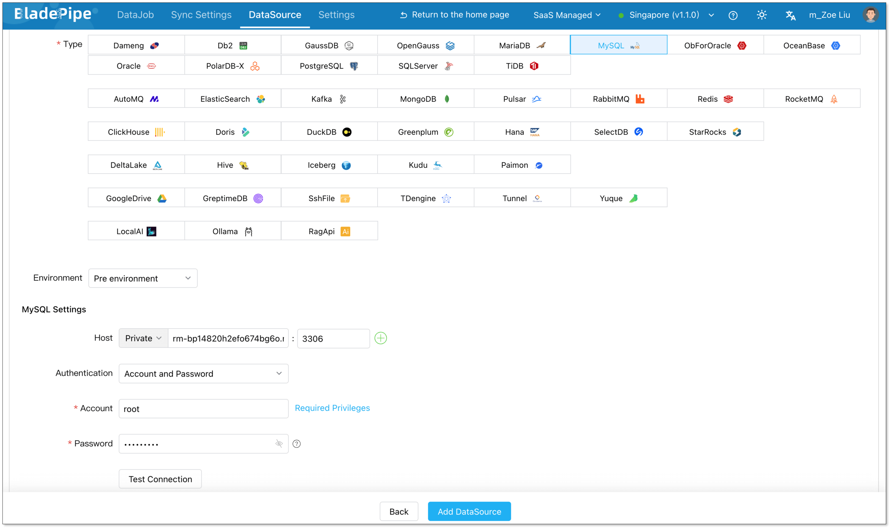

### Create a DataJob
1. Go to **DataJob** > **Create DataJob**.
2. Select the source and target DataSources, and click **Test Connection** for both. 
3. Select the source and target database or schema. 
4. Click **Next**.

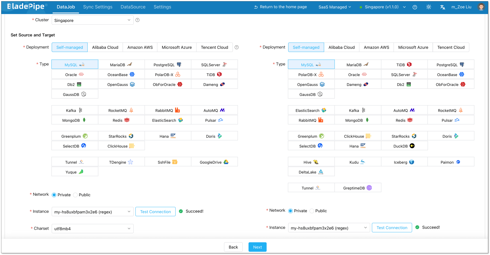

### Configure DataJob settings
1. In the **Properties** step, select **Incremental** and enable **Full Data**. 
2. Select the specification. The default vaule meets most needs.
3. Click **Next**.

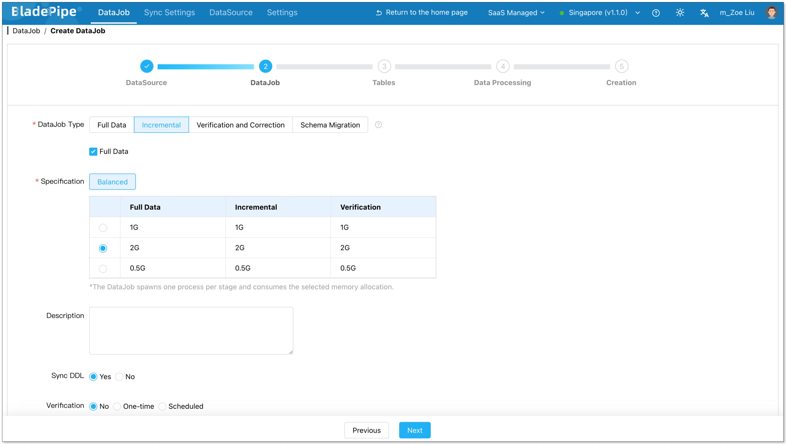

### Select tables by expression
1. In the **Tables** step, choose a schema on the left.
2. From the dropdown, select **Use Regular Expression**. The default expression is `.*`, which means all tables in the schema are to be replicated.     
   To add more expressions, click **Add Expression** in the bottom left corner.
:::info
By default, target table names mirror source table names.    
You can also manually specify a single target table, in which case all source tables are merged into it.
:::
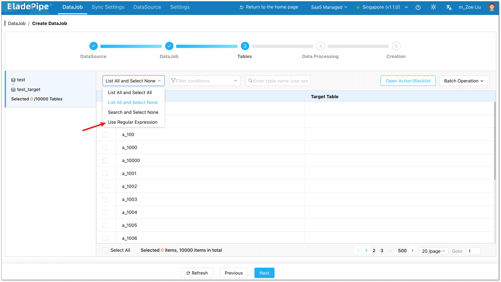
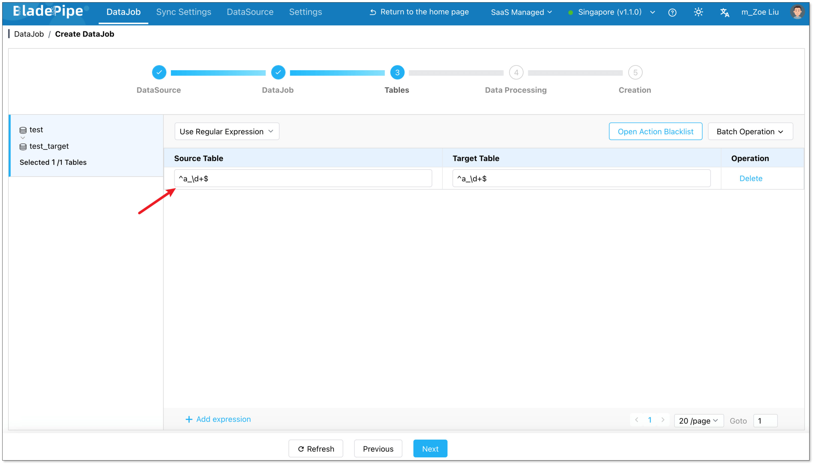

3. **Open the Operation Blacklist** to filter DML/DDL. 
4. Use Batch Operations to set operation blacklists, rename target tables, apply unified mapping rules.
5. Click **Next**.

### Confirm and start
1. Review DataJob details
2. Click **Create DataJob**.

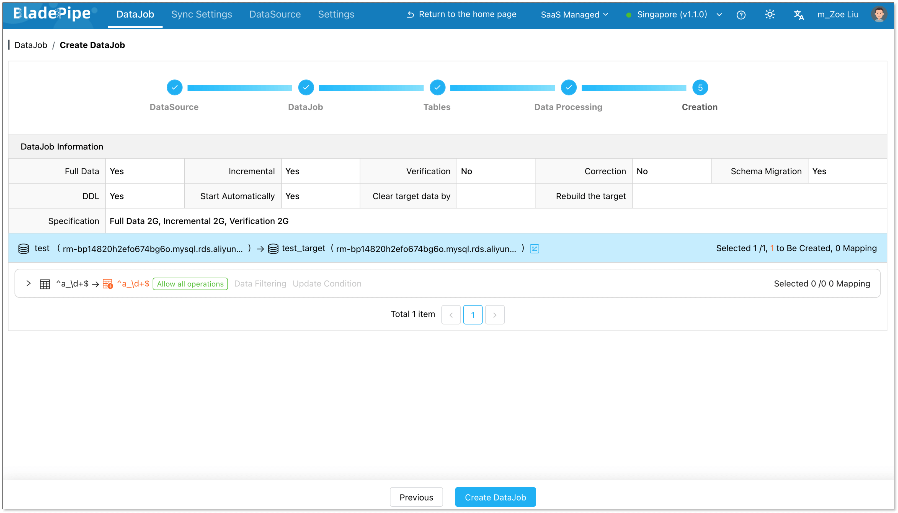

Once started, BladePipe automatically handles schema evolution, full data initialization, and real-time incremental sync. 

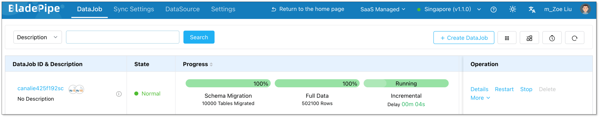

You can view all matched tables directly in the DataJob details.

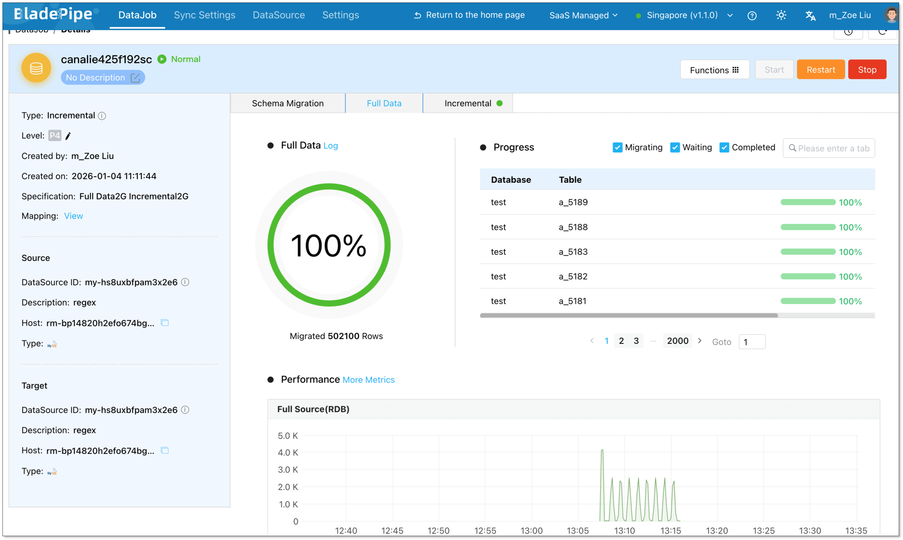

## Final thoughts
Regex-based table matching fundamentally changes how large-scale table replication is configured.

Instead of managing thousands of individual tables, you define rules that describe your data domain. This dramatically reduces operational overhead, avoids metadata bloat, and adapts naturally to fast-changing schemas.

If you’re dealing with tens of thousands of tables, give Regex-based table matching a try. It isn’t just a convenience. It’s a more stable, scalable, and realistic way to move data.
