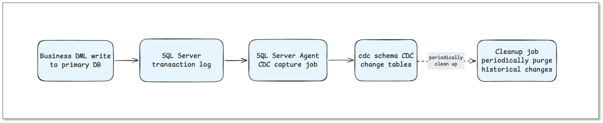
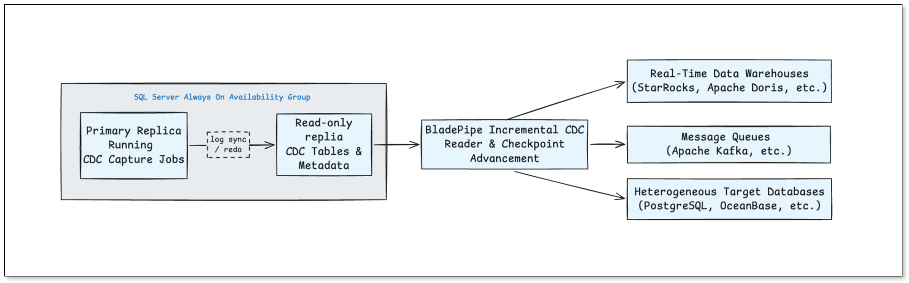
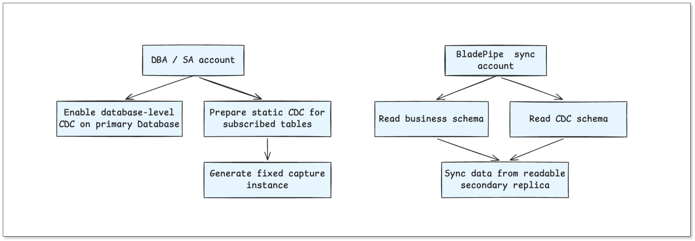
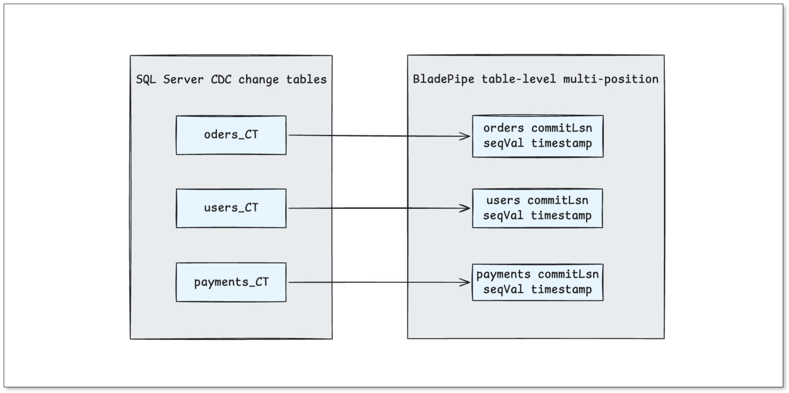

When you use [SQL Server](https://www.bladepipe.com/connector/sql-server/) as a source for a data pipeline, the same three questions almost always come up: **Will synchronization add load to the primary? Can the sync account's privileges be kept to an absolute minimum? Can we reuse the high-availability architecture we already run?** An earlier article looked at this for [Oracle standby databases](https://www.bladepipe.com/blog/data_insights/oracle_cdc_from_dataguard_standby_database/); SQL Server raises the same concerns, and the answer is just as clean.

[SQL Server CDC](sql_server_change_data_capture.md) pushes incremental changes from the transaction log into a capture process, which writes them to CDC change tables. During the incremental phase, your sync task reads those CDC change tables and their metadata.

If you already run **Always On Availability Groups**, you can move that read workload onto a **readable secondary replica**. The primary keeps doing what it does best — business writes and CDC capture — while the sync task consumes CDC data from the replica using a **read-only account**. The result is less load on your core database, a tighter permission model, and a HA setup you don't have to duplicate.

## TL;DR

- **Capture stays on the primary; reads move to the replica.** SQL Server CDC capture is still performed by the primary replica. The optimization is routing the sync task's *continuous reads* of the CDC change tables to a readable secondary.
- **The replica sees the CDC tables.** Change tables and CDC metadata are replicated to the secondary through Always On log transport and redo, so a tool connected to the replica can consume them directly.
- **Least privilege at runtime.** With *static CDC*, the DBA pre-creates the capture instances (in the `db_schema_table_cc_static` format) once on the primary. The sync account then needs only `SELECT` on the business schema and the `cdc` schema — no `sysadmin` or `db_owner` at runtime.
- **Per-table checkpoints.** Each table's `_CT` change table is consumed with its own LSN / `__$seqval` position, avoiding duplicate reads and making lag easy to pinpoint.
- For production-grade, [real-time SQL Server CDC](change_data_capture_cdc.md) without the operational heavy lifting, [BladePipe](https://www.bladepipe.com/) supports this static-CDC-from-replica mode out of the box.

## How SQL Server CDC Incremental Reading Works

The entry point for incremental reading is **not the business table itself**. It's the **capture instance** and its corresponding **CDC change table** that SQL Server creates when you enable CDC on a table.

Every CDC-enabled source table gets its own change table, conventionally named `cdc.<capture_instance>_CT`. When an `INSERT`, `UPDATE`, or `DELETE` hits the business table, the change is first written to the SQL Server **transaction log**. The SQL Server Agent **CDC capture job** then mines the log and writes the change into the matching `_CT` table.

When the sync task consumes incremental data, it reads several objects under the `cdc` schema:

- `cdc.<capture_instance>_CT` — stores the DML changes for the source table. This is the core data source.
- `cdc.change_tables` — records the capture instance, source table, and starting LSN, used to identify CDC tables and the readable range.
- `cdc.captured_columns`, `cdc.index_columns`, `cdc.ddl_history` — metadata used to identify captured columns, index columns, and DDL history.

Inside each `_CT` row, alongside the business columns, are several CDC-specific fields:

- `__$start_lsn` — the commit LSN of the transaction the change belongs to. This is the main position used to advance incremental reading.
- `__$seqval` — the operation sequence within the same LSN, used to order multiple changes that share a commit.
- `__$operation` — the operation type: `1` = delete, `2` = insert, `3` = before-update image, `4` = after-update image.
- `__$update_mask` — a bitmask identifying which columns an `UPDATE` touched.

So the essence of SQL Server CDC incremental reading is: consume rows from the `_CT` table in the order defined by `__$start_lsn`, `__$seqval`, and `__$operation`, and translate the insert/delete and before/after update images into change events the downstream system can apply.

## Reading CDC From an Always On Readable Replica

Under Always On, **CDC capture still happens on the primary replica**. Business DML is written to the transaction log, the SQL Server Agent capture job mines the log and writes changes into the CDC change tables on the primary, and a cleanup job purges historical changes according to the configured retention period.

Those CDC change tables and their metadata are then made visible on the readable secondary through Always On **log transport** and **redo**. A sync tool connected to the readable replica reads the already-replicated `cdc.<capture_instance>_CT`, `cdc.change_tables`, and related objects to complete incremental consumption.

The key insight: **the optimization isn't about changing how CDC is captured — it's about moving the sync task's continuous queries against the CDC tables off the primary and onto the readable replica.** The primary keeps handling business writes and CDC capture; the secondary serves the CDC reads the sync pipeline needs.

## Static CDC and Least-Privilege Operation

Enabling SQL Server CDC requires elevated privileges up front. Database-level CDC needs the `sysadmin` server role, and table-level CDC / capture-instance creation needs `db_owner`. These are one-time setup operations, normally performed by a DBA on the primary.

**Static CDC** means the DBA pre-creates all CDC-related objects in advance, so the sync task never dynamically creates capture instances at runtime — it only consumes the CDC tables and metadata that are already prepared.

In this mode, the DBA pre-creates the CDC capture instances for the subscribed tables in a fixed format, `db_schema_table_cc_static`. From that point on, the sync account needs only `SELECT` on the business schema and the `cdc` schema to continuously consume CDC data — **no write or administrative privileges required at runtime**.

This privilege model is ideal for core databases. The sync account never needs to hold `sysadmin` or `db_owner` long term; keeping read-only access during normal operation is enough. On a production SQL Server with strict permission audits, this is often the deciding factor in whether a CDC pipeline is allowed to ship at all. For the exact grant statements a read-only source account needs, see [Required Privileges for SQL Server](https://www.bladepipe.com/docs/dataMigrationAndSync/datasource_func/SqlServer/privs_for_sqlserver/).

## Per-Table, Multi-Checkpoint Advancement

In SQL Server CDC, every table has its own independent `_CT` change table, so different tables naturally progress at different rates. If you maintained only a **single global LSN** across all tables, the sync task would end up re-reading data it had already consumed.

The multi-checkpoint mechanism solves this by tracking progress **independently per table**. Each table's checkpoint records the LSN it has read up to and the `__$seqval`, and combines that with `__$operation` when reading the change table:

- **LSN** — the log sequence number, which locates the transaction boundary.
- `__$seqval` — the sequence value for multiple changes within the same LSN, used to order operations inside a single transaction.
- `__$operation` — the operation type (`1` = delete, `2` = insert, `3` = before-update, `4` = after-update).

This pays off in real operating scenarios — multi-table subscriptions, task pause and resume, CDC table backlogs. With per-table checkpoints, it's immediately obvious **which table has read to where, and which table is falling behind**, instead of debugging a single opaque global position.

## When to Choose This Architecture

Reading SQL Server CDC from an Always On readable replica with static CDC is a strong fit when:

- **The primary is load-sensitive.** You don't want continuous CDC read queries competing with business writes on the core database.
- **Permissions are tightly audited.** Security policy won't allow a sync account to hold `sysadmin` or `db_owner` for day-to-day operation, so a read-only runtime account is a hard requirement.
- **You already run Always On.** Reusing the existing HA topology avoids standing up a separate replication path just for CDC.
- **You need long-running, stable CDC pipelines.** Least privilege plus replica offload is a more sustainable posture for core systems than a high-privilege account hammering the primary.

Conversely, if you have no readable secondary and no strict privilege constraints, dynamic CDC on the primary is simpler to set up. The replica + static CDC pattern earns its keep precisely on the databases where it matters most.

## Conclusion

In a SQL Server Always On environment, CDC capture is still performed by the primary replica, while incremental synchronization connects to a **readable secondary** to read the CDC change tables.

This lets you reuse your existing high-availability architecture, keeps the sync read workload off the primary, and lets the runtime account stay **read-only**. For core SQL Server databases that are sensitive to primary load and strict about permissions, this is a more sustainable way to run CDC synchronization over the long term.

If you'd like to run SQL Server CDC this way without building and operating the plumbing yourself, [BladePipe](https://www.bladepipe.com/) supports static-CDC reads from an Always On readable replica out of the box — with upsert, delete, schema-evolution handling, and built-in monitoring. You can [start a free trial](https://www.bladepipe.com/register/) or [book a live demo](https://cal.com/bladepipe-xxypci/30min) for an architecture review.

You may also want to read:

- [SQL Server CDC: What Is It and How to Implement It](sql_server_change_data_capture.md)
- [Change Data Capture (CDC): A Complete Guide](change_data_capture_cdc.md)
- [Best Data Replication Tools for SQL Databases](best_data_replication_tools_for_sql_database.md)

## FAQ

**Q: Can you read SQL Server CDC from a standby / secondary replica?**

Yes, with one condition: the replica must be **readable**, which is the normal configuration for an Always On secondary replica (and for read-scale availability groups). CDC change tables and metadata are replicated to the secondary through Always On log transport and redo, so a tool connected to the secondary can consume them. A traditional non-readable standby mirror won't work for this.

**Q: Does reading CDC from the replica change how capture works?**

No. SQL Server CDC capture is still performed by the primary replica. Moving reads to the secondary only redirects the sync task's *continuous queries* against the CDC tables; it does not change the capture mechanism, the capture job, or the cleanup job.

**Q: What privileges does the sync account need at runtime?**

With static CDC, the runtime account needs only `SELECT` on the business schema and the `cdc` schema. The one-time CDC setup (enabling database- and table-level CDC and creating the `db_schema_table_cc_static` capture instances) requires `sysadmin` / `db_owner` and is done by the DBA once on the primary.

**Q: Why track a separate checkpoint per table instead of one global LSN?**

Each table's `_CT` change table is independent, so tables progress at different rates. A single global LSN would force the task to re-read already-consumed data. Per-table checkpoints (LSN + `__$seqval`, combined with `__$operation`) avoid duplicates and make per-table lag easy to diagnose.

**Q: How does this compare to running CDC directly on the primary?**

Running CDC reads on the primary is simpler to set up but adds continuous read load to the core database and typically needs a higher-privilege account for dynamic CDC. Reading from an Always On readable replica with static CDC trades a little setup complexity (DBA pre-creates capture instances) for lower primary load and a read-only runtime account — the better long-term posture for core databases.
