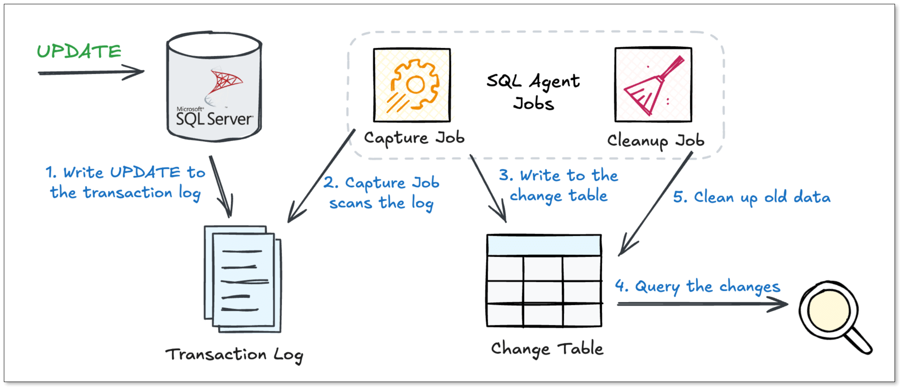

SQL Server CDC is one of those features many teams know exists, but fewer really understand. You’ve probably heard it’s useful for real-time data pipelines. But how does it actually work under the hood? And more importantly, what breaks once you run it in production?

In this guide, we’ll walk through how Change Data Capture (CDC) works in SQL Server, where it shines, and where it starts to hurt.

## What Is CDC and How It Works
Before diving into SQL Server CDC, we need to understand what is CDC first. 

[Change Data Capture (CDC)](change_data_capture_cdc.md) is a technique used to track data changes, such as inserts, updates, and deletes in a database. Unlike traditional ETL that repeatedly scans entire tables, CDC records only the changes that occur, enabling incremental data processing.

A typical CDC system:

+ Monitors committed transactions
+ Captures INSERT, UPDATE, and DELETE operations
+ Preserves the order of changes
+ Delivers changes in a queryable or streamable form

Compared to batch-based approaches (like full table dumps), [CDC tools](https://www.bladepipe.com/blog/data_insights/top_cdc_tool/) significantly reduces database load and latency, making it suitable for real-time data pipelines.

## What Is CDC in SQL Server?
**SQL Server CDC** is a built-in feature that tracks row-level changes in a database and makes them available for incremental consumption. Instead of repeatedly querying tables to figure out what changed, CDC captures inserts, updates, and deletes directly from the SQL Server **transaction log**.

Once enabled, SQL Server creates a dedicated **change table** for each tracked source table. Downstream systems can query these change tables to fetch new changes in order.

### What Problem Does SQL Server CDC Solve?
SQL Server often sits behind business-critical systems for its robust performance. The problem is that while your application data is changing constantly, most downstream systems like warehouses still rely on slow, batch-based syncs. 

That's where SQL Server CDC comes in. It solves this by:

+ Capturing only incremental changes
+ Avoiding full table scans
+ Preserving the order and type of changes
+ Keeping production impact low

This makes CDC especially useful for near-real-time data integration.

### Benefits of SQL Server CDC
Now you've understood what problem that SQL Sever CDC solves. But why should you choose it over the familiar comfort of triggers? The benefits are bigger than you might think:

+ **Minimal impact on production workloads**, because it reads changes from the transaction log.
+ **Reduced data volume, latency and computing cost**, because it captures only what changed.
+ **Strong ordering and consistency guarantees**. All changes are from the database's single source of truth - transaction log.
+ **Rich change details**, easy for auditing, analytics and debugging.

### SQL Server CDC vs Change Tracking
CDC is often confused with **Change Tracking (CT)**, another change-related feature in SQL Server. But they are built for different purposes.

Change Tracking is a lightweight solution to tell you **what rows have changed**. When enabled, it synchronously records the brief information (the primary key and the type of change) of every changed row. So, if you just care about the final state of data, Change Tracking might be enough.

In contrast, CDC tells you **the details of how data is changed**. It keeps a detailed record of change history, including the values before and after each change. That makes it a better fit for real-time data pipelines, analytics and streaming use cases.

## How CDC Works in SQL Server?
To fully understand the actual CDC process in SQL Server, let’s walk through what happens when an UPDATE occurs on a CDC-enabled table.



1. **Write UPDATE to the transaction log**   
When an UPDATE statement is executed, SQL Server writes the details of this change, together with other transactions, to the **transaction log**. 

2. **Capture Job scans the log**   
A background Capture Job continuously scans the transaction log for changes related to CDC-enabled tables. When it finds the log record for the UPDATE, it reads the information.

3. **Write to the change table**   
The Capture Job processes the information from the log and writes it as new rows into a separate **change table**. Each row is tagged with a **Log Sequence Number (LSN)** to preserve order.

4. **Query the changes**   
Applications or pipelines can query the changes, such as all changes after a certain LSN. It returns a structured set of the changes, which your application can process and apply to a target system.

5. **Clean up old data**   
A background Cleanup Job periodically checks the retention period you configured and removes expired records to control storage growth. 

Such a cycle runs continuously, providing a robust and reliable stream of change data without directly burdening your transaction workload.

## How to Enable SQL Server CDC?
### Prerequisites
+ SQL Server edition should be Enterprise Edition (2008 and later) or Standard Edition (SQL Server 2016 SP1 and later).
+ Have `sysadmin` or `db_owner` privileges.
+ The SQL Agent service is running.

### **Step 1: Enable CDC on the Database**
Run the following statement to enable CDC of a certain database. 

```sql
sys.sp_cdc_enable_db;
GO
```

This creates the necessary system tables, schemas, and a special user (`cdc`) within your database.

### **Step 2: Enable CDC on a Table**
Let's say you want to track changes on a table named `dbo.Products`.

```sql
EXEC sys.sp_cdc_enable_table
    @source_schema = 'dbo',
    @source_name   = 'Products',
    @role_name     = 'cdc_readers'; -- This creates a database role to control access. If it sets to NULL, the change data can be accessed by any user.
GO
```

## Native CDC vs Third-Party CDC Tools
If SQL Server already has CDC, why do many teams choose other data tools for SQL Server CDC pipelines? 

Because native CDC is useful, but incomplete.

### Limitations of Native SQL Server CDC
While native CDC is effective, it is not a "set it and forget it" solution. Companies often run into the following challenges, especially as their systems scale.

+ **Handling Schema Changes**   
This is arguably the biggest limitation. Native CDC doesn't catch DDL changes. If you add, remove, or modify a column, you have to manually capture the changes and handle the order of DDL and DML. This process is disruptive, and can lead to data loss or long downtime. 

+ **Initial Full Data Loa**   
Native CDC only captures changes after it's enabled. It does not provide a mechanism for the initial load of the source data to the target. It has to be handled as a separate, manual process, and you have to carefully connect it with the start of CDC to avoid data gaps or duplicates.

+ **No Built-in Transformations**   
Native CDC delivers the raw change data exactly as it was recorded. If you need to filter out sensitive columns, mask data, or perform any transformations before loading it into the target system, you must build that logic into a separate downstream process. 

+ **Complex Management & Monitoring**   
Native CDC relies on SQL Agent jobs. All monitoring, management and troubleshooting requires specialized DBA skills. There is no central, user-friendly dashboard to see the health of all your data pipelines at a glance.

### How Third-party Tools Address the Gaps
Many third-party CDC platforms are specifically designed to overcome the limitations of the native solution. Taking [BladePipe](https://www.bladepipe.com/) as an example, it provides a managed, end-to-end data integration experience.

+ **Automated Schema Evolution**   
BladePipe can automatically detect schema changes on the source table and propagate them to the target system without interrupting the data pipeline. No manual intervention or downtime is required.

+ **Integrated Initial Load**    
A "snapshot" mechanism is integrated into BladePipe. When you create a new pipeline, it will first perform a full, consistent copy of the source data and then seamlessly transit to streaming live changes, ensuring no data is missed or duplicated.

+ **In-Flight Transformations & Filtering**   
BladePipe allows you to build transformations directly into the data pipeline. You can select specific columns, filter out rows based on conditions, [mask sensitive data](https://www.bladepipe.com/blog/data_insights/data_masking/), or even perform [light data type conversions](https://www.bladepipe.com/docs/operation/job_manage/job_op/data_transform/) before the data ever leaves your source environment.

+ **Unified UI & Centralized Monitoring**   
In BladePipe, you get an intuitive, visual web interface. You can create, manage, and monitor all your data pipelines from a central dashboard, with built-in alerting for failures or latency spikes, making the process accessible to non-DBAs.

## Conclusion
SQL Server CDC is a solid foundation. It gives you an efficient way to capture changes without touching application code or stressing your database.

But it’s still just a foundation. Once schema changes, monitoring, and downstream integration enter the picture, native CDC starts to show its limits. For teams moving beyond simple use cases, third-party CDC tools like BladePipe help turn raw change data into reliable, production-ready data pipelines.

Ready to see a complete SQL Server CDC solution? [Have a trial](https://www.bladepipe.com/login/) now or [book a live demo](https://cal.com/bladepipe-xxypci/30min).

## FAQ
**Q: How does CDC work in SQL Server?**    
CDC works by asynchronously reading the database's transaction log. A background Capture Job  copies committed changes (inserts, updates, and deletes) from the log into dedicated change tables. You can then query these tables.

**Q: How do I check if CDC is enabled?**    
You need to check in two places. First, see if the database is enabled:

```plain
SELECT name, is_cdc_enabled FROM sys.databases WHERE name = 'YourDatabaseName';
```

If that returns `1`, check if your specific table is enabled:

```plain
SELECT name, is_tracked_by_cdc FROM sys.tables WHERE name = 'YourTableName';
```

**Q: How do I disable CDC?**    
Disabling CDC is a two-step process. First, you must disable it for each table being tracked, and then you can disable it for the database.

**Disable on the table:**

```plain
EXEC sys.sp_cdc_disable_table
    @source_schema = N'dbo',
    @source_name   = N'YourTableName',
    @capture_instance = N'all';
```

**Disable on the database (after all tables are disabled):**

```plain
EXEC sys.sp_cdc_disable_db;
```


