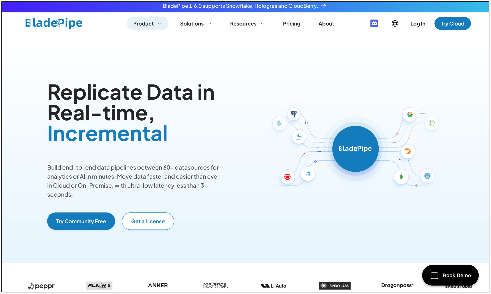
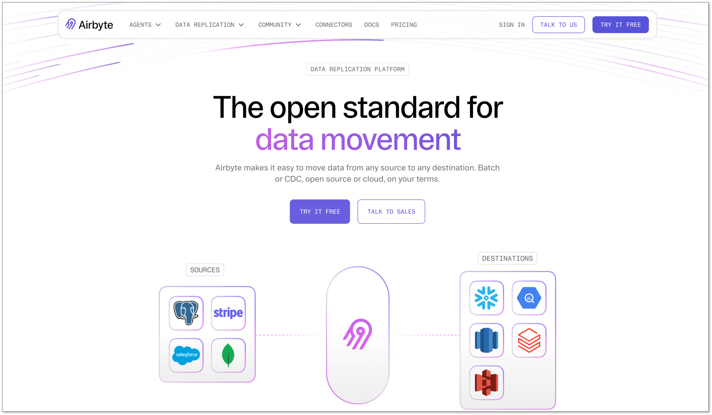
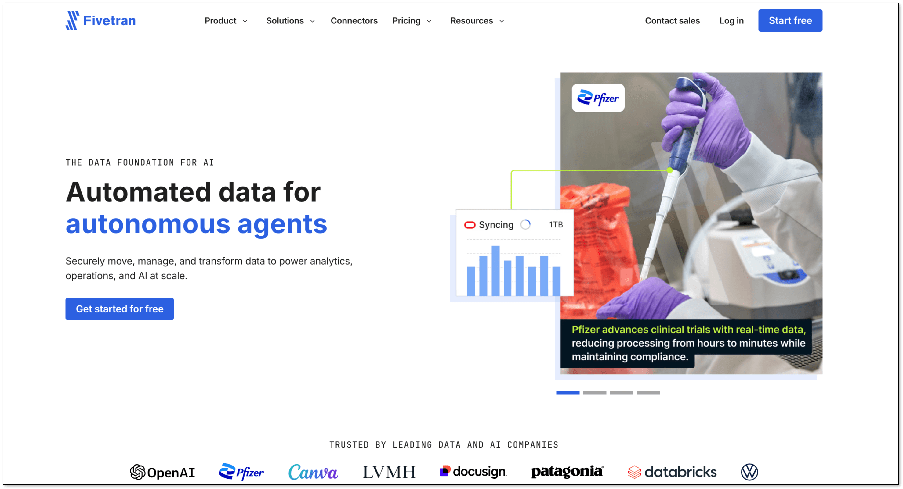
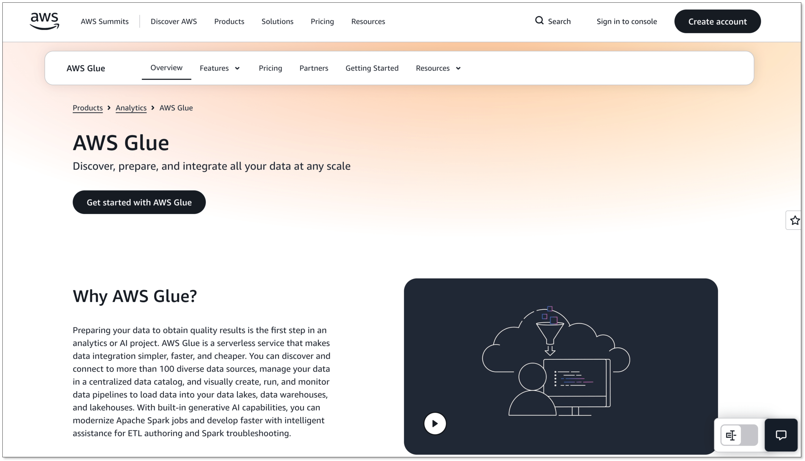
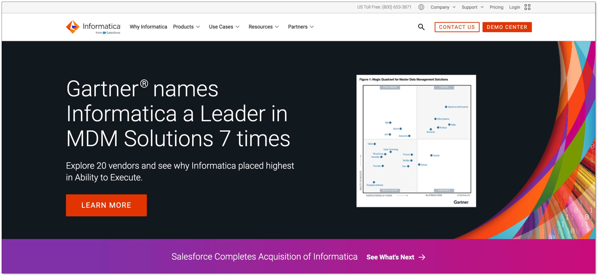
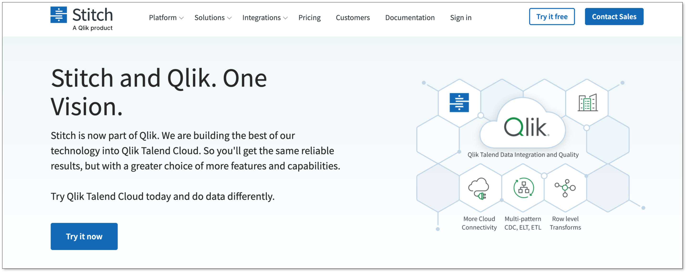

If you are looking for **Talend alternatives**, you are not alone. 

Many teams are moving away from Talend because of its cost, complexity, or licensing changes. Whether you need ETL pipelines, real-time CDC, data migration, or data ingestion at scale, there are better options today. This article breaks down the top 7 alternatives so you can find the right fit.

## What Is Talend?
Talend is a data integration platform that has been around since 2006. It supports ETL, data quality, and cloud data pipelines. For a long time, it was one of the go-to tools for enterprise data teams.

In 2023, Qlik acquired Talend. Since then, pricing and licensing have shifted. Some open-source components have been pulled back. [The community edition](https://community.qlik.com/t5/Installing-and-Upgrading/Download-Talend-Open-Studio/td-p/2470265) (Talend Open Studio) was fully discontinued. And the paid product is expensive for small to mid-sized teams.

## Why Consider a Talend Alternative?
A few common reasons teams start looking elsewhere:

**Cost**: Talend's enterprise plans are not cheap. For startups or growing teams, the price-to-value ratio gets hard to justify.

**Complexity**: Setting up and maintaining Talend jobs takes time. It has a steep learning curve, especially for teams without dedicated data engineers.

**Limited real-time CDC**: Talend handles batch ETL well, but real-time Change Data Capture (CDC) support is limited compared to newer tools.

**Licensing changes:** After the Qlik acquisition, some features that used to be free moved behind a paywall. That surprised a lot of existing users.

If any of these sound familiar, it is worth exploring what else is out there.

## Best 7 Talend Alternatives
### 1. BladePipe

[BladePipe](https://www.bladepipe.com/) is the best Talend alternative if your main focus is real-time data integration, data migration, CDC, and database replication. It covers the full range: ETL, CDC, data migration, and data ingestion. And the best part is it has a fully free version to get started.

Unlike most tools in this space, BladePipe does not hide core features behind a paywall. You get real-time CDC, full data migration support, and a clean UI without paying anything upfront.

**What it does well:**

BladePipe supports CDC from databases like MySQL, PostgreSQL, MongoDB, Oracle, and more. Changes are captured at the source and streamed downstream in real time. [Setup](https://www.bladepipe.com/docs/productOP/onPremise/installation/install_all_in_one_docker/) is fast, and latency is low.

For data migration, BladePipe handles both schema migration and full data sync. You can move data between databases with minimal configuration. It supports cloud, on-premise, and hybrid environments.

The platform also supports ETL transformations in the pipeline. You do not need a separate tool for transformation logic.

**Why choose BladePipe**:

+  Strong fit for [real-time CDC](https://www.bladepipe.com/real-time-analytics/) 
+  Good for data migration and synchronization 
+  Supports full migration and incremental replication 
+  Useful for database-to-database and database-to-warehouse pipelines 
+  Includes a fully free option 

**Best for:** Startups, growing data teams, and anyone tired of paying for features they barely use.

[**Pricing**](https://www.bladepipe.com/pricing/)**:** Free tier available. [Paid plans](https://www.bladepipe.com/docs/price/plans_diff/) for enterprise-scale usage.

### 2. Airbyte

Airbyte is an open-source ELT platform with a large connector library. It focuses on data ingestion from hundreds of sources into your data warehouse or lake.

The community edition is self-hosted and free. Airbyte Cloud is managed but has usage-based pricing. It is a good choice if you want open-source flexibility with a wide connector ecosystem.

CDC support exists but is not its strongest feature. Airbyte shines most for batch ELT and data ingestion use cases.

**Why choose Airbyte:**

+  Open-source option 
+  Broad connector catalog 
+  Good for ELT workflows 
+  Active developer community 

**Best for:** Teams that need many pre-built connectors and prefer open-source software.

**Pricing:** Free (self-hosted). Airbyte Cloud starts at usage-based pricing.

### 3. Fivetran 

Fivetran is a fully managed ELT tool. It handles data ingestion from SaaS apps, databases, and cloud services with minimal setup. Connectors are maintained by Fivetran, so you do not worry about breaking changes.

Fivetran is reliable and easy to use. It is a strong choice if you want less maintenance. But it is not cheap. Pricing is based on monthly active rows (MAR), which can get expensive as data volume grows.

Fivetran does support CDC for certain database sources. It is a solid option if budget is not a concern and you want something that just works.

**Why choose Fivetran**:

+  Fully managed data pipelines 
+  Large connector ecosystem 
+  Strong fit for cloud data warehouses 
+  Good for SaaS data ingestion 
+  Low operational burden

**Best for:** Teams that want a managed, low-maintenance pipeline solution, and don't concern about the budget.

**Pricing:** No free tier. Starts at several hundred dollars per month depending on volume.

### 4. Apache Kafka + Kafka Connect

Kafka is the standard for real-time data streaming. Combined with Kafka Connect and [Debezium](https://www.bladepipe.com/blog/data_insights/debezium_alternatives/), it becomes a powerful CDC engine. Changes from your source databases stream into Kafka topics and can be consumed by any downstream system.

This is not a plug-and-play tool. It requires infrastructure knowledge and operational overhead. But for teams that need high-throughput, real-time CDC at scale, Kafka is hard to beat.

**Why choose Kafka**:

+  Strong for real-time streaming 
+  Good for event-driven systems 
+  Large connector ecosystem 
+  Works well with Debezium for CDC 
+  Open-source option

**Best for:** Engineering teams comfortable managing distributed systems who need real-time event streaming.

**Pricing:** Open-source and free. Managed versions (Confluent Cloud) are paid.

### 5. AWS Glue 

AWS Glue is a serverless ETL service built into the AWS ecosystem. If your data already lives in S3, Redshift, or RDS, Glue integrates cleanly. You write ETL scripts in Python or Spark, and Glue handles the infrastructure.

It is not the easiest tool to use. Debugging Glue jobs can be frustrating. But for AWS-native teams, it removes the need to manage ETL servers.

CDC support through Glue is limited. It works better for scheduled batch ETL than real-time pipelines.

**Why choose AWS Glue:**

+  Serverless ETL 
+  Strong AWS integration 
+  Supports batch and streaming jobs 
+  Good for data lakes 
+  Pay-as-you-go pricing

**Best for:** AWS-centric teams running batch ETL workflows.

**Pricing:** Pay-per-use based on DPU hours. No upfront cost, but costs can add up.

### 6. Informatica

Informatica is one of the oldest names in enterprise data integration. It covers ETL, data quality, master data management, and data governance in one platform.

It is feature-rich, but it also comes with enterprise-level pricing and complexity. Smaller teams will likely find it overkill.

For large organizations with strict compliance needs and complex data environments, Informatica still makes sense. But for most teams reading this article, it is probably more than you need.

**Why choose Informatica:**

+  Enterprise-grade data integration 
+  Strong governance features 
+  Strong data quality capabilities 
+  Suitable for hybrid and multi-cloud environments 
+  Good for regulated industries

**Best for:** Large enterprises with complex data governance requirements.

**Pricing:** Enterprise pricing only. Contact sales.

### 7. Stitch

Stitch is a simple, cloud-based data ingestion tool. It moves data from dozens of sources into your warehouse with very little configuration. Think of it as a lighter version of Fivetran.

It does not support CDC or complex transformations. But if you need a quick, reliable way to load data from common SaaS sources into BigQuery, Snowflake, or Redshift, Stitch does the job well.

**Why choose Stitch:**

+ Simple setup 
+ Good for SaaS data ingestion 
+ Works with major cloud warehouses 
+ Supports incremental replication 
+ Easier than enterprise ETL tools

**Best for:** Small teams that need straightforward data ingestion without the complexity.

**Pricing:** Free trial available. Paid plans start at around $100/month.

## Comparison At a Glance
| Tool | ETL | CDC | Data Migration | Free Tier | Ease of Use |
| --- | --- | --- | --- | --- | --- |
| BladePipe | Yes | Yes | Yes | Yes (free) | Very Easy |
| Airbyte | Yes | Partial | Yes | Yes (OSS) | Easy |
| Fivetran | Yes | Partial | Yes | No | Very Easy |
| Apache Kafka | Yes | Yes | Partial | Yes (OSS) | Complex |
| AWS Glue | Yes | Partial | Yes | No | Moderate |
| Informatica | Yes | Yes | Yes | No | Moderate |
| Stitch | Yes | No | Yes | Trial only | Very Easy |
| Talend | Yes | Partial | Yes | No | Moderate |

## How to Choose the Best Talend Alternative
It depends on what you actually need.

**If you want free and powerful:** Start with BladePipe. It covers ETL, CDC, and data migration for free. There is no better starting point for teams on a budget.

**If you want open-source ELT:** Airbyte is the right pick. Large connector library, active community, and self-hosted so you keep control.

**If you want managed with no maintenance:** Fivetran is reliable, but budget accordingly.

**If you need real-time streaming:** Kafka with Debezium is the gold standard. Just be ready for the operational complexity.

**If you are all-in on AWS:** AWS Glue fits naturally. Keep expectations realistic for real-time use cases.

**If you are a large enterprise:** Informatica has the depth you need, including governance and data quality features.

**If simplicity is your priority:** Stitch is the no-fuss option for basic data ingestion.

A simple way to decide: write down your top three requirements. Match them to the table above. That usually narrows it down fast.

## Final Thoughts
Talend used to be the default choice for enterprise data integration. That is no longer the case. There are many faster, cheaper, and easier tools available today.

For most teams, [**BladePipe**](https://www.bladepipe.com/login/) is worth trying first. It is free, it handles real-time CDC, ETL, and data migration in one place, and setup takes minutes not days. You can be running a live pipeline before lunch.

If your needs are more specific, the other tools in this list each have a clear strength. Pick the one that matches your stack and your team's skill set.

The best data integration tool is the one your team will actually use. Start simple, and scale from there.

## FAQ
**Q: What is the best free alternative to Talend?** 

BladePipe is the best free Talend alternative. It supports ETL, CDC, and data migration with a generous free tier and no upfront cost.

**Q: Which data integration tools offer better pricing than Talend?**

Most alternatives in this list do. BladePipe is free to start, with no custom quote required. Airbyte and Apache Kafka are open-source and self-hostable at no license cost. AWS Glue uses pay-per-use pricing, so you only pay for what you run. For teams watching budget, BladePipe is the most straightforward option.

**Q: What is the difference between ETL and CDC?** 

ETL (Extract, Transform, Load) is typically a batch process that moves and transforms data on a schedule. CDC (Change Data Capture) is a real-time technique that captures row-level changes from a source database as they happen and streams them downstream.

**Q: What is the easiest data integration tool to use?** 

BladePipe, Fivetran, and Stitch are consistently rated as the easiest to set up. BladePipe stands out because it combines ease of use with a free tier and real-time CDC support.

**Q: Which Talend alternatives support real-time data ingestion and processing?** 

BladePipe and Apache Kafka are the strongest options here. BladePipe supports real-time CDC and data ingestion out of the box, with low latency and no complex infrastructure to manage. Kafka is the most powerful for high-throughput streaming but requires more engineering effort to set up. 