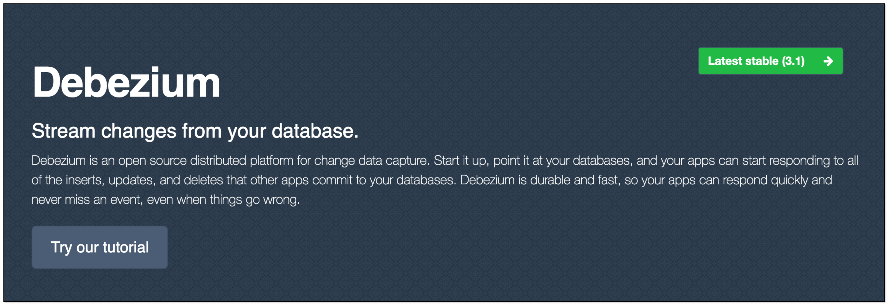
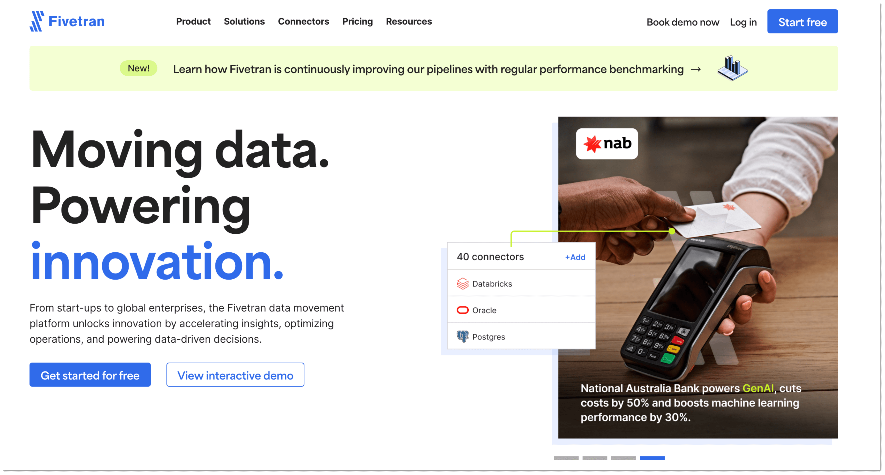
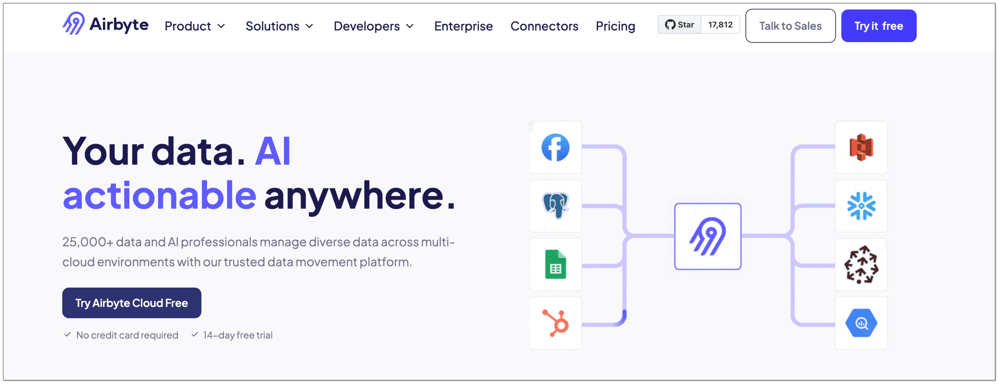
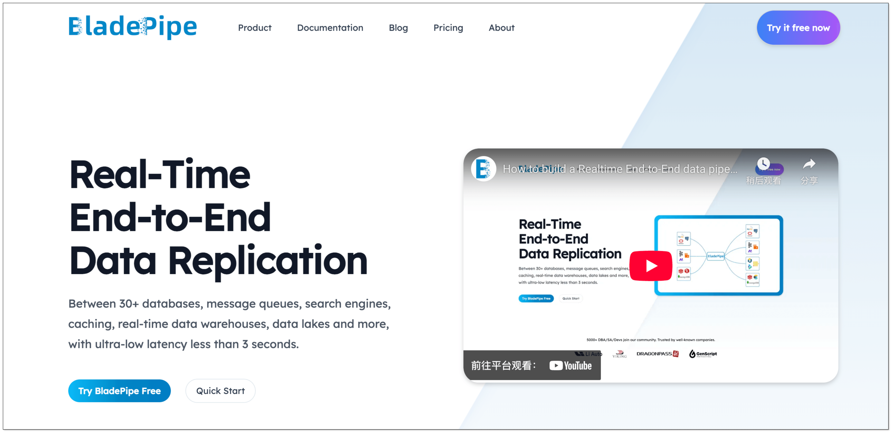
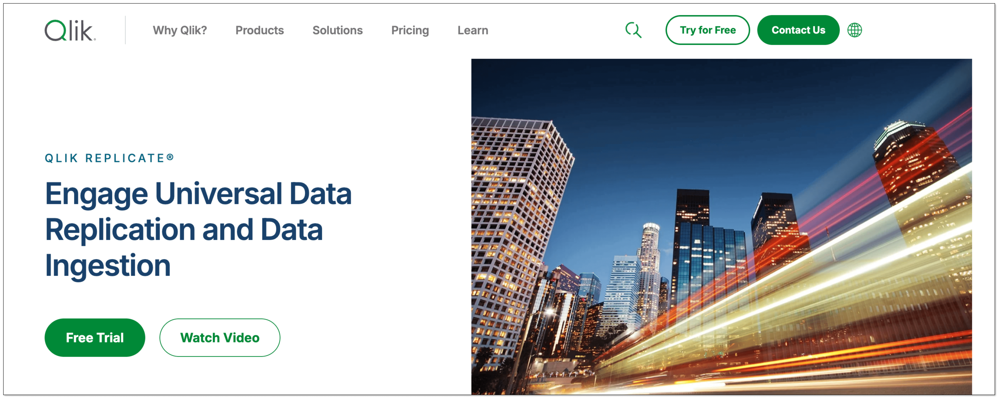
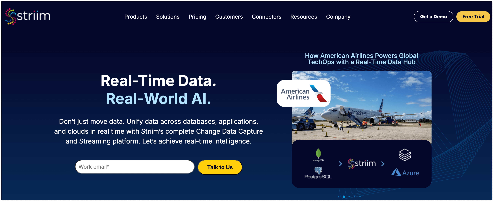
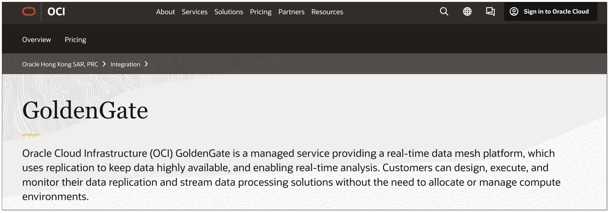

Change Data Capture (CDC) is a technique that identifies and tracks changes to data stored in a database, such as inserts, updates, and deletes. By capturing these changes, CDC enables efficient data replication between systems without full data reloads. It’s widely used in modern data pipelines to power real-time analytics, maintain data lakes, update caches, and support event-driven architectures.

## Why do You Need CDC?
- **Real-time Data Flow**: As the name implies, data changes are captured as they happen in near real-time. So, when something updates in the source database, it's reflected almost immediately elsewhere. This feature perfectly suits the use cases requiring real-time change sync across different databases or systems.
- **Reduced Resource Requirement**: CDC optimizes resource utilization to reduce operational costs by monitoring and extracting database changes in real-time, which requires fewer computing resources and provides better performance.
- **Greater Efficiency**: Only data that has changed is synchronized, which is exponentially more efficient than replicating an entire database and enhances the accuracy of data and analytics.
- **Agile Business Insights**: CDC enables data collection in real-time, allowing teams across organizations to access recent data for making data-driven decisions quickly and improving accuracy of decision-making.

## 7 Best CDC Tools in 2026

### Debezium
[Debezium](https://debezium.io/) is an open-source distributed platform for change data capture. Built on top of Apache Kafka, Debezium captures row-level changes from various databases, like MySQL, PostgreSQL, MongoDB, and others, and streams these changes to Kafka for downstream processing.

**Key Features:**

- **Open source**: Debezium is actively developed with a strong community, and it's free of cost.
- **Kafka Integration**: It is built on Apache Kafka, enabling scalable, fault-tolerant streaming of change events.
- **Snapshot & Stream Modes**: It can take an initial snapshot of existing data and then continue with real-time streaming.

### Fivetran
[Fivetran](https://www.fivetran.com/) is a fully managed data integration platform that simplifies and automates the process of moving data from various sources into centralized destinations like data warehouses or lakes. It handles schema changes, data normalization, and continuous updates without manual intervention.

**Key Features:**

- **Real-Time Data Movement**: It continuously updates data with low-latency, using CDC where supported to reduce load and improve speed.
- **Data Normalization**: It standardizes data structures and formats across sources to ensure consistency in your data warehouse.
- **Transformations with dbt Integration**: It enables in-warehouse transformations using SQL or dbt, making it easy to prepare data for analytics.

### Airbyte
[Airbyte](https://airbyte.com/) is an open-source data integration platform that supports log-based CDC from databases like Postgres, MySQL, and SQL Server. To assist log-based CDC, Airbyte uses Debezium to capture various operations like INSERT and UPDATE. 

**Key Features:**
- **Open-Source & Extensible**: It is fully open-source with a modular design that allows users to build and customize connectors easily.
- **A Wide Range of Connector Support**: It supports for over 300 connectors, enabling data ingestion from APIs, databases, SaaS tools, and more.
- **Orchestration Integration**: It is compatible with Airflow and Dagster, allowing integration into existing workflows.

### BladePipe
[BladePipe](https://www.bladepipe.com/) is a real-time end-to-end data replication tool that moves data between 60+ databases, message queues, search engines, caching, real-time data warehouses, data lakes, etc.

BladePipe tracks, captures and delivers data changes automatically and accurately with ultra-low latency (less than 3 seconds), greatly improving the efficiency of data integration. It provides sound solutions for use cases requiring real-time data replication, fueling data-driven decision-making and business agility. 

**Key Features:**

- **Real-time Data Sync**: The latency is extremely low, less than 3 seconds in most cases.
- **Intuitive Operation**: It offers visual management interface for easy creation and monitoring of DataJobs. Almost all operations can be done by clicking the mouse. 
- **Flexibility of Transformation**: It supports filtering and mapping, and has multiple [built-in data transformation scripts](https://www.bladepipe.com/docs/operation/job_manage/job_op/data_transform/), which is friendly for non-developers. Also, users can realize special transformation using custom code.
- **Data Accuracy**: It supports [data verification and correction](https://www.bladepipe.com/docs/operation/job_manage/create_job/create_period_verification_correction_job/) right after replication, making it easy for users to check the accuracy and integrity of data in the target instance.
- **Monitoring & Alerting**: It has [built-in tools](https://www.bladepipe.com/docs/operation/job_manage/job_op/job_monitor/) for monitoring task health, performance metrics, and error handling. It also supports various ways for alert notification.

### Qlik Replicate
[Qlik Replicate](https://www.qlik.com/us/products/qlik-replicate) is a high-performance data replication and change data capture (CDC) solution designed to enable real-time data movement across diverse systems. It supports a wide range of source and target platforms, including relational databases, data warehouses, cloud services, and big data environments.

**Key Features:**
- **Cloud and Hybrid Support**: It works across on-premises, cloud, and hybrid environments, suitable for building modern data architectures.
- **High Performance & Scalability**: It is optimized for high-volume data replication with minimal impact on source systems.
- **Broad Source and Target Support**: It supports a wide range of platforms including Oracle, SQL Server, MySQL, PostgreSQL, SAP, Mainframe, Snowflake, Amazon Redshift, Google BigQuery, and more.

### Striim
[Striim](https://www.striim.com/) is a real-time data integration and streaming platform. With built-in change data capture (CDC) capabilities, Striim enables low-latency replication from transactional databases to modern destinations such as data warehouses, lakes, and analytics platforms.

**Key Features:**
- **Real-Time Data Integration**: It captures and delivers data changes instantly using log-based CDC.
- **Source & Target Support**: It supports a wide range of sources and destinations, including databases, data warehouses, lakes, etc.
- **User-friendly UI**: It offers a drag-and-drop interface and SQL support for building, deploying, and managing data pipelines.

### Oracle GoldenGate
[Oracle GoldenGate](https://www.oracle.com/integration/goldengate/) is a software package for enabling the replication of data in heterogeneous data environments. It enables continuous replication of transactional data between databases, whether on-premises or in the cloud, with minimal impact on source systems.

**Key Features:**
- **Log-Based Replication**: It uses transaction logs for non-intrusive, high-performance data capture without impacting source systems.
- **Cloud Integration**: It can seamlessly integrates with Oracle Cloud Infrastructure (OCI) and other cloud platforms for hybrid and multi-cloud deployments.
- **Data Transformation**: It allows filtering, mapping, and transformation of data during replication.

## How to Choose the CDC Tool that Works for You?
Choosing the right CDC tool depends on the specific needs and requirements of your organization. Here are some factors to consider:

- **Data Sources and Targets**: Ensure that the CDC tool supports the data sources and targets you need to integrate.
- **Real-time Requirements**: Evaluate the latency requirements of your applications and choose a CDC tool that can meet those needs.
- **Scalability**: Consider the volume of data you need to process and choose a CDC tool that can scale to handle your workload.
- **Ease of Use**: Look for a CDC tool that is easy to set up, configure, and manage.
- **Cost**: Compare the pricing of different CDC tools and choose one that fits your budget.
- **Existing Infrastructure**: Assess how well the CDC tool integrates with your current data infrastructure and tools.
- **Specific Use Cases**: Align the tool's capabilities with your specific use cases, such as real-time analytics, data warehousing, or application integration.
- **Security and Compliance**: Ensure the tool meets your organization's security and compliance requirements.
- **Support and Documentation**: Check for comprehensive documentation, community support, and vendor support options.

## Wrapping Up
CDC tools are about efficiency. It maintains consistency between systems without the cost of bulk data transfers, making real-time business insights possible. To choose a right CDC tool for your project, you have to consider multiple factors. Align a tool’s capabilities with your technical requirements and business goals, and select a CDC solution that ensures reliable, real-time data replication tailored to your project.

If you are looking for an efficient, stable and easy-to-use CDC tool, [BladePipe](https://www.bladepipe.com/) is well-placed as it offers an out-of-the-box solution for real-time data movement. Whether you're building real-time analysis, syncing data across services, or preparing datasets for machine learning, BladePipe helps you move and shape data quickly, reliably, and efficiently.

> **Suggested Reading**
>  
> - [10 Best Data Integration Tools](data_integration_tools.md)
> - [10 Best Data Migration Tools](best_data_migration_tools.md)