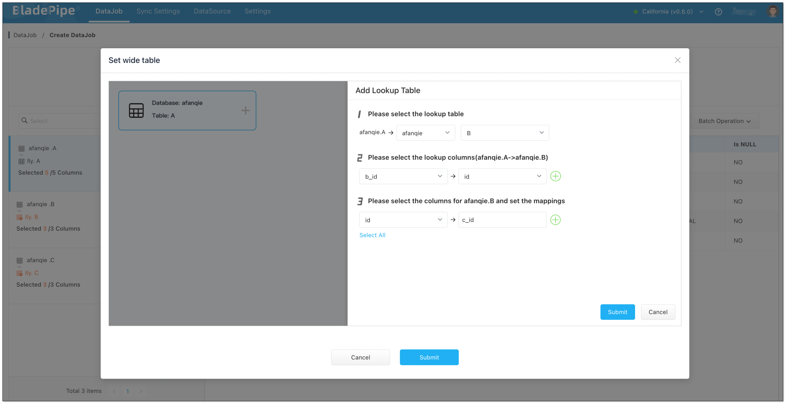
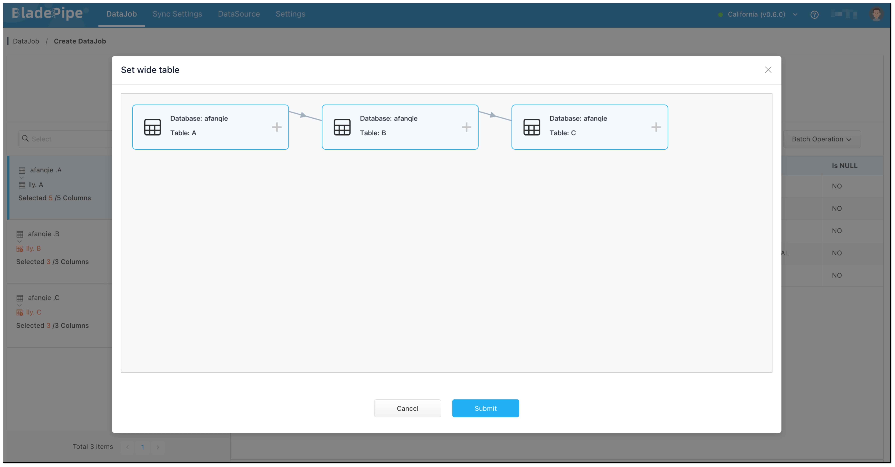

In real-world business scenarios, even a basic report often requires joining 7 or 8 tables. This can severely impact query performance. Sometimes it takes hours for business teams to get a simple analysis done.

This article dives into how wide table technology helps solve this pain point. We’ll also show you how to build wide tables with zero code, making real-time cross-table data integration easier than ever.

## The Challenge with Complex Queries

As business systems grow more complex, so do their data models. In an e-commerce system, for instance, tables recording orders, products, and users are naturally interrelated:

- **Order table**: product ID (linked to **Product table**), quantity, discount, total price, buyer ID (linked to **User table**), etc.
- **Product table**: name, color, texture, inventory, seller (linked to **User table**), etc.
- **User table**: account info, phone numbers, emails, passwords, etc.

Relational databases are great at normalizing data and ensuring efficient storage and transaction performance. But when it comes to analytics, especially queries involving filtering, aggregation, and multi-table JOINs, the traditional schema becomes a performance bottleneck.

Take a query like "Top 10 products by sales in the last month": the more JOINs involved, the more complex and slower the query. And the number of possible query plans grows rapidly:

Tables Joined|	Possible Query Plans |
--------------|--|
2|2|
4|24|
6|720|
8|40320 |
10| 3628800 |

For CRM or ERP systems, joining 5+ tables is standard. Then, the real question becomes: **How to find the best query plan efficiently?**

To tackle this, two main strategies have emerged: **Query Optimization** and **Precomputation**, with **wide tables** being a key form of the latter.

## Query Optimization vs Precomputation
### Query Optimization

One of the solutions is to reduce the number of possible query plans to accelerate query speed. This is called pruning. Two common approaches are derived:

- **RBO (Rule-Based Optimizer)**: RBO doesn't consider the actual distribution of your data. Instead, it tweak SQL query plans based on a set of predefined, static rules. Most databases have some common optimization rules built-in, like predicate pushdown. Depending on their specific business needs and architectural design, different databases also have their own unique optimization rules. Take SAP Hana, for instance: it powers SAP ERP operations and is designed for in-memory processing with lots of joins. Because of this, its optimizer rules are noticeably different from other databases.
- **CBO (Cost-Based Optimizer)**: CBO evaluates I/O, CPU and other resource consumption, and picks the plan with the lowest cost. This type of optimization dynamically adjusts based on the specific data distribution and the features of your SQL query. Even two identical SQL queries might end up with completely different query plans if the parameter values are different. CBO typically relies on a sophisticated and complex statistics subsystem, including crucial information like the volume of data in each table and data distribution histograms based on primary keys.

Most modern databases combine both RBO and CBO.

### Precomputation

Precomputation assumes **the relationships between tables are stable**, so instead of joining on every query, it pre-joins data ahead of time into a wide table. When data is changed, only changes are delivered to the wide table. The idea has been around since the early days of **materialized views** in relational databases. 

Compared with live queries, precomputation massively reduces runtime computation. But it's not perfect:

- **Limited JOIN semantics**: Hard to handle anything beyond LEFT JOIN efficiently.
- **Heavy updates**: A single change on the “1” side of a 1-to-N relation can cause cascading updates, challenging service reliability.
- **Functionality trade-offs**: Precomputed tables lack the full flexibility of live queries (e.g. JOINs, filters, functions).

### Best Practice: Combine Both

In the real world, a hybrid approach works best: use **precomputation** to generate intermediate wide tables, and use **live queries** on top of those to apply filters and aggregations.

- **Precomputation**: A popular approach is stream computing, with stream processing databases emerging in recent years. Materialized views in traditional relational databases or data warehouses also offer an excellent solution.

- **Live queries**: There is a significant performance boosts in data filtering and aggregation within real-time analytics databases, thanks to the columnar and hybrid row-column data structures, the new instruction sets like AVX 512, high-performance computing hardware such as FPGAs and GPUs, and the software application like distributed computing.

## BladePipe's Wide Table Evolution

BladePipe started with a high-code approach: users had to write scripts to fetch related table data and construct wide tables manually during data sync. It worked, but wasn’t scalable due to too much effort required.

Now, BladePipe supports **visual wide table building**, enabling zero-code configuration. Users can select a driving table and the lookup tables directly in the UI to define JOINs. The system handles both initial data migration and real-time updates.

It currently supports visual wide table creation in the following pipelines:

- MySQL -> MySQL/StarRocks/Doris/SelectDB
- PostgreSQL/SQL Server/Oracle/MySQL -> MySQL
- PostgreSQL -> StarRocks/Doris/SelectDB

More supported pipelines are coming soon.

## How Visual Wide Table Building Works in BladePipe

### Key Definitions

In BladePipe, a wide table consists of:

- **Driving Table**: The main table used as the data source. Only one driving table can be selected.
- **Lookup Tables**: Additional tables joined to the driving table. Multiple lookup tables are supported.

By default, the join behavior follows **Left Join** semantics: all records from the driving table are preserved, regardless of whether corresponding records exist in lookup tables.

BladePipe currently supports two types of join structures:

- **Linear**: e.g., A.b_id = B.id AND B.c_id = C.id. Each table can only be selected once, and circular references are not allowed.
- **Star**: e.g., A.b_id = B.id AND A.c_id = C.id. Each lookup table connects directly to the driving table. Cycles are not allowed.

In both cases, table A is the driving table, while B, C, etc. are lookup tables.

### Data Change Rule

#### If the target is a relational DB (e.g. MySQL):
- **Driving table INSERT**: Fields from lookup tables are automatically filled in.
- **Driving table UPDATE/DELETE**: Lookup fields are not updated.
- **Lookup table INSERT**: If downstream tables exist, the operation is converted to an UPDATE to refresh Lookup fields.
- **Lookup table UPDATE**: If downstream tables exist, no changes are applied to related fields.
- **Lookup table DELETE**: If downstream tables exist, the operation is converted to an UPDATE with all fields set to NULL.

#### If the target is an overwrite-style DB (e.g. StarRocks, Doris):
- All operations (INSERT, UPDATE, DELETE) on the Driving table will auto-fill Lookup fields.
- All operations on Lookup tables are ignored.
  
  :::info
  If you want to include lookup table updates when the target is an overwrite-style database, set up a two-satge pipeline:
  1. **Source DB → relational DB wide table**
  2. **Wide table → overwrite-style DB**
  :::

### Step-by-Step Guide

1. Log in to BladePipe. Go to **DataJob** > **Create DataJob**.
2. In the **Tables** step, 
   1. Choose the tables that will participate in the wide table.
   2. Click **Batch Modify Target Names** > **Unified table name**, and enter a name as the wide table name.
3. In the **Data Processing** step,
   1. On the left panel, select the Driving Table and click **Operation** > **Wide Table** to define the join.
      - Specify Lookup Columns (multiple columns are supported).
      - Select additional fields from the Lookup Table and define how they map to wide table columns. This helps avoid naming conflicts across different source tables.
      
    :::info
    **1.**
    If a Lookup Table joins to another table, **make sure to include the relevant Lookup columns**. For example, in A.b_id = B.id AND B.c_id = C.id, when selecting fields from B, c_id must be included.   
    **2.**
    When multiple Driving or Lookup tables contain fields with the same name, always **map them to different target column names to avoid collisions**.
    :::
      
      
   
   2. Click **Submit** to save the configuration.
      
   
   
   3. Click Lookup Tables on the left panel to check whether field mappings are correct.
4. Continue with the DataJob creation process, and start the DataJob.

## Wrapping up
Wide tables are a powerful way to speed up analytics by precomputing complex JOINs. With BladePipe’s visual builder, even non-engineers can set up and maintain real-time wide tables across multiple data systems.

Whether you're a data architect or a DBA, this tool helps streamline your analytics layer and power up your dashboards with near-instant queries.