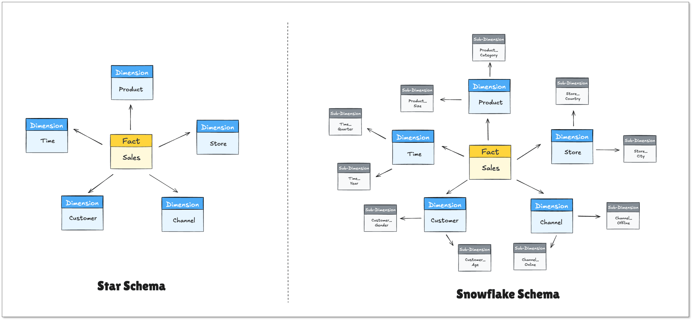
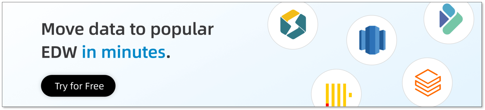

You have plenty of data. But what comes next?

It’s scattered across systems, each with its own logic and definitions. When you try to answer even simple questions, you often end up with conflicting numbers instead of clear insights.

That’s the problem an **Enterprise Data Warehouse (EDW)** is designed to solve. It brings data into one place, standardizes it, and makes it usable for analysis and decision-making.

In this guide, we’ll look at how EDWs work in practice, where they fall short, and why real-time integration is becoming the new baseline.

## Key Takeaways
+ An **Enterprise Data Warehouse (EDW)** is a centralized system for storing, modeling, and analyzing data from across the organization.
+ A typical EDW architecture includes **ingestion** (batch/streaming), **storage & modeling**, and **governance**.
+ Cloud warehouses like **Snowflake** and **BigQuery** are now the default choices. **StarRocks** and **Doris** are emerging alternatives.
+ Data lakes and lakehouses offer flexibility, but EDWs still win in structured analytics and BI.
+ Tools like **BladePipe** simplify moving data into the EDW, reducing pipeline complexity.

## What is Enterprise Data Warehouse (EDW) ?
At a high level, an Enterprise Data Warehouse (EDW) is a centralized repository that integrates data from various sources across an entire organization. 

But that definition doesn’t capture why it matters.

What an EDW really does is **force consistency across your business data**.

It pulls information from different systems, each with its own schema, logic, and quirks, and turns it into actionable insights. All scattered data is consolidated into a single layer, where historical records are preserved, and relationships across systems can be modeled. Without that layer, every team ends up building its own version of reality.

### Core Benefits of an EDW
Organizations invest heavily in EDW platforms because they solve several persistent data problems.

+ **Consolidated Reporting:** By providing a unified view of all business data, an EDW enables more accurate and insightful reporting and analysis.
+ **Improved Data Quality:** The process of loading data into an EDW, known as ETL (Extract, Transform, Load), involves cleaning and standardizing information, which enhances data quality and consistency across the organization.
+ **Accelerated Decision-Making:** With a centralized and optimized source of data, analysts and decision-makers can get answers to complex questions much faster, enabling a more agile response to market changes.
+ **Performance Isolation**: EDWs isolate analytics workloads from operational systems, ensuring applications stay fast while analytics runs freely.

### How EDW Differs from ODS and Data Marts
You may confuse EDW with ODS and data marts, the other two variations of data warehouses. While they seem similar, the three tools serve very different purposes.

+ **Operational Data Store (ODS)**: An ODS sits close to operational systems and usually stores **recent, near-real-time data**. It’s designed for operational reporting rather than deep analytics.
+ **Data mart**: Data marts are subsets of a warehouse, mainly focused on one department or subject area (e.g., sales, marketing, finance), and optimized for that team’s reporting needs.

What are the differences between the three? Here's a quick breakdown:

| **Angle** | **EDW** | **ODS** | **Data Mart** |
| --- | --- | --- | --- |
| **Scope** | Enterprise-wide | Operational systems | Single department |
| **Data Volume** | Massive (Terabytes+) | Moderate | Small to Medium |
| **Data Type** | Historical, integrated | Current, volatile | Subject-specific |
| **Target Users** | Executives, analysts | Operations staff | Department analysts |
| **Key Focus** | Strategic decisions | Day-to-day operations | Specific business needs |

## EDW Architecture at a Glance
A well-structured EDW is typically built on a tiered architecture that ensures efficiency, scalability, and security. This design separates the core functions of data acquisition, storage, and governance.

### Ingestion
The journey of data into an EDW starts at the ingestion layer. Data enters the system from various sources like CRM systems, ERPs, and external APIs. Traditionally, this was done through **batch processing**, where data was moved in large groups once a day. This is still the standard for non-urgent data, like monthly financial reconciliations.

Modern businesses, however, increasingly rely on **streaming ingestion**. This allows data to flow into the warehouse the moment an event occurs. This "near real-time" capability is essential for fraud detection or live inventory tracking. Most successful EDWs today use a hybrid approach to balance system load with the need for speed.

### Storage and Modeling
Once the data is inside, it must be organized to be useful. This is the "Modeling" phase. Most warehouses use specific structures:

+ **Star Schema:** A central "Fact" table (the numbers) surrounded by "Dimension" tables (the context).
+ **Snowflake Schema:** A more complex version of the star schema that saves storage space by further organizing dimensions.

After the data is modeled, it often passes through a semantic layer. This layer translates technical column names (like `cust_id_01`) into business terms (like "Customer Name"). This makes the data accessible to non-technical employees who want to build their own reports without writing SQL.

### Governance, Lineage, and Access Control
**Governance** is the set of rules that determines who can do what with the data. In a large enterprise, not everyone should have access to sensitive employee salaries or private customer details. Robust **access controls** are built into the EDW to ensure security. This helps companies comply with laws like GDPR or CCPA.

**Data lineage** is another critical component of the architecture. It provides a map of where the data came from and how it was changed along the way. If a report shows a strange number, lineage allows data engineers to trace it back to the source to find the error. It provides transparency and accountability for the entire data lifecycle.

## EDW vs. Data Lake vs. Lakehouse
The rise of Big Data has introduced new concepts like data lakes and lakehouses. Understanding their differences is key to choosing the right strategy.

+ An **Enterprise data warehouse** excels at handling structured, processed data. Its "schema-on-write" approach (where data is structured before being stored) guarantees performance and reliability for BI and analytics. 
+ A [**Data Lake**](https://www.bladepipe.com/blog/data_insights/iceberg_vs_deltalake_vs_paimon/) is designed to store massive volumes of raw data in its native format. Its "schema-on-read" flexibility makes it ideal for exploratory data science and machine learning, but it can become disorganized without strong governance.
+ A **Data Lakehouse** is a hybrid model that aims to provide the structure and management features of a data warehouse with the low-cost, flexible storage of a data lake. Tools like Delta Lake and [Apache Iceberg](https://www.bladepipe.com/blog/tech_share/mysql_iceberg_sync/) are part of this trend.

### When the EDW Still Wins
The EDW remains the champion for structured data and high-speed reporting. If your data fits neatly into rows and columns, the EDW is faster and more reliable. It is also better for standard reporting where the rules don't change often. Some scenarios include: 

+ enterprise BI platforms
+ regulated financial reporting
+ high-performance SQL analytics
+ strict governance environments

### When to Look Elsewhere
An EDW is not a silver bullet. You might want to consider a **Data Lake** if:

+ Your data is mostly unstructured (videos, audio files, raw logs).
+ You are a data science team doing exploratory research where you don't yet know the value of the data.
+ Your budget is extremely tight, as EDWs can be expensive to maintain and scale.

The **Data Lakehouse** is a newer hybrid that tries to combine both. While promising, it is often more complex to manage than a traditional EDW. 

## Leading EDW Solutions in the Market
Choosing an EDW is no longer just about storage. It’s about performance, scalability, ecosystem, and how well it fits your data workflows. The market today is dominated by cloud-native platforms, with a few strong alternatives depending on your use case.

Here are some of the most outstanding players today:

### Cloud-Native Giants
Most modern data teams start here. These platforms are fully managed and designed for elastic scaling.

**Snowflake**  
Snowflake is one of the most popular EDW platforms today. It separates storage and compute, supports multi-cluster workloads, and is known for its ease of use. Many teams choose it for its strong ecosystem and minimal operational overhead.

**Google BigQuery**  
BigQuery is a serverless data warehouse with strong integration into the Google Cloud ecosystem. It performs well for large-scale analytics and is often favored by teams already using Google services.

**Amazon Redshift**  
Redshift is a mature EDW offering within AWS. It integrates well with other AWS services and has evolved to support both traditional warehouse and lakehouse-style workloads.

### Emerging EDW Alternatives
A newer category includes high-performance analytical databases that focus on real-time query performance.

[**StarRocks**](https://www.bladepipe.com/blog/tech_share/mysql_starrocks_sync/) and **Apache Doris** are often used for low-latency analytics and high-concurrency dashboards. They are especially strong in scenarios where data freshness is critical.

**ClickHouse** is another popular option for fast analytical queries. It is widely used in observability, ad tech, and real-time analytics use cases.

These systems are not always positioned as full EDWs. However, many teams use them as serving layers or even lightweight warehouses when real-time performance is a priority.

## How to Choose an EDW
Choosing a platform is a long-term commitment that affects your company for years. Evaluate your options based on these key pillars:

+ **Scalability**: Evaluate whether the system can handle the data in three years without slowing down.
+ **Query performance**: Some workloads involve massive joins or aggregations. Benchmarking query performance is critical.
+ **Ecosystem fit**: Make sure that the EDW connects easily with your existing tools, including CRM, ERP, and BI software. 
+ **Cost model**: Cloud warehouses vary significantly in pricing structure. Make sure that the cost is predictable and transparent.
+ **Security Certifications:** Ensure the provider meets your industry's specific needs, such as HIPAA for healthcare or SOC2 for tech.
+ **Skill Set**: Check if your team know how to use the system, or they need months of training.

Always perform a "Proof of Concept" (POC). Don't just look at the marketing slides. Upload a messy sample of your actual data and see how the system handles it.

## Move data into EDW in Real Time
### Where Real-Time Matters
Not all analytics needs to be real time, but some use cases benefit greatly.

+ **Fraud detection:** Financial systems need to flag suspicious transactions within seconds, not hours.
+ **Inventory and supply chain tracking:** Keeping stock levels updated in real time to avoid overselling or stockouts.
+ **Customer engagement**: Triggering in-app messages, recommendations, or emails based on recent user behavior.
+ **Reporting**: You may not need minute-by-minute updates, but you do need data that’s always current when executives ask for it.

### Streaming and CDC 
To achieve this speed, companies are moving away from traditional ETL toward [**Change Data Capture (CDC)**](https://www.bladepipe.com/blog/data_insights/change_data_capture_cdc/). It is a technology that reads the database logs to capture changes instantly. 

Instead of repeatedly copying entire datasets, CDC reads directly from database logs and streams only what changed. That places almost zero load on your production systems, and allows the warehouse to stay updated in near real-time.

For teams looking to solve the integration bottleneck without hiring an army of engineers, tools like [**BladePipe**](https://www.bladepipe.com/pricing/) simplify the process. BladePipe handles high-performance data replication and CDC out of the box. It bridges the gap between various cloud environments and on-premise databases, ensuring that your EDW is always in sync with your live data.

## Final Thoughts
An EDW works best when it delivers trusted, up-to-date data that teams can actually use. The technology matters, but the real impact comes from how data flows into it and how consistently it is modeled.

In most projects, the hardest part is not the warehouse itself. It is integration, freshness, and reliability. Getting data in quickly and keeping it accurate is what makes dashboards useful.

Keep the setup simple, choose tools that fit your workloads, and focus on moving data efficiently. That is what turns an EDW from a storage system into a decision-making engine.

## FAQ
**Q: Is an EDW the same as a Database?** 

No. A database (OLTP) is built to record transactions quickly. An EDW is built to analyze large amounts of those transactions over time.

**Q: How much does an EDW cost?** 

It varies wildly. Small cloud setups can start at a few hundred dollars a month, while massive enterprise systems can cost millions annually.  
**Q: How long does it take to build an EDW?**  
Traditionally, this could take many months. However, with modern integration platforms that use CDC and streaming, the timeline can be reduced significantly to months even weeks.

**Q: What is the most popular EDW today?** 

Currently, Snowflake, Google BigQuery, and Amazon Redshift lead the market due to their cloud-native features and ease of use. 

