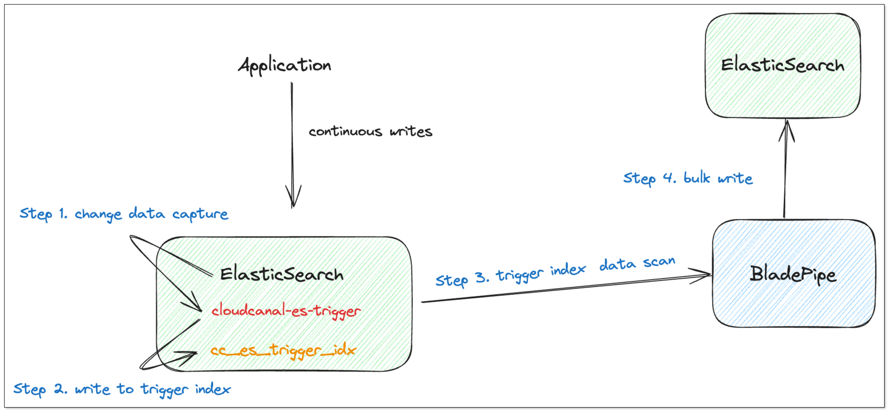

## Overview

Elasticsearch is a popular search engine that forms part of the modern data stack alongside relational databases, caching, real-time data warehouses, and message-oriented middleware.

While writing data to Elasticsearch is relatively straightforward, real-time data synchronization can be more challenging.

This article describes how to migrate and sync data from Elasticsearch to Elasticsearch using [BladePipe](https://www.bladepipe.com) and the **Elasticsearch incremental data capture plugin**.


## Highlights

### Elasticsearch Plugin

Elasticsearch does not explicitly provide a method for real-time change data capture. However, its plugin API **IndexingOperationListener** can track **INDEX** and **DELETE** events. The **INDEX** event includes INSERT or UPDATE operations, while the **DELETE** event refers to traditional DELETE operations.

Once the mechanism for capturing incremental data is established, the next challenge is how to make this data available in downstream tools.

We use a dedicated index, `cc_es_trigger_idx`, as a container for incremental data.

This approach has several benefits:

- No dependency on third-party components (e.g., message-oriented middleware).
- Easy management of Elasticsearch indices.
- Consistency with the incremental data capture method of other BladePipe data sources, allowing for code reuse.



The structure of the `cc_es_trigger_idx` index is as follows, where `row_data` holds the data after the INDEX operations, and `pk` stores the document **_id**.

```json
{
  "mappings": {
    "_doc": {
      "properties": {
        "create_time": {
          "type": "date",
          "format": "yyyy-MM-dd'T'HH:mm:ssSSS"
        },
        "event_type": {
          "type": "text",
          "analyzer": "standard"
        },
        "idx_name": {
          "type": "text",
          "analyzer": "standard"
        },
        "pk": {
          "type": "text",
          "analyzer": "standard"
        },
        "row_data": {
          "type": "text",
          "index": false
        },
        "scn": {
          "type": "long"
        }
      }
    }
  }
}
```

### Trigger Data Scanning

As for the incremental data generated by using the Elasticsearch plugin, simply perform batch scanning in the order of the `scn` field in the `cc_es_trigger_idx` index to consume the data.

The coding style for data consumption is consistent with that used for the SAP Hana as a Source.

### Open-source Plugin

Elasticsearch strictly identifies third-party packages that plugins depend on. If there are conflicts or version mismatches with Elasticsearch's own dependencies, the plugin cannot be loaded. Therefore, the plugin must be compatible with the exact version of Elasticsearch, including the minor version.

Given the impracticality of releasing numerous pre-compiled packages and to encourage widespread use, we place the open-source plugin on [GitHub](https://github.com/ClouGence/cloudcanal-es-trigger).

## Procedure

### Step 1: Install the Plugin on Source Elasticsearch

Follow the instructions in **[Preparation for Elasticsearch CDC](https://www.bladepipe.com/docs/dataMigrationAndSync/datasource_func/ElasticSearch/prepare_for_es_as_src)** to install the incremental data capture plugin.

### Step 2: Install BladePipe

Follow the instructions in [Install Worker (Docker)](https://www.bladepipe.com/docs/productOP/byoc/installation/install_worker_docker) or [Install Worker (Binary)](https://www.bladepipe.com/docs/productOP/byoc/installation/install_worker_binary) to download and install a BladePipe Worker.

### Step 3: Add DataSources

1. Log in to the [BladePipe Cloud](https://cloud.bladepipe.com).
2. Click **DataSource** > **Add DataSource**, and add 2 DataSources.

### Step 4: Create a DataJob
1. Click **DataJob** > [**Create DataJob**](https://doc.bladepipe.com/operation/job_manage/create_job/create_full_incre_task).
2. Select the source and target DataSources, and click **Test Connection** to ensure the connection to the source and target DataSources are both successful.
3. Select **Incremental** for DataJob Type, together with the **Full Data** option.

   :::info
   In the **Specification** settings, make sure that you select a specification of at least **1 GB**.

   Allocating too little memory may result in Out of Memory (OOM) errors during DataJob execution.
   :::

4. Select the indices to be replicated.
5. Select the fields to be replicated.

   :::info
   If you need to select specific fields for synchronization, you can first create the index on the target Elasticsearch instance. This allows you to define the schemas and fields that you want to synchronize.
   :::

6. Confirm the DataJob creation.

   :::info
   The DataJob creation process involves several steps. Click **Sync Settings** > [**ConsoleJob**](https://doc.bladepipe.com/operation/job_setting/console_job_manage), find the DataJob creation record, and click **Details** to view it.

   The DataJob creation with a source Elasticsearch instance includes the following steps:
   
   - Schema Migration
   - Initialization of Elasticsearch Triggers and Offsets
   - Allocation of DataJobs to BladePipe Workers
   - Creation of DataJob FSM (Finite State Machine)
   - Completion of DataJob Creation
   :::
   
7. Wait for the DataJob to automatically run.

   :::info
   Once the DataJob is created and started, BladePipe will automatically run the following DataTasks:
   - **Schema Migration**: The index mapping definition in the source Elasticsearch instance will be migrated to the Target. If an index with the same name already exists in the Target, it will be ignored.
   - **Full Data Migration**: All existing data in the Source will be fully migrated to the Target.
   - **Incremental Synchronization**: Ongoing data changes will be continuously synchronized to the target instance.
   :::