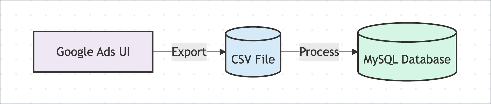
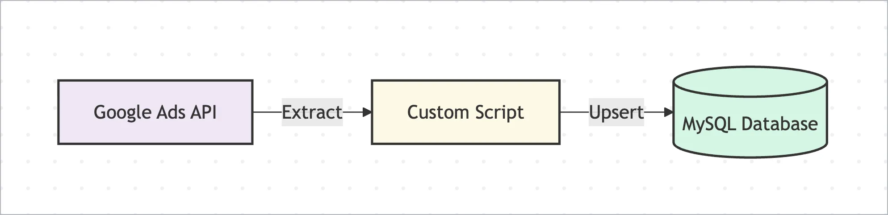
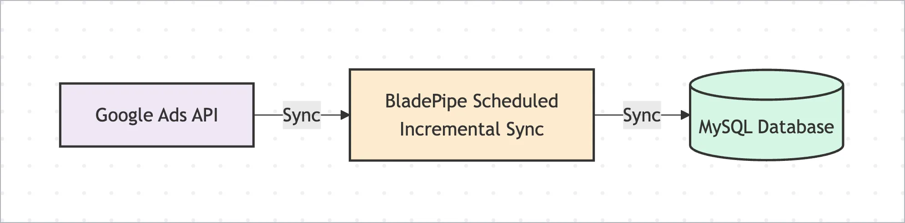
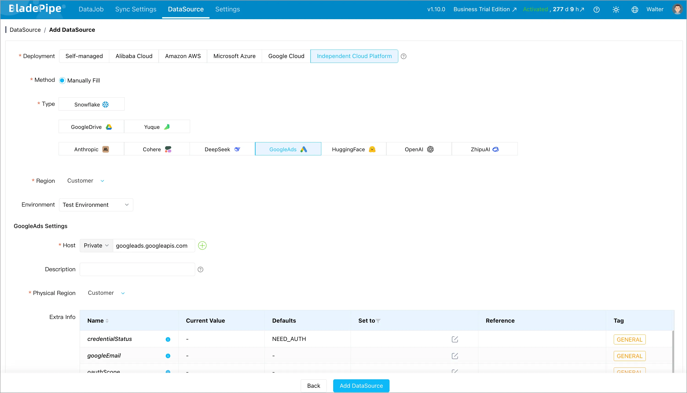
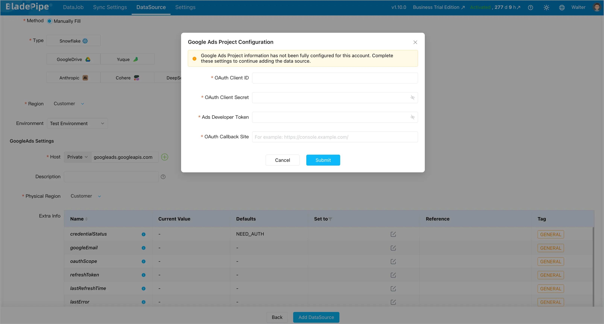
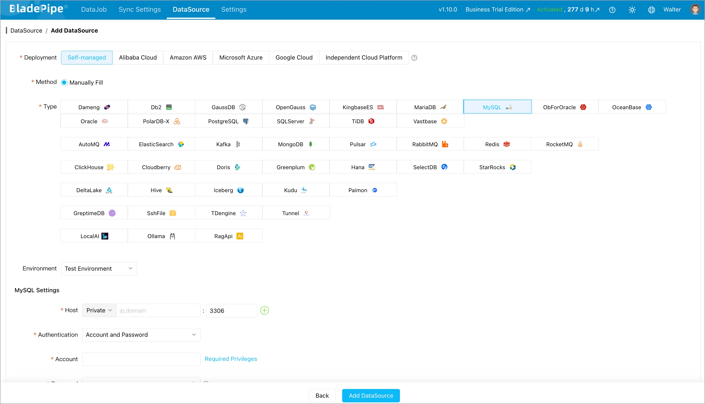
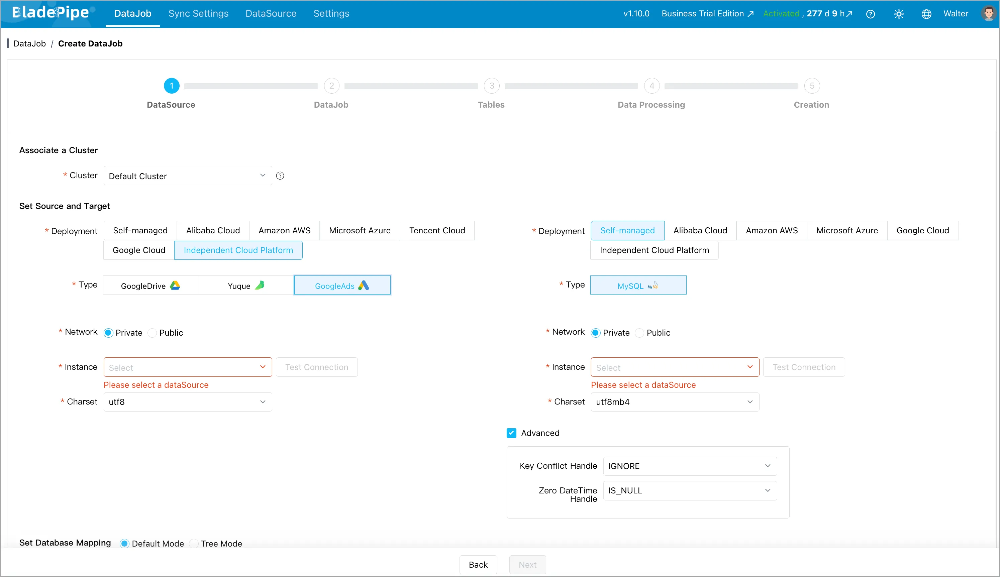

Google Ads UI is good for campaign operations, but not enough when marketing, finance, and data teams need historical reporting, custom dashboards, attribution analysis, or joins with CRM/order data. To do that, teams often need to sync Google Ads data into a database such as MySQL.

This guide compares three practical ways to sync **Google Ads to MySQL**:

1. [**Manual export from Google Ads**](#method-1-manual-export-from-google-ads)
2. [**Custom Google Ads API scripts**](#method-2-custom-google-ads-api-scripts)
3. [**Scheduled incremental sync with BladePipe**](#method-3-scheduled-incremental-sync-with-bladepipe)

If you need automated Google Ads reporting in MySQL with lower maintenance, BladePipe provides a no-code pipeline that reads Google Ads report data through the Google Ads API and writes it to MySQL with scheduled scans and upsert support.

## Why Sync Google Ads Data to MySQL?

Google Ads is where campaign data is generated, but it is rarely where all business reporting happens.

Marketing performance usually needs context from other systems:

- Orders, revenue, refunds, and subscriptions from application databases
- Leads, opportunities, and pipeline stages from CRM systems
- Product, region, sales team, and customer segment dimensions
- Internal attribution, margin, and cohort logic

When Google Ads data stays inside the Google Ads UI, analysis is limited to the reports and dimensions available there. When the same data lands in MySQL, teams can build custom dashboards, join ad metrics with first-party business data, and keep a queryable history for downstream analytics.

Common use cases include:

- **Campaign performance dashboards** that combine impressions, clicks, cost, conversions, and revenue
- **ROAS and CAC analysis** across campaigns, ad groups, keywords, and landing pages
- **Multi-account reporting** for agencies or teams managing several Google Ads client accounts
- **Data warehouse staging** where MySQL acts as an operational reporting layer before data moves elsewhere
- **Audit and reconciliation** between ad spend, invoices, and internal revenue records

The key requirement is not just "export the data once". Most teams need a repeatable pipeline that keeps MySQL updated as Google Ads reports change.

## Method 1: Manual Export from Google Ads

Flow:



The simplest way to move Google Ads data into MySQL is to export reports from the Google Ads UI as CSV files, then load those files into MySQL.

### How it works

1. Open the required Google Ads report.
2. Select the date range, metrics, and dimensions.
3. Export the report as CSV.
4. Create a matching MySQL table.
5. Load the CSV file into MySQL.
6. Repeat whenever the report needs to be refreshed.

For small, one-off analysis, this can be enough. It is easy to understand and does not require engineering work.

### Pros

- Fastest way to start
- No API setup required
- Works for small, ad-hoc reporting tasks
- Easy for business users to inspect before loading

### Cons

- Not automated
- Easy to miss accounts, date ranges, or report fields
- Repeated manual work does not scale
- Hard to handle late conversion updates correctly
- No built-in retry, scheduling, or upsert logic

Manual export is fine when someone needs a quick snapshot. It is not a good foundation for recurring dashboards, multi-account reporting, or production analytics.

## Method 2: Custom Google Ads API Scripts

Flow:



The next option is to build your own pipeline with the Google Ads API.

Your script authenticates through OAuth, queries Google Ads reports, transforms the response, and writes rows into MySQL. You can run it with cron, Airflow, GitHub Actions, or another scheduler.

### How it works

A typical custom pipeline includes:

1. Create or select a Google Cloud project.
2. Enable the Google Ads API.
3. Configure an OAuth application.
4. Obtain a Google Ads Developer Token.
5. Store the OAuth client credentials and refresh token.
6. Query Google Ads report data for each customer account.
7. Normalize the response into relational tables.
8. Write data into MySQL with insert or upsert logic.
9. Track sync state and retry failed jobs.

At a high level, the write path usually needs an idempotent upsert:

```sql
INSERT INTO google_ads_campaign_daily (
  customer_id,
  campaign_id,
  report_date,
  impressions,
  clicks,
  cost_micros,
  conversions
)
VALUES (?, ?, ?, ?, ?, ?, ?)
ON DUPLICATE KEY UPDATE
  impressions = VALUES(impressions),
  clicks = VALUES(clicks),
  cost_micros = VALUES(cost_micros),
  conversions = VALUES(conversions);
```

The table needs a stable unique key such as `customer_id + campaign_id + report_date`, adjusted for the report grain you are loading.

### Pros

- Maximum flexibility
- Full control over report fields and transformation logic
- Works when you have unusual business rules
- Can be integrated into an existing data platform

### Cons

- OAuth and refresh token handling are your responsibility
- Developer Token, account access, and quota issues require ongoing care
- Schema design and report grain must be maintained manually
- Retry and idempotency logic can get complicated
- Late conversion updates require a refresh-window strategy
- Monitoring, alerting, and backfills must be built separately

Custom API scripts are a reasonable choice when your team needs highly specific logic and is ready to own the pipeline long term. For many teams, though, the maintenance cost grows faster than expected.

## Method 3: Scheduled Incremental Sync with BladePipe

Flow:



[BladePipe](https://www.bladepipe.com/) supports **Google Ads > MySQL** incremental synchronization through scheduled scans with upsert support.

BladePipe reads report data through the Google Ads API on a schedule. It then writes the selected report data into MySQL and updates existing rows through upserts. This makes the pipeline suitable for analytics tables where recent metrics may be refreshed.

### Why teams use BladePipe for Google Ads to MySQL

BladePipe reduces the engineering work required to operate a Google Ads reporting pipeline:

- No custom Google Ads API extraction code
- Visual DataSource and DataJob configuration
- OAuth authorization flow in the console
- Support for manager accounts and multiple customer accounts
- Scheduled incremental scans
- Upsert writes into MySQL
- Configurable report refresh windows
- Built-in job monitoring and operation visibility

This is especially useful for marketing analytics teams that want Google Ads data in MySQL but do not want to maintain OAuth scripts, scheduling, retries, and database write logic themselves.

### Prerequisites

Before creating the pipeline, prepare the following.

**Google Ads side**

- A Google Ads manager account, also known as an MCC account
- One or more Google Ads client accounts linked to the manager account
- A Google account that can access both the manager account and the target client accounts
- An Ads Developer Token from the Google Ads manager account
- The manager account customer ID and target customer IDs

**Google Cloud side**

- A Google Cloud project
- Google Ads API enabled
- A Google OAuth web application
- OAuth Client ID and OAuth Client Secret
- An authorized redirect URI configured for BladePipe.

```text
https://<BladePipe Console domain>/callback/googleads/oauth
```

**BladePipe side**

Choose one BladePipe deployment option before creating the sync pipeline:

- **SaaS Managed**: [Register for a BladePipe account](https://www.bladepipe.com/register/) or log in to [BladePipe Cloud](https://cloud.bladepipe.com), then follow the [SaaS Managed Quick Start](/docs/quick/quick_start_mgr/). No local deployment is required.
- **BYOC**: Use BladePipe Cloud with a Worker deployed in your own cloud environment. Follow the [BYOC Quick Start](/docs/quick/quick_start_byoc/).
- **On-Premise**: Deploy BladePipe in your local network. Follow the [On-Premise Quick Start](/docs/quick/quick_start/) or install with [All-In-One Docker](/docs/productOP/onPremise/installation/install_all_in_one_docker/).

**MySQL side**

- A reachable MySQL instance
- A user with permission to create or write target tables
- A target database for Google Ads report data

For the full Google Ads source preparation checklist, see [Preparation for Adding a Google Ads DataSource](/docs/dataMigrationAndSync/datasource_func/GoogleAds/configure_and_authorize_google_ads/).

### Step 1: Prepare Google Ads Account Access

Start with the account hierarchy.

Create or select a [Google Ads manager account](https://developers.google.com/google-ads/api/docs/concepts/account-types), then link the client accounts whose report data you want to synchronize. Record the manager account customer ID and the target customer IDs.

BladePipe expects the customer IDs in configuration without hyphens. For example, if the Google Ads UI shows `123-456-7890`, enter it as `1234567890`.

The Google account used during OAuth authorization must have access to the manager account and the client accounts. If the authorizing user cannot access a client account, BladePipe will not be able to read that account's reports.

You also need an Ads Developer Token. Sign in to the [Google Ads API Center](https://ads.google.com/aw/apicenter) with the manager account, complete the API access setup if needed, and record the Developer Token for BladePipe.

### Step 2: Configure Google Cloud OAuth

In [Google Cloud Console](https://console.cloud.google.com/):

1. Create or select a project.
2. Go to **APIs & Services** > **Library** and enable the [Google Ads API](https://console.cloud.google.com/apis/library/googleads.googleapis.com).
3. Go to **Google Auth Platform** and configure branding, audience, and data access.
4. Go to **Clients** and create an OAuth client with **Web application** as the application type.
5. Add the BladePipe callback URL as an **Authorized redirect URI**.
6. Record the OAuth Client ID and OAuth Client Secret for the BladePipe Google Ads project configuration.

The OAuth application should include the required Google Ads scope:

```text
https://www.googleapis.com/auth/adwords
```

If the OAuth app is external and still in testing status, refresh tokens may expire quickly. For production synchronization, publish the application and complete any verification required by Google.

### Step 3: Add Google Ads as a BladePipe DataSource



In BladePipe Console:

1. Go to **DataSource** > **Add DataSource**.
2. Select **GoogleAds** as the database type.
3. Keep the default network address `googleads.googleapis.com`.
4. Enter the DataSource description.
5. Configure the additional parameters.



Key parameters include:

| Parameter | Required | How to use it |
| --- | --- | --- |
| `loginCustomerId` | Yes | The Google Ads manager account customer ID. Enter digits only, without hyphens. |
| `customerIds` | Yes | A JSON array of client account IDs, such as `["3028850329", "1234567890"]`. |
| `timezone` | As needed | The IANA time zone used to plan report refresh dates, such as `Asia/Shanghai` or `America/Los_Angeles`. |
| `refreshWindowDays` | As needed | The number of historical report days to retrieve again during scheduled refreshes. |
| `conversionLookbackDays` | As needed | The conversion attribution lookback period. The actual refresh window uses the greater value of this and `refreshWindowDays`. |

If Google Ads project information has not been configured for the BladePipe account, BladePipe will prompt you to enter:

- OAuth Client ID
- OAuth Client Secret
- Ads Developer Token
- OAuth Callback Site

Confirm that the complete authorized redirect URI shown in BladePipe exactly matches the value configured on the Google Cloud Clients page.

### Step 4: Complete API Authorization

After the Google Ads DataSource is created:

1. Return to the **DataSource** list.
2. Find the new GoogleAds DataSource.
3. Click **API Authorization**.
4. Sign in with a Google account that can access the manager and client accounts.
5. Review the requested permissions and grant access.

After authorization succeeds, BladePipe returns to the DataSource list. The Google Ads DataSource can then be used in a DataJob.

If the connection test later reports that the DataSource has not been authorized, return to the DataSource list and run **API Authorization** again.

### Step 5: Add MySQL as the Target DataSource



Add the MySQL target in BladePipe:

1. Go to **DataSource** > **Add DataSource**.
2. Select **MySQL**.
3. Enter the host, port, username, password, and database information.
4. Click **Test Connection**.
5. Save the DataSource.

Make sure the MySQL user has the required write permissions for the target database. If BladePipe needs to create tables automatically, grant the appropriate DDL permissions as well.

### Step 6: Create the Google Ads to MySQL DataJob



Create the sync pipeline:

1. Go to **DataJob** > **Create DataJob**.
2. Select **GoogleAds** as the source.
3. Select **MySQL** as the target.
4. Test both connections.
5. Choose the Google Ads report objects to synchronize.
6. Configure mapping rules if target names need to be adjusted.
7. Confirm the DataJob settings.
8. Create and start the DataJob.

BladePipe will scan the selected Google Ads report data on schedule and write it into MySQL. Existing rows are updated through upsert logic, so refreshed metrics can replace older values for the same report grain.

### Step 7: Monitor and Validate

Once the DataJob is running, check:

- Whether scheduled scans complete successfully
- Whether expected customer accounts are included
- Whether report dates are being refreshed as planned
- Whether MySQL row counts match the expected account and date ranges
- Whether cost, clicks, impressions, and conversion metrics align with Google Ads reports

Use [DataJob monitoring](/docs/operation/job_manage/job_op/job_monitor/) and [DataJob logs](/docs/operation/job_manage/job_op/job_log/) to inspect runtime status, errors, and execution details. For production reporting, it is a good idea to validate a few core business views before routing dashboards to the MySQL tables.

## Google Ads to MySQL Methods Compared

| Dimension | Manual Export | Custom API Scripts | BladePipe |
| --- | --- | --- | --- |
| Setup effort | Low | Medium to high | Medium |
| Automation | No | Yes, if built | Yes |
| OAuth handling | Manual user login | Self-managed | Console-based authorization |
| Multi-account support | Manual | Custom logic required | Supported through manager and customer IDs |
| Late metric updates | Manual re-export | Requires refresh-window logic | Configurable refresh windows |
| MySQL upsert | Manual | Self-built | Built in |
| Monitoring | None | Self-built | Built in |
| Best for | One-time analysis | Highly customized pipelines | Ongoing reporting and analytics sync |

If you only need a one-time spreadsheet, manual export is enough. If you need unusual transformations and have engineering resources, a custom API pipeline gives full control. If you want recurring Google Ads reports in MySQL without maintaining API extraction code, BladePipe is the most practical option.

## Best Practices for Google Ads Reporting Tables in MySQL

### Choose the right report grain

Before syncing data, decide how you want to query it.

For example, a daily campaign table might use:

- `customer_id`
- `campaign_id`
- `report_date`

A keyword-level table might also include:

- `ad_group_id`
- `criterion_id`
- `keyword_text`

The report grain determines the MySQL primary key or unique key used for upserts.

### Keep raw metrics and business metrics separate

Store raw Google Ads metrics such as `cost_micros`, `clicks`, `impressions`, and `conversions` as they come from the report. Then calculate derived metrics such as CPC, CPA, CTR, and ROAS in views or downstream models.

This makes recalculation easier when attribution logic changes.

### Refresh recent historical dates

Do not assume yesterday's advertising data is final. Conversions can be attributed after the click date, and some metrics may continue to change.

Use a refresh window that matches your reporting needs. For conversion-heavy campaigns, align it with the conversion lookback period used by the business.

### Validate by account and date

When checking the pipeline, compare Google Ads and MySQL by customer account and report date. This makes it easier to find whether an issue is caused by account access, date windows, report selection, or downstream SQL.

## FAQs

### Can I sync multiple Google Ads accounts to MySQL?

Yes. With BladePipe, configure a Google Ads manager account as `loginCustomerId` and provide the target client accounts in `customerIds`. The authorizing Google account must have access to those accounts.

### Why do Google Ads conversions change after the report date?

Conversions may be attributed after the original click or interaction date, depending on the conversion window and attribution settings. This is why a Google Ads sync pipeline should refresh recent historical report dates instead of only loading brand-new dates.

### What is the difference between `refreshWindowDays` and `conversionLookbackDays`?

`refreshWindowDays` controls how many historical report days are retrieved again during scheduled refreshes. `conversionLookbackDays` represents the attribution lookback period for conversions. BladePipe uses the greater value when planning the actual refresh window.

### Do I need a Google Ads manager account?

Yes, BladePipe's Google Ads source configuration uses a manager account customer ID as `loginCustomerId`. This is required when accessing client accounts through the manager account.

### Can MySQL be used directly for dashboards?

Yes, for many operational analytics workloads. MySQL can serve dashboards and reporting queries when the dataset and concurrency are manageable. For larger analytics workloads, MySQL can also act as a staging layer before data is sent to a data warehouse or lakehouse.

## Next Steps

If you are planning a Google Ads to MySQL reporting pipeline, start by defining:

- Which Google Ads customer accounts need to be synchronized
- Which report grains are required, such as campaign daily or keyword daily
- How far back recent report dates should be refreshed
- Which MySQL tables and unique keys will support upsert writes
- Who owns OAuth credentials, Developer Token access, and monitoring

When you are ready to build the pipeline:

- Read the [Google Ads DataSource preparation guide](/docs/dataMigrationAndSync/datasource_func/GoogleAds/configure_and_authorize_google_ads/)
- [Start a free BladePipe trial](https://www.bladepipe.com/register/)
- [Request a demo](https://cal.com/bladepipe-xxypci/30min)
