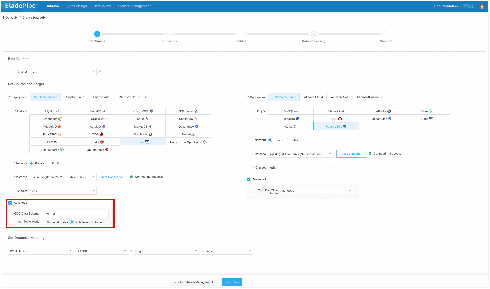
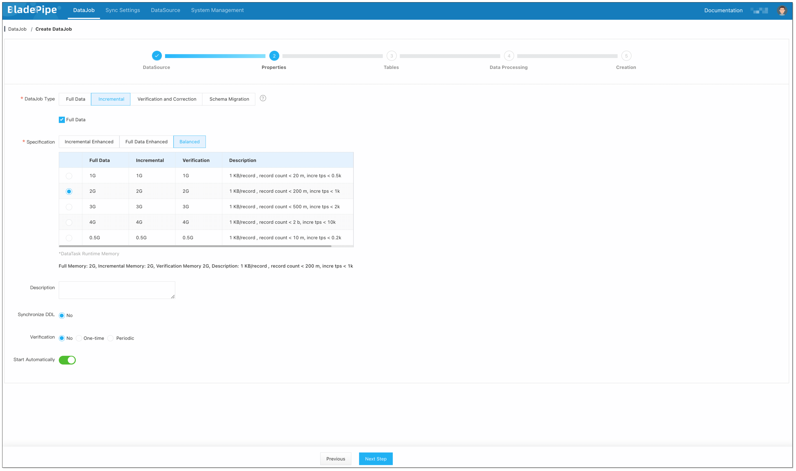
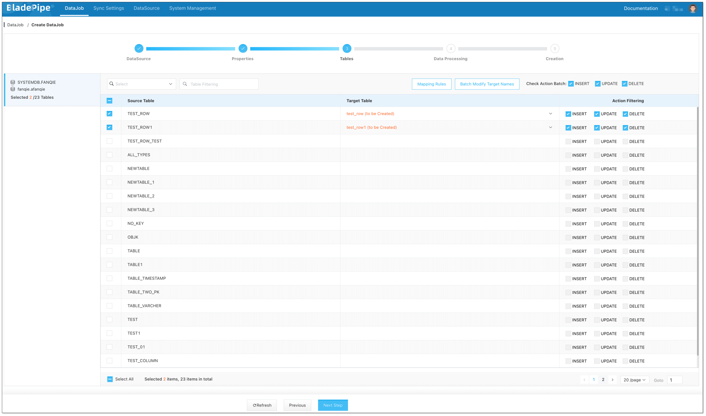
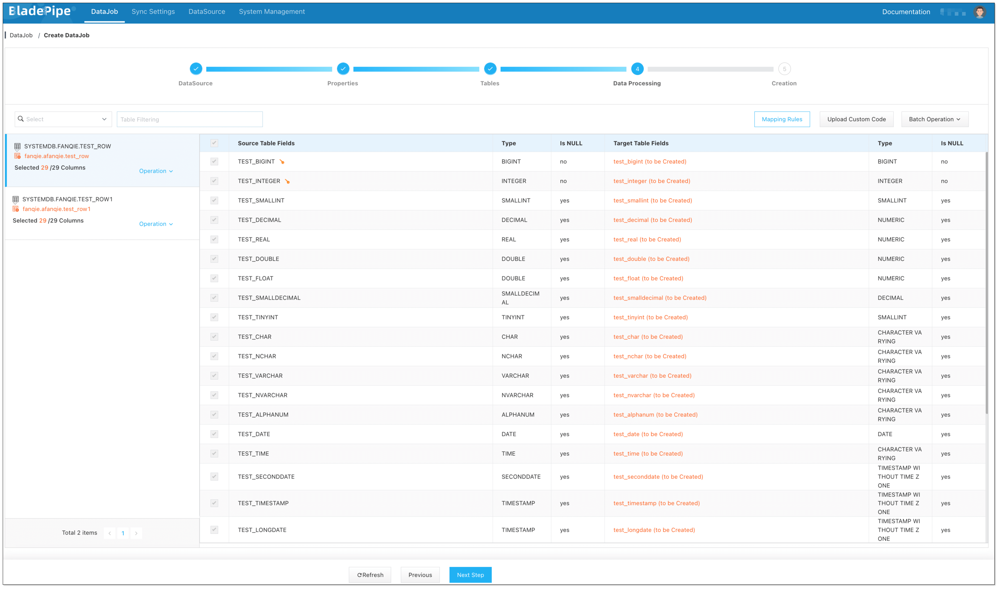
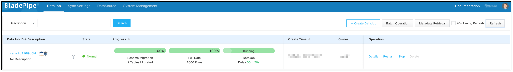

## Overview
SAP Hana is a column-oriented in-memory database. It stores and retrieves large volume of data and handles complex query processing. Besides, it performs advanced analytics, providing business insights via real-time data analysis.

PostgreSQL is a popular open-source relational database. It is known for its reliability, scalability and flexibility. Many organizations use it as a backend database for applications.

To move data from Hana to PostgreSQL, speed is the issue that many users care about. [BladePipe](https://www.bladepipe.com) lets you build a data pipeline from Hana to PostgreSQL in just minutes.

## Highlights

### Table-level CDC Tables

To sync incremental data from a Hana instance, BladePipe designed a single change data capture (CDC) table mode in the beginning, that is, the incremental data (generated by INSERT, UPDATE and DELETE operations) of all subscribed tables is written to the same CDC table through triggers. This design was intended to simplify the architecture and process, but it also introduced some problems.

* **Slow trigger performance**：When using a single CDC table, BladePipe concatenates the field values of the subscribed tables into a JSON string. Though it is a unified approach, the trigger becomes more complex. When the number of fields exceeds 300, the efficiency of the trigger is significantly reduced, which affects the synchronization performance.

* **Incremental data backlog**：When table A has much more incremental data than table B, if all the data is written to a single CDC table, the data in table B will not be processed in time, resulting in latency due to a backlog of data in table B.

Then, BladePipe optimized the single CDC table mode. It designed a **table-level CDC table** mode, where a CDC table is created for each source table. In a table-level CDC table, only several offset fields are added to the schema based on the original table schema for incremental data synchronization.

**Original Table**:

```sql
CREATE
COLUMN TABLE "SYSTEM"."TEST" (
  "TEST1" INTEGER NOT NULL ,
  "TEST2" INTEGER NOT NULL ,
  "TEST3" INTEGER,
  CONSTRAINT "TEST_KEY" PRIMARY KEY ("TEST1", "TEST2")
)
```

**CDC Table**:

```sql
CREATE
COLUMN TABLE "SYSTEM"."SYSTEM_TEST_CDC_TABLE" (
  "TEST1" INTEGER,
  "TEST2" INTEGER,
  "TEST3" INTEGER,
  "__$DATA_ID" BIGINT NOT NULL ,
  "__$TRIGGER_ID" INTEGER NOT NULL ,
  "__$TRANSACTION_ID" BIGINT NOT NULL ,
  "__$CREATE_TIME" TIMESTAMP,
  "__$OPERATION" INTEGER NOT NULL 
);
-- other index
```

**Trigger (INSERT)**:

```sql
CREATE TRIGGER "SYSTEM"."BLADEPIPE_ON_I_TEST_TRIGGER_TEST"
    AFTER INSERT
    ON "SYSTEM"."TEST"
    REFERENCING NEW ROW NEW FOR EACH ROW
BEGIN 
  DECLARE
EXIT HANDLER FOR SQLEXCEPTION
BEGIN
END; 
  IF
1=1 THEN 
    INSERT INTO "SYSTEM"."SYSTEM_TEST_CDC_TABLE" ("__$DATA_ID", "__$TRIGGER_ID", "__$TRANSACTION_ID", "__$CREATE_TIME", "__$OPERATION", "TEST1", "TEST2", "TEST3") 
    VALUES( 
      "SYSTEM"."CC_TRIGGER_SEQ".NEXTVAL, 
      433, 
      CURRENT_UPDATE_TRANSACTION(), 
      CURRENT_UTCTIMESTAMP, 
      2, 
      :NEW."TEST1" ,
      :NEW."TEST2" ,
      :NEW."TEST3"  
    );
END IF;
END;
```

The table-level CDC table mode has several benefits:

* Table-level CDC tables are more self-contained, making it easier to make multiple subscriptions.
* The trigger only needs to execute the INSERT statements, so it can maintain high performance even for tables with many fields.
* When scanning and consuming CDC data, no additional processing is required, and data consumption is simpler.

## Procedure

### Step 1: Install BladePipe

Follow the instructions in [Install Worker (Docker)](https://www.bladepipe.com/docs/productOP/byoc/installation/install_worker_docker/) or [Install Worker (Binary)](https://www.bladepipe.com/docs/productOP/byoc/installation/install_worker_binary/) to download and install a BladePipe Worker.

### Step 2: Add DataSources

1. Log in to the [BladePipe Cloud](https://cloud.bladepipe.com).
2. Click **DataSource** > **Add DataSource**.
3. Select the source and target DataSource type, and fill out the setup form respectively.

### Step 3: Create a DataJob

1. Click **DataJob** > [**Create DataJob**](https://www.bladepipe.com/docs/operation/job_manage/create_job/create_full_incre_task/).
2. Configure the source and target DataSources:
   1. Select the source and target DataSources, and click **Test Connection**.
   2. In the **Advanced** configuration of the source DataSource, select the CDC table mode: **Single CDC table** / **Table-level CDC table**.
   
    
1. Select **Incremental** for DataJob Type, together with the **Full Data** option.
   
   
2. Select the tables to be replicated.
   
   
3. Select the fields to be replicated.
  
   
   
   :::info
   If you need to select specific fields for synchronization, you can first create the schema on the target PostgreSQL instance. This allows you to define the schemas and fields that you want to synchronize.
   :::

4. Confirm the DataJob creation.
   :::info
   The DataJob creation process involves several steps. Click **Sync Settings** > [**ConsoleJob**](https://www.bladepipe.com/docs/operation/job_setting/console_job_manage/), find the DataJob creation record, and click **Details** to view it.

   The DataJob creation with a source Hana instance includes the following steps:
    - Schema Migration
    - Initialization of Hana CDC Tables and Triggers
    - Allocation of DataJobs to BladePipe Workers
    - Creation of DataJob FSM (Finite State Machine)
    - Completion of DataJob Creation
   :::

5. Now the DataJob is created and started. BladePipe will automatically run the following DataTasks:

   - **Schema Migration**: The schemas of the source tables will be migrated to the target instance. If there is a target table with the same name as that in the source, then this table schema won't be migrated.
   - **Full Data Migration**: All existing data of the source tables will be fully migrated to the target instance.
   - **Incremental Synchronization**: Ongoing data changes will be continuously synchronized to the target instance with ultra-low latency.

   