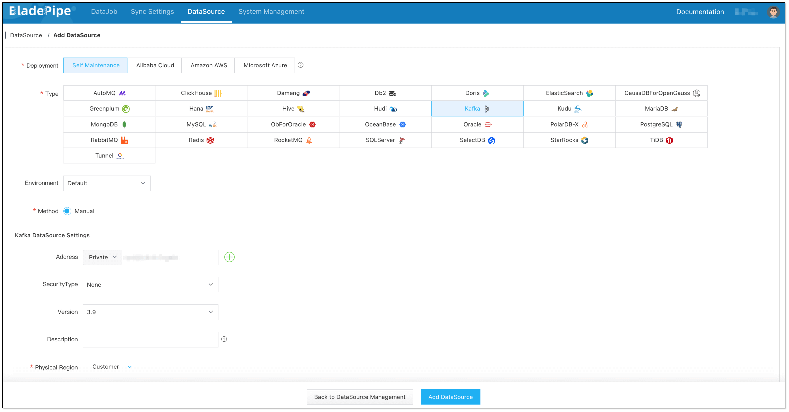
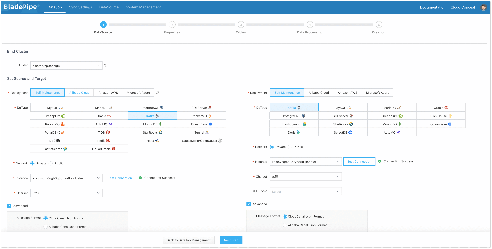
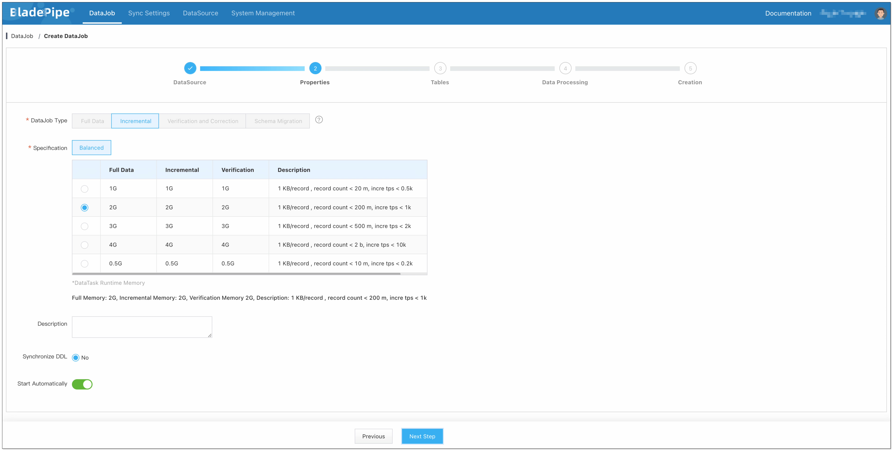
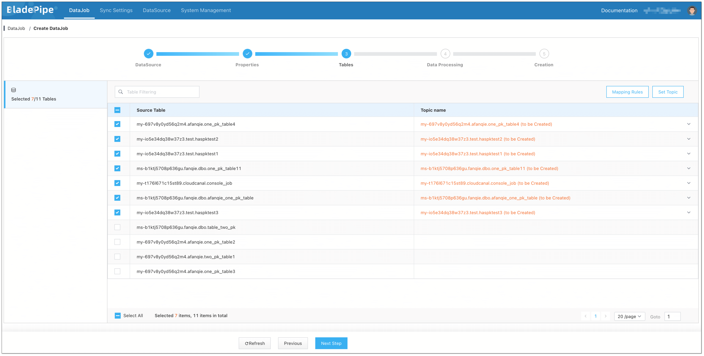
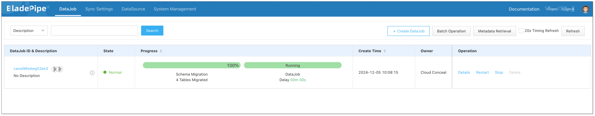

## Overview

[Apache Kafka](../data_insights/do_you_really_need_kafka.md) is a stream-processing platform most known for its great performance, high throughput and low latency. Its persistence layer is essentially a "massive publish/subscribe message queue following a distributed transaction logging architecture," making it valuable as an enterprise-class infrastructure for processing streaming data. Therefore, the data transmission from Kafka to Kafka is of great importance for many enterprises.

This tutorial introduces how to use [BladePipe](https://www.bladepipe.com) to create a Kafka-Kafka real-time data pipeline.

## Highlights

### Pushing Messages

After a DataJob is created, BladePipe automatically creates a consumer group and subscribes to the topics to be synchronized. Then it pulls the messages from the source Kafka and pushes them to the target Kafka.

### Kafka Heartbeat Mechanism

When no messages were produced at the Source Kafka, BladePipe was unable to accurately calculate the message latency.

To address the problem, BladePipe monitors the Kafka heartbeat. After [Kafka heartbeat is enabled](https://www.bladepipe.com/docs/dataMigrationAndSync/datasource_func/Kafka/open_kafka_heartbeat/), BladePipe will monitor the consumer offsets of all partitions. If the differences between the latest offset and the current offset of all partitions are all smaller than the tolerant offset interval (configured by parameter **dbHeartbeatToleranceStep**), a heartbeat record containing the current system time will be generated. Upon consuming this record, BladePipe will calculate the latency based on the time included in it.

## Procedure

### Step 1: Grant Permissions

Please refer to [Permissions Required for Kafka](https://www.bladepipe.com/docs/dataMigrationAndSync/datasource_func/Kafka/privs_for_kafka/) to grant the required permissions to a user for data movement using BladePipe.

### Step 2: Install BladePipe

Follow the instructions in [Install Worker (Docker)](https://www.bladepipe.com/docs/productOP/byoc/installation/install_worker_docker/) or [Install Worker (Binary)](https://www.bladepipe.com/docs/productOP/byoc/installation/install_worker_binary/) to download and install a BladePipe Worker.

### Step 3: Add DataSources

1. Log in to the [BladePipe Cloud](https://cloud.bladepipe.com).
2. Click **DataSource** > **Add DataSource**, and add 2 DataSources.
   

### Step 4: Create a DataJob

1. Click **DataJob** > [**Create DataJob**](https://www.bladepipe.com/docs/operation/job_manage/create_job/create_full_incre_task/).

2. Select the source and target DataSources and click **Test Connection** to ensure the connection to the source and target DataSources are both successful.
   
   

3. Select the [**message format**](https://www.bladepipe.com/docs/reference/kafka_msg_format_type/).

   :::info
   If there is no specific message format, please select **Raw Message Format**.
   :::

4. Select **Incremental** for DataJob Type.
   
   

5. Select the Topic to be synchronized.
   
   

6. Confirm the DataJob creation.

   :::info
   The DataJob creation process involves several steps. Click **Sync Settings** > [**ConsoleJob**](https://www.bladepipe.com/docs/operation/job_setting/console_job_manage/), find the DataJob creation record, and click **Details** to view it.

   The DataJob creation with a source Kafka instance includes the following steps:

   - Schema Migration
   - Allocation of DataJobs to BladePipe Workers
   - Creation of DataJob FSM (Finite State Machine)
   - Completion of DataJob Creation
   :::

7. Now the DataJob is created and started. BladePipe will automatically run the following DataTasks:
   - **Schema Migration**: The topics will be created automatically in the target instance if they don't exist already.
   - **Incremental Data Synchronization**: Ongoing data changes will be continuously synchronized to the target instance.

   

