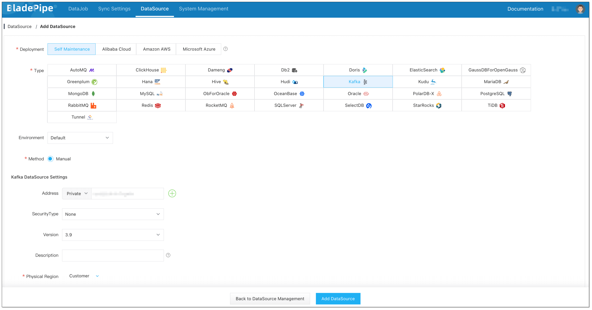
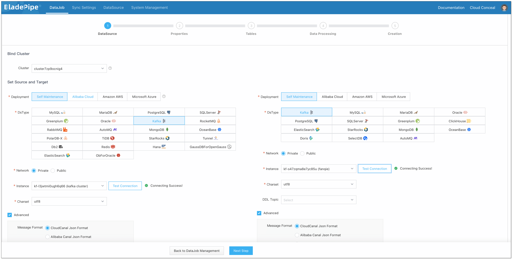
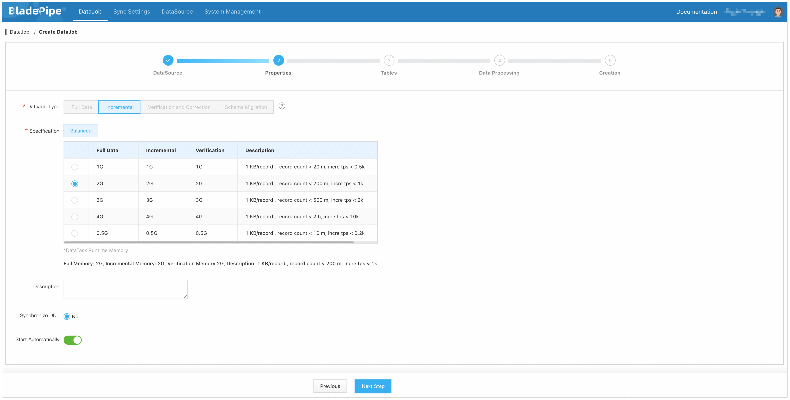
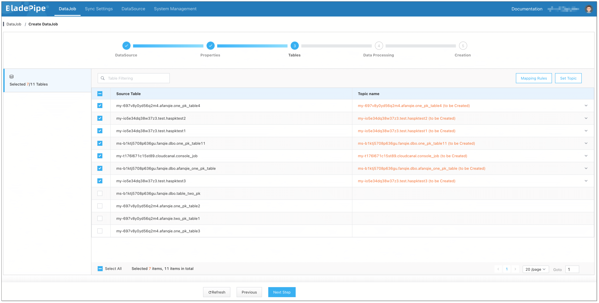
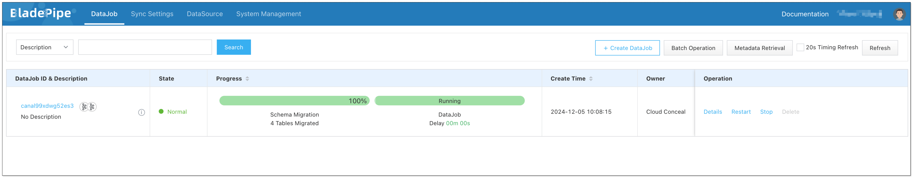

[Apache Kafka](../data_insights/do_you_really_need_kafka.md) is widely used for high-throughput event streaming, inter-service communication, and real-time data delivery across distributed systems.

**Kafka-to-Kafka replication is usually used to copy topics between clusters for cross-region delivery, environment isolation, backup, migration, or downstream consumption**. The core requirement is not just moving messages, but doing it with predictable latency and manageable operations.

This tutorial shows how to use [BladePipe](https://www.bladepipe.com) to build a Kafka-to-Kafka real-time pipeline.

## Highlights

### Pushing Messages

After a DataJob is created, BladePipe automatically creates a consumer group and subscribes to the topics to be synchronized. Then it pulls the messages from the source Kafka and pushes them to the target Kafka.

### Kafka Heartbeat Mechanism

When no messages were produced at the Source Kafka, BladePipe was unable to accurately calculate the message latency.

To address the problem, BladePipe monitors the Kafka heartbeat. After [Kafka heartbeat is enabled](https://www.bladepipe.com/docs/dataMigrationAndSync/datasource_func/Kafka/open_kafka_heartbeat/), BladePipe will monitor the consumer offsets of all partitions. If the differences between the latest offset and the current offset of all partitions are all smaller than the tolerant offset interval (configured by parameter **dbHeartbeatToleranceStep**), a heartbeat record containing the current system time will be generated. Upon consuming this record, BladePipe will calculate the latency based on the time included in it.

## When Kafka-to-Kafka Replication Makes Sense

This pattern is usually a strong fit when you need:

- topic replication across regions or environments
- migration from one Kafka cluster to another
- cluster isolation between producers and downstream consumers
- centralized event distribution without rewriting producers

If you are still comparing broker architecture choices, also see [Kafka vs RabbitMQ vs RocketMQ vs Pulsar](../data_insights/kafka_vs_rabbitmq_vs_rocketmq_pulsar.md).

## Procedure

### Step 1: Grant Permissions

Please refer to [Permissions Required for Kafka](https://www.bladepipe.com/docs/dataMigrationAndSync/datasource_func/Kafka/privs_for_kafka/) to grant the required permissions to a user for data movement using BladePipe.

### Step 2: Install BladePipe

Follow the [instructions](/docs/productOP/onPremise/installation/install_all_in_one_docker.mdx) to install BladePipe.

### Step 3: Add DataSources

1. Visit `http://${ip}:8111` to the BladePipe Console.
2. Click **DataSource** > **Add DataSource**, and add 2 DataSources.
   

### Step 4: Create a DataJob

1. Click **DataJob** > [**Create DataJob**](https://www.bladepipe.com/docs/operation/job_manage/create_job/create_full_incre_task/).

2. Select the source and target DataSources and click **Test Connection** to ensure the connection to the source and target DataSources are both successful.
   
   

3. Select the [**message format**](https://www.bladepipe.com/docs/reference/kafka_msg_format_type/).

   :::info
   If there is no specific message format, please select **Raw Message Format**.
   :::

4. Select **Incremental** for DataJob Type.
   
   

5. Select the Topic to be synchronized.
   
   

6. Confirm the DataJob creation.

   :::info
   The DataJob creation process involves several steps. Click **Sync Settings** > [**ConsoleJob**](https://www.bladepipe.com/docs/operation/job_setting/console_job_manage/), find the DataJob creation record, and click **Details** to view it.

   The DataJob creation with a source Kafka instance includes the following steps:

   - Schema Migration
   - Allocation of DataJobs to BladePipe Workers
   - Creation of DataJob FSM (Finite State Machine)
   - Completion of DataJob Creation
   :::

7. Now the DataJob is created and started. BladePipe will automatically run the following DataTasks:
   - **Schema Migration**: The topics will be created automatically in the target instance if they don't exist already.
   - **Incremental Data Synchronization**: Ongoing data changes will be continuously synchronized to the target instance.

   

## FAQ

**What is Kafka-to-Kafka replication used for?**

It is commonly used for cluster migration, cross-region streaming, backup-like topic duplication, and separating production event generation from downstream consumer environments.

**What is the main challenge in Kafka-to-Kafka replication?**

The main challenge is not just copying messages. It is preserving stable throughput, monitoring lag correctly, and keeping operations manageable across multiple partitions and topics.

**Do I need Kafka-to-Kafka replication instead of producer-side dual write?**

Often yes. Dual write can increase application complexity and failure risk. Replication at the pipeline layer is usually easier to manage and observe centrally.
