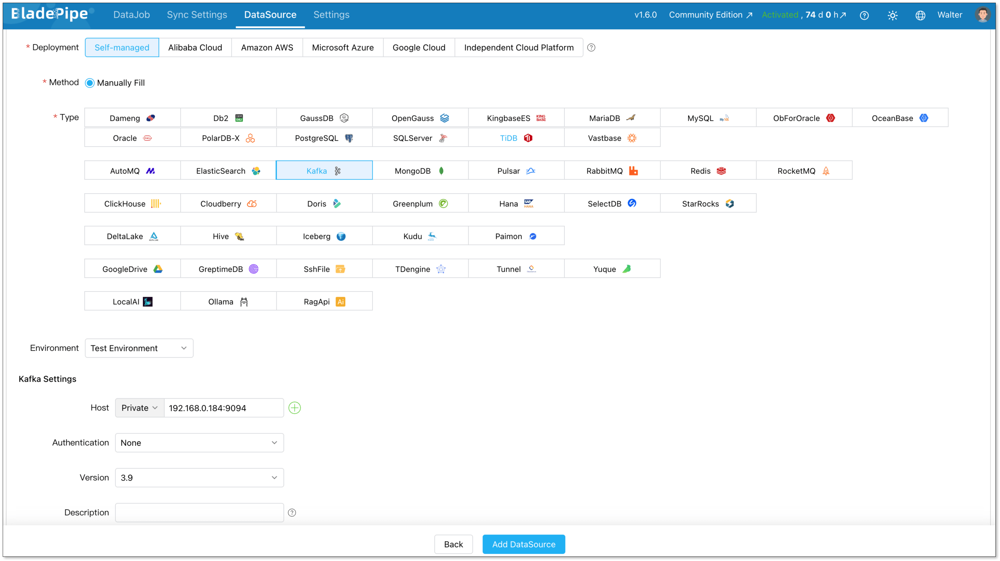
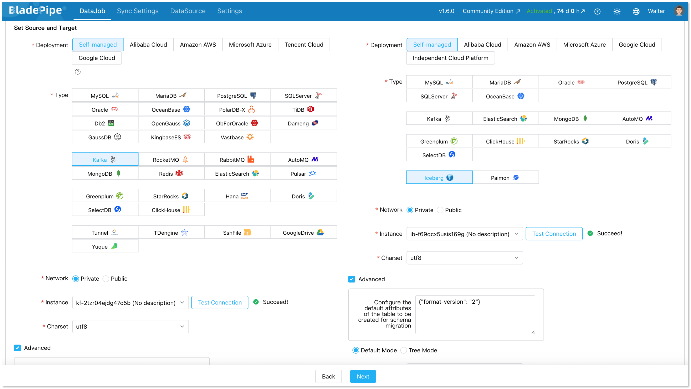
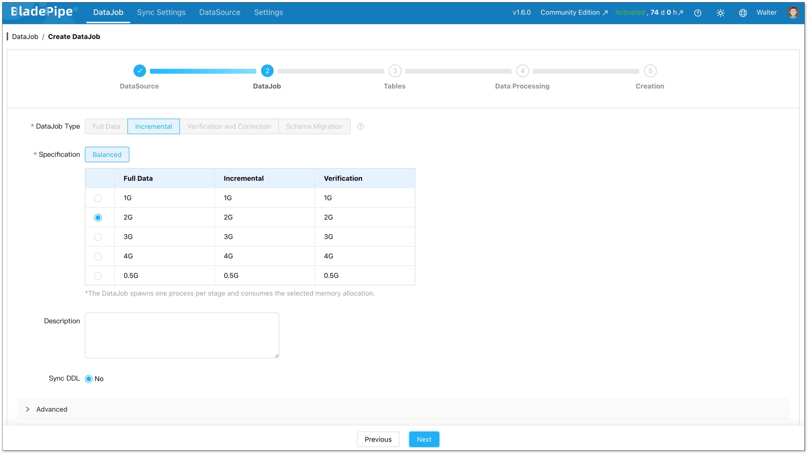
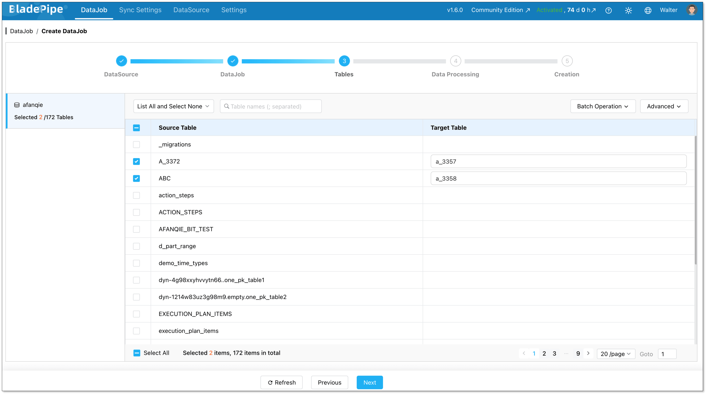
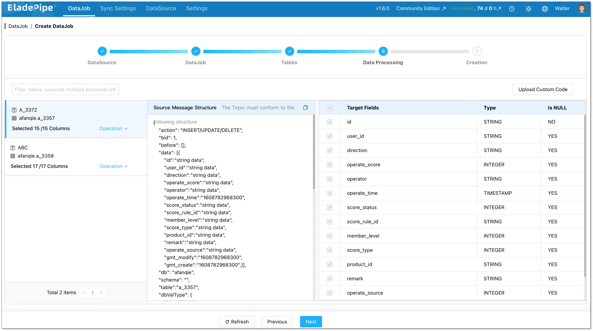
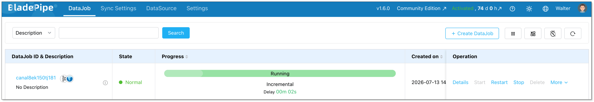

If your team already uses Kafka, you probably have a lot of valuable data moving through it every second.

Orders, payments, user events, IoT messages and more data may all be flowing through Kafka topics. The problem is that [Kafka](https://www.bladepipe.com/connector/kafka/) is great for moving and buffering real-time data, but it is not where most teams want to keep analytical data forever.

That is where [Apache Iceberg](https://www.bladepipe.com/connector/iceberg/) comes in.

Iceberg gives you an open, reliable table format for the lakehouse. Once Kafka data lands in Iceberg, it becomes easier to query, govern and reuse across [analytics](https://www.bladepipe.com/real-time-analytics/), AI, and reporting workloads.

So the question is simple: **How do you stream data from Kafka to Iceberg in a way that is reliable enough for production?**

In this guide, we will walk through two practical methods:

1. [**Using a managed CDC and data ingestion solution like BladePipe**](#method-1-managed-cdc-solution-using-bladepipe)
2. [**Using Kafka Connect with an Iceberg sink connector**](#method-2-kafka-connect-with-an-iceberg-sink-connector)

We will also compare both methods and show the main steps involved in each approach.

## Introduction to Kafka and Iceberg

Before we get into the ingestion methods, let’s quickly align on what Kafka and Iceberg do in this architecture.

### What Is Kafka?

Apache Kafka is a distributed event streaming platform. It is commonly used to collect, store, and deliver real-time data between systems.

In a typical Kafka architecture:

* Producers write events to Kafka topics.
* Kafka stores those events in a distributed log.
* Consumers read events from Kafka topics and send them to downstream systems.

Kafka is widely used for real-time data movement. It works well for event streaming, log collection, message buffering, and data distribution.

However, Kafka is not designed to be a long-term analytical table store. You can retain messages for a period of time, but Kafka does not provide the same table-level capabilities that lakehouse systems need.

That is why many teams stream Kafka data into a data lake or lakehouse.

### What Is Apache Iceberg?

Apache Iceberg is an open table format for large-scale analytical datasets. It is often used on top of object storage or distributed file systems, such as Amazon S3, HDFS, Azure Data Lake Storage, Google Cloud Storage, or OSS.

Iceberg brings table management capabilities to data lakes, including:

* ACID transactions
* Schema evolution
* Partition evolution
* Time travel
* Hidden partitioning
* Snapshot management
* Compatibility with engines like Spark, Flink, Trino, Presto, StarRocks, and Snowflake

In simple terms, Iceberg helps turn files in a data lake into reliable tables that can be queried and managed more easily.

## Top 2 Methods for Kafka-to-Iceberg Ingestion

There are several ways to move data from Kafka to Iceberg. In practice, two methods are the most common:

1. A managed ingestion platform, such as BladePipe
2. Kafka Connect with an Iceberg sink connector

### Method 1: Managed CDC Solution Using BladePipe

[BladePipe](https://www.bladepipe.com/) is a real-time data integration platform for building production-ready data pipelines with less manual setup and less operational overhead.

For Kafka-to-Iceberg ingestion, BladePipe can consume streaming data from Kafka and continuously write it into Apache Iceberg tables. Instead of building and maintaining the pipeline from scratch, teams can configure the ingestion flow through a managed platform.

This is especially useful when you want the pipeline to be easy to create, monitor, recover, and maintain over time.

In other words, BladePipe turns Kafka-to-Iceberg ingestion from a self-managed connector project into a managed data pipeline.

**Key strengths**:

* Easy setup in minutes
* Visual pipeline configuration
* Low-latency streaming ingestion (usually less than 3 seconds)
* Built-in monitoring and alerting
* Error handling and recovery
* Schema evolution and data transformation support
* Support for [multiple data sources and targets](https://www.bladepipe.com/connector/)
* [Flexible deployment options](https://www.bladepipe.com/pricing/), such as private deployment, BYOC, or SaaS

This method is especially helpful for teams that care about reliability, but do not want every pipeline to become an infrastructure project.

**Trade-offs**:

- Not ideal for teams that require a fully open-source-only stack.
- Highly custom logic may still need extra configuration.

### Method 2: Kafka Connect with an Iceberg Sink Connector

Kafka Connect is a framework for moving data between Kafka and external systems. With an Iceberg sink connector, Kafka Connect can consume records from Kafka topics and write them into Iceberg tables.

This is a common approach when your team already runs Kafka Connect and wants to keep the ingestion pipeline inside the Kafka ecosystem.

Compared with a managed platform, Kafka Connect gives you more control over the connector layer. But it also means your team is responsible for deployment, configuration, monitoring, error handling, and ongoing maintenance.

**Key strengths**:

* Native fit for Kafka ecosystems
* Lower coding effort than custom applications
* Good for simple Kafka-to-Iceberg ingestion
* Works well with Schema Registry
* Flexible for teams already familiar with Kafka Connect
* Easier to standardize if your organization already manages Kafka Connect clusters

**Trade-offs**:

- Requires worker, connector, and version management.
- Schema changes and small files need careful tuning.
- Compatibility must be tested before production.

## BladePipe vs Kafka Connect for Kafka-to-Iceberg Ingestion

Here is a simple comparison:

| Dimension           | BladePipe Managed CDC Solution                  | Kafka Connect Iceberg Sink                 |
| ------------------- | ----------------------------------------------- | ------------------------------------------ |
| Best for            | Production-ready managed ingestion              | Self-managed Kafka-native ingestion        |
| Setup complexity    | Low                                             | Medium                                     |
| Coding required     | Minimal                                         | Low to medium                              |
| Operations          | Built-in management, monitoring, and recovery   | Requires Kafka Connect worker management   |
| Schema evolution    | Built-in support                                | Depends on connector and configuration     |
| Monitoring          | Built-in dashboard and alerts                   | Requires additional monitoring setup       |
| Error recovery      | Built-in recovery mechanisms                    | Requires manual configuration and handling |
| Small file handling | Easier to manage with platform support          | Requires tuning and Iceberg maintenance    |
| Flexibility         | Strong for multi-source, multi-target pipelines | Strong within the Kafka ecosystem          |
| Best team fit       | Teams that want less infrastructure work        | Teams with Kafka Connect expertise         |

Kafka Connect gives you a Kafka-native way to build the pipeline. BladePipe gives you a more managed way to run the pipeline in production.

## Step-by-Step Guidance with 2 Methods

Now let’s walk through how each method works at a high level.

The exact configuration will depend on your Kafka environment, Iceberg catalog, storage system, message format, and deployment model. But the overall process is usually similar.

## Method 1: Stream Data from Kafka to Iceberg with BladePipe

### Prerequisites 

- Install BladePipe in minutes [following the guidance](https://www.bladepipe.com/docs/productOP/onPremise/installation/install_all_in_one_docker/).
- Ensure the Kafka cluster is running.
- Prepare an Iceberg catalog and storage location.

### Step 1: Connect to Kafka and Iceberg
Log in to BladePipe console.

Go to **DataSource** > **Add DataSource**.

Add Kafka and Iceberg as a DataSource, and fill in the IP, hosts and credentials for connection.



### Step 2: Create a Kafka-to-Iceberg DataJob
Go to **DataJob** > **Create DataJob**.

Select your Kafka source and Iceberg target.



Choose DataJob type: **Incremental** plus **initial load**. This is the right choice for most cases. Initial Load handles existing data. CDC takes over after that.



Select which tables to sync. You can include everything or pick specific ones.



Select the columns to sync. Here you can process data, like filtering and transformation.



Click **Create DataJob**, and the pipeline will start running.



## Method 2: Stream Data from Kafka to Iceberg with Kafka Connect

### Prerequisites

Before you start, make sure you have:

* A running Kafka cluster
* One or more Kafka topics with structured data
* Kafka Connect installed or ready to deploy
* An Iceberg catalog, such as Hive Metastore, AWS Glue, REST Catalog, Nessie, or Hadoop Catalog
* Object storage or distributed storage for Iceberg table files
* An Iceberg table created or permission to create one

## Step 1: Download or Install the Iceberg Sink Connector

First, download an Iceberg sink connector that supports Kafka Connect.

You can install the connector by placing its plugin files in the Kafka Connect plugin directory.

Then update the Kafka Connect worker configuration.

After that, restart the Kafka Connect worker so it can load the new connector plugin.

## Step 2: Check Your Kafka Topic and Message Format

Before creating the connector, check the Kafka topic you want to ingest.

You need to confirm:

* Topic name
* Message key
* Message value format
* Field names and data types
* Whether Schema Registry is used
* Whether the topic contains insert, update, or delete events

For simple append-only event data, the setup is usually easier.

For CDC events, you need to check how changes are represented. For example, the message may include operation type, before and after values, primary key fields, and source timestamps.

## Step 3: Prepare the Iceberg Catalog and Table

Next, prepare the Iceberg target. 

If the target Iceberg table does not exist yet, create it before starting the connector.

The table schema should match the Kafka message structure. If your Kafka topic contains fields such as `order_id`, `user_id`, `amount`, and `created_at`, the Iceberg table should have compatible columns.

## Step 4: Create the Kafka Connect Connector Configuration

Now create a connector configuration file. A simplified configuration may look like this:

```json
{
  "name": "kafka-to-iceberg-sink",
  "config": {
    "connector.class": "your.iceberg.sink.ConnectorClass",
    "tasks.max": "2",
    "topics": "orders",
    "iceberg.catalog.type": "rest",
    "iceberg.catalog.uri": "http://your-catalog:8181",
    "iceberg.table": "lakehouse.orders",
    "format": "parquet",
    "errors.tolerance": "all",
    "errors.deadletterqueue.topic.name": "orders_dlq"
  }
}
```

Treat this as a reference structure, not a copy-paste-ready config. Different Iceberg sink connectors use different parameter names.

## Step 5: Submit the Connector to Kafka Connect

Submit the connector configuration through the Kafka Connect REST API.

For example:

```bash
curl -X POST http://localhost:8083/connectors \
  -H "Content-Type: application/json" \
  -d @kafka-to-iceberg-sink.json
```

Then check whether the connector was created successfully:

```bash
curl http://localhost:8083/connectors/kafka-to-iceberg-sink/status
```

If the connector status is `RUNNING`, Kafka Connect has started consuming records from the Kafka topic.

## Step 6: Monitor the Connector

After the connector starts, monitor it closely. A running connector does not always mean the pipeline is healthy. You still need to check whether records are being written correctly into Iceberg.

## Step 7: Query and Validate the Iceberg Table

Use Spark, Trino, StarRocks, Snowflake, or another Iceberg-compatible engine to query the target table.

For example:

```sql
SELECT COUNT(*) FROM lakehouse.orders;

SELECT * FROM lakehouse.orders
ORDER BY created_at DESC
LIMIT 10;
```

This step helps confirm that Kafka records are not only consumed, but also written into Iceberg correctly.

## Conclusion

Streaming data from Kafka to Iceberg helps teams turn real-time events into open, queryable lakehouse tables.

There are two practical ways to build this pipeline:

* Use **BladePipe** if you want a managed Kafka-to-Iceberg ingestion pipeline with less setup, built-in monitoring, schema evolution, and easier recovery.
* Use **Kafka Connect** if your team already has Kafka Connect expertise and prefers a self-managed, Kafka-native approach.

For production use, the real challenge is not only moving data from Kafka to Iceberg. It is keeping the pipeline reliable, observable, and easy to maintain as data volume and schemas change.

Read more:
- [MySQL to Iceberg](http://localhost:3000/blog/tech_share/mysql_iceberg_sync)
- [SQL Server to Iceberg](http://localhost:3000/blog/tech_share/sql_server_to_apache_iceberg)
- [Kafka to Kafka](http://localhost:3000/blog/tech_share/kafka_kafka_sync)

## FAQs


**Q: Can Kafka write directly to Apache Iceberg?**

Not by itself. Kafka stores and delivers event streams, but it does not write directly to Iceberg tables. You need an ingestion layer, such as BladePipe, Kafka Connect, Flink, or a custom application, to consume Kafka records and write them into Iceberg.

**Q: What is the easiest way to stream data from Kafka to Iceberg?**

The easiest way is usually to use a managed ingestion tool like BladePipe. It helps you configure the Kafka source, Iceberg target, field mapping, monitoring, and recovery in one platform, so you do not need to manage every connector detail by yourself.

**Q: How do I handle schema changes when streaming Kafka data to Iceberg?**

You need to make sure upstream Kafka message changes can be mapped safely to the Iceberg table schema. This may include adding new columns, handling nullable fields, and validating data types. Managed tools like BladePipe can reduce this manual work, while Kafka Connect usually requires careful connector and schema configuration.

**Q: How do I avoid small files when writing Kafka streams to Iceberg?**

Streaming writes can create many small files if records are committed too frequently. To reduce this problem, tune batch size and commit interval, design partitions carefully, and run regular Iceberg maintenance tasks such as compaction and manifest rewriting.

