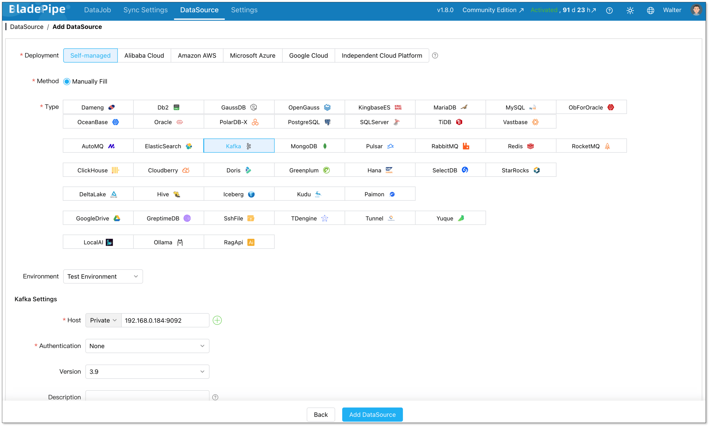
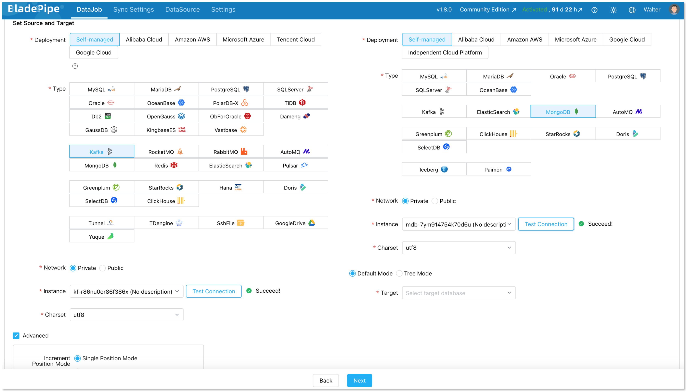
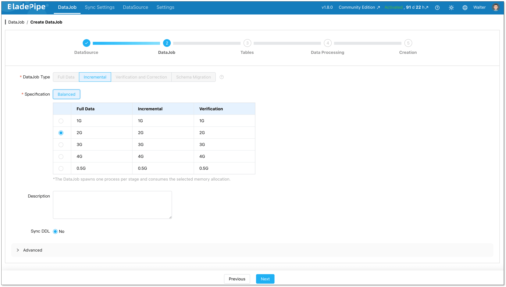
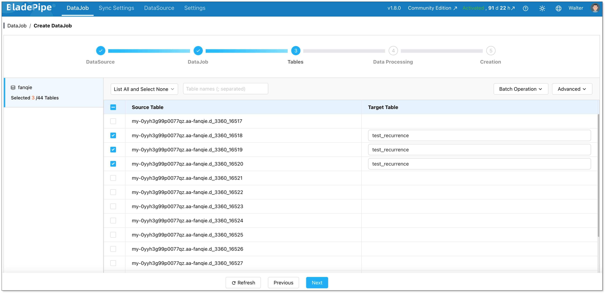
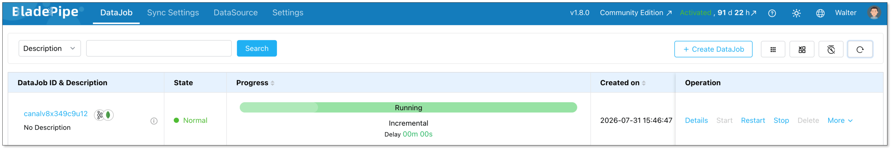

Looking for a reliable [Kafka](https://www.bladepipe.com/connector/kafka/) to [MongoDB](https://www.bladepipe.com/connector/mongodb/) connector?

The basic idea sounds simple: consume messages from Kafka and write them into MongoDB. But once updates, deletes, retries, schema changes, and duplicate records enter the picture, the pipeline can get complicated fast.

You also have several ways to build it. You can use a managed CDC tool like [BladePipe](https://www.bladepipe.com/), deploy the MongoDB Kafka Connector on Kafka Connect, or write your own Kafka consumer application.

Each option comes with a different level of setup, control, and maintenance. We will compare all three methods and help you choose the right way to stream data from Kafka to MongoDB.

## What Is Apache Kafka?

[Apache Kafka](https://kafka.apache.org/) is a distributed event streaming platform. It is designed to receive, store, and deliver large volumes of data in real time.

Data in Kafka is organized into topics. Producers write messages to these topics, while consumers subscribe to them and process the messages independently.

Kafka is built for high throughput and scalability. It can retain messages for a defined period, which allows consumers to replay older data when needed.

However, Kafka is not usually used as the main database for application queries. Applications often need to move Kafka data into another system for easier storage and access.

## What Is MongoDB?

[MongoDB](https://www.mongodb.com/) is a document-oriented database. It stores data as BSON documents, which have a structure similar to JSON.

Unlike relational databases, MongoDB does not require every record in a collection to have exactly the same fields. This makes it suitable for data with nested objects or structures that change over time.

MongoDB also supports indexes, queries, aggregation, replication, and horizontal scaling.

## Why Stream Data from Kafka to MongoDB?

Kafka and MongoDB solve different problems.

Kafka is designed for event streaming. It stores events in topics and allows many consumers to process the same data.

MongoDB is designed for storing and querying application data. Applications can use it to find documents, filter fields, and access the latest state of an object.

Streaming data from Kafka to MongoDB allows teams to use both systems together.

### Power Real-Time Applications

Kafka may receive user events, order updates, payment records, or device messages. These events can be written into MongoDB and used by an application immediately. The application does not need to read and rebuild data from Kafka every time a user sends a request.

### Maintain the Latest State

Kafka usually stores a sequence of events. MongoDB can store the latest version of that order. The application can then query one document instead of replaying the full event history.

### Handle Flexible Event Data

Kafka messages often contain JSON, Avro, or Protobuf records. MongoDB can store nested documents and flexible fields. This makes it suitable for application events, user profiles, IoT data, and other semi-structured records.

However, the pipeline still needs clear rules for document keys, field types, updates, and deletes.

## How to Stream Data from Kafka to MongoDB?
Here we introduce three common ways:
1. [**Stream CDC data from Kafka to MongoDB using BladePipe**](#method-1-stream-cdc-data-from-kafka-to-mongodb-using-bladepipe)
2. [**Use the MongoDB Kafka Connector**](#method-2-use-the-mongodb-kafka-connector)
3. [**Build a custom Kafka consumer application**](#method-3-build-a-kafka-consumer-application)

### Method 1: Stream CDC Data from Kafka to MongoDB Using BladePipe

BladePipe is a real-time data replication platform. It provides an automated way to move structured CDC events from Kafka to MongoDB.

It can subscribe to Kafka topics and apply insert, update, and delete operations to MongoDB. The pipeline can be configured and monitored from one interface without writing a line of code.

This method is useful when Kafka already contains database change events and the team does not want to build or maintain another consumer service.

#### Benefits of Using BladePipe

BladePipe reduces the amount of connector infrastructure a team needs to manage. Its main advantages include:

* Visual pipeline configuration
* No Kafka Connect cluster required
* CDC pipelines with ultra-low latency
* Built-in task monitoring
* Configurable consumption settings
* Batch write controls
* Centralized management for multiple data pipelines
* Easier replay and position management

This makes BladePipe suitable for teams that want a more managed Kafka-to-MongoDB workflow.

#### Prerequisites

Before creating the pipeline, prepare the following:

* A reachable Kafka cluster
* A MongoDB instance
* BladePipe installed. If not, follow [the guide](https://www.bladepipe.com/docs/productOP/onPremise/installation/install_all_in_one_docker/) to have it installed in minutes.

#### Step 1: Add Kafka and MongoDB as the DataSources

Start by adding Kafka and MongoDB as DataSources in BladePipe.

Go to **DataSource** > **Add DataSource**.

Enter the host, port and authentication information. Then click **Add DataSource**.



#### Step 2: Create a Pipeline
Go to **DataJob** > **Create DataJob**.

Configure the Source and Target as Kafka and MongoDB, and test connection.



Configure the **DataJob Type** as **Incremental**.



Select the topics to be moved.



Confirm the DataJob information, and click **Create DataJob**.



Read more:
- [Kafka to SQL Server](https://www.bladepipe.com/blog/tech_share/kafka_to_sql_server/)
- [Kafka to Iceberg](https://www.bladepipe.com/blog/tech_share/kafka_to_apache_iceberg/)
- [Kafka to Kafka](https://www.bladepipe.com/blog/tech_share/kafka_kafka_sync/)
- [MongoDB to MongoDB](https://www.bladepipe.com/blog/tech_share/mongodb_mongodb_sync/)


### Method 2: Use the MongoDB Kafka Connector

The MongoDB Kafka Connector runs on Kafka Connect. It consumes records from Kafka topics and writes them into MongoDB collections.

This method is a good choice for teams that already operate Kafka Connect.

#### Prerequisites

* A Kafka cluster
* Kafka Connect
* A MongoDB deployment
* The MongoDB Kafka Connector plugin

#### Step 1: Install the Connector

Download the MongoDB Kafka Connector and add it to the Kafka Connect plugin path.

Restart the Kafka Connect worker after installation. Then check that the connector plugin is available.

#### Step 2: Create the Sink Connector

Create a sink connector configuration.

A basic example looks like this:

```json
{
  "name": "mongodb-sink",
  "config": {
    "connector.class": "com.mongodb.kafka.connect.MongoSinkConnector",
    "topics": "orders",
    "connection.uri": "mongodb://mongodb-host:27017",
    "database": "commerce",
    "collection": "orders"
  }
}
```

#### Step 3: Configure Document Keys

You need to decide how Kafka record keys map to MongoDB documents.

A stable Kafka key can be mapped to MongoDB `_id`. This is important for updates, retries, and replay.

You should also define whether incoming records should:

* Insert
* Replace
* Update
* Upsert
* Delete

#### Step 4: Start and Verify

Create the connector through the Kafka Connect REST API. Then check the connector and task status.

Finally, verify the data in MongoDB. Check document IDs, field types, updates, and duplicate records.

#### Advantages

* Official MongoDB connector
* No custom consumer code
* Works with existing Kafka Connect deployments
* Suitable for standard topic-to-collection pipelines
* Flexible configuration

#### Limitations

* Kafka Connect must be deployed and maintained
* Plugin upgrades require management
* Monitoring usually needs extra tooling
* Complex CDC formats may need additional transformations
* Key and update rules require careful configuration

### Method 3: Build a Kafka Consumer Application

A custom consumer gives you full control over the data processing logic.

The application reads Kafka messages, transforms them, and writes them into MongoDB through a MongoDB driver.

This method is best when the pipeline needs custom business logic.

#### Step 1: Subscribe to Kafka Topics

Start by creating a Kafka consumer and connecting it to the required topics.

The application needs basic settings such as the Kafka broker address, consumer group, topic name, deserializer, and offset policy.

#### Step 2: Process the Message

After receiving a message, the application needs to deserialize and validate it.

The record may use JSON, Avro, or Protobuf. If it contains CDC data, the application also needs to identify whether the event represents an insert, update, or delete.

At this stage, you can rename fields, convert data types, flatten nested values, enrich records, or map a source primary key to MongoDB `_id`.

#### Step 3: Write to MongoDB

Use a MongoDB driver to write the processed record into the target collection.

Depending on the event type, the application may perform an insert, update, replacement, upsert, or delete.

For higher throughput, records can be grouped into bulk writes. A stable document key should also be used to make repeated processing safer.

#### Step 4: Manage Offsets and Failures

Commit Kafka offsets only after MongoDB writes succeed.

A common flow is:

```text
Read Kafka message
        ↓
Write to MongoDB
        ↓
Confirm success
        ↓
Commit Kafka offset
```

This reduces the risk of losing data.

However, a message may be processed twice if the write succeeds but the offset commit fails. Idempotent writes are important.

You also need to build retry and dead-letter handling.

#### Advantages

* Full control over processing
* Supports complex transformations
* Can integrate with external services
* Flexible routing and retry logic

#### Limitations

* Requires more development
* Offset handling is more complex
* Monitoring must be built
* Scaling is self-managed
* Long-term maintenance cost is higher

## How to Choose the Right Kafka to MongoDB Method

The right option depends on your existing infrastructure and processing requirements.

| Factor       | BladePipe        | MongoDB Kafka Connector | Custom Consumer    |
| --------- | -------- | ----------- | ----------- |
| Setup complexity        | Low         | Medium                  | High               |
| Coding required         | Minimal         | Minimal                 | High               |
| Kafka Connect required  | No           | Yes                     | No                 |
| Built-in monitoring     | Yes         | Limited                 | Custom             |
| CDC support             | Supported formats     | May need configuration  | Fully customizable |
| Complex transformations | Limited      | Basic                   | Full control       |
| Infrastructure work     | Low     | Medium                  | High               |
| Best for                | Managed CDC pipelines | Kafka Connect teams     | Custom processing  |

### Choose BladePipe When

Choose BladePipe when Kafka contains structured CDC messages and you want a simpler deployment.It is also suitable when you need visual configuration, centralized monitoring, and less connector maintenance.

This is often the practical option for data teams managing several replication pipelines.

### Choose the MongoDB Kafka Connector When

Choose the MongoDB Kafka Connector when Kafka Connect is already part of your infrastructure. It works well for standard topic-to-collection pipelines.

Your team should be comfortable managing Kafka Connect workers, plugins, and connector configurations.

### Choose a Custom Consumer When

Choose a custom consumer when the message processing logic is highly specific. It provides the most flexibility. It also requires the most engineering work.

Before choosing this method, make sure your team can maintain retry logic, offset handling, monitoring, and scaling.

## Conclusion

The best Kafka-to-MongoDB setup depends on how much control and maintenance your team wants.

MongoDB Kafka Connector works well if Kafka Connect is already part of your stack. A custom consumer makes sense when the pipeline needs complex processing.

For teams that want a faster and more manageable way to move CDC data from Kafka to MongoDB, BladePipe can simplify the whole process. You can build, run, and monitor the pipeline in one place, without adding more connector infrastructure to maintain.

Start with a simple Kafka-to-MongoDB task in [BladePipe](https://www.bladepipe.com/login/) and see how it fits your workflow.


## FAQ

**Q: What is a Kafka to MongoDB connector?**

A Kafka to MongoDB connector consumes records from Kafka topics and writes them into MongoDB collections.

It may run through Kafka Connect, a managed data integration platform, or a custom consumer application.

**Q: How can I stream data from Kafka to MongoDB?**

You can use BladePipe, deploy the MongoDB Kafka Connector, or build a custom Kafka consumer.

The right method depends on your infrastructure and processing requirements.

**Q: How do I prevent duplicate documents?**

Use a stable business key or source primary key as the MongoDB document identifier.

You should also use upserts or other idempotent write operations.

**Q: Which method requires the least maintenance?**

A managed platform such as BladePipe usually requires less connector infrastructure.

The MongoDB Kafka Connector requires Kafka Connect. A custom consumer requires application development and ongoing maintenance.

**Q: Which method is best for complex transformations?**

A custom Kafka consumer offers the most flexibility. It is suitable for enrichment, complex routing, external API calls, and multi-collection writes.

