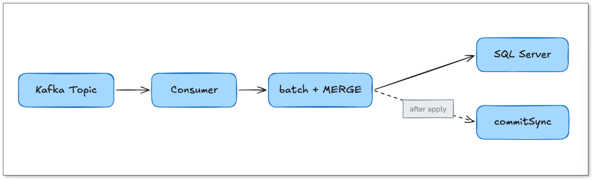
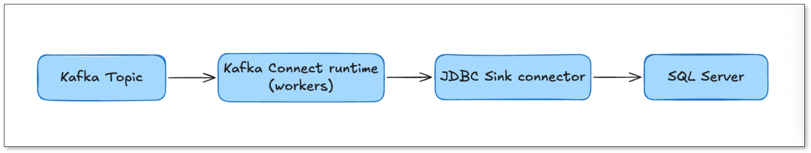
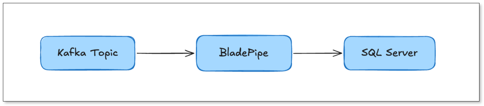
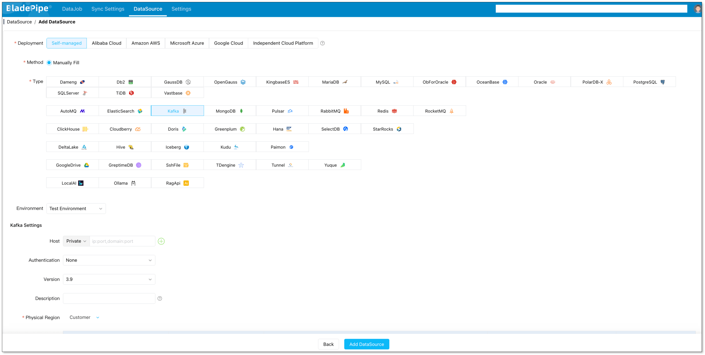
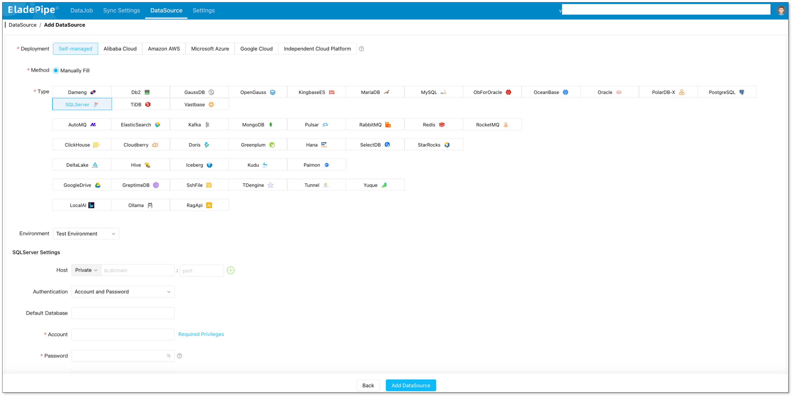
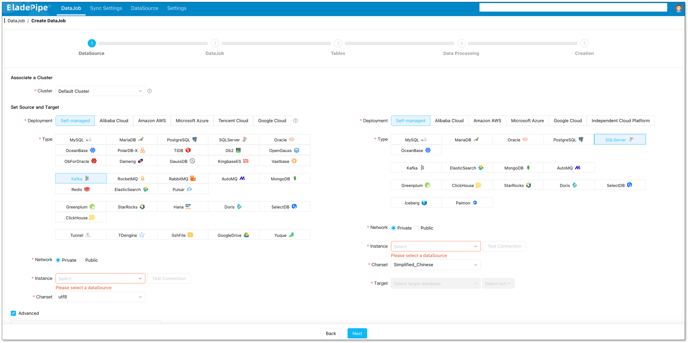

You need data from [Apache Kafka](../data_insights/do_you_really_need_kafka.md) to land in Microsoft SQL Server — as real upserts and deletes, continuously, in near real time. The hard part isn't moving the bytes. It's picking the right approach before you build a pipeline you'll regret at 3 a.m.

Consumer, sink connector, or Flink? They're not interchangeable, and the wrong choice costs weeks. Here's the honest 2026 comparison — quick answer first.

## Quick Answer: Three Ways to Sync Kafka to SQL Server

**How to sync data from Kafka to SQL Server?** There are three widely used approaches:

1. **A custom Kafka consumer** — your own application reads Kafka topics and writes rows to SQL Server through the `mssql-jdbc` driver. Maximum control, maximum operational burden.
2. **A data integration tool** — either a self-managed connector like **Kafka Connect with the JDBC Sink connector**, or a **managed platform like [BladePipe](https://www.bladepipe.com/)** that consumes Kafka CDC messages and applies them to SQL Server with built-in upsert, delete, and DDL handling.
3. **Apache Flink** — a stateful stream-processing engine with a Kafka source and a JDBC sink, ideal when you need joins, aggregations, or complex transformations before the data hits SQL Server.

For most teams that need reliable, low-maintenance **real-time Kafka to SQL Server replication**, a managed data integration tool such as **BladePipe** is the recommended choice: it removes the cluster management and connector tuning that Kafka Connect and Flink require, while still handling upserts, deletes, and schema evolution correctly.

| Approach | Best for | Setup effort | Ops burden | Latency |
| :--- | :--- | :--- | :--- | :--- |
| **Custom consumer** | Simple payloads, one-off pipelines, full control | Days–weeks | Extreme | Configurable |
| **Data integration tool** *(Kafka Connect / BladePipe)* | Landing CDC events into tables, ongoing replication | Minutes (managed) to days (Kafka Connect) | Low–medium | Near real time |
| **Apache Flink** | Heavy transformation, joins, aggregations, windowing | Weeks | High | Sub-second (tunable) |

Before diving in: if you're new to CDC message formats in Kafka, read [What Is Change Data Capture (CDC)?](../data_insights/change_data_capture_cdc.md) and [SQL Server CDC: What Is It and How to Implement It](../data_insights/sql_server_change_data_capture.md).

## Why Sync Kafka to SQL Server?

[Kafka](https://www.bladepipe.com/connector/kafka/) is an excellent buffer and distribution layer, but it is not a query engine. Many workloads still need SQL Server on the receiving end:

- **Operational systems on Microsoft stack** — CRMs, ERPs, and internal apps that read and write against SQL Server, fed by events produced elsewhere.
- **Analytics and reporting** — land streamed events into SQL Server for Power BI, SSRS, and ad-hoc SQL without hammering the source.
- **Application modernization** — decouple producers behind Kafka while new SQL Server-backed services catch up incrementally.
- **Data consolidation** — merge change streams from multiple upstream databases (MySQL, Oracle, PostgreSQL) that already flow through Kafka into one SQL Server store.
- **Disaster recovery and replicas** — keep a continuously updated SQL Server copy for failover or downstream consumption.

In all of these, a one-time bulk load is not enough. You need **continuous, incremental sync**: every insert, update, and delete in Kafka must be reflected in SQL Server, in order, without duplicates or gaps.

## What Makes Kafka-to-SQL Server Sync Hard

Moving bytes between systems looks easy. Landing *correct* rows is not. Regardless of which approach you pick, you must solve these problems:

- **Change semantics** — Kafka messages represent inserts, updates, and deletes. SQL Server needs the right SQL for each: `INSERT`, an upsert (`MERGE`), or a `DELETE`. Get this wrong and you get duplicates or lost rows.
- **Offset management** — if your consumer crashes, it must resume from the exact offset it committed. At-least-once delivery is the realistic default, which means **consumers must be idempotent** (a re-delivered update must not corrupt state).
- **Deletes and tombstones** — deletes are the easiest thing to get silently wrong. Without explicit tombstone handling, rows that should disappear stay forever and your target drifts.
- **Schema evolution** — when the upstream adds a column or changes a type, your sink must either adapt or fail loudly. Silent schema drift is a long-term correctness risk.
- **Batching and throughput** — writing one row per Kafka message is too slow for real volume. You need batched, parameterized writes that don't overload SQL Server's transaction log.
- **Ordering** — within a Kafka partition, messages are ordered; across partitions they are not. If two updates to the same row land in different partitions, you can apply them out of order.

Every approach below is, at heart, a different answer to "who solves these problems — you, a connector, a stream engine, or a managed platform?"

## Approach 1: Custom Kafka Consumer (DIY)

The most flexible path: write a consumer application (Java, Python, Go, .NET) using the Kafka client library, parse each message, and write it to SQL Server via JDBC.

### How it works



A minimal Java sketch (idiomatic, deliberately simplified):

```java
try (Consumer<String, String> consumer = new KafkaConsumer<>(props)) {
    consumer.subscribe(List.of("orders"));
    while (running) {
        ConsumerRecords<String, String> records = consumer.poll(Duration.ofMillis(500));
        // Group records by table + op, then batch-upsert via MERGE
        applyBatchToSqlServer(records);     // parameterized, idempotent
        consumer.commitSync();              // commit offsets AFTER successful apply
    }
}
```

The corresponding SQL Server upsert uses the `MERGE` statement:

```sql
MERGE dbo.orders AS target
USING (VALUES (@id, @status, @amount)) AS src (id, status, amount)
ON target.id = src.id
WHEN MATCHED THEN UPDATE SET status = src.status, amount = src.amount
WHEN NOT MATCHED THEN INSERT (id, status, amount) VALUES (src.id, src.status, src.amount);
```

### When to choose it

- The message payload is custom or non-CDC and needs bespoke parsing.
- You need full control over transaction boundaries, retry logic, and routing.
- It's a small, well-scoped pipeline and your team has the bandwidth to own it permanently.

### Where it bites

This approach pushes **every** hard problem onto you:

- **Offsets and idempotency** — you design commit-after-apply and idempotent upserts yourself. Get it wrong and a restart produces duplicates or data loss.
- **Deletes** — you must detect tombstones/`DELETE` events and emit `DELETE` SQL.
- **Schema evolution** — you build your own column mapping and migration logic.
- **Monitoring** — lag, throughput, error rate, and dead-letter handling are all yours to instrument.
- **Operational life** — deployment, scaling, restarts, and on-call all live with your team.

A custom consumer is cheap to *start* and expensive to *keep*. Treat it as a proof-of-concept path unless you have a dedicated streaming team.

## Approach 2: Data Integration Tools (Kafka Connect & Managed Platforms)

Data integration tools exist to solve the plumbing problems above for you. Within this category there are two flavors: the **self-managed open-source tool** (Kafka Connect + JDBC Sink) and the **managed platform** (such as BladePipe).

### 2a. Kafka Connect with the JDBC Sink Connector

Kafka Connect is the standard connector framework shipped with Kafka. The **JDBC Sink connector** reads records from a topic and writes them to any JDBC-compatible database, including SQL Server.



A typical sink config:

```json
{
  "name": "sqlserver-sink",
  "config": {
    "connector.class": "io.confluent.connect.jdbc.JdbcSinkConnector",
    "topics": "orders",
    "connection.url": "jdbc:sqlserver://db:1433;databaseName=SalesDB",
    "connection.user": "sink_user",
    "connection.password": "********",
    "table.name": "dbo.orders",
    "insert.mode": "upsert",
    "pk.mode": "record_key",
    "pk.fields": "id",
    "auto.evolve": "false",
    "batch.size": "3000"
  }
}
```

**Strengths:** mature, widely understood, schema-aware (with a Schema Registry), and a natural fit if you already run a Kafka Connect cluster.

**Where it bites:**

- **Upsert relies on SQL Server `MERGE`**, which has well-known concurrency and edge-case quirks.
- **No native delete handling** beyond limited tombstone support — deletes are a frequent pain point.
- **Composite primary keys can tank performance**, with consumer lag growing fast under load.
- **Schema evolution is limited**; `auto.evolve` is conservative and often disabled in production.
- **You operate the cluster** — workers, rebalancing, connector upgrades, REST API, and metrics (Prometheus/Grafana) are all yours.

Kafka Connect is a strong choice if your team already runs it well. If you don't, the operational learning curve is steep.

### 2b. Managed Platform: BladePipe

[BladePipe](https://www.bladepipe.com/) is a managed CDC and data integration platform. On the Kafka-to-database path, it acts as a **managed sink**: it subscribes to Kafka topics that carry CDC message envelopes, parses the `INSERT` / `UPDATE` / `DELETE` operations (and DDL), and applies them to SQL Server — with upsert by primary key, explicit delete handling, configurable schema evolution, batching, and built-in monitoring.



BladePipe supports the common CDC message formats used in Kafka, including **CloudCanal JSON** and **Debezium Envelope Json Format** as source formats, and applies them to the target. See [supported message formats](/docs/reference/kafka_msg_format_type/). This makes it a natural fit when your Kafka topics are already fed by database CDC (for example, MySQL or Oracle changes streamed into Kafka) and you need them to land in SQL Server.

**Why teams pick it over Kafka Connect:**

- **No cluster to run** — no Kafka Connect workers, no connector REST API, no rebalancing to debug.
- **Correct change semantics out of the box** — upserts, deletes, and ordering handled by the platform.
- **DDL / schema evolution** is configurable and manageable, which is the part DIY pipelines struggle with most.
- **Resumability** — offsets and checkpoints are tracked, so a restart resumes from the last committed position instead of forcing a reload.
- **Observability built in** — lag, throughput, and errors surface in a dashboard instead of a hand-built Grafana board.

If you're weighing managed alternatives to self-operated connectors, [BladePipe](https://www.bladepipe.com/connector/) is one of the options designed for exactly this kind of database-bound streaming workload.

#### Within data integration tools: Kafka Connect vs BladePipe

| Dimension | Kafka Connect + JDBC Sink | BladePipe (managed) |
| :--- | :--- | :--- |
| **Infrastructure** | You run the Connect cluster | Managed; no cluster to operate |
| **Setup time** | 1–3 days (cluster + config + testing) | Minutes (configure source & target, click start) |
| **Delete handling** | Limited; common pain point | Native, via CDC envelope |
| **Schema / DDL evolution** | Limited (`auto.evolve`) | Configurable and manageable |
| **Monitoring** | DIY (Prometheus + Grafana) | Built-in dashboard + alerts |
| **Operational ownership** | Connect upgrades, rebalancing, REST API | Handled by the platform |
| **Best for** | Teams already running Kafka Connect well | Teams that want outcomes fast, low ops |

## Approach 3: Apache Flink

[Flink](https://nightlies.apache.org/flink/) is a stateful stream-processing engine. When your pipeline needs **computation before storage** — joins across topics, aggregations, session windows, enrichment, filtering — Flink is the most powerful option. You define a Kafka source and a JDBC sink, often in SQL:

```sql
-- Source: Kafka topic as a table
CREATE TABLE kafka_orders (
  id        BIGINT,
  status    STRING,
  amount    DECIMAL(18, 2),
  op_ts     TIMESTAMP(3),
  WATERMARK FOR op_ts AS op_ts - INTERVAL '5' SECOND
) WITH (
  'connector' = 'kafka',
  'topic' = 'orders',
  'properties.bootstrap.servers' = 'kafka:9092',
  'format' = 'canal-json',          -- or debezium-json, json, avro
  'scan.startup.mode' = 'latest-offset'
);

-- Sink: SQL Server via JDBC
CREATE TABLE sqlserver_orders (
  id    BIGINT,
  total DECIMAL(18, 2),
  PRIMARY KEY (id) NOT ENFORCED
) WITH (
  'connector' = 'jdbc',
  'url' = 'jdbc:sqlserver://db:1433;databaseName=SalesDB',
  'table-name' = 'dbo.orders',
  'username' = 'sink_user',
  'password' = '********'
);

-- Continuous, stateful aggregation streamed into SQL Server
INSERT INTO sqlserver_orders
SELECT id, SUM(amount) AS total
FROM kafka_orders
GROUP BY id, TUMBLE(op_ts, INTERVAL '1' MINUTE);
```

### Strengths

- **True stream processing** — windowed aggregations, temporal joins, complex event logic, exactly-once via checkpointing.
- **Exactly-once semantics** — the Kafka source commits offsets at checkpoints and the JDBC sink can participate in two-phase commit, giving end-to-end guarantees when configured correctly.
- **Unified batch and streaming** — the same SQL/API serves both.

### Where it bites

- **Operational weight** — you run a Flink cluster (JobManager, TaskManagers), manage checkpoints, savepoints, state backends, and version upgrades.
- **The JDBC sink is comparatively thin** — heavy writes still need tuning (batch size, exactly-once config, idempotency), and SQL Server `MERGE` semantics still apply to upserts.
- **Learning curve** — Flink's state, watermark, and checkpoint model is powerful but non-trivial.
- **Overkill for plain landing** — if you don't need transformations, Flink's power is mostly cost and complexity you won't use.

Choose Flink when computation is the point. If you're only landing CDC rows into SQL Server, it's usually more engine than you need.

## Full Comparison: Consumer vs Data Integration Tools vs Flink

| Dimension | Custom Consumer | Data Integration Tools *(Kafka Connect / BladePipe)* | Apache Flink |
| :--- | :--- | :--- | :--- |
| **Primary use case** | Bespoke parsing, full control | Land CDC/event data into tables, ongoing replication | Stateful transform: joins, aggregations, windowing |
| **Setup time** | Days–weeks | Minutes (managed) to days (Kafka Connect) | Weeks |
| **Operational burden** | Extreme | Low–medium | High |
| **Latency** | Configurable | Near real time | Sub-second, tunable |
| **Delivery semantics** | You build it (usually at-least-once) | At-least-once; idempotent apply | Exactly-once via checkpoints |
| **Upsert support** | Hand-coded `MERGE` | Built-in (primary-key based) | Built-in (upsert mode) |
| **Delete handling** | DIY | Native (managed) / limited (JDBC Sink) | DIY or via CDC connector |
| **Schema / DDL evolution** | Fully DIY | Limited (Connect) / configurable (BladePipe) | Via connectors, partial |
| **Transformations** | Any, hand-coded | Light (mapping, filtering) | Rich (SQL, stateful, windowed) |
| **Monitoring** | Build from scratch | Built-in (managed) / DIY (Connect) | Metrics + external dashboards |
| **Team skill required** | Streaming + SQL Server | Config + light ops | Flink + streaming + SQL Server |
| **Best for** | One-off / POC, niche formats | Most production landing workloads | Analytics-heavy stream processing |

A simple rule: **if you're transforming, use Flink; if you're landing, use a data integration tool; if you have a narrow custom need and the people to own it, write a consumer.** Most "sync Kafka to SQL Server" requirements are landing workloads — which is why managed data integration tools have become the default recommendation in 2026.

## Which Should You Choose?

Use this decision framework:

- **Choose a custom consumer if** your message format is highly custom, you need full control over transaction and retry behavior, and you have a streaming team to own it long-term.
- **Choose Kafka Connect (JDBC Sink) if** you already operate a Connect cluster, your team knows it, and deletes/schema evolution aren't deal-breakers.
- **Choose Apache Flink if** the pipeline requires joins, aggregations, windowing, or complex stateful logic before data reaches SQL Server.
- **Choose a managed platform like [BladePipe](https://www.bladepipe.com/register/) if** you want reliable, near-real-time Kafka-to-SQL Server sync with upserts, deletes, and schema handling — and you'd rather not run streaming infrastructure yourself.

If you're unsure where you fall, a managed platform is the lowest-risk place to start: you can prove the pipeline in minutes and avoid committing to infrastructure you may not need. You can [start free](https://www.bladepipe.com/register/) or [book a demo](https://cal.com/bladepipe-xxypci/30min) for an architecture review.

## Step-by-Step: Kafka to SQL Server with BladePipe

This is the fastest path for landing Kafka CDC data into SQL Server. BladePipe subscribes to your Kafka topic, parses the CDC message envelope, and applies the changes to SQL Server.

### Prerequisites

**Kafka side**

- A reachable Kafka cluster (self-hosted, MSK, Confluent Cloud, etc.)
- Topics carrying CDC messages in a supported format — **CloudCanal JSON** or **Canal JSON** are the recommended source formats. See [Message Format](/docs/reference/kafka_msg_format_type/).
- Correct read permissions on the topics; see [Required Privileges for Kafka](/docs/dataMigrationAndSync/datasource_func/Kafka/privs_for_kafka/).

**SQL Server side**

- Network access from BladePipe to SQL Server
- A target account with the right permissions; see [Required Privileges for SQL Server](/docs/dataMigrationAndSync/datasource_func/SqlServer/privs_for_sqlserver/).
- If you hit TLS errors connecting to SQL Server, see [SQL Server TLS1.0 Error](/docs/faq/solve_sqlserver_tls/).

**BladePipe side**

- A free BladePipe account: [sign up for the managed SaaS](https://www.bladepipe.com/register/), or [deploy a self-hosted Community edition](https://www.bladepipe.com/docs/productOP/onPremise/installation/install_all_in_one_docker/).

### Step 1: Add Kafka and SQL Server as data sources

1. Open the BladePipe console → **DataSource** → **+ Add DataSource** → choose **Kafka** → fill in the broker address, auth, and the message format used by your topic → **Test Connection** → **Add DataSource**.



2. Back to **DataSource** → **+ Add DataSource** → choose **SQL Server** → fill in the host, port, database, and account → **Test Connection** → **Add DataSource**.



### Step 2: Create the Kafka → SQL Server DataJob

1. Go to **DataJob** → **Create DataJob** → select **Kafka** as the source and **SQL Server** as the target → **Test Connection** → **Next**.



2. Choose the **message format** that matches your topic (e.g., CloudCanal JSON or Canal JSON) so BladePipe can parse `INSERT` / `UPDATE` / `DELETE` and DDL correctly.
3. Select **Incremental** as the DataJob type. (For a Kafka source, ongoing change consumption is the core mode.)
4. Select the topics/tables and columns to sync, and configure any mapping rules.
5. Confirm and click **Create DataJob**.

Once started, BladePipe will:

- Consume Kafka messages from the configured topic
- Parse each change operation from the CDC envelope
- Apply upserts and deletes to SQL Server by primary key
- Track offsets so the job resumes from the last committed position after any restart

That's the whole landing pipeline — no Kafka Connect cluster, no connector tuning, no hand-written `MERGE`.

## Production Checklist (Regardless of Approach)

Whatever you choose, verify these before going live:

1. **Change semantics are correct** — confirm inserts, updates, **and deletes** all land. Deletes are the most common silent failure.
2. **Idempotent apply** — under at-least-once delivery, a replayed update must not corrupt the target. Upsert by primary key is the standard pattern.
3. **Offset/checkpoint strategy** — offsets commit *after* a successful apply, never before. For Flink, enable checkpointing and validate exactly-once if you need it.
4. **Batching and throughput** — parameterized, batched writes sized to keep SQL Server's transaction log healthy.
5. **Schema evolution policy** — decide explicitly whether DDL propagates automatically or is gated by a release.
6. **Monitoring** — track consumer lag, error rate, retry backlog, and apply latency (not just source capture latency).
7. **Recovery plan** — know what happens on restart, on a bad message, and on a schema mismatch.
8. **Data validation** — row counts, checksums, and spot-checks on a cadence. See [Data Verification](../data_insights/data_verification.md).

## Common Issues and Fixes

| Symptom | Likely cause | Fix |
| :--- | :--- | :--- |
| Consumer lag keeps growing | Slow apply; one row per message; composite-PK upserts | Batch writes; tune `batch.size`; simplify keys |
| Rows reappear after delete | Tombstones / `DELETE` events not handled | Enable explicit delete handling in the sink |
| Duplicates after restart | Offsets committed before apply; non-idempotent writes | Commit-after-apply; upsert by primary key |
| Pipeline breaks on new column | Schema drift not handled | Define DDL propagation policy; test column adds |
| `MERGE` concurrency errors | SQL Server upsert under contention | Tune batch/parallelism; stage then swap |
| Out-of-order updates | Same key across multiple partitions, no key routing | Route by primary key so a key stays on one partition |

If you get stuck, [BladePipe's docs](https://www.bladepipe.com/docs/) and [Discord](https://discord.com/invite/HMnThuQMup) are good places to get help quickly.

## Summary

To sync data from Kafka to SQL Server in 2026 you have three real options: a custom consumer, a data integration tool (Kafka Connect or a managed platform), or Apache Flink. They trade off control against operational cost:

- **Custom consumer** — maximum control, maximum ongoing burden.
- **Data integration tools** — the sweet spot for landing CDC and event data into tables. Self-manage with **Kafka Connect + JDBC Sink**, or skip the infrastructure with a managed platform like **[BladePipe](https://www.bladepipe.com/)**.
- **Apache Flink** — the right tool when transformation is the point, and overkill when it isn't.

For most teams, the deciding factor isn't features — it's how much streaming infrastructure you want to own. If the answer is "as little as possible," a managed data integration tool is the recommended default.

Ready to stream Kafka into SQL Server without running the plumbing yourself?

- [**→ Start your free trial**](https://www.bladepipe.com/register/)
- [**→ Request a demo**](https://cal.com/bladepipe-xxypci/30min) — you'll be paired with an experienced data engineer for a personalized architecture review.
- Comparing approaches? See [Best Data Replication Tools for SQL Databases](../data_insights/best_data_replication_tools_for_sql_database.md) and [Debezium Alternatives](../data_insights/debezium_alternatives.md).

## FAQs

### How do I sync data from Kafka to SQL Server?

There are three main approaches: (1) write a custom Kafka consumer that reads topics and writes rows via the `mssql-jdbc` driver; (2) use a data integration tool such as **Kafka Connect's JDBC Sink connector** or a managed platform like **BladePipe**, which consumes Kafka CDC messages and applies upserts and deletes to SQL Server; or (3) use **Apache Flink** with a Kafka source and a JDBC sink when you need transformations. For most landing workloads, a managed data integration tool such as **BladePipe** is the recommended choice.

### Is Kafka-to-SQL Server sync real time?

Yes, near real time. A well-tuned sink typically lands changes within seconds. Latency depends on poll interval, batch size, apply throughput, and SQL Server transaction-log pressure rather than on Kafka itself.

### Can Kafka write directly to SQL Server?

No. Kafka only stores and distributes messages; it needs a consumer on the other end — your own application, a connector such as Kafka Connect, a stream processor like Flink, or a managed platform like BladePipe — to turn messages into rows.

### How are deletes handled when syncing Kafka to SQL Server?

Deletes must be handled explicitly. In a CDC message envelope (CloudCanal JSON, Canal JSON, Debezium), a `DELETE` operation tells the sink to emit a `DELETE` against the target table. Plain JDBC Sink connectors have limited delete support, which is why CDC-aware managed tools like BladePipe are often preferred for correct delete handling.

### Which is better: Kafka Connect or Flink?

They serve different purposes. Kafka Connect (with the JDBC Sink) is a connector framework for landing data; Flink is a stateful stream-processing engine for transforming it. If you just need Kafka data in SQL Server tables, Kafka Connect or a managed tool is simpler. If you need joins, aggregations, or windowing before writing, Flink is the right tool.

### Does BladePipe support Kafka as a source?

Yes. BladePipe can consume Kafka topics that carry CDC messages in supported formats (such as CloudCanal JSON and Canal JSON), parse the insert/update/delete operations and DDL, and apply them to a target like SQL Server. See [Message Format](/docs/reference/kafka_msg_format_type/) for the supported source formats.

### What about exactly-once delivery?

End-to-end exactly-once is achievable but requires the sink to participate in transactions. Flink supports exactly-once via checkpointing and a transactional JDBC sink; practical Kafka-to-SQL Server pipelines more commonly use **at-least-once delivery plus idempotent upserts** (upsert by primary key), which yields the same observable result with far less complexity.
