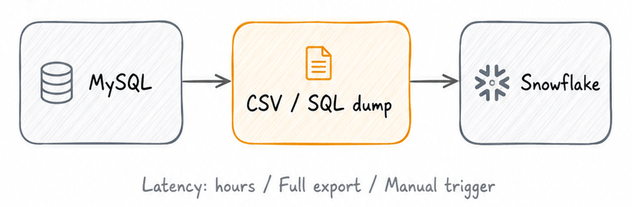
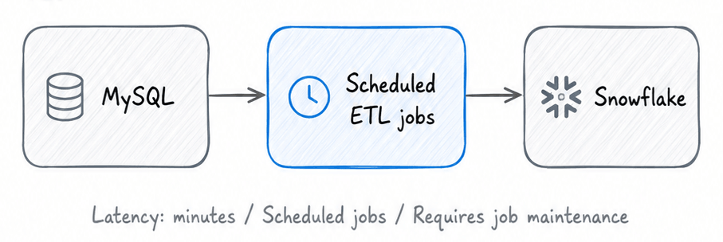
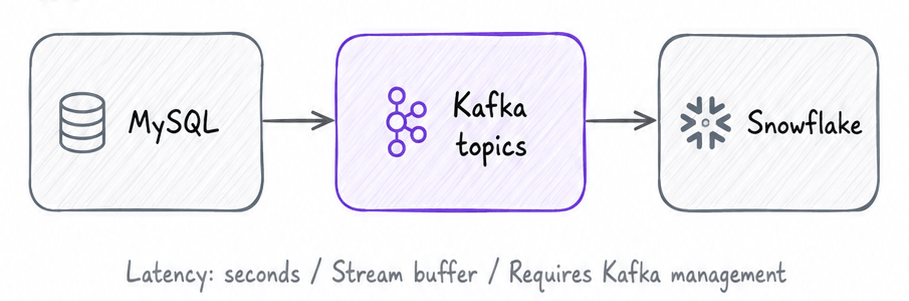
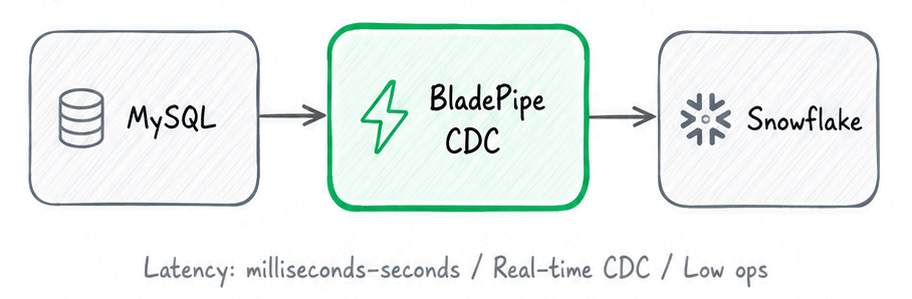
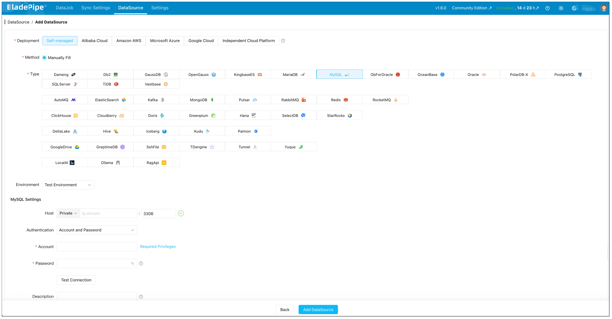
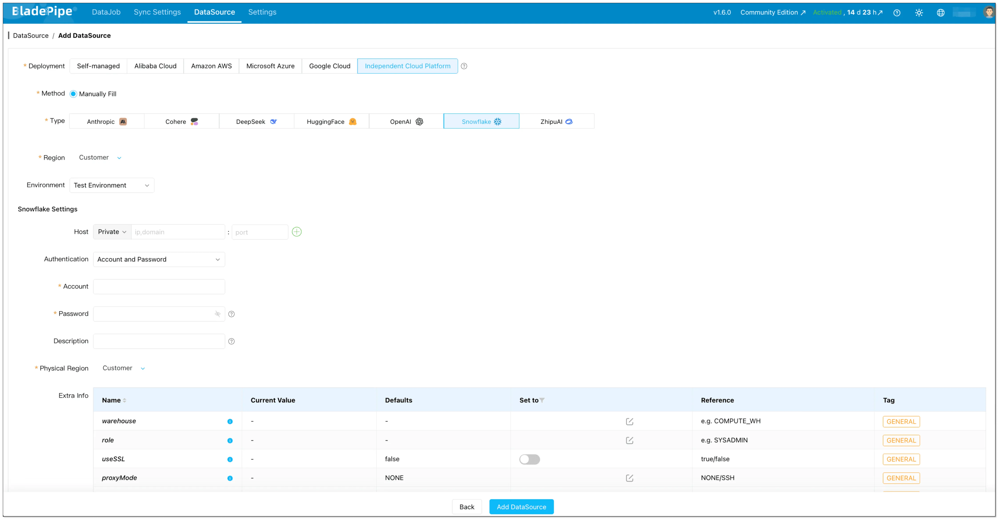

You've outgrown MySQL's analytical limits.

Maybe your BI dashboards are timing out. Maybe ad-hoc queries are fighting your OLTP workload. Maybe the business wants “near real-time analytics” without giving analysts direct access to production.

Snowflake is a natural destination—but **mysql to snowflake migration** is rarely “just move the data”. The hard part is migrating without breaking production, losing changes, or taking a risky downtime window you can’t afford.

This guide compares **4 practical ways to move data from MySQL to Snowflake**, from the simplest one-time approach to **zero-downtime database migration** with continuous replication:

1. [**Manual export and import** (CSV / SQL dump)](#method-1-manual-export-and-import)
2. [**Batch ETL pipelines** (scheduled incremental loads)](#method-2-batch-etl-pipelines)
3. [**Kafka streaming** (MySQL → Kafka → Snowflake)](#method-3-kafka-streaming-mysql--kafka--snowflake)
4. [**CDC-based real-time replication (BladePipe)** (MySQL binlog → BladePipe CDC → Snowflake)](#method-4-cdc-based-real-time-replication-bladepipe)

Along the way, you’ll see when each method works, what typically goes wrong, and what to choose if you need a production cutover with minimal downtime.

## What Is MySQL?

**MySQL** is one of the most widely used **open-source relational [databases](/blog/data_insights/database_types_selection_guide.md)**. It’s commonly deployed as the transactional backbone for web and SaaS applications, where the workload is primarily **OLTP** (many small reads/writes, low latency, strong consistency). MySQL supports indexes, ACID transactions (with InnoDB), and replication features that power read replicas and high availability setups. It also provides a binary log (binlog) that records row-level changes—an important foundation for Change Data Capture (CDC). 

While MySQL can handle some analytical queries, it is typically not optimized for large scans, heavy joins across huge tables, or concurrency patterns common in enterprise analytics.

## What Is Snowflake?

Snowflake is a **cloud data platform** built for analytical workloads (**OLAP**). Its best-known advantage is **separating compute and storage**, which lets you scale query performance independently from data size. You can run multiple virtual warehouses for different teams without resource contention, and pause/resume compute to control cost. Snowflake supports semi-structured data (like JSON), has strong concurrency for analytics, and provides features for secure data sharing. 

For many organizations, Snowflake becomes the system of record for reporting, modeling, and downstream analytics—after data is migrated from operational systems like MySQL.

## Why Migrate Data From MySQL To Snowflake?

**MySQL and Snowflake are built for different jobs.** MySQL is great at **serving application traffic**—high-frequency reads/writes with predictable access patterns. Snowflake is designed for **analytics at scale**—big scans, complex joins, large aggregations, and many concurrent users.

When analytics runs directly on MySQL (or on a fragile replica), teams usually hit three pain points:

- **Performance bottlenecks**: dashboards and analyst queries can spike CPU/IO, impacting transactional latency.
- **Scaling limits**: scaling MySQL for analytics often means expensive vertical scaling or complex replica topologies.
- **Analytics capability**: modern ELT workflows, data modeling, and multi-team concurrency fit Snowflake much better.

That’s why **mysql to snowflake migration** becomes a common modernization step: **keep MySQL focused on OLTP, move analytics to Snowflake**, and choose a migration approach that matches your downtime tolerance and freshness requirements.

## 4 Methods to Move Data From MySQL to Snowflake

There’s no single “best” method. The right choice depends on your goals:

- One-time copy vs. ongoing **mysql to snowflake replication**
- Acceptable downtime window (minutes? hours? none?)
- How “real-time” you need the data (hours vs. minutes vs. seconds)
- Team capacity for operational ownership

Here are the **4 methods** we see most often in practice.

### Method 1: Manual Export and Import

Flow:

This is the simplest way to **load data from MySQL to Snowflake**: export tables from MySQL as files (CSV or SQL dump), stage them (often in cloud storage), and then import them into Snowflake.

#### How it works (typical steps)

1. **Export from MySQL**
   - Small tables: export to CSV
   - Full database / multiple tables: logical dump with `mysqldump`
2. **Upload to a staging location**
   - Commonly an object store (S3 / GCS / Azure Blob) that Snowflake can read from
3. **Create Snowflake tables**
   - Manually define schema, or generate it from the export
4. **Load into Snowflake**
   - Use Snowflake `COPY INTO` (or Snowpipe if you want continuous file ingestion)
5. **Validate**
   - Row counts, sampling, basic checksums, and critical business queries

Helpful references:

- MySQL `mysqldump` documentation: https://dev.mysql.com/doc/refman/8.0/en/mysqldump.html
- Snowflake `COPY INTO <table>` documentation: https://docs.snowflake.com/en/sql-reference/sql/copy-into-table

#### Pros

- Fast to start, low tooling complexity
- Works well for **small datasets** or **one-time migrations**
- Easy to reason about (files in, tables out)

#### Cons (what breaks in production)

- **Downtime risk**: you often need a write freeze to export consistently
- **Ongoing drift**: if MySQL changes while you export, you can miss updates
- **Harder incremental sync**: you’ll reinvent “incremental load” logic per table
- **Schema changes**: DDL drift creates extra manual work

This method is suitable for small one-time migrations but often causes downtime and data inconsistency during active production workloads.

### Method 2: Batch ETL Pipelines

Flow:

Batch ETL (or ELT) pipelines copy data on a schedule—hourly, daily, or every few minutes. The key idea is: do a full load once, then keep Snowflake updated via incremental jobs.

This approach is commonly implemented using:

- Custom scripts + cron
- Orchestrators like Airflow
- [ETL tools](/blog/data_insights/best_etl_tool_for_small_business.md)/ELT tools (commercial or open source)

You’ll also see tools like Fivetran used here, typically with a managed connector that performs periodic syncs and handles common edge cases.

#### Two common batch patterns

**Pattern A: Timestamp-based incremental loads**

For each table, you select rows where `updated_at` is greater than the last watermark, then upsert into Snowflake.

- Good when `updated_at` is reliable and strictly maintained
- Risky when updates arrive late, clocks drift, or `updated_at` is not updated consistently

**Pattern B: ID-based incremental loads**

For append-only tables, you select `id > last_max_id`.

- Good for append-only event tables
- Breaks for updates and deletes unless you add extra mechanisms

#### Pros

- Works well for **periodic reporting** workloads
- Easier to start than streaming for many teams
- Control over scheduling and resource usage

#### Cons

- Correct incremental logic is harder than it looks (late updates, deletes, dedup)
- More moving parts: scheduler, state storage, retries, idempotency
- “Near real-time” often becomes expensive (frequent jobs, more load)

Batch ETL works well for periodic reporting workloads, but it may struggle with continuously changing production data when you need low-latency updates, strong delete handling, and reliable consistency guarantees.

### Method 3: Kafka Streaming (MySQL → Kafka → Snowflake)

Flow:

Kafka-based architectures are common when you already have Kafka as a data backbone, or when multiple downstream systems need the same stream of database changes.

At a high level:

1. Capture changes from MySQL (often by reading MySQL binlog)
2. Produce changes into Kafka topics
3. Load from Kafka into Snowflake using a sink connector or custom consumer + Snowflake loading mechanism

If you’re evaluating whether you truly need Kafka, see: [Do You Really Need Kafka?](../data_insights/do_you_really_need_kafka.md).

#### Implementation options (high level)

- **Debezium + Kafka Connect** for capturing MySQL changes to Kafka (DIY approach)
- A managed CDC platform that can also write to Kafka (reduces ops burden)
- Snowflake ingestion on the other side:
  - Snowflake Kafka Connector (Kafka Connect sink)
  - Custom consumers that stage files and use `COPY INTO`

Reference (Snowflake): Kafka Connector documentation: https://docs.snowflake.com/en/user-guide/kafka-connector-overview

#### Pros

- Low-latency, event-driven pipeline
- Great when you need multiple consumers (not just Snowflake)
- Well understood pattern in data engineering

#### Cons

- Operational overhead can be significant (Kafka + Connect + schema evolution + monitoring)
- Exactly-once semantics are hard end-to-end; you still need idempotency and dedup strategy
- Failure handling is non-trivial (retries, offsets, backpressure, reprocessing)

In practice, Kafka streaming can be a strong option when you already operate Kafka reliably. Otherwise, it often turns a MySQL-to-Snowflake project into “run Kafka in production”, with more operational overhead, infrastructure complexity, and maintenance cost.

### Method 4: CDC-Based Real-Time Replication (BladePipe)

Flow:

If your goal is **zero-downtime database migration** (or close to it), the safest pattern is usually:

1. Run an initial full load into Snowflake
2. Keep Snowflake continuously updated by reading MySQL changes from the binlog (CDC)
3. Cut over reads (and eventually writes) once lag is near zero and validation passes

[Change Data Capture (CDC)](../data_insights/change_data_capture_cdc.md) is the mechanism that makes this practical for production. Instead of scanning tables repeatedly, CDC reads change logs and streams inserts/updates/deletes.

BladePipe is a **no-code, fully managed, production-ready** CDC platform. It runs a **full load + incremental CDC [DataJob](https://www.bladepipe.com/docs/intro/product_nouns/#datajob)**: schema migration (optional) + initial snapshot + ongoing CDC—while keeping operational overhead low.

#### Prerequisites

**MySQL side**

- Network access from BladePipe to MySQL
- MySQL binlog enabled (CDC reads binlog; `ROW` format is commonly recommended for correctness)
- An account with required privileges

See: [Required Privileges for MySQL](/docs/dataMigrationAndSync/datasource_func/MySQL/privs_for_mysql/).

**Snowflake side**

- A Snowflake account and a target database/schema
- A role with permission to create tables and load data
- A network path for BladePipe to reach Snowflake endpoints

**BladePipe side**

You can get a **free BladePipe account** in three ways:

- **SaaS (Fully Managed)** – 90-day free trial. Just [log in](https://www.bladepipe.com/register/) and start using it. See [Quick Start (SaaS)](/docs/quick/quick_start_mgr.md).
- **BYOC (Bring Your Own Cloud)** – 90-day free trial. Follow the [instructions](/docs/quick/quick_start_byoc.md) in Install Worker (Docker) or Install Worker (Binary) to download and install a BladePipe Worker.
- **On-premise (Local Deployment)** – Free Community edition. Click Try Community Free on the [homepage](https://www.bladepipe.com/) for one-click deployment. See [Quick Start (On-premise)](/docs/quick/quick_start.md).

#### Step-by-step setup (adapted for MySQL → Snowflake)

The workflow is similar to the “full load + incremental CDC” pattern used in other BladePipe guides (for example: [SQL Server CDC pipeline setup](sql_server_to_kafka_cdc_guide.md)).

##### Step 1: Add MySQL as a DataSource

In BladePipe console:

1. Go to **DataSource** → **+ Add DataSource**
2. Choose **MySQL**
3. Fill in host/port/user/password and any extra parameters
4. Click **Test Connection**, then **Add DataSource**

##### Step 2: Add Snowflake as a DataSource

1. Go to **DataSource** → **+ Add DataSource**
2. Choose **Snowflake**
3. Fill in host/account/password and any extra parameters (depending on your auth setup)
4. Click **Test Connection**, then **Add DataSource**

##### Step 3: Create a CDC DataJob (initial load + incremental)

1. Go to **DataJob** → **Create DataJob**
2. Select **MySQL** as source and **Snowflake** as target
3. Test connections → Next
4. Choose **Incremental** together with **Initial Load**

This creates a single pipeline that starts with a snapshot (full load) and then continuously applies changes from MySQL binlog.

Reference: [Create Full + Incremental DataJob](/docs/operation/job_manage/create_job/create_full_incre_task/).

##### Step 4: Select tables and mapping rules

1. Select the tables you want to replicate
2. (Optional) Configure:
   - Mapping rules
   - Modify target name (prefix/suffix)
   - Open action blacklist

##### Step 5: Select columns and start the job

1. Select the columns want to replicate
2. (Optional) Configure:
   - Mapping rules
   - Set data filtering
   - upload custom code
3. Click **Create DataJob**

##### Step 6: Observe lag, validate, and cut over safely

For a migration (not just replication), “data is flowing” is not enough. You need:

- **Lag monitoring** (seconds/minutes behind)
- **Validation checks** (row counts, sampling, key aggregates)
- A **cutover plan** (read cutover first, then write cutover if needed)

A typical production cutover looks like this:

1. Start CDC pipeline and let it run until stable
2. Validate Snowflake data continuously
3. Schedule a short cutover window
4. Briefly pause writes (or route writes to a maintenance queue), let CDC catch up to near-zero
5. Switch analytics reads to Snowflake
6. Keep CDC running for a period to ensure no drift

BladePipe uses Change Data Capture (CDC) to continuously replicate MySQL changes into Snowflake in real time, reducing downtime during migration and keeping data synchronized throughout the cutover process.

## Comparison: MySQL to Snowflake Migration Methods (Best Tools Comparison)

Below is a practical comparison of these approaches for teams choosing the best tools for mysql to snowflake migration.

| Dimension | Method 1: Manual Export | Method 2: Batch ETL | Method 3: Kafka Streaming | Method 4: CDC Replication (BladePipe) |
| --- | --- | --- | --- | --- |
| **Downtime** | Usually requires downtime / write freeze | Low-to-medium (depends on batch window) | Low (but depends on pipeline maturity) | Minimal / supports zero-downtime patterns |
| **Real-Time Capability** | No | Limited (minutes to hours) | Yes (near real-time) | Yes (near real-time) |
| **Complexity** | Low | Medium | High | Low-to-medium (no-code + managed) |
| **Best For** | Small one-time migrations | Periodic reporting / low-frequency sync | Teams already strong at Kafka | Production migrations and continuous replication |
| **Data Consistency** | Risky under active writes | Depends on incremental design | Good with careful offset/dup handling | Strong (snapshot + CDC position tracking) |

If you need zero-downtime, real-time sync with no coding, go with Method 4. If it’s a one-time small dataset, Method 1 is fine.

## FAQs

### Can I migrate from MySQL to Snowflake with zero downtime?

Yes—if you use a CDC-based approach. The common pattern is: initial full load + continuous replication + short cutover when lag is near zero. This is the most practical way to do **zero-downtime database migration** for production systems.

### Will CDC replication impact MySQL performance?

CDC reads the MySQL binlog, which is generally lightweight compared with repeatedly scanning tables for incremental loads. However, you still need to monitor binlog retention, disk usage, and replication lag. With proper configuration, CDC is usually production-safe.

### Does Snowflake support real-time ingestion?

Snowflake supports near real-time ingestion patterns (for example via streaming ecosystems, connectors, or continuous file ingestion). In practice, end-to-end “real-time” depends on your pipeline design, buffering strategy, and how you handle retries and deduplication.

### How do incremental sync pipelines avoid missing updates or deletes?

The safest way is log-based CDC, because it records inserts/updates/deletes as they happen. If you rely on batch ETL with timestamps, you must explicitly handle deletes and late updates, use stable watermarks, and design idempotent upserts to avoid gaps and duplicates.

### What free/open-source tools can I use—and how is BladePipe different from Fivetran?

Open-source options commonly include Debezium (often with Kafka Connect) for CDC. They offer flexibility, but you own deployment, upgrades, monitoring, schema evolution, and on-call operations. Managed tools like Fivetran can reduce setup effort but may still require careful tuning for latency and cost.

BladePipe is built for production replication with a managed, no-code experience and a full-load + incremental CDC pipeline in one job—aimed at lower operational overhead while still supporting near real-time migration and sync.

## Next Steps

If you're planning a production MySQL to Snowflake migration, start by defining:

- Acceptable downtime window (if any)
- Freshness target (hourly vs. minutes vs. seconds)
- Data consistency requirements for your critical tables
- Who will own operations (alerts, retries, schema changes)

When you’re ready to implement CDC-based replication:

- [Start a free trial](https://www.bladepipe.com/register/)
- [Request a demo](https://cal.com/bladepipe-xxypci/30min)
