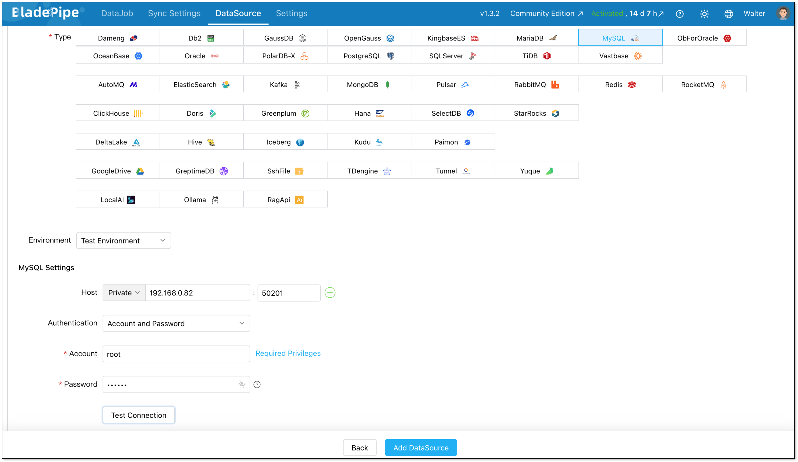
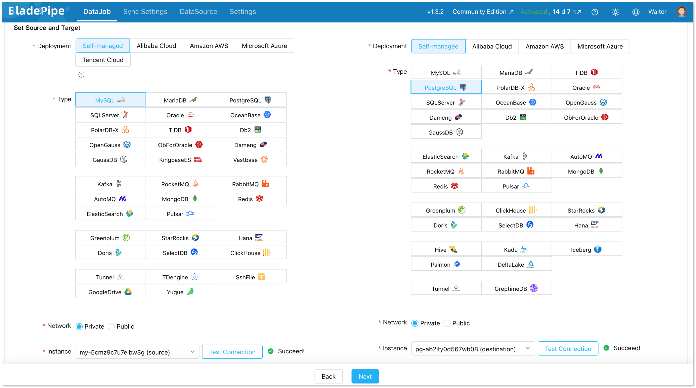
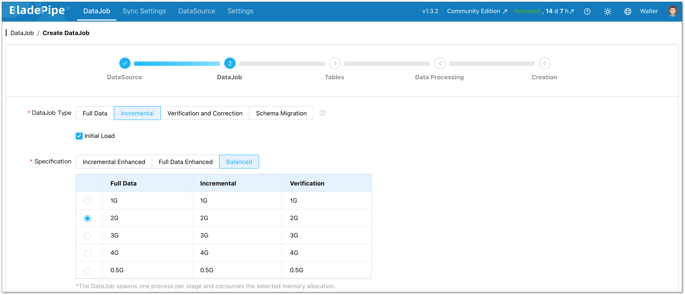
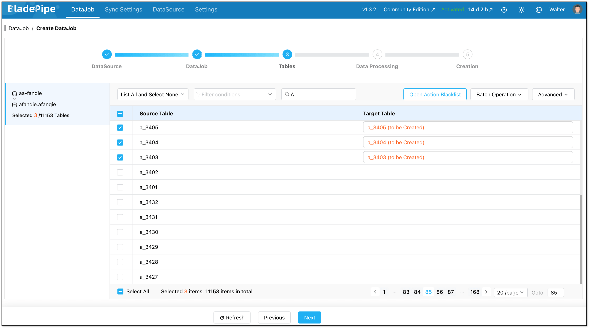
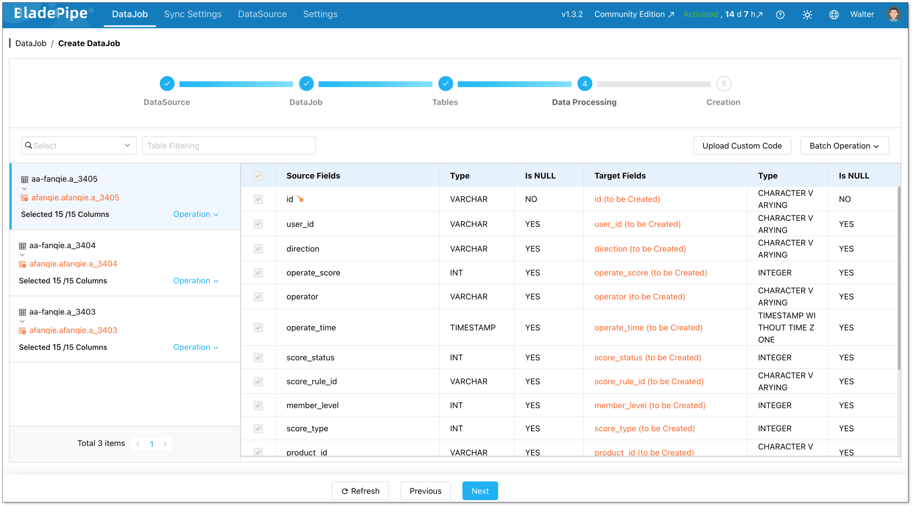
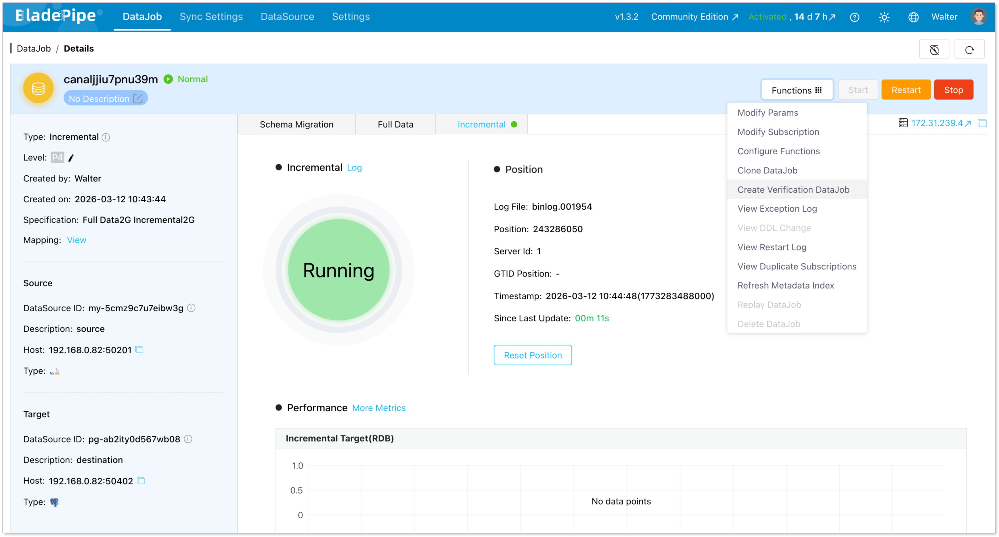
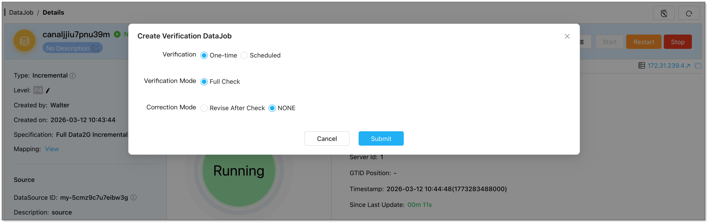
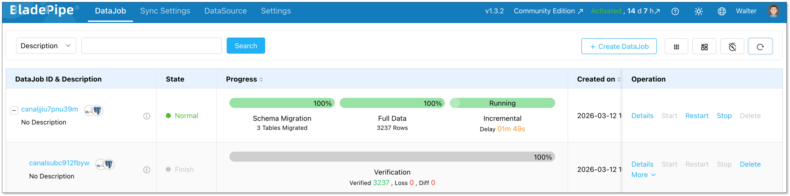

MySQL and PostgreSQL are two of the most widely used open-source databases. Many teams start with MySQL because it’s simple and familiar. As applications grow, however, developers often migrate to PostgreSQL for its advanced SQL capabilities, extensibility, and stronger support for complex workloads.

The challenge is that database migrations are rarely trivial. Schema differences, data consistency, and minimizing downtime all need careful planning. This guide walks through how to migrate from MySQL to PostgreSQL safely, including tools, migration steps, and common pitfalls to avoid.

## TL;DR
If you’re planning a **MySQL to PostgreSQL migration**, here are the key takeaways:

+ Teams migrate to PostgreSQL for stronger SQL compliance, extensibility, and analytics-friendly capabilities.
+ A safe migration typically includes **three phases**: schema conversion, full data migration, and CDC-based replication.
+ Tooling significantly impacts migration complexity:
    - **pgloader** is great for quick one-time migrations.
    - **AWS DMS** supports cloud-native migration pipelines.
    - **BladePipe** enables near-zero downtime migrations with real-time CDC.
+ Thorough staging tests and data validation are critical before production cutover.

## Why Teams Move from MySQL to PostgreSQL
### MySQL vs PostgreSQL
Both MySQL and PostgreSQL are powerful relational databases, but they are optimized for slightly different use cases.

[**MySQL**](https://dev.mysql.com/doc/refman/8.4/en/) has traditionally been the go-to choice for web applications and simple OLTP workloads. It is easy to operate, widely supported, and familiar to many developers.

[**PostgreSQL**](https://www.postgresql.org/docs/), on the other hand, is designed as a more feature-rich and extensible relational database. It provides advanced query capabilities, richer data types, and a strong ecosystem of extensions.

| **Feature** | **MySQL** | **PostgreSQL** |
| --- | --- | --- |
| **SQL compliance** | Moderate | Very high |
| **Data Types** | Good support for standard types.  | Richer data types, including arrays, JSONB, and geospatial data.  |
| **JSON support** | Supports JSON data type. | Advanced JSON support with JSONB for indexed JSON data.  |
| **Extensions** | Limited | Rich extension ecosystem |
| **Advanced queries** | Basic support | Strong support |
| **Analytics workloads** | Moderate | Strong |

For simple transactional systems, MySQL often performs well. But as applications evolve toward complex queries, analytics workloads, or mixed data models, PostgreSQL becomes increasingly attractive.

### Key Reasons Teams Switch
Several factors commonly drive teams to migrate from MySQL to PostgreSQL:

+ **Advanced SQL capabilities**: PostgreSQL supports advanced SQL constructs such as common table expressions (CTEs), and sophisticated query optimization strategies. These features make it more suitable for complex data processing tasks.
+ **Stronger data integrity**: PostgreSQL enforces stricter standards around data types and constraints, which helps maintain data correctness in large systems.
+ **Native JSON support**: PostgreSQL supports advanced types such as **JSONB**, arrays and geospatial data. This flexibility allows developers to model complex data more efficiently.
+ **Extensions ecosystem**: PostgreSQL supports powerful extensions like TimescaleDB and pgvector, which make it a multi-purpose data platform.
+ **Analytics-friendly architecture**: Compared to MySQL, PostgreSQL tends to perform better with complex analytical queries, large aggregations and mixed analytical workloads.

## Pre-Migration Checklist
Before you start moving data, a thorough preparation phase is crucial to minimize downtime and avoid data loss. Here’s a checklist to guide you:

1. **Analyze Your Schema:** Carefully examine your MySQL schema. Identify any MySQL-specific features or data types that will need conversion. 
2. **Data Type Mapping:** Create a clear mapping from MySQL data types to their PostgreSQL equivalents. For example, `DATETIME` in MySQL will become `TIMESTAMP` in PostgreSQL. 
3. **Backup Your Data:** This is a non-negotiable step. Create a full backup of your MySQL database before you begin the migration process.
4. **Evaluate downtime tolerance:** Decide whether you can afford downtime (offline migration) or if you need a continuous replication solution with zero downtime (live migration with CDC).
5. **Select Your Tools:** Based on your migration strategy, choose the right set of tools. We'll explore some popular options in the next section.
6. **Test, Test, and Test Again:** Set up a staging environment that mirrors your production setup. Perform a full test migration and thoroughly test your application to catch any issues before the final migration. 

## Common Tools: pgloader vs. AWS DMS vs. BladePipe
The right tool can make or break your migration experience. Let's look at three popular choices.

### pgloader
[**pgloader**](https://pgloader.io/) is a widely used open-source tool specifically designed for migrating databases to PostgreSQL, including MySQL. It can automatically convert schemas, transform data types, and load data efficiently. pgloader is an excellent choice for one-time migrations where some downtime is acceptable. 

### AWS DMS
**AWS Database Migration Service (DMS)** is a managed cloud service that facilitates database migrations. AWS DMS supports both homogeneous and heterogeneous migrations and is a great option if your infrastructure is already on AWS. It can handle both one-time migrations and continuous data replication with Change Data Capture (CDC). 

### BladePipe
[**BladePipe**](https://www.bladepipe.com/) is a **real-time data replication platform** designed for high-performance CDC pipelines. Unlike traditional migration tools, BladePipe focuses on **continuous data replication and operational reliability**. It supports [a wide range of sources and targets](https://www.bladepipe.com/connector/), including MySQL and PostgreSQL, and offers a visual interface for creating and managing migration jobs.  

Here’s a quick comparison of the tools:

|  | **pgloader** | **AWS DMS** | **BladePipe** |
|---|---|---|---|
| **Type** | Open-source CLI | Managed Cloud Service | Self-hosted / Cloud Platform |
| **Pros** | High-speed bulk loading; Open source and free. | Managed by AWS; Scalability; Ongoing replication (CDC). | Real-time CDC; Visual interface; Schema evolution; High throughput for large datasets. |
| **Cons** | Not designed for long-running CDC pipelines; Limited operational monitoring. | Complex setup; Limited transformation. | Requires initial configuration |
| **Best for** | Small-to-medium one-time migrations with acceptable downtime. | Teams already deeply integrated into the AWS ecosystem. | Zero-downtime production database migration |

## Step-by-Step Migration Flow
A typical MySQL → PostgreSQL migration pipeline including three stages:

+ schema migration
+ full data load
+ incremental replication via CDC

A [modern CDC tool](https://www.bladepipe.com/blog/data_insights/top_cdc_tool/) usually fully automates the flow while offering great visibility.

Today, let’s walk through how to build a MySQL → PostgreSQL pipeline in minutes using such a CDC tool — [BladePipe free version](https://www.bladepipe.com/pricing/).

### Step 1: Install BladePipe
Install BladePipe using [Docker](https://www.bladepipe.com/docs/productOP/onPremise/installation/install_all_in_one_docker/) or [Kubernetes](https://www.bladepipe.com/docs/productOP/onPremise/installation/install_all_in_one_k8s/) based on your deployment environment.

Once installed, access the BladePipe console and prepare to configure your source and target databases.

### Step 2: Add Data Sources
Go to **DataSource** > [**Add DataSource**](https://www.bladepipe.com/docs/operation/datasource_manage/add_self_maintain_ds/), and create two data sources:

+ MySQL (source)
+ PostgreSQL (destination)

Configure connector details:

+ **Deployment:** Self-managed
+ **Type:** MySQL / PostgreSQL
+ **Host:** Database IP and host
+ **Authentication:** Choose the method and fill in the info.

Then verify that both connections are working correctly.

### Step 3: Build a CDC Pipeline
Next, create a new data replication job.

Go to **DataJob** > [**Create DataJob**](https://www.bladepipe.com/docs/operation/job_manage/create_job/create_full_incre_task/). Then select the source and target DataSources, and click **Test Connection** for both.

For one-time migration, select **Full Data** for DataJob Type. For continuous replication, select **Incremental**, together with the **Initial Load** option.

Select the tables to be replicated.

Select the columns to be replicated.

Confirm the DataJob creation, and start to run the DataJob.    

### Step 4: Verify the Data
Before final cutover, verify that the source and target databases contain identical data. This can be done through automated verification jobs.

In the DataJob Details page, click **Functions** > **Create Verification DataJob**.

Check the DataJob configuration, and confirm to run the verification job automatically.

Now you can check the data consistency between the source and the destination.

## Common Migration Pitfalls and Fixes
Even with the best tools, you might encounter some bumps along the road. Here are some common pitfalls and how to deal with them:

### Auto-Increment Differences
MySQL's `AUTO_INCREMENT` is straightforward, but in PostgreSQL, you'll use `SERIAL`, `BIGSERIAL`, or the more standard `GENERATED ALWAYS AS IDENTITY`. 

**How to Fix:** 

Your migration tool should handle this conversion. If you're doing a manual migration, make sure to create the sequences in PostgreSQL and set the next value correctly after the data import.

### SQL Syntax and Function Differences
MySQL can be more lenient with its SQL syntax, while PostgreSQL is stricter. You might also find that some MySQL-specific functions are not available in PostgreSQL.

**How to Fix:** 

Thoroughly test your application's queries against the new PostgreSQL database. You may need to rewrite some queries to be compliant with PostgreSQL's syntax.

### Character Encoding
Mismatches in character encoding can lead to data corruption. MySQL's default `latin1` can cause issues when migrating to PostgreSQL's default `UTF-8`.

**How to Fix:** 

Ensure that your PostgreSQL database is created with the correct character encoding (`UTF-8` is recommended).

### Performance Degradation
After migration, you might notice that some queries are slower. This can be due to differences in query optimizers, indexing, or database configuration. 

**How to Fix:**

Analyze the slow queries using `EXPLAIN ANALYZE` in PostgreSQL. You may need to create new indexes, tune your PostgreSQL configuration, or rewrite some queries for better performance.

## Conclusion
Migrating from MySQL to PostgreSQL is a significant architectural step, but it’s also a well-established journey that many teams have successfully completed.

With the right preparation, tooling, and validation process, migrations can be executed safely without major downtime or operational risk.

Whether you use open-source tools like **pgloader**, managed services like **AWS DMS**, or a real-time CDC platform like [**BladePipe**](https://www.bladepipe.com/login/), the key is building a migration workflow that minimizes risk while maintaining data consistency.

Done right, the transition to PostgreSQL can unlock powerful capabilities for your application from advanced querying to a richer ecosystem of extensions.

## FAQ
**Q: How long does a MySQL to PostgreSQL migration take?**

The duration of a migration depends on the size and complexity of your database, the migration strategy, and the tools you use. A small database might be migrated in a few hours, while a large, complex database could take days or even weeks to migrate, especially if a zero-downtime approach is required.

**Q: What are the main advantages of PostgreSQL over MySQL?**

PostgreSQL's main advantages include its support for advanced data types (JSONB, arrays, geospatial), its ability to handle complex queries efficiently, its extensibility, and its strict adherence to SQL standards. 

**Q: What is the biggest challenge in MySQL to PostgreSQL migration?**

The biggest challenge is often not the data migration itself but ensuring that the application continues to function correctly after the migration. This involves thorough testing to identify and fix any issues related to SQL syntax differences, data type conversions, and performance. 

**Q: Which tool should I start with?**

For simple one‑time migrations, pgloader works well. If you need low downtime or repeatable pipelines, a tool like BladePipe is a better fit. Choose based on downtime limits, schema complexity, and automation needs.

> **Suggested Reading:**
> - [MySQL CDC vs PostgreSQL CDC](../data_insights/mysql_cdc_vs_postgres_cdc.md)

