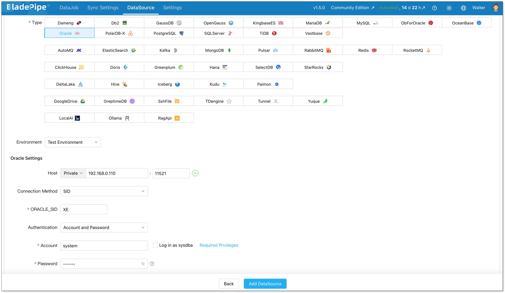
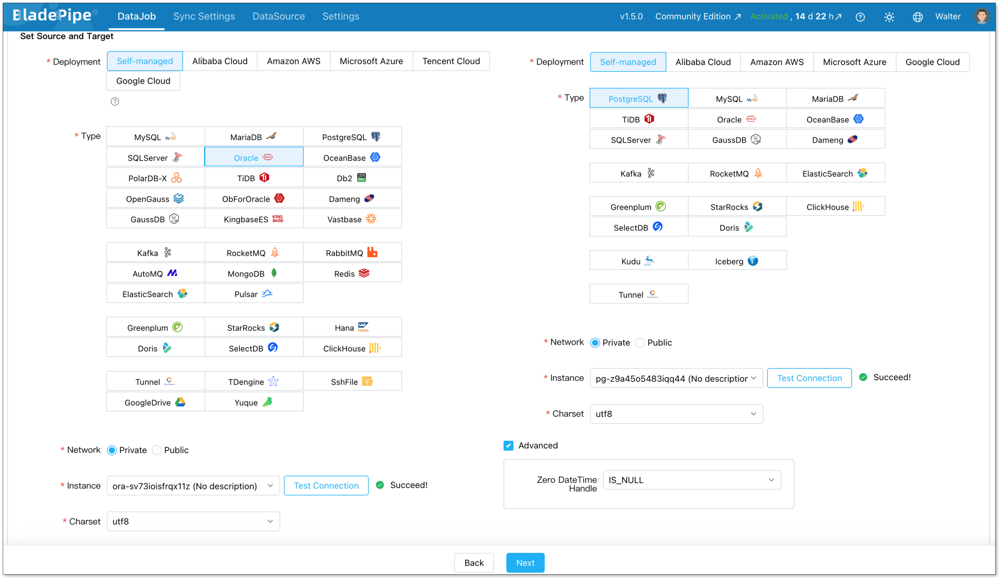
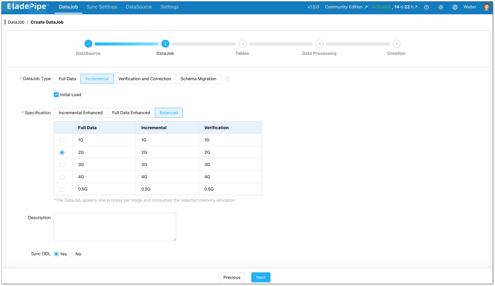
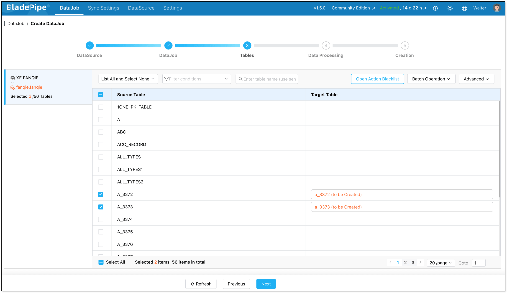
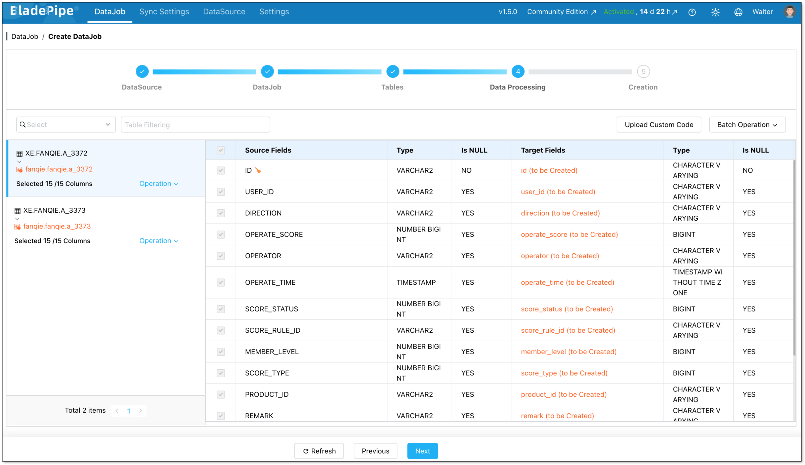
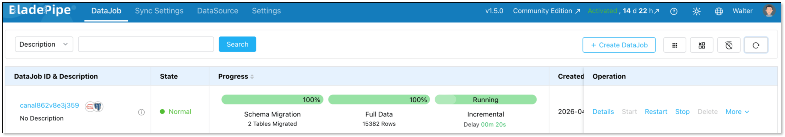

If you're running Oracle in production, you've probably felt the pain. The licensing bills keep climbing. Your infrastructure is tied to one vendor. And every time you want to try something new, there's another Oracle-specific constraint standing in your way.

PostgreSQL offers a way out. It's open-source, and runs beautifully on every major cloud platform. More and more engineering teams are making the switch.

This guide walks you through everything you need to know to migrate from Oracle to PostgreSQL confidently. We'll cover the key differences between the two databases, the two main migration approaches, and a step-by-step guide for each.

## Oracle vs. PostgreSQL: Key Differences to Know First
Understanding the structural differences between Oracle and PostgreSQL is the first step in a smooth migration. A lot of migrations run into trouble not because of bad planning, but because teams underestimate how different they actually are under the hood. Here's the differences that matte most.

### Architecture
Oracle uses a multitenant model built around a container database (CDB) that hosts one or more pluggable databases (PDBs). PostgreSQL uses a simpler schema-based model. This means you'll likely need to rethink how your databases and schemas are structured before you migrate.

### SQL dialect
Oracle has its own SQL extensions that PostgreSQL simply doesn't support. These are scattered throughout application code and stored procedures, and they'll break silently if you don't catch them. Here are the most common ones:

| Oracle | PostgreSQL equivalent |
| --- | --- |
| `ROWNUM` | `LIMIT` |
| `SYSDATE` | `NOW()` |
| `CONNECT BY` | `WITH RECURSIVE` |
| `SELECT 1 FROM DUAL` | `SELECT 1` |
| `NVL(x, y)` | `COALESCE(x, y)` |


### Procedural language
Oracle’s procedural language is PL/SQL, which is very robust and feature-rich. PostgreSQL uses PL/pgSQL. While they look similar, there are nuances in how exceptions are handled and how cursors behave. Most PL/SQL logic can be mapped to PL/pgSQL, but complex packages might require manual rewriting.

### Data types
Oracle's type system doesn't map cleanly to PostgreSQL. This is where silent data loss can happen if you're not careful. Here is a quick reference for common mappings:

| Oracle | PostgreSQL |
| --- | --- |
| `NUMBER(p,s)` | `NUMERIC(p,s)` |
| `VARCHAR2(n)` | `VARCHAR(n)` or `TEXT` |
| `DATE` | `TIMESTAMP` (Oracle DATE includes time — PostgreSQL DATE does not) |
| `CLOB` | `TEXT` |
| `BLOB` | `BYTEA` |
| `RAW` | `BYTEA` |


## Two Common Migration Methods
Now that you know what you're dealing with, the next question is how to actually approach it.

There are two main paths for migrating from Oracle to PostgreSQL, and they serve very different needs.

### CDC with BladePipe  
[**BladePipe**](https://www.bladepipe.com/) is an automated migration platform. It connects to your Oracle database, converts the schema to PostgreSQL-compatible DDL, moves your data, and can keep both databases in sync via [Change Data Capture (CDC)](https://www.bladepipe.com/blog/data_insights/change_data_capture_cdc/) while you validate and prepare to cut over. In a UI-driven surface, you can build a robust pipeline in minutes. 

### ora2pg-based migration 
**ora2pg** is a free, open-source migration tool specifically built for Oracle-to-PostgreSQL migrations. 

It connects directly to your Oracle database, exports the schema, converts data types and PL/SQL code to PostgreSQL-compatible equivalents, and generates ready-to-run SQL scripts. You then review and run those scripts against your PostgreSQL instance. 

It's more structured than a fully manual approach, but it still requires hands-on technical work at every step.

## How to Choose Between Them
The right method really comes down to three factors: the size of your database, how much downtime you can tolerate, and how complex your Oracle setup is.

**Choose BladePipe if:**

+ Your database is large (50GB or more)
+ You're migrating a live production system and can't afford extended downtime
+ Your team doesn't have deep Oracle or PostgreSQL DBA expertise
+ You want to run both databases in parallel and validate before cutting over
+ You hope to synchronize incremental data right after full data migration

**Choose ora2pg if:**

+ Your database is small to medium in size
+ You can schedule a maintenance window for cutover
+ Your team has strong SQL and command-line skills
+ You want an open-source toolchain with full transparency
+ You're comfortable reviewing and adjusting auto-generated scripts before running them

For most production migrations, automation is the safer bet. The manual approach works well for smaller, lower-stakes projects, but it doesn't scale, and it leaves a lot of room for human error on larger databases.

## Migration Checklist
Rushing into a migration without proper preparation is the number one reason projects go sideways. Before you start either method, work through this checklist.

**Audit what you're migrating:**

+  All tables, indexes, and constraints
+  Views, triggers, and stored procedures
+  Sequences and identity columns
+  Large objects (CLOB/BLOB)

**Identify your dependencies:**

+  Oracle-specific SQL buried in your application code
+  PL/SQL logic that needs rewriting
+  External tools, reports, or integrations connected to Oracle

**Plan your cutover:**

+  Decide between big bang (all at once) or phased (incremental) migration
+  Define your rollback criteria, like at what point would you switch back to Oracle?
+  Decide how long you'll keep Oracle running as a fallback after cutover

**Network & Security**:

+ Ensure the migration server has high-speed access to both the source and the target.
+ Map your Oracle users and roles to PostgreSQL roles and schemas.

Once that's all in order, let's get into the step-by-step guide for each method.

## Method 1: Migrating with BladePipe
### Prerequisites
+ Access to BladePipe — either by deploying the [free Community Edition](https://www.bladepipe.com/) locally or [signing up for a free BladePipe Cloud trial](https://www.bladepipe.com/register/).
+ Oracle Database 10g or above
+ A target PostgreSQL instance (self-hosted or managed cloud)

### Step 1: Prepare your Oracle database
Before building a pipeline, ensure your Oracle account has the required privileges. Follow the instructions in [Required Privileges for Oracle](https://www.bladepipe.com/docs/dataMigrationAndSync/datasource_func/Oracle/privs_for_oracle/) and grant the required privileges.

### Step 2: Add Your connectors
Log in to BladePipe Console and go to **DataSource** > [**Add DataSource**](https://www.bladepipe.com/docs/operation/datasource_manage/add_self_maintain_ds/).

Add two data sources:

+ Oracle (source)
+ PostgreSQL (destination)

Configure connector details:

+ **Deployment:** Self-managed
+ **Type:** Oracle / PostgreSQL
+ **Host:** Database host and port
+ **Authentication:** Choose the method and fill in the info.

Then verify that both connections are working correctly.



### Step 3: Migrate data
Next, create an Oracle - PostgreSQL pipeline.

Go to **DataJob** > [**Create DataJob**](https://www.bladepipe.com/docs/operation/job_manage/create_job/create_full_incre_task/). Then select the source and target DataSources, and click **Test Connection** for both.



For one-time migration, select **Full Data** for DataJob Type. For continuous replication, select **Incremental**, together with the **Initial Load** option.



Select the tables to be replicated.



Select the columns to be replicated.



Confirm the DataJob creation, and start to run the DataJob.




## Method 2: Migrating with ora2pg
**ora2pg** works in two phases: first it exports and converts your Oracle schema and data into PostgreSQL-compatible scripts, then you run those scripts against your target database. Here's how to do it.

### Prerequisites
+ ora2pg installed on a Linux/macOS machine ([installation guide](https://ora2pg.darold.net/documentation.html))
+ Perl and the required DBD::Oracle and DBD::Pg modules installed
+ Oracle client libraries (Oracle Instant Client) on the same machine
+ A target PostgreSQL instance with admin access

### Step 1: Configure your Oracle connection
ora2pg uses a configuration file (`ora2pg.conf`) to manage connection settings. Open it and set your Oracle connection details:

```bash
ORACLE_DSN    dbi:Oracle:host=your_host;sid=your_sid;port=1521
ORACLE_USER   your_oracle_user
ORACLE_PWD    your_oracle_password
```

### Step 2: Export and review your schema
Run ora2pg in TABLE mode to export your schema first. This generates a PostgreSQL-compatible DDL script:

```bash
ora2pg -t TABLE -o tables.sql -b ./output
```

Open `tables.sql` and review the output carefully, especially DATE columns, NUMBER types, and any constraints. Adjust anything that doesn't look right before moving on.

### Step 3: Export your data
Once the schema looks good, export the actual data:

```bash
ora2pg -t COPY -o data.sql -b ./output
```

This generates PostgreSQL `COPY` statements for all your tables. 

### Step 4: Apply the schema to PostgreSQL
With your scripts reviewed and adjusted, create the schema in your PostgreSQL target:

```bash
psql -h your_pg_host -U your_pg_user -d your_database -f ./output/tables.sql
```

### Step 5: Load the data
Import the data using the generated `COPY` scripts:

```bash
psql -h your_pg_host -U your_pg_user -d your_database -f ./output/data.sql
```

Add indexes and foreign key constraints after the data is loaded. This is much faster than having them active during import.

## Ready to Start Your Migration?
Migrating from Oracle to PostgreSQL is a strategic move that pays off in the long run. While the architectural differences require a solid plan, the tools available today make the transition smoother than ever.

Whether you choose the precision of **BladePipe CDC** for zero-downtime or the granular control of a **ora2pg-based migration**, the key is to start small, test thoroughly, and move with confidence. 

## FAQ
**Q: Should I move to the Cloud or stay On-Premise?**

It depends on your priorities. Cloud hosting (Amazon RDS, Azure Database, Cloud SQL) gives you managed backups, auto-scaling, and less infrastructure overhead. On-premise gives you more control over security and compliance, which matters in regulated industries like finance or healthcare. 

**Q: How do I handle large binary files (LOBs) during a move?**

Large objects can slow down migration significantly. It is often best to move these in batches or separate them from the main table migration. In some cases, teams choose to move these files to external Object Storage (like S3) instead of putting them back into the database.

**Q: Can I run both databases at the same time?**

Yes, and it's actually recommended for production migrations. Running Oracle and PostgreSQL in parallel gives you time to validate data, test your application, and catch issues before fully cutting over. With BladePipe's CDC feature, both databases stay in sync in real time during this window. With ora2pg, you'd need to re-export and reload any tables that changed during migration, so the parallel window is shorter and requires more careful coordination.

