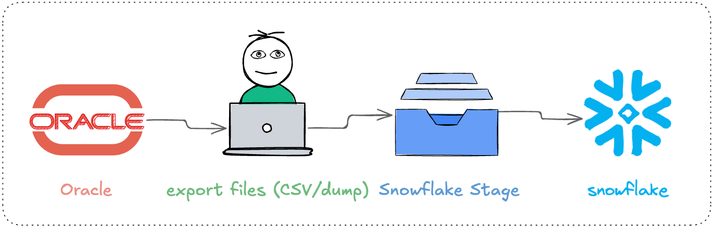
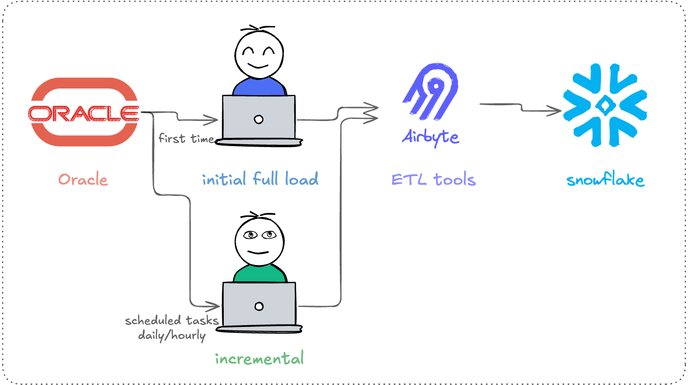
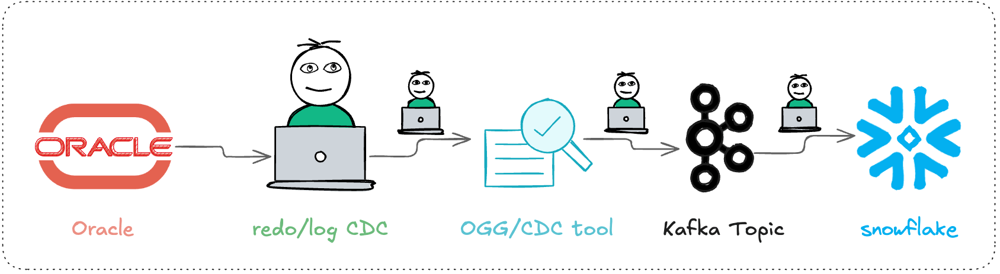
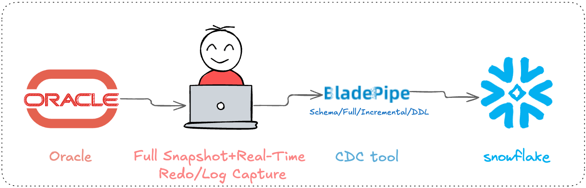
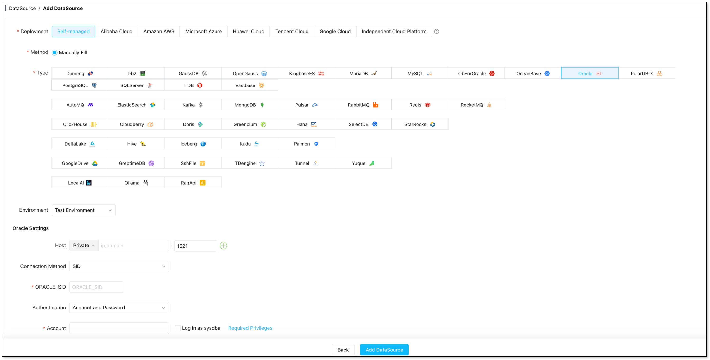
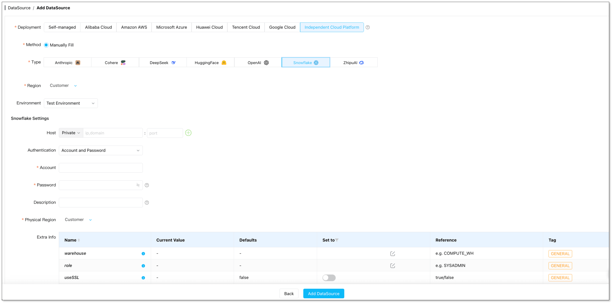
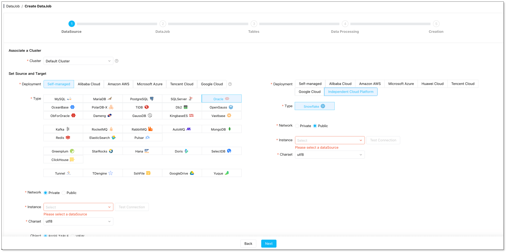
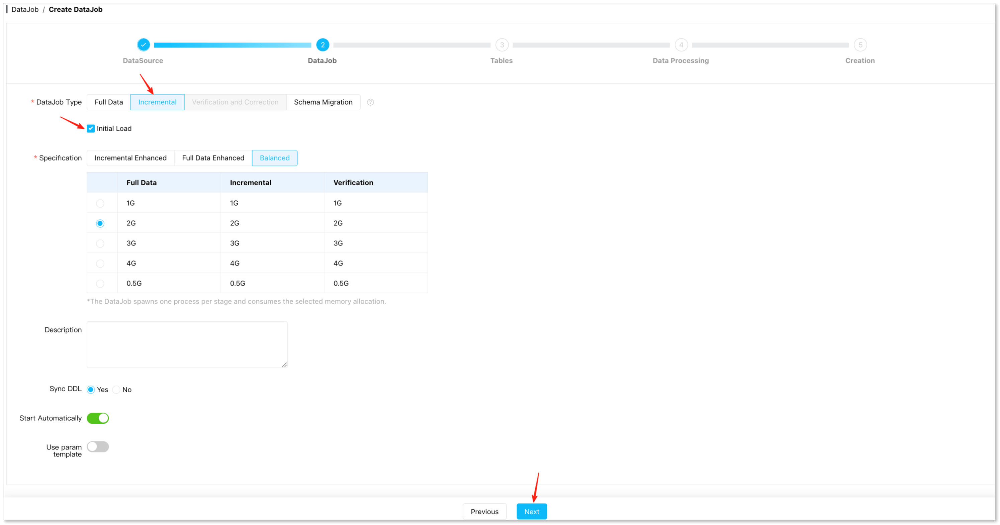
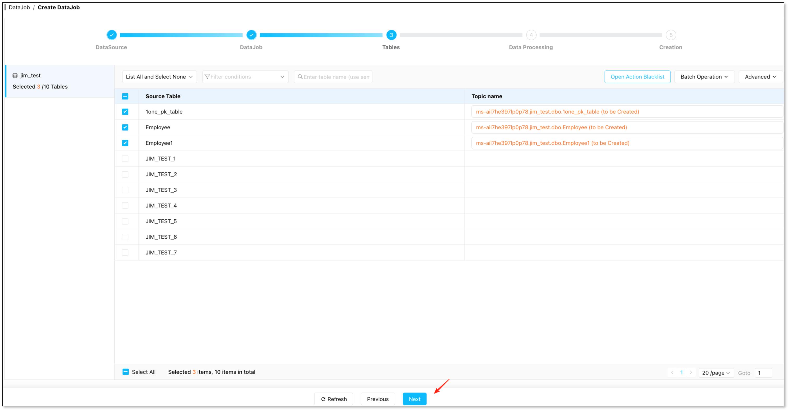
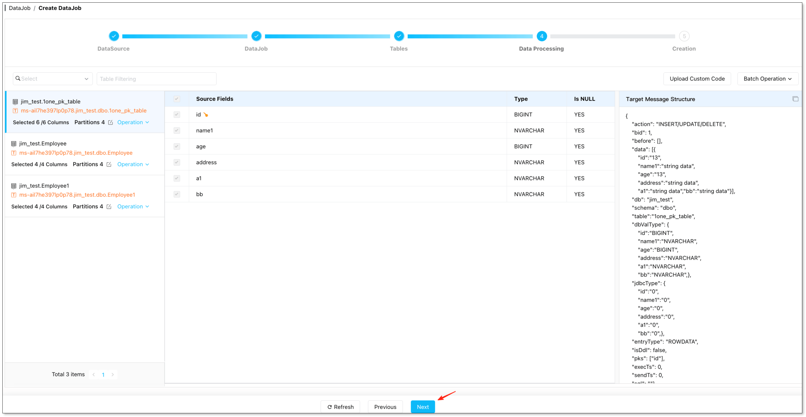

When migrating analytical reports and BI workloads **from Oracle to Snowflake**, most people fear three things: (1) a full migration takes too long, and any interruption forces a full restart; (2) incremental sync easily misses data, causing mismatches in reconciliation; (3) you don’t dare to take the system offline, and the cutover window never feels long enough.

At its core, these three fears boil down to one thing: **choosing the wrong migration strategy**. If you are experiencing (or worry about) these issues, this article is worth 10 minutes of your time. We compare **4 common Oracle → Snowflake migration approaches** and lay out a practical path that minimizes downtime, enables data validation, and allows rollback.

## Why Move Analytical Workloads from Oracle to Snowflake?

Why do most teams want to move data from Oracle to Snowflake? Because running analytics and reports on Oracle for a long time leads to **three increasingly painful problems**:

- **Performance contention** – Analytical queries compete with online transaction processing (OLTP) for CPU and I/O. During peak hours, both suffer.
- **High scaling costs** – Adding more Oracle capacity or read replicas for reports costs money without solving the real problem.
- **Messy data pipelines** – To get faster insights, teams resort to manual exports and scripts, ending up with unmaintainable processes.

That’s why more teams are moving analytical workloads to Snowflake. It’s better suited for analytical computation and concurrent team access, and it helps build a unified analytics asset. But the key prerequisite is that the migration must be **controllable, verifiable, and reversible** – ideally with near-zero downtime.

## Comparison of 4 Migration Solutions

What solutions exist, which scenarios do they fit, and what pitfalls should you watch for? Let’s walk through them one by one.

### Option 1 – Manual export/import (CSV/dump files)

**How it works:** Oracle → export files (CSV/dump) → Snowflake stage → COPY INTO 

**Best for:** small data volumes, one-time migration, acceptable downtime windows. Also fine for PoC or offline migration.

**Pros:** quick to start, few dependencies, no extra tooling required.

**Cons:** hard to guarantee consistency during continuous writes (data changes during export); heavy type mapping work (NUMBER precision, time zones, LOB fields all require manual handling); incremental sync basically means starting over.

### Option 2 – Batch ETL (scheduled incremental)

**How it works:** Oracle → scheduled incremental tasks (full + watermark) → Snowflake (upsert/merge)  

**Best for:** hourly/daily refreshes meet business needs; source tables have reliable incremental fields (or can be modified); the team can handle scheduling, retries, and backfill operations.

**Pros:** more automated than manual export, rich tooling ecosystem, many scheduler and ETL options.

**Cons:** incremental correctness is tricky – late-arriving updates get missed, delete handling is often poor, duplication or data loss occurs; higher sync frequency increases read load on Oracle; for the combination of “minimal downtime + strong consistency + delete sync,” costs rise quickly.

### Option 3 – Kafka/OGG streaming (Oracle → Kafka → Snowflake)

**How it works:** capture changes from Oracle (redo/log-based CDC, some teams use GoldenGate or similar), write to Kafka topics, then land into Snowflake via a connector or consumer application.

**Best for:** you already run Kafka, or you have multiple downstream systems beyond Snowflake (search, risk, user profiling, etc.). The most valuable part is sharing the same change stream across multiple consumers.

**Pros:** low latency, event-driven, multiple downstream consumers reuse one pipeline.

**Cons:** operational and engineering complexity is very high – Kafka/Connect/monitoring/alerting/backpressure/replay require significant engineering effort to achieve “near-real-time, exactly once.” If Snowflake is your only target and you don’t have a dedicated Kafka ops team, this is likely over‑engineering.

### Option 4 – Near-real-time replication based on CDC (using BladePipe as example)

**How it works:** first take a full snapshot to load historical data into Snowflake, while continuously reading Oracle redo/logs to sync inserts/updates/deletes in near-real-time. After the lag approaches zero and validation passes, switch analytical reads first, then decide write-side strategy.

**Best for:** migrations with minimal downtime, or production-grade long-term near-real-time sync. Compared to Kafka, this path has much lower operational overhead.

**Pros:** a single task covers schema migration (optional), full migration, incremental sync (CDC), and DDL sync. Observability, retries, and offset management are handled by the platform, so you don’t have to build a streaming pipeline yourself.

**Cons:** you need to choose a capable [CDC tool](/blog/data_insights/top_cdc_tool.md). Different tools support Oracle differently (LogMiner, XStream, OGG capture methods). Also, if Oracle is a RAC cluster or has many LOB fields, pay extra attention during configuration.

We’ll walk through a real Oracle → Snowflake migration using [BladePipe](https://www.bladepipe.com/) as an example. It’s less complex than you might expect – the entire process takes about 10–15 minutes.

**Prerequisites:**
- Obtain a CDC tool account ([SaaS](https://www.bladepipe.com/register/) or [self-managed deployment](https://www.bladepipe.com/docs/quick/quick_start/))
- Meet [Oracle privilege](https://www.bladepipe.com/docs/dataMigrationAndSync/datasource_func/Oracle/privs_for_oracle/) requirements
- Prepare [LogMiner](https://www.bladepipe.com/docs/dataMigrationAndSync/datasource_func/Oracle/prepare_for_oracle_logminer/) as per documentation (archiving, supplemental logging, grants, etc.)

**Configuration steps:**

**Add data sources** – In the console, go to **DataSource** > **Add DataSource**, and add **Oracle** and **Snowflake** as a DataSource separately.

**Create a sync task** – Go to **DataJob** > **Create DataJob**. Select Oracle as source, Snowflake as target. Test connectivity for both.

**Configure task** – Under **DataJob Type** Configuration, choose **Incremental** and check **Initial Load**.

**Select tables** – In the **Tables** filter, choose the tables to migrate.

**Handle data** – In the **Data Processing** page, select the columns you want to migrate. Confirm and click **Create DataJob** to start.

Throughout this process, Oracle continues serving business workloads normally – no need to wait for a cutover window.

## How to Choose Among the 4 Solutions?

Each solution has pros and cons, and fits different scenarios. Here’s a six‑dimension comparison to use as a reference framework (illustrative):

| Solution | Downtime | Consistency | Complexity | Oracle Load | Delete Handling | Best For |
|----------|----------|-------------|------------|--------------|----------------|-----------|
| Manual CSV/dump | High | Low | Low | Medium | Poor | Small, one‑time offline |
| Batch ETL | Medium | Medium | Medium | Medium-High | Tricky | Hourly/daily refreshes |
| Kafka/OGG streaming | Very low | High | Very high | Low | Good | Multiple downstream consumers |
| [CDC replication](/blog/data_insights/change_data_capture_cdc.md) (e.g., BladePipe) | Minimal | High | Low-Medium | Low | Good | Minimal‑downtime migration, long‑term sync |

## FAQ

**Q: Can Oracle → Snowflake achieve zero downtime?**  
A: Not completely zero, but a minimal‑downtime window. The process is: full import + CDC to catch up increments. During cutover, you only need a short window to let lag reach zero. Many teams switch only analytical reads, leaving the write path untouched.

**Q: How is CDC done? Is LogMiner required?**  
A: Oracle CDC relies on reading redo/logs. You can use LogMiner, commercial CDC tools, or a platform like BladePipe. If using BladePipe, just prepare LogMiner as documented, and incremental sync works.

**Q: Why does timestamp‑based incremental sync easily miss data?**  
A: Common reasons: late‑arriving updates, timestamp columns not strictly maintained, timezone or clock drift, and missing delete semantics. For high‑consistency scenarios, log‑based CDC is recommended.

**Q: How to handle NUMBER/DATE/LOB data types?**  
A: This is a common pitfall in Oracle → Snowflake migrations. Perform a field inventory and mapping validation before migration, then verify with sampling and key report regressions. In production, don’t just check that “the task completed” – always run data validation.

**Q: How to migrate schema, constraints, and sequences?**  
A: Snowflake and Oracle modeling differ (constraint semantics, sequence/auto‑increment strategies). Test with 1–2 representative schemas first: validate type mapping, primary key/unique constraint strategy, and application dependency on sequences.

**Q: Can Oracle Data Pump be directly imported into Snowflake?**  
A: Usually no. Data Pump dump files aren’t in a format Snowflake can directly load. The common approach is to export to CSV/Parquet (Snowflake‑friendly formats) and use COPY INTO, or use a CDC/ETL tool.

**Q: Is it worth setting up a dedicated Kafka stack just for this migration?**  
A: Not necessarily. If Snowflake is your only downstream, you have no multi‑consumer requirement, and no dedicated Kafka ops team, a dedicated Kafka stack is over‑architecture. Option 4 (CDC replication) gives you the same real‑time effect with much lower operational cost. But if you already have a Kafka cluster and multiple downstream systems that need the change stream, Kafka makes sense.

**Q: Should we keep the sync running after migration?**  
A: Yes, keep it for a few weeks as a safety net. Even after switching reports to Snowflake, continuous sync helps you quickly roll back or backfill if issues arise. After data and processes stabilize, decide whether to keep it long‑term.

## Summary

Based on your requirements, use the comparison above to choose a suitable solution. Regardless of which migration path you pick, **start with a single core report as a pilot**: run full load, catch up incremental changes, validate results, then expand.

You can [try BladePipe for free](https://bladepipe.com/register/) – it’s easy to set up. 
