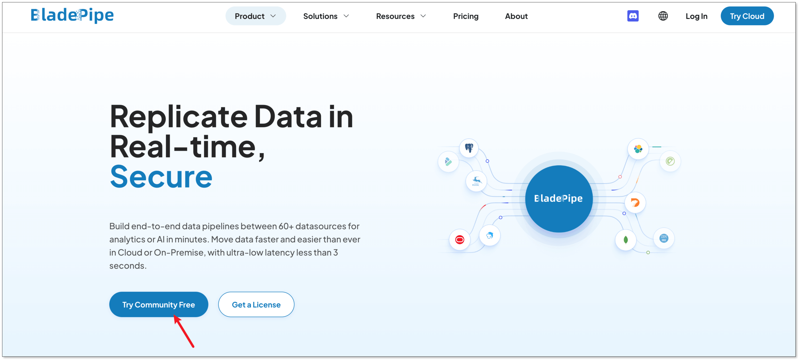
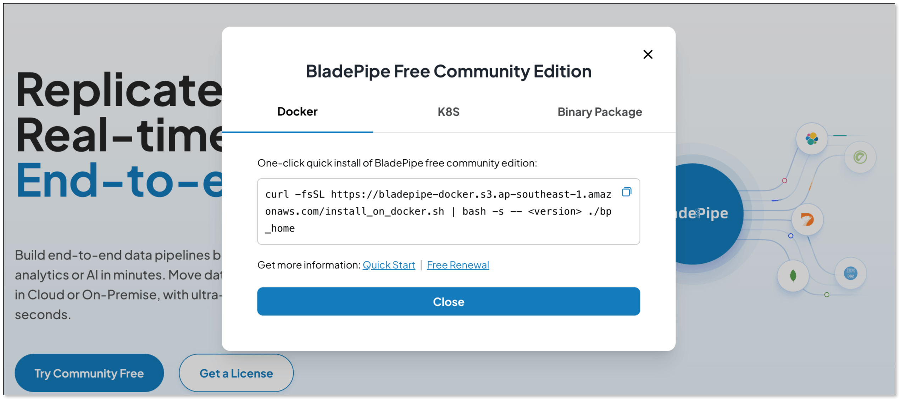
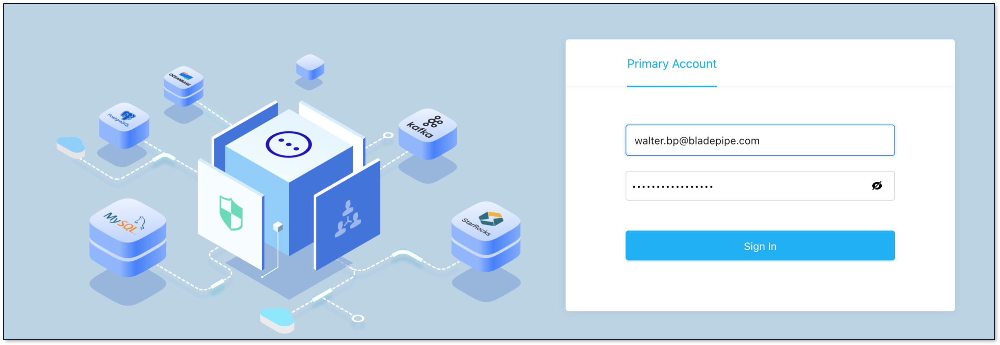
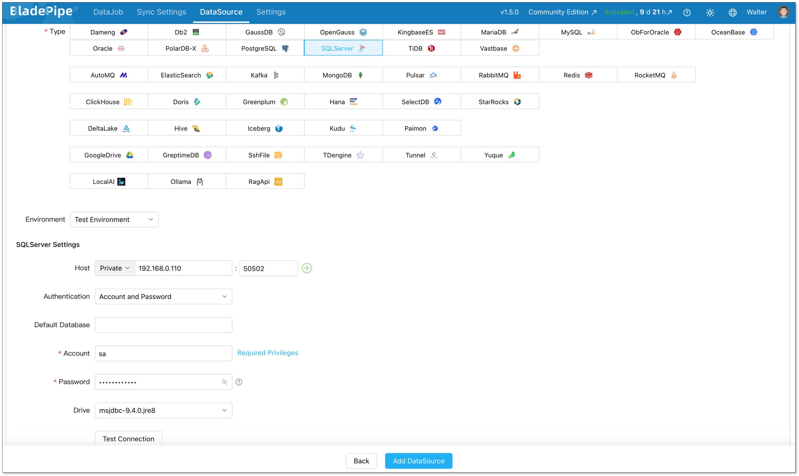
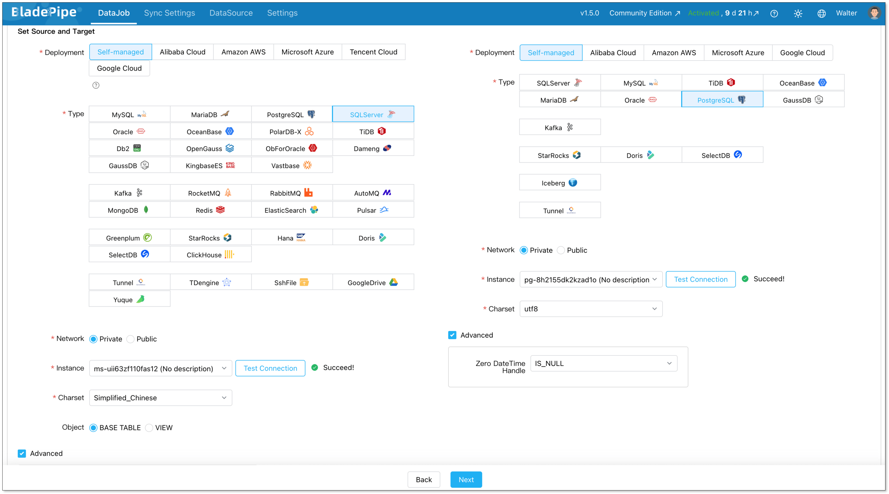
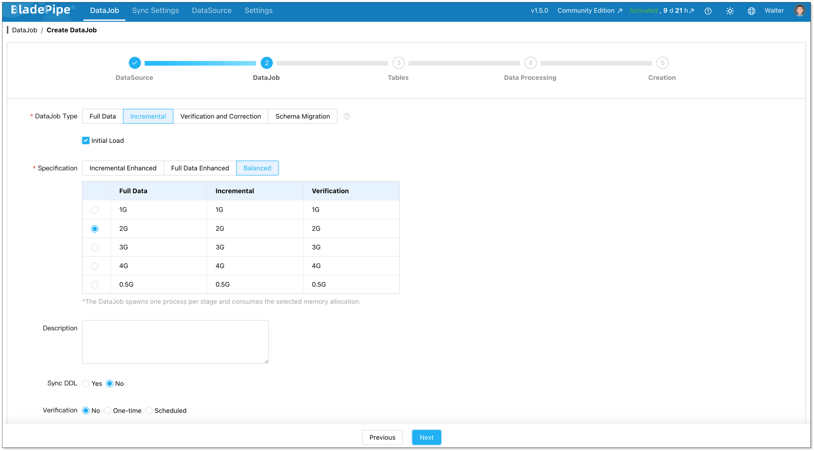
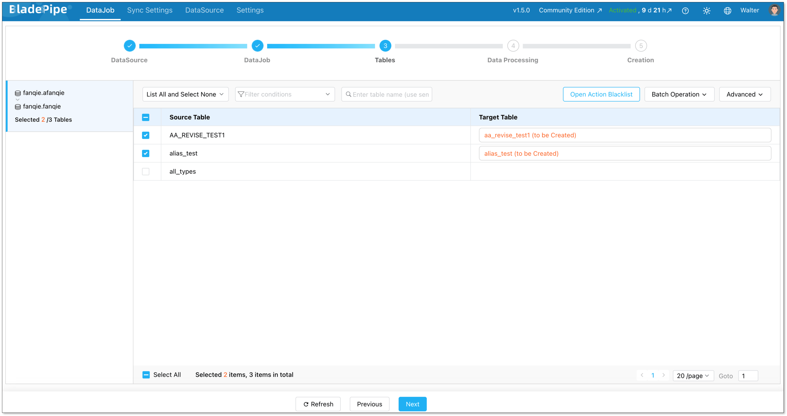
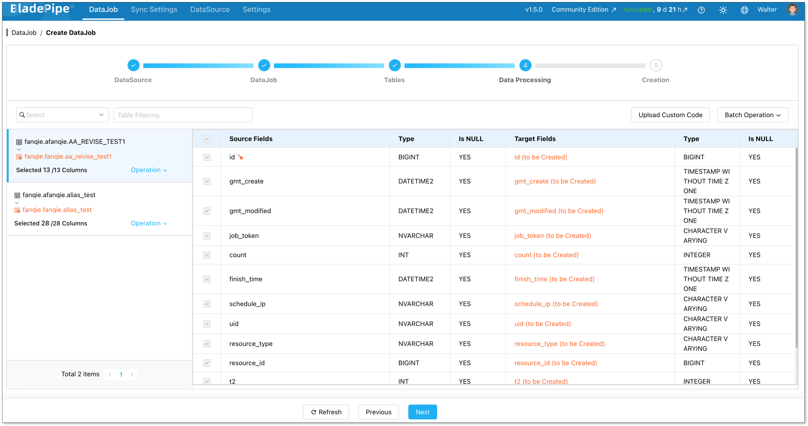
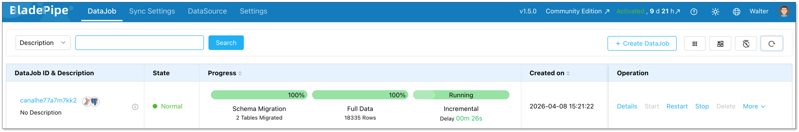

If you've been thinking about migrating from SQL Server to PostgreSQL, you're not alone. More and more teams are making the switch, whether it's to cut licensing costs, embrace open source, or get better flexibility in the cloud.

The decision isn't that hard. What’s harder is the migration. Moving data is one thing, but dealing with schema differences, and keeping systems running during the transition is where things get complex. 

This guide walks you through the real differences, common challenges, how to prepare before migration, and how to migrate step by step with confidence.

## Key Takeaways
+ SQL Server and PostgreSQL handle data types, syntax, and stored procedures differently, and these gaps are the main source of migration headaches.
+ You need a solid pre-migration assessment before touching any data.
+ CDC-based migration is the safest approach for production systems that can't afford downtime.
+ Tools like BladePipe can handle schema conversion, full load, and live replication automatically, cutting migration time from weeks to days or even hours.

## SQL Server vs. PostgreSQL: What’s Really Different?
While both are ACID-compliant relational databases, their underlying philosophies differ significantly. But here you don't need a deep-dive comparison of every feature. What matters for migration are the specific things that will break or behave differently when you switch.

### Data Type Mapping
Data types don't map 1:1. The differences need to be mapped carefully during schema conversion. Some typical differences include:

| **SQL Server** | **PostgreSQL Equivalent** |
| --- | --- |
| `TINYINT` | `SMALLINT` |
| `DECIMAL / NUMERIC` | `NUMERIC` |
| `FLOAT / REAL` | `DOUBLE PRECISION / REAL` |
| `MONEY / SMALLMONEY` | `NUMERIC(19,4)` |
| `CHAR / NCHAR` | `CHAR / BPCHAR` |
| `VARCHAR / NVARCHAR` | `VARCHAR` |
| `VARCHAR(MAX) / TEXT` | `TEXT` |
| `DATETIME / DATETIME2` | `TIMESTAMP` |
| `DATETIMEOFFSET` | `TIMESTAMPTZ` |
| `BINARY / VARBINARY` | `BYTEA` |
| `BIT` | `BOOLEAN` |
| `JSON (String)` | `JSONB` |


### Case Sensitivity
SQL Server is case-insensitive by default. PostgreSQL is case-sensitive for identifiers. That means a table called `UserData` and a column called `userdata` are the same thing in SQL Server, but two different things in PostgreSQL. This trips up a lot of teams.

### T-SQL vs. PL/pgSQL
SQL Server uses Transact-SQL (T-SQL), which has its own functions, syntax, and procedural language. PostgreSQL uses PL/pgSQL. Stored procedures, triggers, and functions will need to be rewritten, not just copied.

### Identity & Auto-increment 
SQL Server uses the `IDENTITY` property on a column. PostgreSQL historically used `SERIAL`, which creates an implicit sequence object. Modern PostgreSQL (10+) now supports the SQL standard `GENERATED BY DEFAULT AS IDENTITY`, which is much closer to the SQL Server behavior and recommended for new migrations.

## Migration Challenges 
To have a smooth migration, it's better to identify the possible pitfalls in advance. Here are some common challenges you should expect:

+ **Schema conversion errors.** Automated tools can convert most of your schema, but stored procedures and complex views often need manual review. Assuming 100% automation is risky.
+ **Data type mismatches causing silent failures.** Sometimes data loads without errors, but numeric precision is lost or string lengths are truncated. This is especially risky for financial or scientific data.
+ **Application-level SQL breaks.** Your application code likely contains SQL that was written for SQL Server. Queries using T-SQL functions like `GETDATE()`, `ISNULL()`, or `TOP` need to be updated to their PostgreSQL equivalents.
+ **Downtime risk.** If you migrate everything at once (a "big bang" approach), your system needs to be offline during the migration window. For production systems, this can be unacceptable.
+ **Post-migration performance differences.** The query optimizer in PostgreSQL works differently. Queries that were fast in SQL Server might need new indexes or rewritten joins to perform well in PostgreSQL.

## Pre-Migration Checklist
The challenges above are well understood. The good news is that most of them are preventable with the right preparation upfront.

Work through this checklist before you touch the data in production.

+ **Audit your schema thoroughly.** List all tables, views, stored procedures, functions, and triggers. Note anything that uses T-SQL-specific syntax.
+ **Identify unsupported data types.** Look for `XML`, `HIERARCHYID`, `GEOGRAPHY`, or `GEOMETRY` columns. These need special handling in PostgreSQL.
+ **Review your application SQL.** Search your codebase for SQL Server-specific functions and syntax. Make a list of what needs to be rewritten.
+ **Define your downtime budget.** How long can your system be offline? This determines whether you go with a simple dump-and-restore approach or a CDC-based live migration.
+ **Set up a test environment.** Never run a migration directly in production on the first try. Spin up a PostgreSQL instance and run your migration there first.
+ **Plan your rollback.** Know exactly what you'll do if something goes wrong. Have a backup strategy ready before you start.

## Common Migration Approaches
There are two main ways to approach the actual migration.

### Manual Migration
This is the straightforward approach. You export your data from SQL Server, convert the schema, and import everything into PostgreSQL.

It works well for smaller databases or non-critical systems where some downtime is acceptable. Tools like `pg_dump`, `pgloader`, or manual scripts are commonly used here.

The downside is that your source system needs to be paused during the migration to avoid data loss. For active production databases, this can mean hours of downtime.

### CDC-Based Migration
CDC is the smarter approach for live production systems. Instead of doing a one-time export, [CDC](https://www.bladepipe.com/blog/data_insights/change_data_capture_cdc/) continuously captures every change happening in SQL Server and replicates it to PostgreSQL in near real-time.

Here's how it works in practice. You do an initial bulk load of your existing data. After that, CDC kicks in and captures all new inserts, updates, and deletes as they happen. Once PostgreSQL is caught up to SQL Server, you cut over your application with minimal downtime, often just seconds.

CDC tools read from [SQL Server](https://www.bladepipe.com/blog/data_insights/sql_server_change_data_capture/)'s transaction log to capture every change without impacting source system performance.

This approach is ideal for those who can't afford downtime, but it is more complex to set up. You'd need to configure log-based replication, handle schema mapping, monitor lag, and manage cutover yourself. For most teams, that's a significant operational burden. 

### Which approach should you use?
If your database is small and downtime is acceptable, manual migration is fine. But if you're running a production system that people depend on, CDC is the way to go.

The challenge is that setting up CDC from scratch takes real effort. That's where a tool like BladePipe comes in. It handles the full CDC pipeline for you, from schema conversion and initial load to live replication and cutover monitoring, without requiring you to wire everything together manually.

The next section walks through exactly how to do it.

## Step-by-Step Guide with BladePipe
BladePipe automates the CDC-based migration process end to end. Instead of manually configuring replication, managing schema mapping, and writing cutover scripts, you get a guided pipeline that handles all of it.

Here's how to run your migration.

### Step 1: Install BladePipe
Go to [BladePipe website](https://www.bladepipe.com/), and click **Try Community Free**.



BladePipe now supports deployment on [Docker](https://www.bladepipe.com/docs/productOP/onPremise/installation/install_all_in_one_docker/), [K8s](https://www.bladepipe.com/docs/productOP/onPremise/installation/install_all_in_one_k8s/) or through a [binary package](https://www.bladepipe.com/docs/productOP/onPremise/installation/install_all_in_one_binary/). According to your case, select one of them.

Copy the script and paste it in your terminal.



Wait for BladePipe to be installed, and you can see:

```sql
███████╗██╗   ██╗ ██████╗ ██████╗███████╗███████╗███████╗
██╔════╝██║   ██║██╔════╝██╔════╝██╔════╝██╔════╝██╔════╝
███████╗██║   ██║██║     ██║     █████╗  ███████╗███████╗
╚════██║██║   ██║██║     ██║     ██╔══╝  ╚════██║╚════██║
███████║╚██████╔╝╚██████╗╚██████╗███████╗███████║███████║
╚══════╝ ╚═════╝  ╚═════╝ ╚═════╝╚══════╝╚══════╝╚══════╝

BladePipe for Docker is ready! visit console http://{ip}:8111 in an web explorer and have fun :)
```

Once installed, access the BladePipe console and prepare to configure your source and target databases.

+ Web: http://`${ip}`:8111
+ Account: `walter.bp@bladepipe.com`
+ Password: `bp_onpremise_2024`



### Step 2: Add DataSources
Go to **DataSource** > [**Add DataSource**](https://www.bladepipe.com/docs/operation/datasource_manage/add_self_maintain_ds/), and create two data sources:

+ SQL Server (source)
+ PostgreSQL (destination)

Configure connector details:

+ **Deployment:** Self-managed
+ **Type:** SQL Server / PostgreSQL
+ **Host:** Database IP and host
+ **Authentication:** Choose the method and fill in the info.

Then verify that both connections are working correctly.



### Step 3: Build a Pipeline
Next, create a new data replication job.

Go to **DataJob** > [**Create DataJob**](https://www.bladepipe.com/docs/operation/job_manage/create_job/create_full_incre_task/). Then select the source and target DataSources, and click **Test Connection** for both.



For one-time migration, select **Full Data** for DataJob Type. For continuous replication, select **Incremental**, together with the **Initial Load** option.



Select the tables to be replicated.



Select the columns to be replicated.



Confirm the DataJob creation, and start to run the DataJob.




## Wrapping Up
Migrating from SQL Server to PostgreSQL is a real investment of time and effort. But for most teams, the long-term payoff in cost, flexibility, and ecosystem benefits is well worth it.

The key is to go in prepared. You have to know your schema, understand the differences, define your downtime budget, and test everything before you commit.

If you want to skip the manual heavy lifting and reduce migration risk, BladePipe can handle the schema conversion, full load, and CDC replication for you. [Try it now for free](https://www.bladepipe.com/pricing/) to see how data flows from SQL Server to PostgreSQL in minutes.

## FAQ
**Q: How long does a SQL Server to PostgreSQL migration take?**

It depends heavily on your database size and complexity. A small database with simple schemas can be migrated in a day. A large, complex production database with many stored procedures and heavy data volumes can take several weeks, including testing time.

You can try BladePipe, which can help you [start quickly](http://localhost:3000/docs/quick/quick_start/), usually in minutes.

**Q: How do I handle large databases (TB-level)?**

For large datasets, you need to optimize for parallel data loading, network throughput and incremental sync during migration. A phased approach with CDC is essential to avoid long downtime windows.

**Q: Will the migration impact my source database performance?** 

If you adopt CDC-based approach, it rarely puts burden on your source database. It reads from transaction logs, which is significantly lighter than running frequent `SELECT` queries, minimizing the impact on your production SQL Server.
