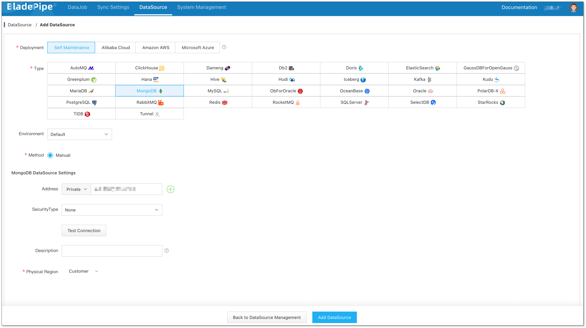
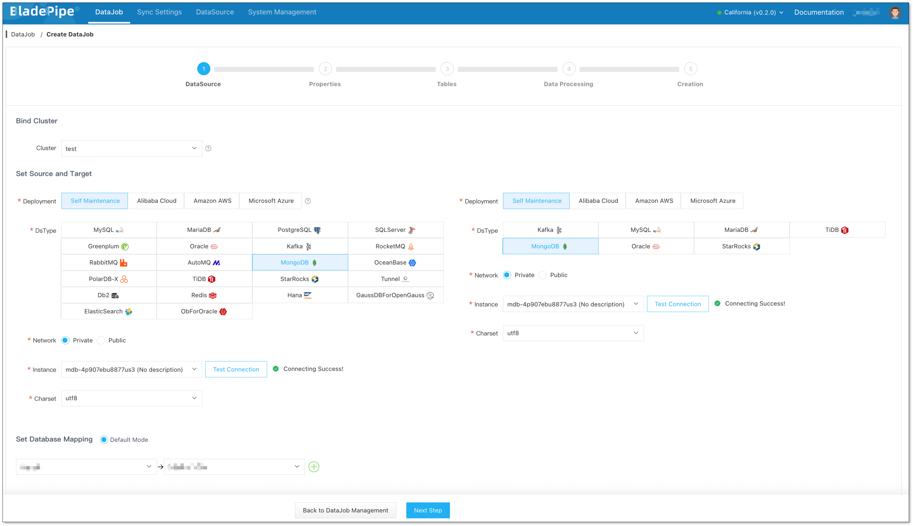
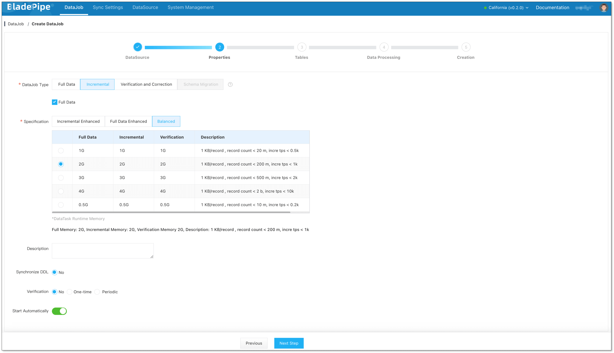
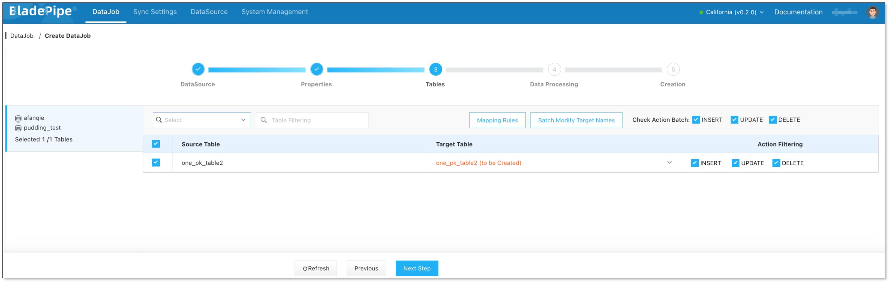
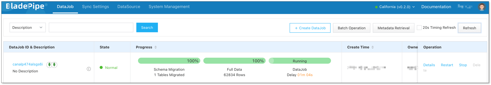

## Overview

MongoDB is a widely used document-oriented database known for its schema flexibility and strong scalability, making it suitable for a variety of use cases. 

This tutorial delves into how to quickly create a stable and efficient data pipeline from MongoDB to MongoDB using [BladePipe](https://www.bladepipe.com). In this tutorial, MongoDB instances are configured as replica sets.

## Highlights

### Sync Data from MongoDB

Incremental data in the source MongoDB can be obtained from the `oplog.rs` collection in the `local` database (replica sets are required).

An event includes the following subdocuments (there are slight differences in different MongoDB versions). BladePipe delivers the data changes by parsing event records:

| Subdocument Name | Description                                     |
| ----------------- | ------------------------------------------------------------ |
| op                | Operation type. BladePipe supports operations including c (control operation), i (INSERT), u (UPDATE), d (DELETE). |
| ns                | Namespace in the format of `dbName.collectionName`. If `collectionName` is `$cmd`, it indicates an operation on the corresponding database. |
| ts                | Timestamp of the operation, in seconds.                        |
| o                 | Changed data. It shows the mirroring of data after INSERT/UPDATE operations, and the mirroring of data before DELETE operations. Note that this subdocument in MongoDB 4.x is different from that in other versions. |
| o2                | Present only in UPDATE events. It can be regarded as the primary key or identifier for locating data. |

Now BladePipe supports data movement from **shards** and **replica sets** of **MongoDB**. The supported MongoDB version is **7.x** and below.

### Supported Data Types in MongoDB

In a full data migration from MongoDB or a data synchronization by consuming oplog, data type conversion is crucial for data processing with custom code and data write to target data sources. For this reason, BladePipe is iteratively expanding its support for MongoDB data types.

The supported data types in full data reading from MongoDB include: **null, ObjectId, Date, Number, String**.

The supported data types in incremental data synchronization from MongoDB oplog include: **ObjectId, Date, Number, String, Integer, Long, BigInteger, Double, BigDecimal**.

The supported data types are expanding along with the requests from the increasing users. 

## Procedure

### Step 1: Install BladePipe

Follow the instructions in [Install Worker (Docker)](https://www.bladepipe.com/docs/productOP/byoc/installation/install_worker_docker) or [Install Worker (Binary)](https://www.bladepipe.com/docs/productOP/byoc/installation/install_worker_binary) to download and install a BladePipe Worker.

### Step 2: Add DataSources

1. Log in to the [BladePipe Cloud](https://cloud.bladepipe.com).
2. Click **DataSource** > **Add DataSource**, and add 2 DataSources.
   

### Step 3: Create a DataJob

1. Click **DataJob** > [**Create DataJob**](https://doc.bladepipe.com/operation/job_manage/create_job/create_full_incre_task).

2. Select the source and target DataSources, and click **Test Connection** to ensure the connection to the source and target DataSources are both successful.
   
   
3. Select **Incremental** for DataJob Type, together with the **Full Data** option.
   
   
4. Select the collections to be replicated.
   
   
5. Confirm the DataJob creation.
   
   :::info
   The DataJob creation process involves several steps. Click **Sync Settings** > [**ConsoleJob**](https://doc.bladepipe.com/operation/job_setting/console_job_manage), find the DataJob creation record, and click **Details** to view it.
   
   The DataJob creation with a source MongoDB instance includes the following steps:
   - Schema Migration 
   - Allocation of DataJobs to BladePipe Workers 
   - Creation of DataJob FSM (Finite State Machine) 
   - Completion of DataJob Creation
   :::

6. Wait for the DataJob to automatically run.
   :::info
   Once the DataJob is created and started, BladePipe will automatically run the following DataTasks:
    - **Schema Migration**: The schemas of the source collections will be migrated to the target instance.
    - **Full Data Migration**: All existing data from the selected source collections will be fully migrated to the target instance.
    - **Incremental Synchronization**: Ongoing data changes will be continuously synchronized to the target instance.
   :::
  
    

