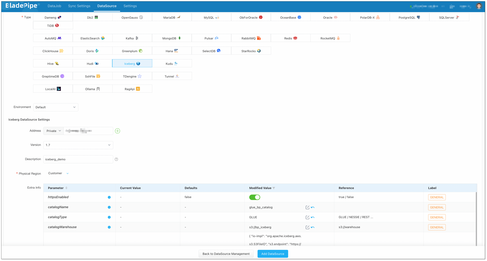
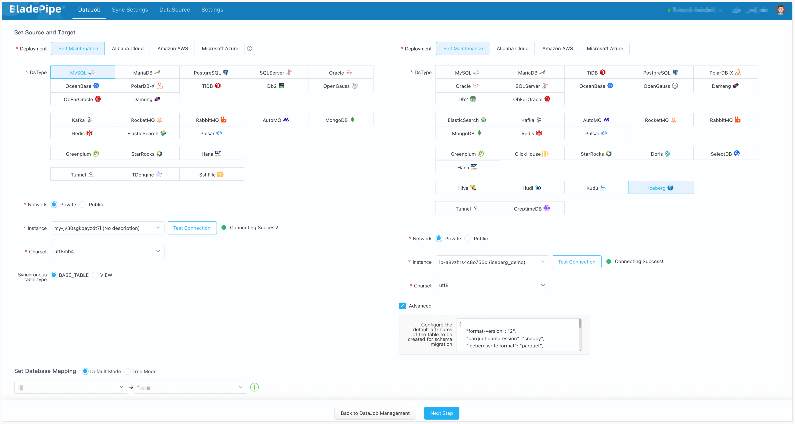
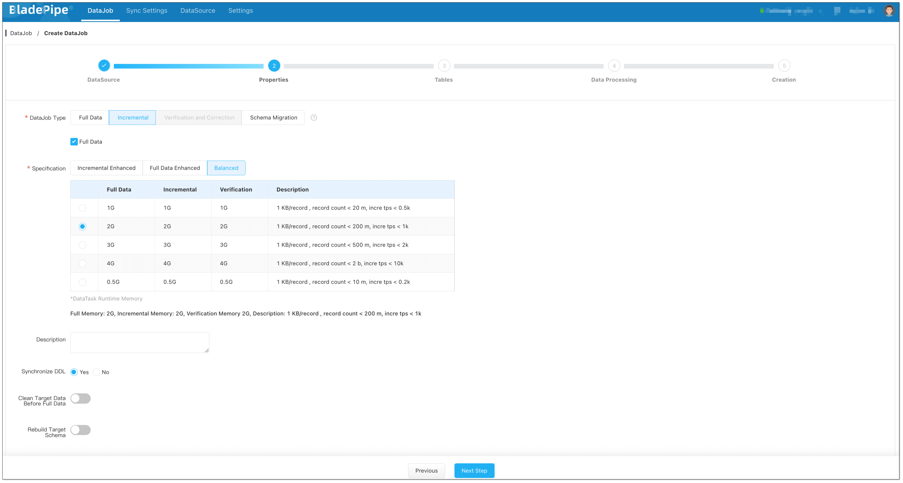
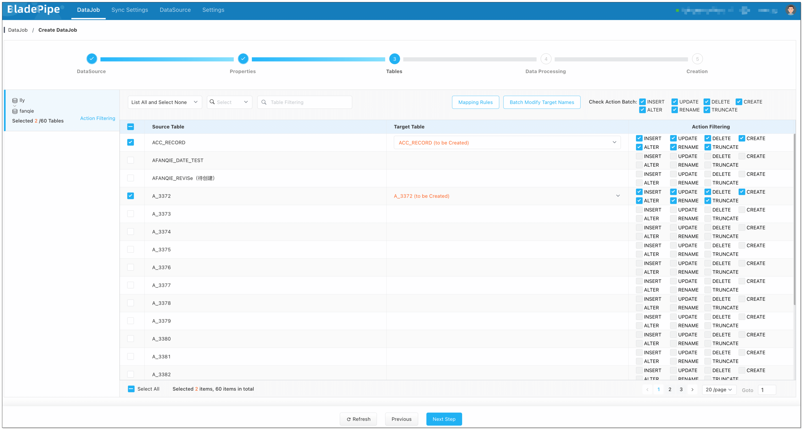
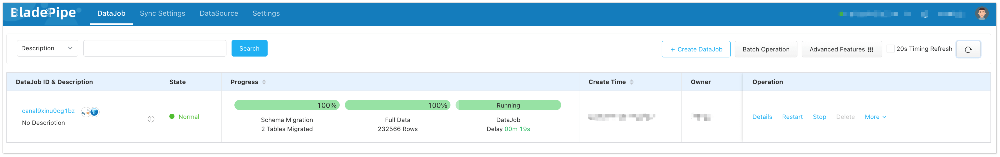
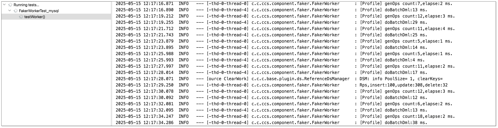
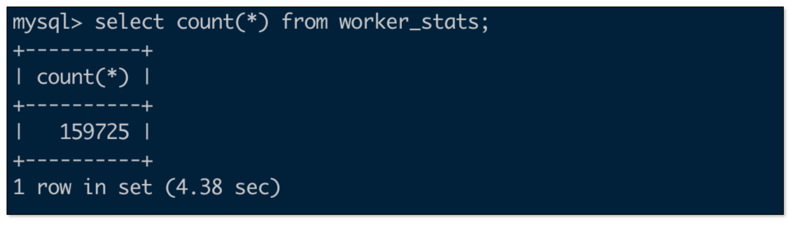

As companies deal with more data than ever before, the need for real-time, scalable, and low-cost storage becomes critical. That's where Apache Iceberg shines. In this post, I’ll walk you through how to build a real-time data sync pipeline from MySQL to Iceberg using [BladePipe](https://www.bladepipe.com)—a tool that makes data migration ridiculously simple.

Let’s dive in.

## Iceberg 

### What is Iceberg?

If you haven’t heard of Iceberg yet, it’s an open table format designed for large analytic datasets. It’s kind of like a smarter table format for your data lake—supporting schema evolution, hidden partitioning, ACID-like operations, and real-time data access.

It includes two key concepts:

- **Catalog**: Think of this as metadata—the table names, columns, data types, etc.
- **Data Storage**: Where the metadata and actual files are stored—like on S3 or HDFS.

### Why Iceberg?
Iceberg is open and flexible. It defines clear standards for catalog, file formats, data storage, and data access. This makes it widely compatible with different tools and services.

- **Catalogs**: AWS Glue, Hive, Nessie, JDBC, or custom REST catalogs.
- **File formats**: Parquet, ORC, Avro, etc.
- **Storage options**: AWS S3, Azure Blob, MinIO, HDFS, Posix FS, local file systems, and more.
- **Data access**: Real-time data warehouses like StarRocks, Doris, ClickHouse, or batch/stream processing engines like Spark, Flink, and Hive can all read, process and analyze Iceberg data.

Besides its openness, Iceberg strikes a good balance between large-scale storage and near real-time support for inserts, updates, and deletes.

Here’s a quick comparison across several database types:

| Database Type  | Relational DB  | Real-time Data Warehouse  | Traditional Big Data  | Data Lake |
| ------------ | -------------------|-------|----------- |------|
|  **Data Capacity**    |  Up to a few TBs    |  100+ TBs   | PB level   | PB level |
| **Real-time Support**     |  Millisecond-level latency, 10K+ QPS   | Second-to-minute latency, thousands QPS | Hour-to-day latency, very low QPS  |Minute-level latency, low QPS (batch write) |
| **Transactions**      | ACID compliant     |   ACID compliant or eventually consistent  |    No   | No |
| **Storage Cost**      |  High     |   High or very high |   Very low  | Low |
| **Openness**      | Low |  Medium(storage-compute decoupling)  | High |Very hcigh|

From this table, it’s clear that Iceberg offers **low cost**, **massive storage**, and **strong compatibility with analytics tools**—a good replacement for older big data systems.

And thanks to its open architecture, you can keep exploring new use cases for it.

## Why BladePipe?
Setting up Iceberg sounds great—until you realize how much work it takes to actually migrate and sync data from your transactional database. That’s where BladePipe comes in.

### Supported Catalogs and Storage

BladePipe currently supports 3 Iceberg catalogs and 2 storage backends:

- AWS Glue + AWS S3
- Nessie + MinIO / AWS S3
- REST Catalog + MinIO / AWS S3

For a fully cloud-based setup: Use AWS RDS + EC2 to deploy BladePipe + AWS Glue + AWS S3.

For an on-premise setup: Use a self-hosted relational database + On-Premise deployment of BladePipe + Nessie or REST catalog + MinIO.

### One-Stop Data Sync

Before data replication, there's often a lot of manual setup. BladePipe takes care of that for you—automatically handling schema mapping, historical data migration, and other preparation.

Even though Iceberg isn't a traditional database, BladePipe supports an automatic data sync process, including converting schemas, mapping data types, adapting field lengths, cleaning constraints, etc. Everything happens in BladePipe.

## Procedures
In this post, we’ll use:

- Source: MySQL (self-hosted)
- Target: Iceberg backed by AWS Glue + S3
- Sync Tool: [BladePipe (Cloud)](https://www.bladepipe.com)

Let’s go step-by-step.


### Step 1: Install BladePipe
Follow the instructions in [Install Worker (Docker)](https://doc.bladepipe.com/productOP/byoc/installation/install_worker_docker) or [Install Worker (Binary)](https://doc.bladepipe.com/productOP/byoc/installation/install_worker_binary) to download and install a BladePipe Worker.

### Step 2: Add DataSources

1. Log in to the [BladePipe Cloud](https://cloud.bladepipe.com).
2. Click **DataSource** > **Add DataSource**.
3. Add two sources – one MySQL, one Iceberg. For Iceberg, fill in the following (replace `<...>` with your values):
  - **Address**: Fill in the AWS Glue endpoint.
    ```text
    glue.<aws_glue_region_code>.amazonaws.com
    ```
  - **Version**: Leave as default.
  - **Description**: Fill in meaningful words to help identify it.
  - **Extra Info**:
    - **httpsEnabled**: Enable it to set the value as true.
    - **catalogName**: Enter a meaningful name, such as glue_&lt;biz_name&gt;_catalog.
    - **catalogType**: Fill in GLUE.
    - **catalogWarehouse**: The place where metadata and files are stored, such as s3://&lt;biz_name&gt;_iceberg.
    - **catalogProps**:
    ```json
    {
      "io-impl": "org.apache.iceberg.aws.s3.S3FileIO",
      "s3.endpoint": "https://s3.<aws_s3_region_code>.amazonaws.com",
      "s3.access-key-id": "<aws_s3_iam_user_access_key>",
      "s3.secret-access-key": "<aws_s3_iam_user_secret_key>",
      "s3.path-style-access": "true",
      "client.region": "<aws_s3_region>",
      "client.credentials-provider.glue.access-key-id": "<aws_glue_iam_user_access_key>",
      "client.credentials-provider.glue.secret-access-key": "<aws_glue_iam_user_secret_key>",
      "client.credentials-provider": "com.amazonaws.glue.catalog.credentials.GlueAwsCredentialsProvider"
    }
    ```
  
    


### Step 3: Create a DataJob
1. Go to **DataJob** > [**Create DataJob**](https://doc.bladepipe.com/operation/job_manage/create_job/create_full_incre_task).
2. Select the source and target DataSources, and click **Test Connection** for both. Here's the recommended Iceberg structure configuration:  
    ```json
    {
      "format-version": "2",
      "parquet.compression": "snappy",
      "iceberg.write.format": "parquet",
      "write.metadata.delete-after-commit.enabled": "true",
      "write.metadata.previous-versions-max": "3",
      "write.update.mode": "merge-on-read",
      "write.delete.mode": "merge-on-read",
      "write.merge.mode": "merge-on-read",
      "write.distribution-mode": "hash",
      "write.object-storage.enabled": "true",
      "write.spark.accept-any-schema": "true"
    }
    ```
    
    :::info
    If the test hangs, try refreshing and selecting the data source again. It might be a network or configuration issue.
    :::
3. Select **Incremental** for DataJob Type, together with the **Full Data** option.
  
    :::info
    Use at least the 1 GB or 2 GB DataJob specification. Smaller specification may hit memory issues with large batches.
    :::
4. Select the tables to be replicated.
  
    :::info
    It’s best to stay under 1000 tables per DataJob.
    :::
5. Select the columns to be replicated.
6. Confirm the DataJob creation, and start to run the DataJob.
  

### Step 4: Test & Verify
1. Generate some insert/update/delete operations on MySQL
   
2. Stop data generation.
3. Set up a pay-as-you-go Aliyun EMR for StarRocks, add the AWS Glue Iceberg catalog, and run queries.
  - In StarRocks, add the external catalog:
     ```sql
     CREATE EXTERNAL CATALOG glue_test
     PROPERTIES
     (
       "type" = "iceberg",
       "iceberg.catalog.type" = "glue",
       "aws.glue.use_instance_profile" = "false",
       "aws.glue.access_key" = "<aws_glue_iam_user_access_key>",
       "aws.glue.secret_key" = "<aws_glue_iam_user_secret_key>",
       "aws.glue.region" = "ap-southeast-1",
       "aws.s3.use_instance_profile" = "false",
       "aws.s3.access_key" = "<aws_s3_iam_user_access_key>",
       "aws.s3.secret_key" = "<aws_s3_iam_user_secret_key>",
       "aws.s3.region" = "ap-southeast-1"
     )

    set CATALOG glue_test;
    
    set global new_planner_optimize_timeout=30000;
    ```

  - MySQL row count
   
     

  - Iceberg row count
   
     


## Summary

Building a robust, real-time data pipeline from MySQL to Iceberg used to be a heavy lift. With tools like [BladePipe](https://www.bladepipe.com), it becomes as easy as clicking through a setup wizard.

Whether you're modernizing your data platform or experimenting with lakehouse architectures, this combo gives you a low-cost, high-scale option to play with.
