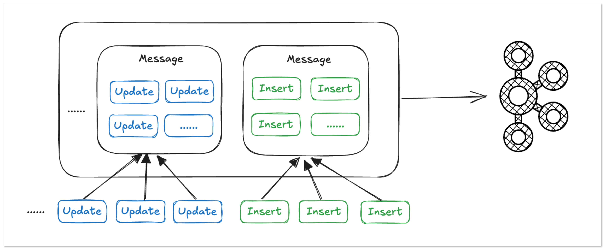
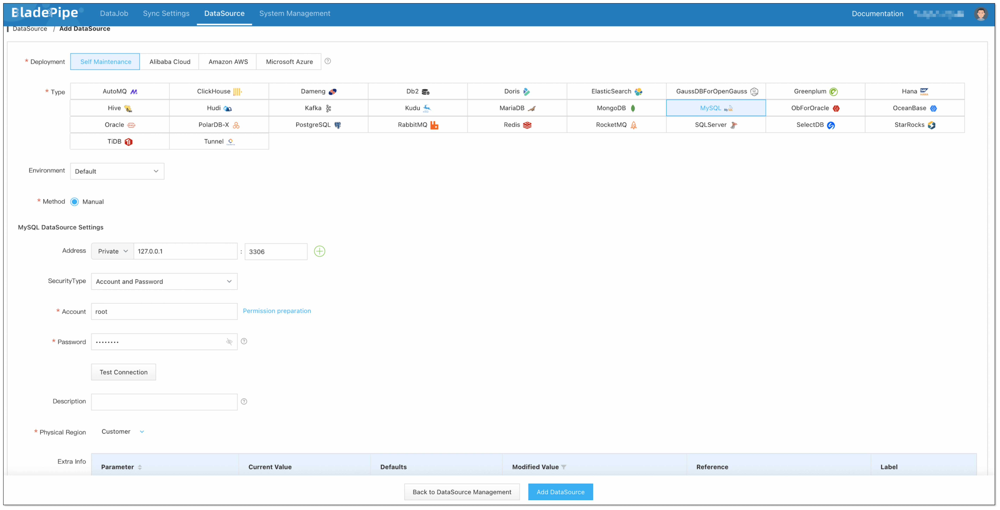
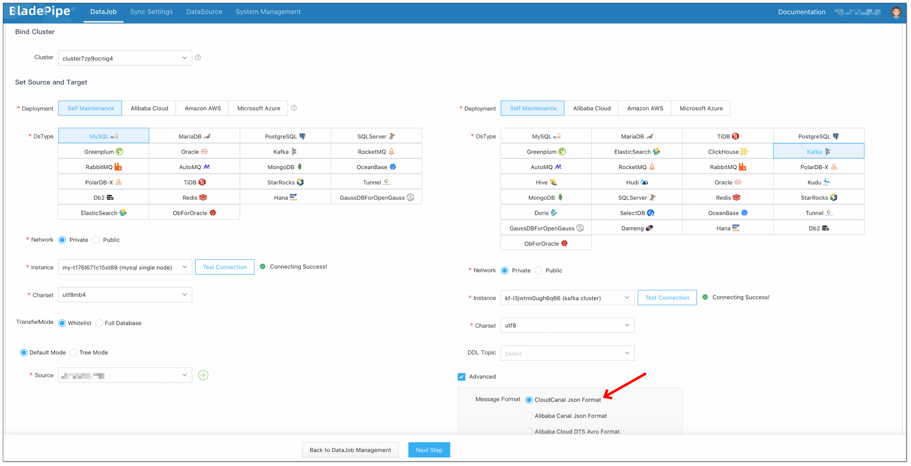
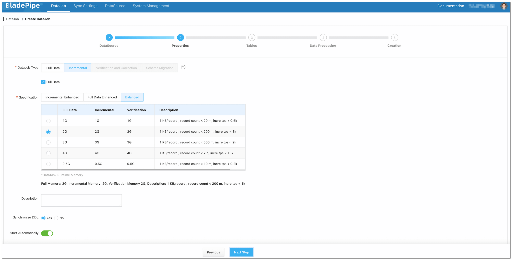
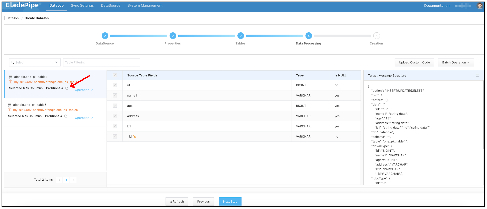
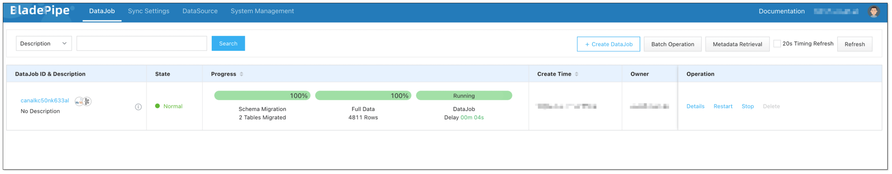

## Overview
In the age of AI, Apache Kafka is becoming a pivotal force due to its high-performance in real-time data streaming and processing. Many organizations are seeking to integrate data to Kafka for an enhanced efficiency and business agility. In this case, a powerful tool for data movement is of great importance. BladePipe is one of the excellent choices.

This tutorial describes how to move data from MySQL to Kafka with [BladePipe](https://www.bladepipe.com), using the CloudCanal Json Format by default. The key features of the pipeline include: 

- Support [multiple message formats](https://www.bladepipe.com/docs/reference/kafka_msg_format_type/).
- Support DDL synchronization. You can configure the topic to which the DDL operations are written.
- Support automatic topic creation.

## Highlights

### Automatic Topic Creation

The topics can be automatically created in the target Kafka during the DataJob creation. Besides, you can configure the number of partitions based on your needs.

### Batch Writing of Data

In BladePipe, the same type of operations on the same table are merged into a single message, enabling batch writing of data and reducing bandwidth usage. Thus, the data processing efficiency is significantly increased.

### Resumable DataJob
Resumability is essential for the synchronization of large tables with billions of records.

By regularly recording the offsets, BladePipe allows resuming Full Data and Incremental DataTasks from the last offset after they are restarted, thus minimizing the impact of unexpected pauses on progress.

## Procedure

### Step 1: Install BladePipe
Follow the instructions in [Install Worker (Docker)](https://www.bladepipe.com/docs/productOP/byoc/installation/install_worker_docker/) or [Install Worker (Binary)](https://www.bladepipe.com/docs/productOP/byoc/installation/install_worker_binary/) to download and install a BladePipe Worker.
### Step 2: Add DataSources
1. Log in to the [BladePipe Cloud](https://cloud.bladepipe.com).
2. Click **DataSource** > **Add DataSource**.
3. Select the source and target DataSource type, and fill out the setup form.
   

### Step 3: Create a DataJob
1. Click **DataJob** > [**Create DataJob**](https://www.bladepipe.com/docs/operation/job_manage/create_job/create_full_incre_task/).
2. Select the source and target DataSources, and click **Test Connection** to ensure the connection to the source and target DataSources are both successful.   
In the **Advanced** configuration of the target DataSource, choose **CloudCanal Json Format** for Message Format.
   
   
3. Select **Incremental** for DataJob Type, together with the **Full Data** option.
   
   
4. Select the tables and columns to be replicated. When selecting the columns, you can configure the number of partitions in the target topics.
   
   
5. Confirm DataJob creation.
   :::info
   The DataJob creation process involves several steps. Click **Sync Settings** > [**ConsoleJob**](https://www.bladepipe.com/docs/operation/job_setting/console_job_manage/), find the DataJob creation record, and click **Details** to view it.

   The DataJob creation with a source MySQL instance includes the following steps:

   - Schema Migration
   - Allocation of DataJobs to BladePipe Workers
   - Creation of DataJob FSM (Finite State Machine)
   - Completion of DataJob Creation
   :::

6. Now the DataJob is created and started. BladePipe will automatically run the following DataTasks:
   - **Schema Migration**: The schemas of the source tables will be migrated to the target database.
   - **Full Data Migration**: All existing data from the source tables will be fully migrated to the target database.
   - **Incremental Data Synchronization**: Ongoing data changes will be continuously synchronized to the target instance.
   
   

## FAQ

### What other source DataSources does BladePipe support?

Currently, you can create a connection from MySQL, Oracle, SQL Server, PostgreSQL and MongoDB to Kafka. If you have any other requests, please give us feedbacks in the [community](https://bladepipehq.slack.com/join/shared_invite/zt-2sh9op2yo-JIsDrstycVMdKM4auCTm8g#/shared-invite/email).