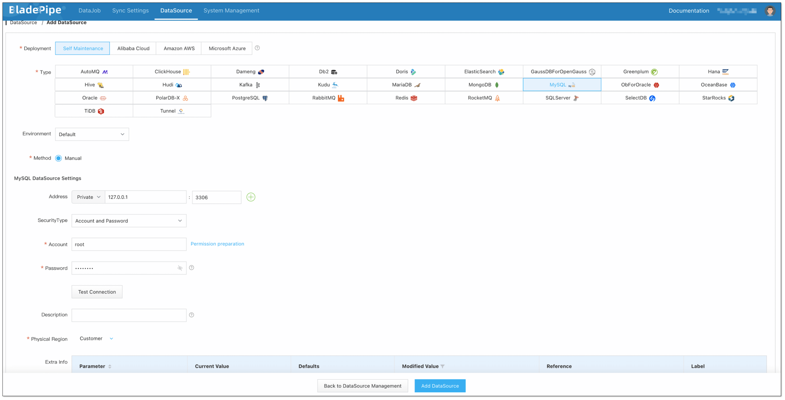
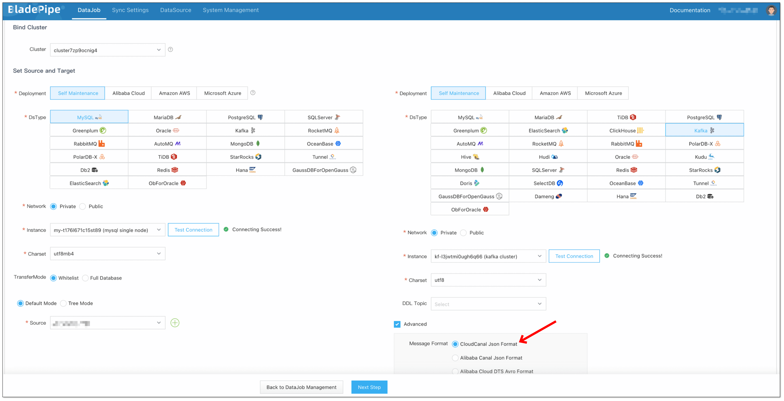
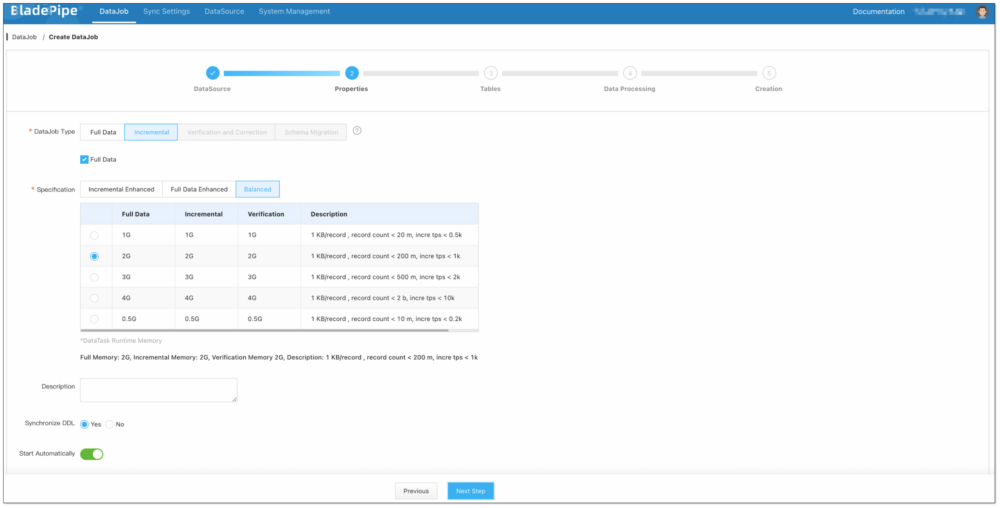
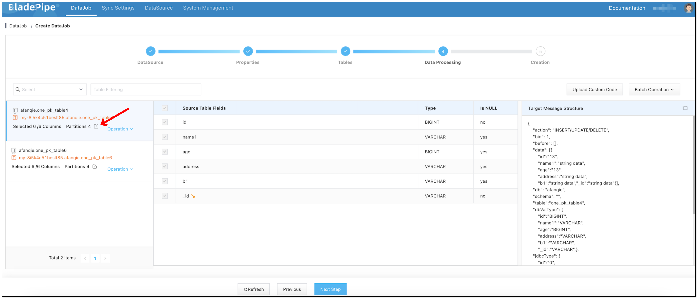
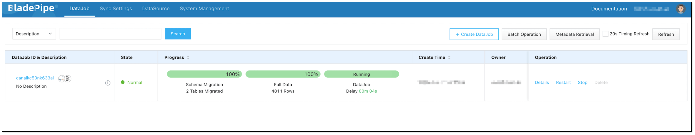
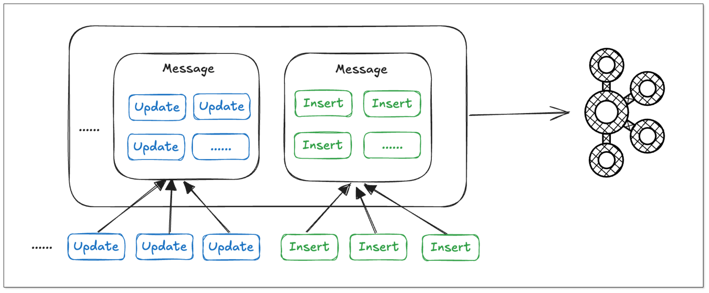

## Overview

If you need to move transactional data from [MySQL](/connector/mysql/) into [Apache Kafka](../data_insights/do_you_really_need_kafka.md) in real time, you are usually building a **MySQL to Kafka CDC** pipeline.

The goal is not just to copy rows once. A production pipeline normally needs to:

- Load existing MySQL data into Kafka as an initial snapshot
- Capture ongoing inserts, updates, and deletes from the MySQL binlog
- Publish changes to Kafka topics in a format downstream consumers can parse
- Resume from the last checkpoint after failures or restarts
- Handle schema changes, topic creation, ordering, and monitoring

This guide explains how MySQL-to-Kafka streaming works, compares a custom Debezium/Kafka Connect approach with a managed CDC pipeline, and walks through how to create a MySQL-to-Kafka DataJob with [BladePipe](https://www.bladepipe.com).

<!-- truncate -->

## Why Stream MySQL Data to Kafka?

MySQL is often the system of record for orders, accounts, payments, inventory, or user activity. Kafka is commonly used as the event backbone for analytics, search indexing, caches, microservices, lakehouse ingestion, and AI data pipelines.

Streaming MySQL changes to Kafka helps teams:

- Feed downstream systems without repeatedly querying production MySQL
- Reduce latency compared with scheduled batch ETL jobs
- Decouple application databases from consumers
- Build event-driven workflows from database changes
- Reuse the same change stream for analytics, search, cache refresh, and alerting

For a broader explanation of the capture layer, see [MySQL CDC](../data_insights/mysql_cdc.md) and [Change Data Capture](../data_insights/change_data_capture_cdc.md).

## How MySQL to Kafka CDC Works

A reliable MySQL-to-Kafka pipeline usually has two stages.

| Stage | What Happens | Why It Matters |
| :--- | :--- | :--- |
| Initial load | The existing rows in selected MySQL tables are read and written to Kafka. | Kafka consumers get the current table state before consuming live changes. |
| Incremental CDC | New inserts, updates, and deletes are captured from the MySQL binlog and delivered to Kafka continuously. | Downstream systems stay fresh without running full reloads. |

The key technical boundary is the handoff between the initial load and incremental CDC. The pipeline needs a consistent starting point, so it can finish the snapshot and then continue reading binlog events without missing or duplicating data in a way that breaks downstream logic.

A typical MySQL-to-Kafka architecture looks like this:

```text
MySQL tables
  -> initial snapshot
  -> MySQL binlog CDC
  -> change event formatter
  -> Kafka topics
  -> downstream consumers
```

## Method 1: Build with Debezium and Kafka Connect

One common open source path is to use [Debezium](../data_insights/debezium_alternatives.md) with Kafka Connect. Debezium reads MySQL binlog events and emits change events to Kafka topics.

This approach is a good fit when your team already operates Kafka Connect and wants full control over connectors, converters, schema registry, topic naming, and deployment details.

### Prepare MySQL for Binlog CDC

For log-based CDC, MySQL must write row-level changes to the binary log. A typical configuration includes:

```ini
[mysqld]
server-id=223344
log_bin=mysql-bin
binlog_format=ROW
binlog_row_image=FULL
binlog_expire_logs_seconds=604800
```

You also need a MySQL user with the privileges required to read table data and binlog events. The exact privilege policy depends on your security model and MySQL version, but a CDC user commonly needs permission to read selected tables, inspect replication state, and consume binary logs.

You can refer to BladePipe's [required privileges for MySQL](/docs/dataMigrationAndSync/datasource_func/MySQL/privs_for_mysql/) when preparing the source database for a managed pipeline.

### Configure a MySQL Source Connector

A simplified Debezium connector configuration often includes:

```json
{
  "name": "mysql-inventory-connector",
  "config": {
    "connector.class": "io.debezium.connector.mysql.MySqlConnector",
    "database.hostname": "mysql",
    "database.port": "3306",
    "database.user": "cdc_user",
    "database.password": "your_password",
    "database.server.id": "184054",
    "topic.prefix": "mysql",
    "database.include.list": "inventory",
    "table.include.list": "inventory.orders,inventory.customers",
    "schema.history.internal.kafka.bootstrap.servers": "kafka:9092",
    "schema.history.internal.kafka.topic": "schema-changes.inventory"
  }
}
```

After the connector starts, it performs a snapshot if configured to do so, then streams MySQL binlog changes into Kafka.

### What You Need to Operate Yourself

The custom path is flexible, but it also means your team owns the operational details:

- Kafka Connect cluster deployment and upgrades
- Connector task failures and restarts
- Snapshot progress and binlog offset management
- Topic naming, partitioning, retention, and compaction policies
- Message format compatibility with consumers
- Schema history and schema evolution
- Monitoring, alerting, and backpressure handling

For prototypes, this is often acceptable. For production data movement, the operational work can become the larger part of the project.

## Method 2: Use BladePipe for a Managed MySQL-to-Kafka Pipeline

The second method is to use a managed CDC platform that already handles full load, incremental sync, Kafka delivery, message formatting, topic creation, and resumability.

In the following procedure, we use [BladePipe](https://www.bladepipe.com) to create a MySQL-to-Kafka pipeline. The example uses **CloudCanal Json Format** by default, and BladePipe also supports [multiple Kafka message formats](/docs/reference/kafka_msg_format_type/).

BladePipe supports:

- **Full load plus incremental sync** in one DataJob
- **DDL synchronization**, with configurable topics for DDL operations
- **Automatic Kafka topic creation** during DataJob creation
- **Batch writing**, where operations on the same table can be merged to improve delivery efficiency
- **Resumable DataJobs**, so full and incremental tasks can continue from recorded offsets after restarts

### Before You Start

Before creating the DataJob, make sure you have:

- A reachable MySQL instance with binlog-based CDC prepared
- A reachable Kafka cluster with the required topics or permission to create topics
- A BladePipe Worker that can connect to both MySQL and Kafka
- A decision on message format, topic naming, partition count, and downstream consumer expectations

## Step-by-Step: Create a MySQL-to-Kafka DataJob in BladePipe

### Step 1: Install BladePipe

Install a BladePipe Worker by following one of these guides:

- [Install Worker with Docker](https://www.bladepipe.com/docs/productOP/byoc/installation/install_worker_docker/)
- [Install Worker with Binary](https://www.bladepipe.com/docs/productOP/byoc/installation/install_worker_binary/)

For a fast evaluation, Docker is usually the shortest path.

### Step 2: Add MySQL and Kafka DataSources

1. Log in to [BladePipe Cloud](https://cloud.bladepipe.com).
2. Click **DataSource** > **Add DataSource**.
3. Add MySQL as the source DataSource.
4. Add Kafka as the target DataSource.



At this stage, fill in host, port, authentication details, and advanced connection parameters required by your environment.

### Step 3: Create the MySQL-to-Kafka DataJob

1. Click **DataJob** > [**Create DataJob**](https://www.bladepipe.com/docs/operation/job_manage/create_job/create_full_incre_task/).
2. Select MySQL as the source and Kafka as the target.
3. Click **Test Connection** for both sides.
4. In the **Advanced** configuration of the target DataSource, choose **CloudCanal Json Format** for **Message Format**.



### Step 4: Select Initial Load and Incremental Sync

Select **Incremental** for the DataJob type, together with the **Full Data** option.

This creates a pipeline that first writes existing MySQL rows to Kafka and then continues to stream ongoing binlog changes.



### Step 5: Select Tables, Columns, and Topic Settings

Select the MySQL tables and columns to replicate. When selecting columns, you can also configure the number of partitions for the target Kafka topics.



Automatic topic creation can be useful when you want BladePipe to create target Kafka topics during DataJob creation. You can configure the number of partitions based on expected throughput and consumer parallelism.

### Step 6: Confirm DataJob Creation

Confirm the DataJob creation.

:::info
The DataJob creation process involves several steps. Click **Sync Settings** > [**ConsoleJob**](https://www.bladepipe.com/docs/operation/job_setting/console_job_manage/), find the DataJob creation record, and click **Details** to view it.

For a MySQL-to-Kafka DataJob, creation usually includes:

- Schema migration
- Allocation of DataJobs to BladePipe Workers
- Creation of the DataJob FSM (Finite State Machine)
- Completion of DataJob creation
:::

### Step 7: Monitor the Running Pipeline

After the DataJob is created and started, BladePipe automatically runs the required DataTasks:

- **Schema Migration**: Prepare schema-related metadata for the target pipeline.
- **Full Data Migration**: Write existing MySQL table data to Kafka.
- **Incremental Data Synchronization**: Continuously stream ongoing MySQL changes to Kafka.



### Batch Writing of Data

In BladePipe, the same type of operations on the same table can be merged into a single message. This enables batch writing and reduces bandwidth usage, which can improve data delivery efficiency for high-volume tables.



### Resumable DataJob

Resumability is important for large tables and long-running CDC pipelines.

BladePipe regularly records offsets, so Full Data and Incremental DataTasks can resume from the last recorded position after a restart. This reduces the impact of unexpected pauses on migration progress and incremental delivery.

## MySQL to Kafka: Debezium vs BladePipe

| Area | Debezium + Kafka Connect | BladePipe |
| :--- | :--- | :--- |
| Best for | Teams that already operate Kafka Connect and want connector-level control | Teams that want a simpler managed workflow for CDC pipelines |
| Initial load | Supported, but connector behavior and operations need careful planning | Built into the Full Data plus Incremental DataJob workflow |
| Offset handling | Managed by Kafka Connect and connector state, but operations remain your responsibility | Managed by BladePipe with resumable DataTasks |
| Message format | Debezium event envelope by default, configurable with converters and transforms | CloudCanal Json Format by default, with multiple supported formats |
| Topic creation | Requires Kafka Connect/topic configuration and Kafka permissions | Can be configured during DataJob creation |
| Operational burden | Higher: connector deployment, upgrades, monitoring, and failure handling | Lower: orchestration, retries, and monitoring are handled in one platform |

## Key Considerations Before Streaming MySQL to Kafka

### Binlog Configuration

Use row-based binlog for CDC. Statement-based logging is not suitable for reliably reconstructing row-level changes.

### Initial Snapshot Consistency

Plan how existing rows are loaded before incremental changes are consumed. The pipeline should avoid gaps between the snapshot boundary and the binlog start position.

### Kafka Topic Design

Decide whether to map one MySQL table to one Kafka topic or route multiple tables into shared topics. One table per topic is easier for consumers to understand and scale.

### Message Keys and Ordering

Use stable keys, usually based on primary keys, so Kafka partitioning preserves per-key order. If ordering matters across multiple rows or tables, define that requirement explicitly before choosing partitions.

### Schema Changes

MySQL DDL changes can affect downstream consumers. Decide whether DDL events should be emitted to Kafka, how consumers should detect schema changes, and whether schema evolution requires approval.

### Deletes and Tombstones

Make sure consumers know how deletes are represented. Some pipelines emit delete events, while compacted Kafka topics may also use tombstone records.

### Monitoring and Recovery

Track full load progress, incremental latency, failed records, Kafka producer errors, and restart behavior. For business-critical pipelines, alerting is as important as the initial connector configuration.

## FAQ

### Can MySQL stream data to Kafka in real time?

Yes. The common approach is MySQL CDC: first load the existing table data, then continuously capture inserts, updates, and deletes from the MySQL binlog and publish those changes to Kafka topics.

### Do I need MySQL binlog for CDC to Kafka?

For log-based CDC, yes. MySQL binlog is the source of row-level change events. You should use row-based binlog and keep binlog files long enough for the CDC reader to recover if it falls behind.

### What is the difference between full load and incremental sync?

Full load moves existing rows from MySQL to Kafka. Incremental sync captures new changes after the full load starts. Production pipelines often need both, so Kafka consumers receive an initial data set and then continue with real-time changes.

### How should MySQL tables map to Kafka topics?

The most common pattern is one table per topic because it keeps schemas and consumers easier to manage. Some teams route multiple tables into shared topics, but that usually requires stronger event typing and more consumer-side logic.

### Can DDL changes be synchronized to Kafka?

Yes. BladePipe supports DDL synchronization and lets you configure the topic where DDL operations are written. This helps downstream consumers track schema changes instead of silently breaking when MySQL tables change.

### Which message format should I use for MySQL-to-Kafka CDC?

Choose a format your consumers can parse consistently. BladePipe uses CloudCanal Json Format by default and supports [multiple Kafka message formats](/docs/reference/kafka_msg_format_type/). If your consumers already use Debezium events, confirm the expected envelope and schema handling before switching formats.

### When should I use Debezium instead of BladePipe?

Debezium is a strong choice when your team already runs Kafka Connect and wants open source connector-level control. BladePipe is usually easier when you want full load, CDC, topic creation, message formatting, monitoring, and recovery in one managed workflow.

### What other source DataSources can BladePipe synchronize to Kafka?

BladePipe supports creating pipelines from MySQL, Oracle, SQL Server, PostgreSQL, MongoDB, and other sources to Kafka. If you have a specific source request, you can share feedback in the [BladePipe community](https://bladepipehq.slack.com/join/shared_invite/zt-2sh9op2yo-JIsDrstycVMdKM4auCTm8g#/shared-invite/email).
