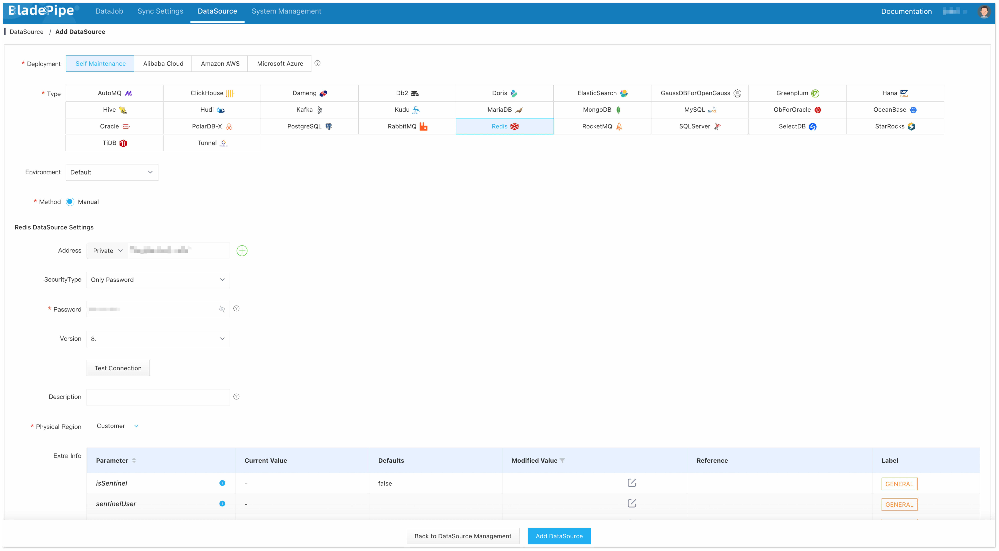
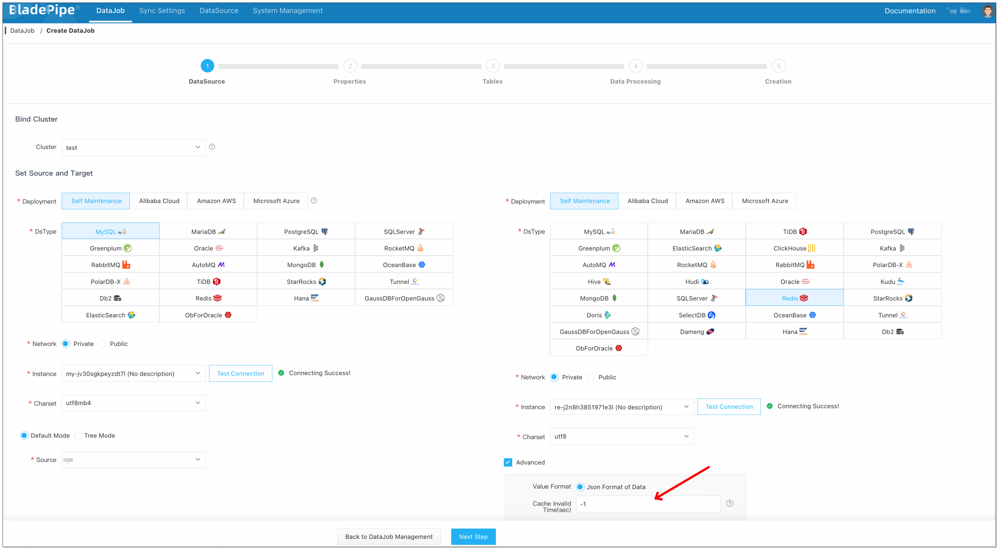
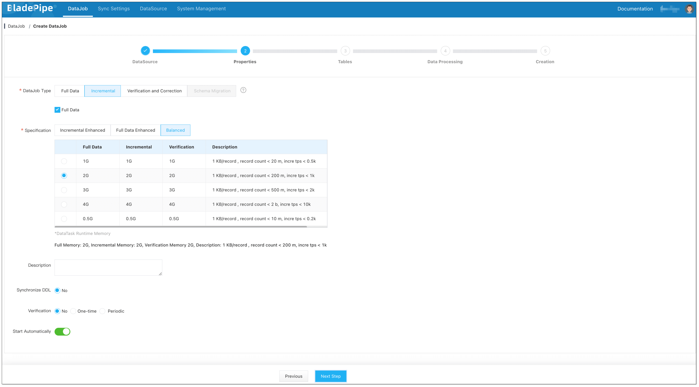
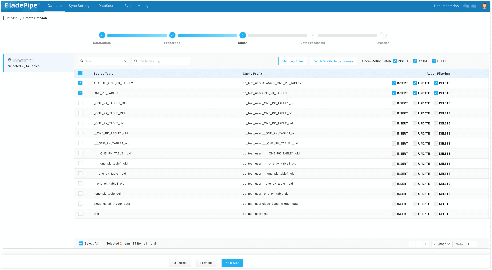
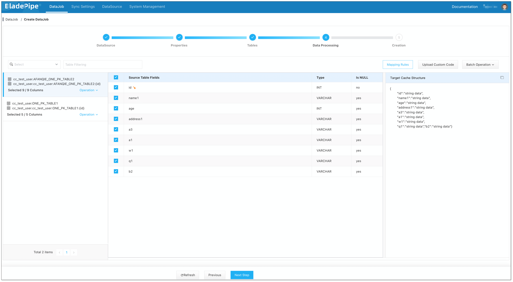
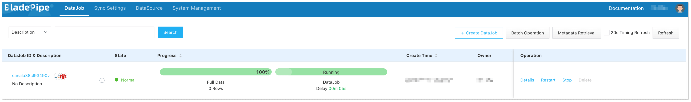

## Overview
Redis is an open-source, in-memory, non-relational data store known for its high performance and flexibility. It is widely used in a range of cases, such as real-time analysis, application cache, and session management. This makes it important to integrate data to Redis.

This tutorial delves into how to use [BladePipe](https://www.bladepipe.com) to move data from MySQL to Redis, including the following features:

- Support a single-node Redis instance, master/standby Redis instances, and a sharded cluster instance.
- Allow setting a cache expiration time when writing data to a Redis instance.

## Highlights

### Automatic Adaptation to Sharded Clusters

There are differences in the way of writing data to Redis sharded and non-sharded clusters.

BladePipe automatically identifies the cluster sharding of Redis by obtaining Redis parameters, and adjusts the data write method to run the Incremental DataJob.

### Support for Cache Expiration

It is allowed to set the cache expiration time when writing data to a Redis instance. 

When creating a BladePipe DataJob, you can optionally set the expiration time (in seconds). The configuration takes effects automatically when a DataJob is running.

## Procedure

### Step 1: Install BladePipe
Follow the instructions in [Install Worker (Docker)](https://www.bladepipe.com/docs/productOP/byoc/installation/install_worker_docker) or [Install Worker (Binary)](https://www.bladepipe.com/docs/productOP/byoc/installation/install_worker_binary) to download and install a BladePipe Worker.

### Step 2: Add DataSources
1. Log in to the [BladePipe Cloud](https://cloud.bladepipe.com).
2. Click **DataSource** > **Add DataSource**.
3. Select the source and target DataSource type, and fill out the setup form respectively.
    
    
  
    :::info

    If the Redis instance is a cluster, please fill in all nodes or all master nodes and separate them with commas.

    :::

### Step 3: Create a DataJob
1. Click **DataJob** > [**Create DataJob**](https://doc.bladepipe.com/operation/job_manage/create_job/create_full_incre_task).
2. Select the source and target DataSources. Set the cache expiration time (in seconds) in **Advanced** configuration of the target DataSource. The number &lt;=0 means the cache won't expire.
    
    
3. Select **Incremental** for DataJob Type, together with the **Full Data** option.
   
    
4. Select the tables to be replicated.
    
    
  
    :::info

    Because the keys in Redis are composed of the primary keys of the source tables, it is not recommended to select the tables without a primary key.

    :::

5. Select the columns to be replicated. [Filter the data](https://doc.bladepipe.com/operation/job_manage/create_job/create_data_filter_job) if needed.
    
    
6. Confirm the creation.
   :::info
   The DataJob creation process involves several steps. Click **Sync Settings** > [**ConsoleJob**](https://doc.bladepipe.com/operation/job_setting/console_job_manage), find the DataJob creation record, and click **Details** to view it.

   The DataJob creation with a source MySQL instance includes the following steps:

   - Schema Migration
   - Allocation of DataJobs to BladePipe Workers
   - Creation of DataJob FSM (Finite State Machine)
   - Completion of DataJob Creation
   :::

7. Now the DataJob is created and started. BladePipe will automatically run the following DataTasks:
   - **Schema Migration**: The schemas of the source tables will be migrated to the target instance.
   - **Full Data Migration**: All existing data from the source tables will be fully migrated to the target instance.
   - **Incremental Data Synchronization**: Ongoing data changes will be continuously synchronized to the target instance.

    

## FAQ

### What should I do after a Redis master/standby switchover?

BladePipe writes data with JedisCluster, which automatically senses a master/standby switchover.

### What should I do if the nodes in Redis are changed？

You can manually modify the node information of the DataJob configuration and restart the DataJob.

