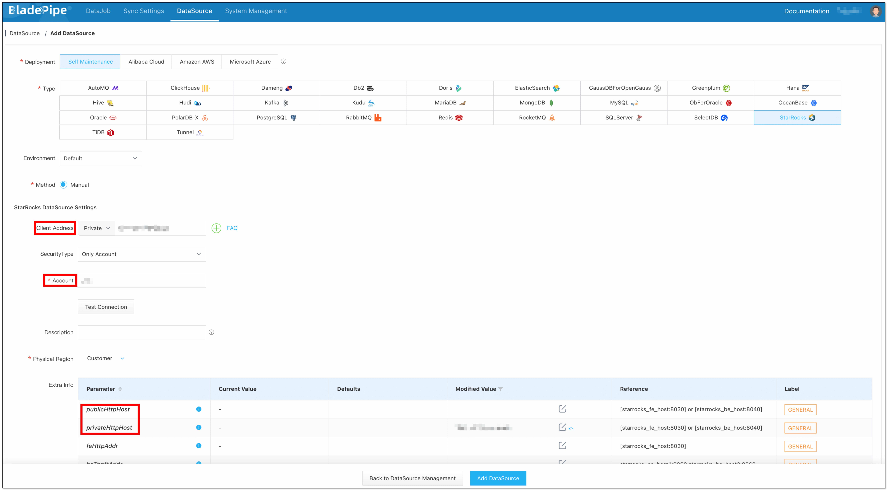
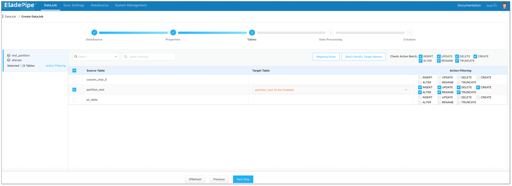
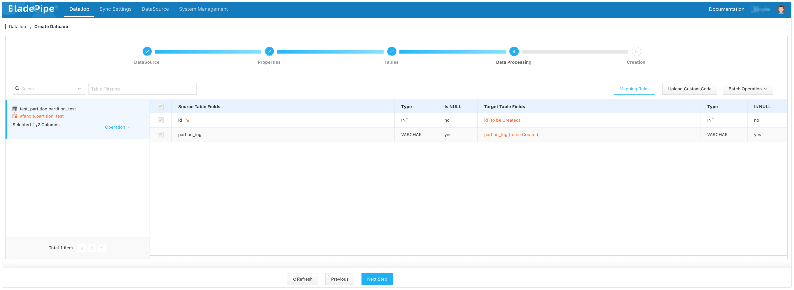
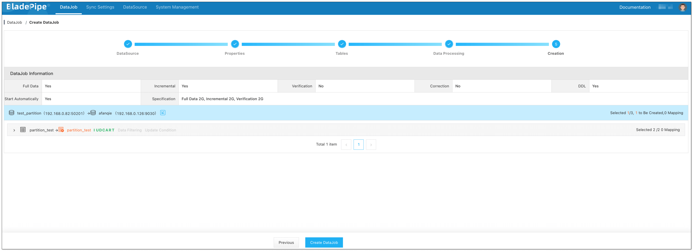
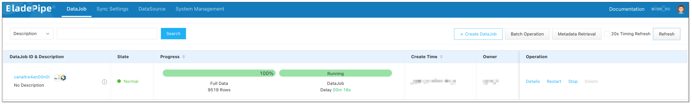

## What is StarRocks?
StarRocks is an open-source, blazing-fast Massively Parallel Processing (MPP) database. Thanks to its special yet simple design of architecture and outstanding performance in data queries, real-time data analysis becomes easier than ever before for enterprises. 

Known for its scalability, speed and high performance, StarRocks is a brilliant and cost-effective choice for many data-driven organizations. It is widely used for OLAP multi-dimensional analytics, real-time analytics, high-concurrency analytics, customized reporting, ad-hoc queries, and unified analytics in finance, e-commerce and many other industries.

## Features
Some of the fantastic features of StarRocks include:
- The MPP framework enables parallel execution, greatly accelerating the data query.
- The columnar storage lowers the data read I/Os, bringing a faster query speed. 
- The fully vectorized execution engine enlarges the power of columnar storage. With this engine, the CPU processing power is fully used, and the overall performance of operator is increased by 3 to 15 times.
- The storage-compute separation architecture provides great scalibility and flexibility while maintaining the same functionalities as the storage-compute coupled mode.

## Data Integration to StarRocks
Before enjoying the unparalleled data analysis offered by StarRocks, an important step is to integrate data from the other data sources to it. How to move massive data to StarRocks as easy as possible? BladePipe provides a sound solution.

BladePipe loads data via StarRocks Stream Load. The existing data and data changes in the Source instance are converted into byte streams and transferred via HTTP for bulk write to StarRocks.

With the Stream Load approach, all operations on the StarRocks instance are performed using INSERT statements. BladePipe automatically converts INSERT/UPDATE/DELETE operations into INSERT statements and fills in the __op value (delete identifier), enabling StarRocks to merge data automatically.

Here's a step-by-step guidance.

### Step 1: Install BladePipe

Follow the instructions in [Install Worker (Docker)](https://www.bladepipe.com/docs/productOP/byoc/installation/install_worker_docker) or [Install Worker (Binary)](https://www.bladepipe.com/docs/productOP/byoc/installation/install_worker_binary) to download and install a BladePipe Worker.

### Step 2: Add DataSources

1. Log in to the [BladePipe Cloud](https://cloud.bladepipe.com).
2. Click **DataSource** > **Add DataSource**.
3. Select StarRocks as the Type, and fill in the setup form.
   - **Client Address**：The port StarRocks provided to MySQL Client. BladePipe queries the metadata in databases via it. 
   - **Account**: The user name of the StarRocks database. The INSERT permission is required to write data to StarRocks. If the user doesn't have the INSERT permission, please grant the permission with [GRANT](https://docs.starrocks.io/docs/sql-reference/sql-statements/account-management/GRANT/) as a reference.
   - **Http Address**：It is used to receive the request from BladePipe to write data to StarRocks.

   
   
4. Click **Test Connection**. After successful connection, click **Add DataSource** to add the DataSource.
5. Add a MySQL DataSource following the above steps.

### Step 3: Create a DataJob

1. Click **DataJob** > [**Create DataJob**](https://doc.bladepipe.com/operation/job_manage/create_job/create_full_incre_task).
2. Select the source and target DataSources, and click **Test Connection** to ensure the connection to the source and target DataSources are both successful.
   
1. Select **Incremental** for DataJob Type, together with the **Full Data** option.
   
1. Select the tables to be replicated. **Note that the target StarRocks tables automatically created after Schema Migration have primary keys, so source tables without primary keys are not supported currently**.
   
1. Select the columns to be replicated.
   
1. Confirm the DataJob creation.
   

Now the DataJob starts. BladePipe will automatically run the following DataTasks:
   - **Schema Migration**: The schemas of the source tables will be migrated to the target instance.
   - **Full Data**: All existing data of the source tables will be fully migrated to the target instance.
   - **Incremental**: Ongoing data changes will be continuously synchronized to the target instance (with latency less than a minute).
   
