You can move data from [MySQL](/connector/mysql/) to [Amazon Redshift](/connector/redshift/) with CSV files and `COPY`, a custom ETL pipeline, AWS Database Migration Service (AWS DMS), AWS zero-ETL integration, or a CDC-based data integration platform.

The right method depends on freshness, downtime tolerance, and how much operational complexity you want to manage. Use CSV and `COPY` for one-time loads. Use scheduled ETL for predictable batch refreshes. Use [CDC](/blog/data_insights/change_data_capture_cdc.md), AWS DMS, or zero-ETL when Redshift must stay current while MySQL keeps serving applications.

This guide compares five MySQL-to-Redshift methods and then walks through a practical workflow for schema migration, full migration, and Binlog-based incremental synchronization.

## Why Move Data from MySQL to Amazon Redshift?

Use cases:

- Separating transactional and analytical workloads;
- Consolidating data from multiple MySQL databases;
- Feeding fresh application data to BI and reporting systems;
- Building analytical models in Redshift;
- Moving an existing reporting workload from MySQL to a data warehouse.

The challenge is not just copying rows. MySQL and Redshift differ in data types, table design, and workload patterns. Production migration may also require schema conversion, historical loading, change capture, monitoring, recovery, and a controlled cutover.

## MySQL-to-Redshift Migration vs. Replication

Migration and replication solve different problems. A migration has an endpoint: move schema and data, keep the target current, and cut over. Replication keeps delivering MySQL changes to Redshift for analytics.

| Requirement | Suitable approach |
| --- | --- |
| Load a small dataset once | CSV, S3, and Redshift `COPY` |
| Refresh data every day or hour | Scheduled ETL or incremental queries |
| Migrate while MySQL remains online | Full load followed by incremental synchronization |
| Keep Redshift current for analytics | Binlog-based CDC replication or AWS zero-ETL |
| Use an AWS-managed integration | AWS DMS or AWS zero-ETL |

An incremental query is not always CDC. A script that selects rows by `updated_at` can find new and modified records, but it may miss deletions and late changes. Binlog-based CDC reads MySQL change records and captures `INSERT`, `UPDATE`, and `DELETE` operations without repeatedly scanning source tables.

## 5 Ways to Move Data from MySQL to Redshift

### Method 1: Export MySQL Data and Use Redshift COPY

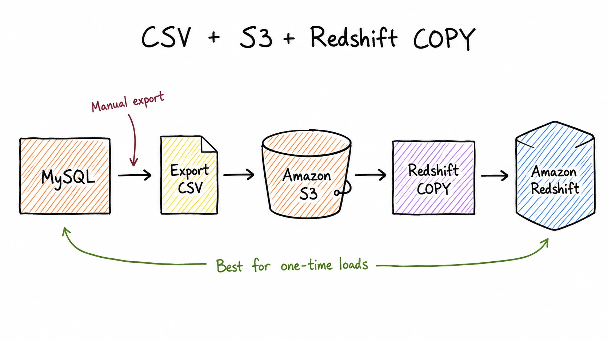

You export MySQL tables, clean or convert incompatible values, upload files to Amazon S3, create destination tables, and run Redshift `COPY`.

This method works when:

- The migration is a one-time operation;
- The dataset is small enough to export and reload manually;
- You are preparing a test or proof-of-concept environment;
- The source data will not change during the transfer.

For larger datasets, plan file splitting, compression, parallel loading, error handling, and restarts. If the source stays active, you also need to load changes made after the export begins.

Manual export is weak for continuous MySQL-to-Redshift replication. It has no built-in update or delete capture, and schema changes require manual work.

### Method 2: Build a Custom ETL Pipeline

A custom pipeline extracts data with SQL or application code, stages it in S3, and loads it into Redshift on a schedule:

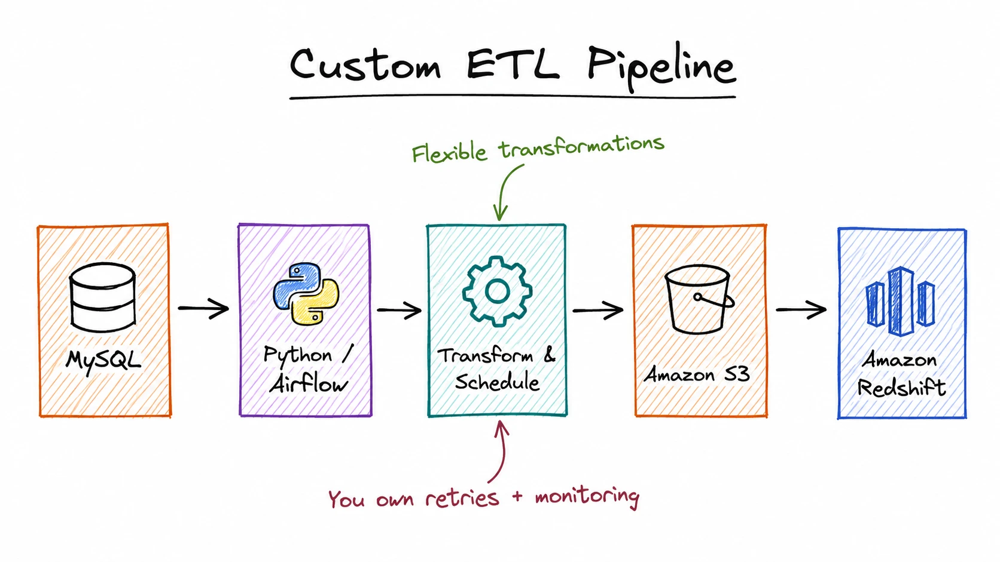

This gives engineers control over filtering, transformation, scheduling, and destination table design. It fits teams that already operate Airflow or another orchestrator and need specialized transformations.

The first full load is usually simple. Incremental processing is harder. The pipeline needs a reliable cursor, such as an increasing ID or update timestamp, plus retries, duplicate control, late-record handling, deletion logic, monitoring, and recovery for partial batches.

### Method 3: Use a CDC-Based Data Integration Platform

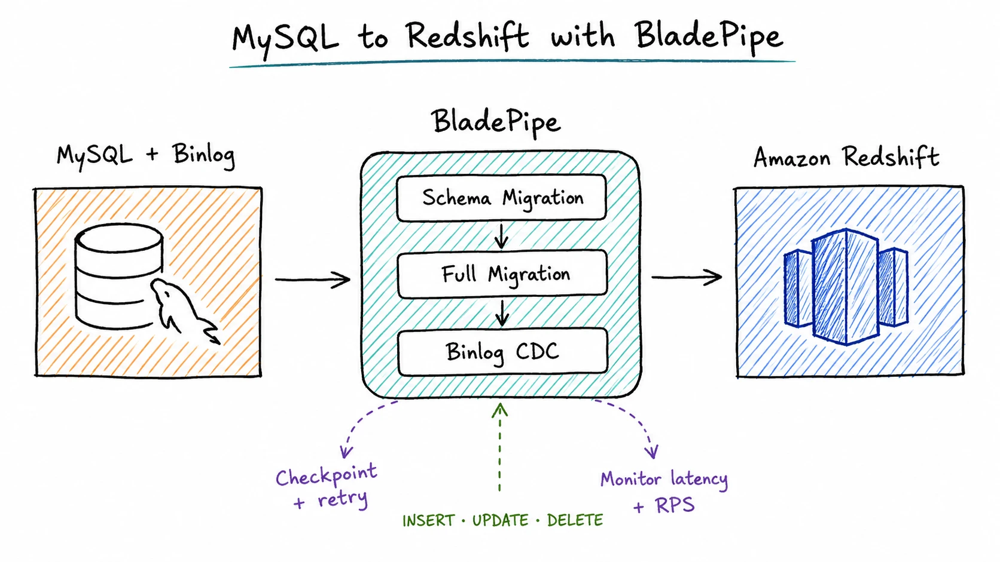

The schema phase prepares compatible destination tables. The full phase loads existing rows. The incremental phase reads changes generated during the full migration and keeps applying new changes afterward.

This method fits when:

- MySQL continues serving application traffic;
- Historical data and ongoing changes need one workflow;
- Redshift needs fresh data for analytics;
- The team needs monitoring, retries, and checkpoint recovery;
- Building and maintaining a custom CDC pipeline is not desirable.

BladePipe is one example of this approach for MySQL-to-Redshift tasks. It supports schema migration, full migration, and Binlog-based incremental synchronization, including `INSERT`, `UPDATE`, and `DELETE` events.

### Method 4: Use AWS Database Migration Service

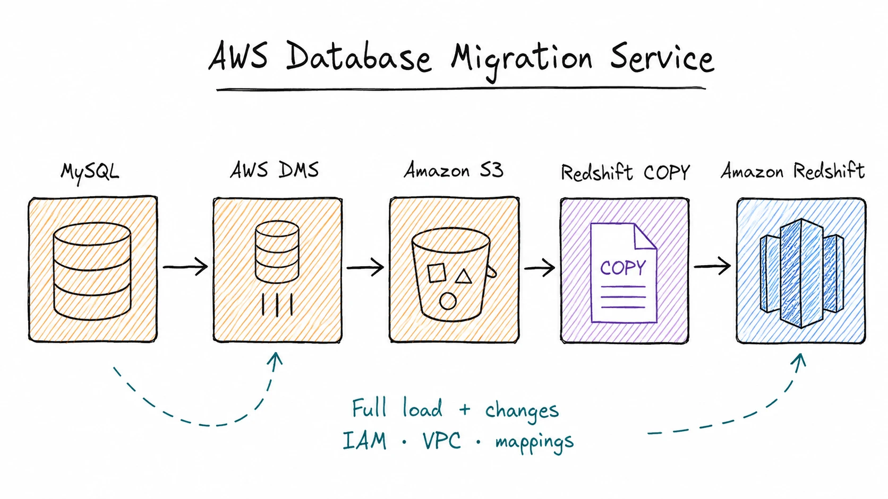

AWS DMS supports full-load and change-processing tasks with Amazon Redshift as a target. It creates files from source data, stages them in Amazon S3, and loads them with Redshift `COPY`. AWS documents this workflow in its [Amazon Redshift target guide for AWS DMS](https://docs.aws.amazon.com/dms/latest/userguide/CHAP_Target.Redshift.html).

AWS DMS is a strong option when the infrastructure is AWS-centered and the team can configure:

- Source and target endpoints;
- Replication resources;
- VPC connectivity and security groups;
- IAM permissions;
- S3 staging resources;
- Table mappings and task settings;
- Monitoring and failure recovery.

AWS DMS provides full automation for schema generation and data type mapping on Redshift targets, plus full load, incremental load, DDL application, and synchronization between full load and CDC. Even so, heterogeneous migrations still need a careful review of unsupported types, table definitions, primary keys, and the generated target schema before the full load.

### Method 5: Use AWS Zero-ETL Integration

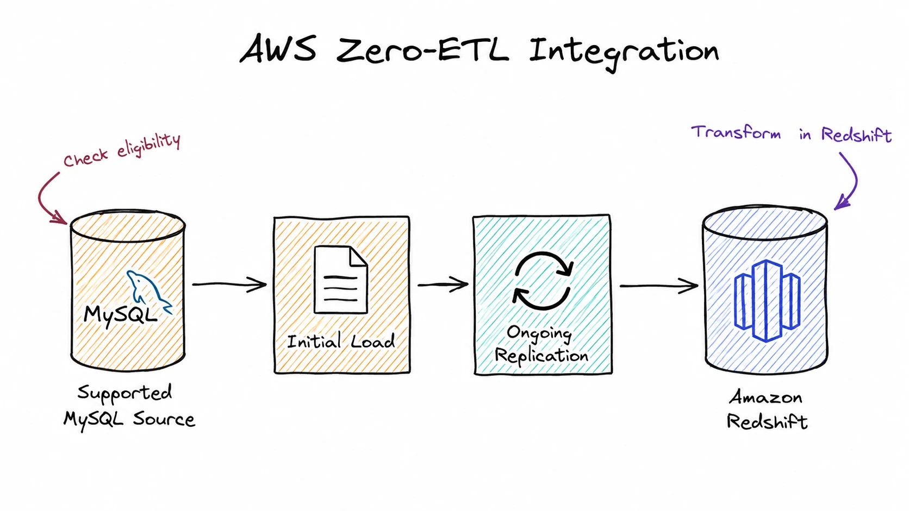

AWS zero-ETL integration is a fully managed path for making operational data available in Amazon Redshift. It performs an initial load and then replicates changes to a Redshift destination database.

For MySQL workloads, AWS currently supports Amazon RDS for MySQL and self-managed MySQL in zero-ETL integrations, but eligibility, Regions, and setup requirements still vary by source. Check the [Amazon Redshift zero-ETL documentation](https://docs.aws.amazon.com/redshift/latest/mgmt/zero-etl-using.html) before choosing this method.

Zero-ETL reduces the amount of pipeline code you need to maintain, but it still requires source, target, network, security, and parameter settings. AWS also notes that zero-ETL does not transform data during replication; transformations run on the replicated data in Redshift. See the [zero-ETL considerations and limitations](https://docs.aws.amazon.com/redshift/latest/mgmt/zero-etl.reqs-lims.html) for details.

## MySQL-to-Redshift Method Comparison

| Method | Full load | Incremental changes | Schema preparation | Typical freshness | Best for |
| --- | --- | --- | --- | --- | --- |
| CSV + S3 + `COPY` | Yes | Manual | Manual | One-time or batch | Small one-time loads |
| Custom ETL | Yes | Scheduled or custom | Usually custom | Minutes to hours | Existing data engineering platforms |
| CDC data integration tool | Yes | Yes | Supported by the migration workflow | Near real time | Continuous synchronization and migration |
| AWS DMS | Yes | Yes | Needs extra schema review | Near real time | AWS-based migration projects |
| AWS zero-ETL | Yes | Yes | Managed within supported configurations | Near real time | Eligible AWS environments |

## How to Migrate MySQL to Amazon Redshift with BladePipe

Now let's walk through the basic flow. The exact settings may vary by environment, but the main steps are the same.

### Prerequisites

Make sure BladePipe can reach both MySQL and Amazon Redshift, and that the source account has permission to read the selected tables. Review the tables you plan to migrate for types or names that may need special handling in Redshift.

**BladePipe**

Deploy the free [Community Edition](https://www.bladepipe.com/pricing/) with the [one-command Docker install](/docs/productOP/onPremise/installation/install_all_in_one_docker/) if you prefer a self-hosted setup. If you want to start quickly, you can also [register for BladePipe Cloud](https://www.bladepipe.com/register/) for a hosted trial.

BladePipe reads MySQL changes from the row-based binary log. The source must have binary logging enabled and use these settings:

```ini
log_bin = ON
binlog_format = ROW
binlog_row_image = FULL
```

Set binlog retention long enough to cover the initial migration and expected interruptions. Expired logs can prevent the incremental task from resuming from its previous position.
On MySQL 8.0 and 8.4, binary logging is enabled by default and row-based logging is the recommended mode for new replication setups, but you should still verify the runtime values in your environment.

### Step 1: Add the MySQL Source and Redshift Target

Create a MySQL data source in BladePipe, then add Amazon Redshift as the destination. Test both connections before you continue.

Use a MySQL account with the permissions required for table reads and replication.

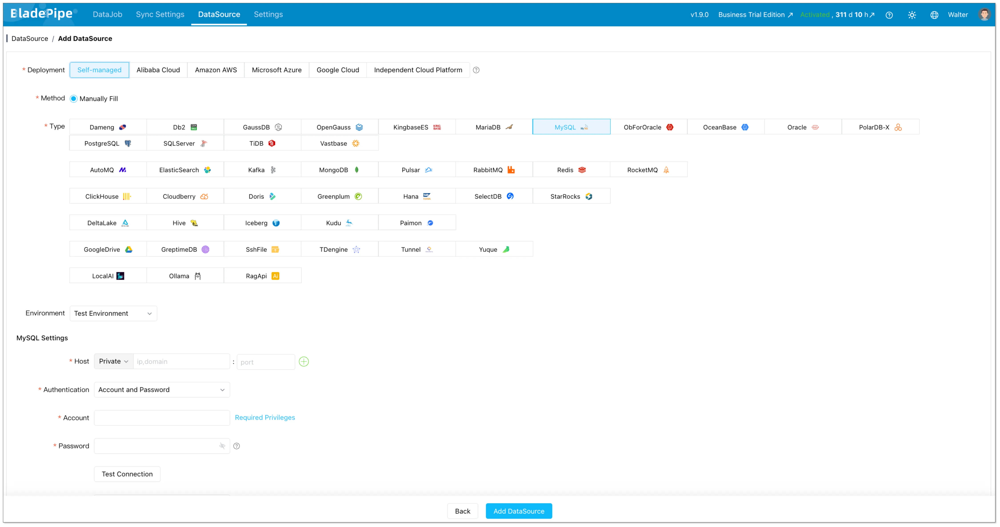

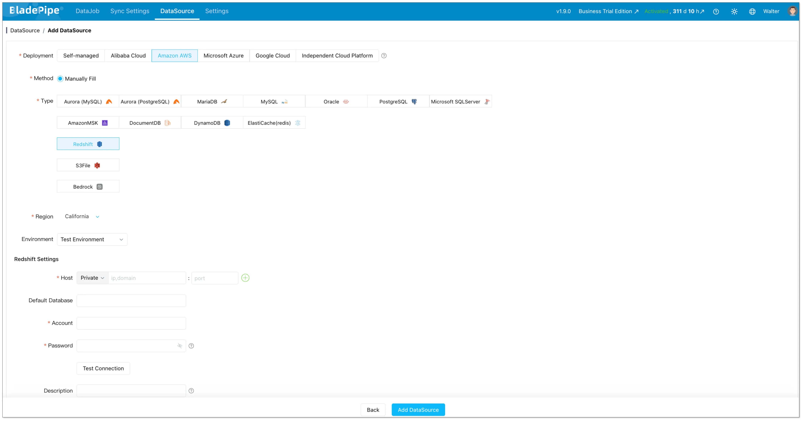

### Step 2: Create the Migration Task

Create a data migration task and select MySQL as the source and Amazon Redshift as the destination. Turn on full migration, and incremental synchronization together so the pipeline can move from initial load to CDC automatically.

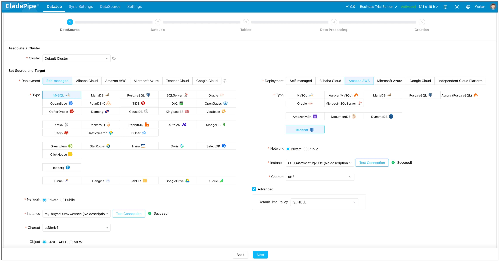

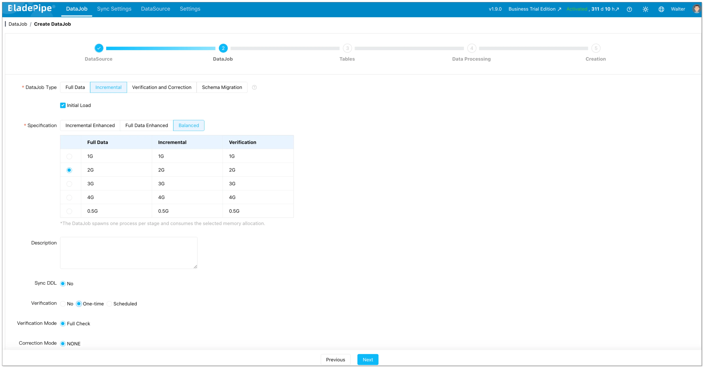

### Step 3: Review Tables and Field Mappings

Choose the databases and tables you want to migrate. Check the generated table names, columns, and type mappings before starting the task.

Pay special attention to unsigned numbers, zero dates, `ENUM`, `SET`, `JSON`, and binary data. Existing target tables can skip schema migration, but the column definitions and primary keys still need to match.

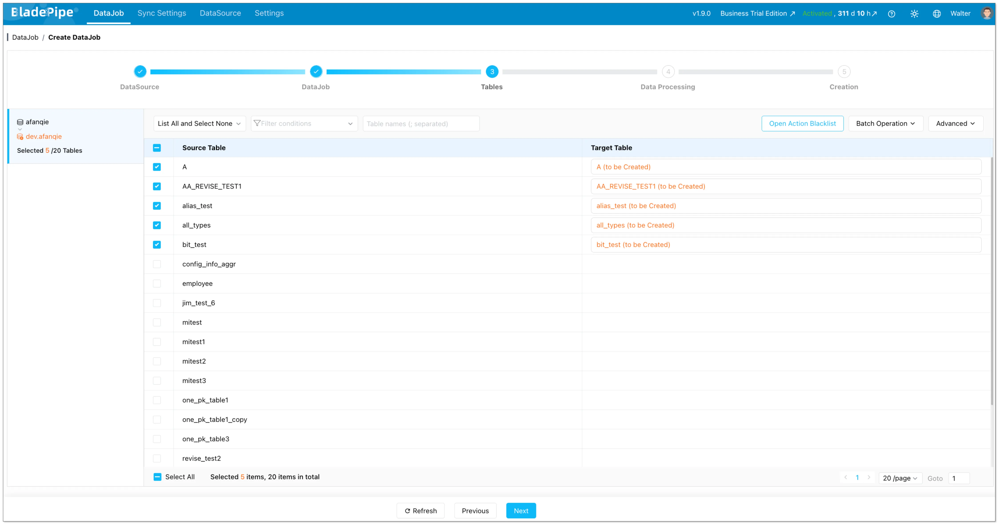

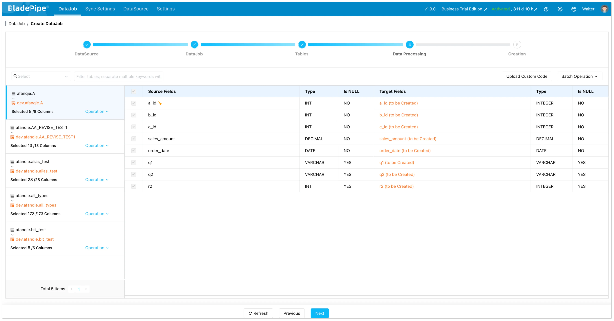

### Step 4: Start the Full Load

Start the task. BladePipe will load the existing data first and then keep tracking MySQL changes from the binlog.

The source application can stay online during the full load. If the task is interrupted, checkpoint-based recovery helps resume from the last confirmed position.

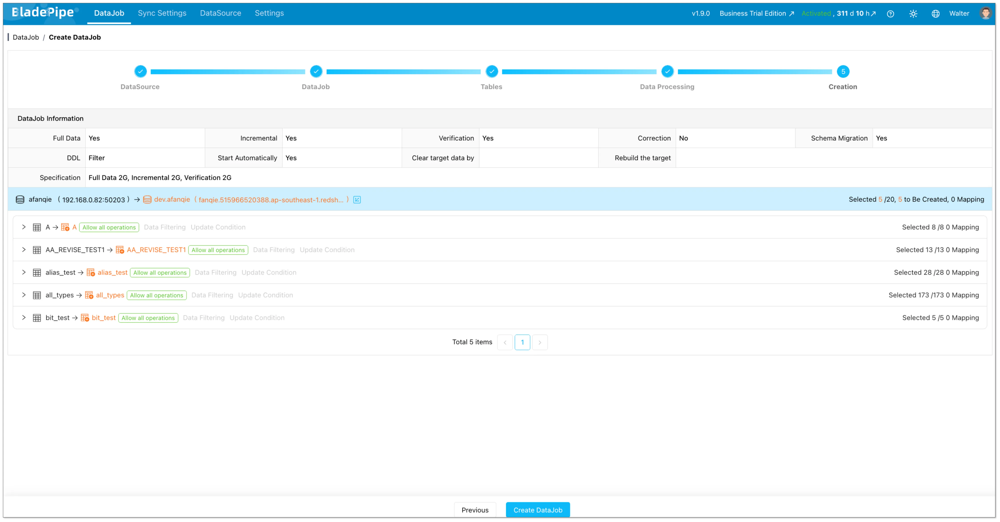

### Step 5: Verify Incremental Sync

After the full load finishes, create a few test `INSERT`, `UPDATE`, and `DELETE` operations in MySQL and confirm that they appear in Redshift as expected.

For a deeper validation checklist, see [Data Verification](/blog/data_insights/data_verification.md).

Keep the incremental task running if you need ongoing analytics. For a cutover, wait until the lag is acceptable, validate the data, switch the downstream workload, and keep a rollback path until verification is complete.

## Common MySQL-to-Redshift Migration Challenges

### Data Type Differences

MySQL and Redshift do not share identical data types. Check numeric ranges, unsigned values, date and time values, character encodings, JSON, binary columns, and MySQL-specific types such as `ENUM` and `SET`.

Automatic mapping reduces manual work, but it does not replace query-oriented review. A type that accepts the source value may still be inefficient or inconvenient for downstream Redshift queries.

### Updates and Deletes

Appending new rows is simpler than applying changes to existing rows. Scheduled queries based on timestamps may miss deleted records, while CDC captures the operation from the MySQL Binlog.

Before migration, identify the keys used to locate destination records. Test updates and deletes separately; a successful insert test does not prove the whole incremental path.

### Table and Column Name Case

MySQL and Redshift can handle identifier case differently. Check names that rely on mixed case or quoted identifiers during schema mapping. AWS documents the behavior in its guide to the [`enable_case_sensitive_identifier`](https://docs.aws.amazon.com/redshift/latest/dg/r_enable_case_sensitive_identifier.html) setting.

### Full-Load Performance

Full migration speed depends on table sizes, source read capacity, network bandwidth, task resources, and Redshift write performance. Monitor large tables individually. An unrestricted full load during peak hours can pressure the source database.

### Recovery and Binlog Retention

CDC recovery depends on the required MySQL Binlog still being available. Configure retention based on initial load duration, maintenance windows, and the longest interruption the task must tolerate. Monitor synchronization delay and the available log window.

## Which Method Should You Choose?

Use CSV, S3, and `COPY` for a small one-time load. Build a custom ETL pipeline when you already have the engineering platform and need specialized transformations. Use CDC, AWS DMS, or AWS zero-ETL when you need full migration plus continuous change capture. Choose AWS DMS when the migration is AWS-centered and the team can operate the required resources. Choose zero-ETL when the source is supported and an AWS-managed integration fits the architecture.

If you are comparing migration patterns across targets, you may also find [MySQL to Snowflake](/blog/tech_share/migrate_data_from_mysql_to_snowflake.md), [MySQL to SQL Server](/blog/tech_share/mysql_to_sqlserver_sync.md), and [best data migration tools](/blog/data_insights/best_data_migration_tools.md) useful.

## FAQ

### How do I migrate MySQL to Amazon Redshift?

You can export MySQL data to files and load them through S3, build an ETL pipeline, use AWS DMS, configure an eligible AWS zero-ETL integration, or use a CDC data integration tool. For active production MySQL, combine a full load with incremental synchronization so changes made during migration also reach Redshift.

### Can Amazon Redshift connect directly to MySQL?

Amazon Redshift supports federated queries to Amazon RDS for MySQL and Aurora MySQL databases. This lets Redshift query external data, but it does not migrate or replicate data into Redshift. See the [AWS federated query guide for MySQL](https://docs.aws.amazon.com/redshift/latest/dg/getting-started-federated-mysql.html) for requirements.

### How can I replicate MySQL to Redshift in near real-time?

Use MySQL Binlog-based CDC, or AWS zero-ETL when your MySQL source is in a supported configuration. The replication process reads row-level changes from the Binlog and applies inserts, updates, and deletes to Redshift. The source must have binary logging enabled and use settings compatible with row-level change capture.

### Can AWS DMS migrate MySQL to Redshift?

Yes. AWS DMS supports Amazon Redshift as a target and can run full-load and change-processing tasks. Its Redshift target workflow stages data in Amazon S3 and loads it with Redshift `COPY`.

### Does Redshift support every MySQL data type?

No. Review the converted schema and test types such as unsigned numbers, zero dates, `ENUM`, `SET`, JSON, and binary data before the production migration.

### What is the best way to move data from self-hosted MySQL to Redshift?

The best method depends on data volume, latency, schema complexity, and operational capacity. If you need to migrate schema and historical data while capturing MySQL changes, full migration plus Binlog CDC is usually more practical than separate export and incremental scripts.

## Conclusion

BladePipe supports MySQL-to-Redshift schema migration, full migration, and Binlog-based incremental synchronization in one workflow. Use it to load existing data, keep Redshift current with MySQL changes, and monitor the migration through cutover or ongoing replication.

**Start a [free trial](https://www.bladepipe.com/register/) or [contact us](https://www.bladepipe.com/about/) to discuss your MySQL-to-Redshift migration requirements.**
