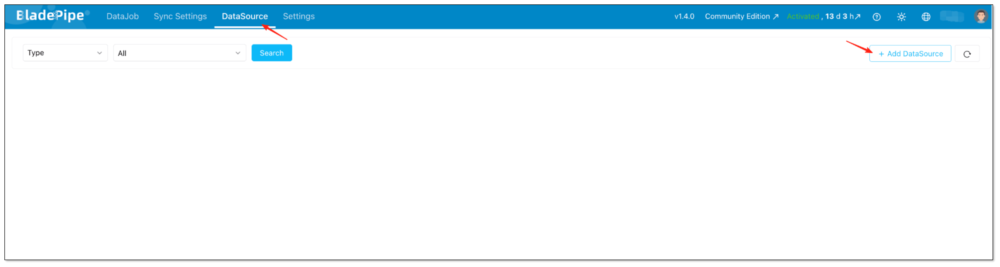
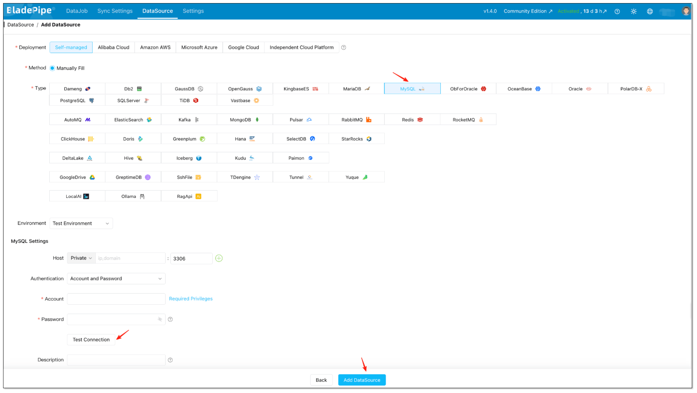
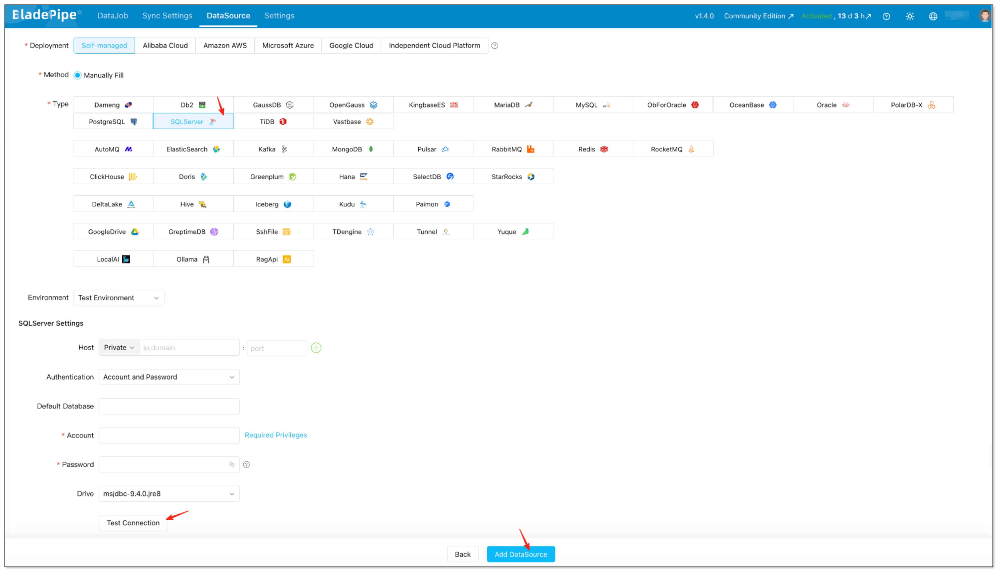
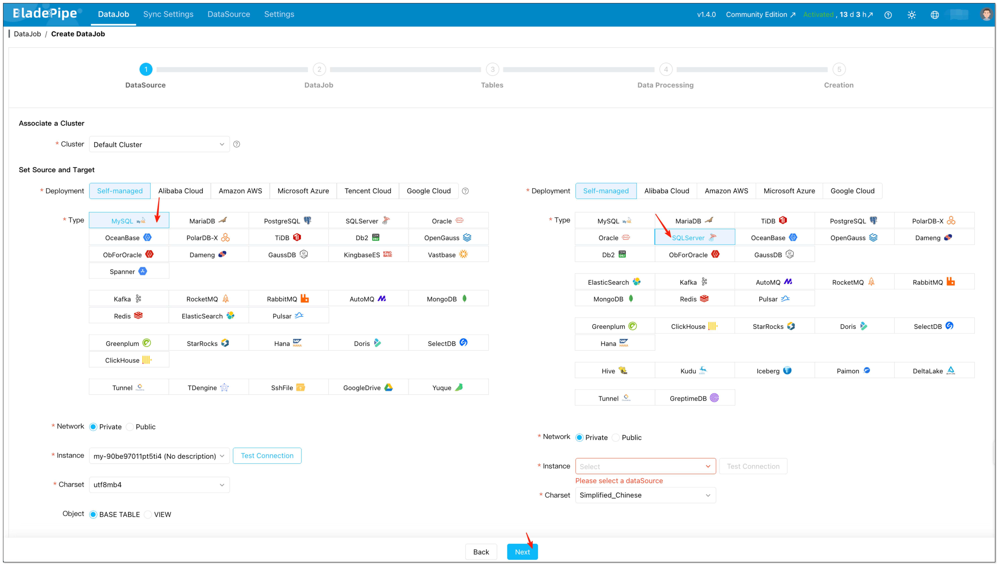
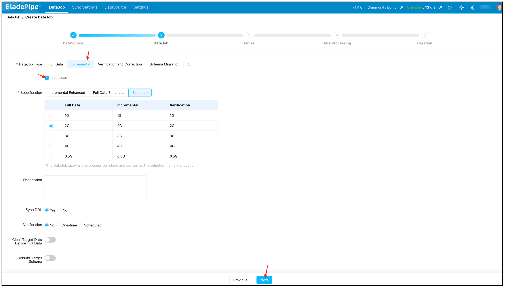
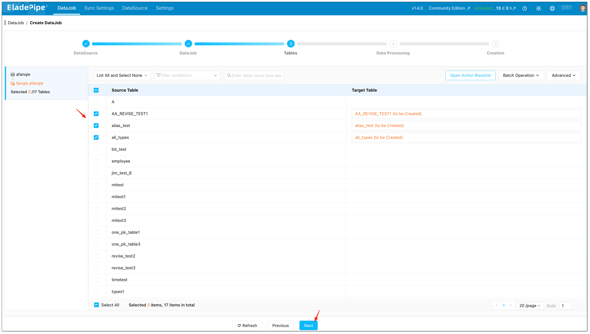
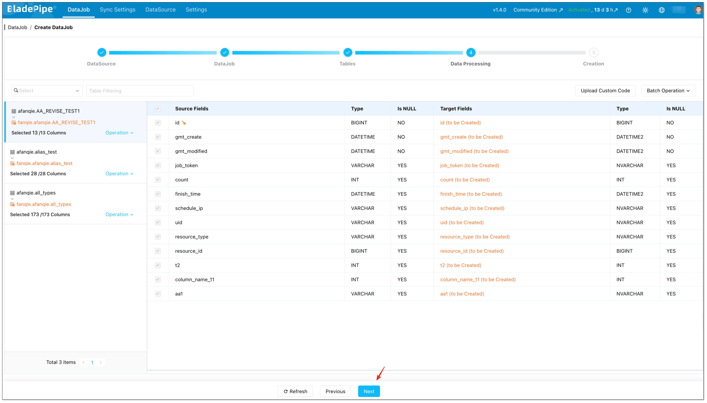
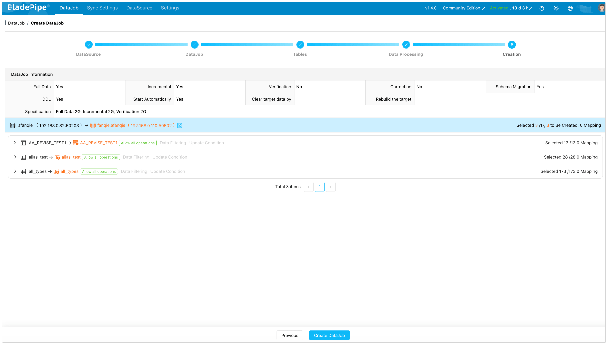

## Overview

Syncing **MySQL to SQL Server** does not have to be painful. If you are looking for the **easiest** way to move data without long downtime, brittle scripts, or the risk of missing changes, a **no-code CDC approach** is usually the simplest answer. In this guide, you will learn how to sync MySQL to SQL Server in real time, reduce operational complexity, and avoid data loss during both the initial migration and ongoing replication.

Many teams start with exports, batch jobs, or custom code, only to discover that live MySQL to SQL Server replication is much harder than a one-time data transfer. The challenge is not only moving historical rows. It is also keeping SQL Server continuously updated as new inserts, updates, and deletes happen in MySQL.

This article explains where traditional methods become risky, why continuous data sync matters, and how to configure a reliable full-load plus CDC pipeline with [BladePipe](https://www.bladepipe.com/) in 3 practical steps.

If you are comparing similar database migration patterns, you may also want to read [Migrate MySQL to PostgreSQL](/blog/tech_share/migrate_mysql_to_postgresql).

## Why Real-Time MySQL to SQL Server Sync Matters

There are many reasons to replicate MySQL into SQL Server, and not all of them are pure migration projects. In real production environments, teams often need both initial data movement and steady ongoing sync.

Common scenarios include:

- **Reporting and BI**: Keep SQL Server ready for Power BI, SSRS, or internal reporting without overloading the MySQL source.
- **Application modernization**: Migrate MySQL to SQL Server in stages instead of forcing a risky big-bang cutover.
- **Operational offloading**: Move read-heavy workloads, exports, and downstream integrations away from the source system.
- **Hybrid system integration**: Connect Linux-oriented applications that run on MySQL with Microsoft-based systems that expect SQL Server.
- **Data backup and continuity**: Maintain an additional up-to-date copy of business data for recovery or downstream use.

For these use cases, a one-time export is not enough. What teams really need is reliable MySQL to SQL Server replication with incremental updates, manageable recovery, and consistent target-side data.

## Why Traditional MySQL to SQL Server Migration Feels Hard

On paper, MySQL to SQL Server migration sounds simple: export the source data, load it into the target, and switch applications later. In practice, that approach often creates hidden risk.

Here is where manual pipelines usually break down:

- **Too many moving parts**: Dumps, CSV files, scheduled jobs, transformation scripts, and manual retries quickly add complexity.
- **[CDC](../data_insights/change_data_capture_cdc.md) is the hard part**: Full loads are straightforward. Continuous sync is not. You need to capture changes in order, replay them safely, and avoid duplicates or gaps.
- **Downtime pressure**: If the target is only refreshed occasionally, the final cutover window becomes more stressful.
- **Schema drift**: New columns, datatype differences, and target constraints can quietly break custom pipelines.
- **Weak observability**: DIY jobs often make it hard to see lag, failures, replay status, or partial-load issues.

This is why many teams search for the best MySQL to SQL Server sync tool rather than trying to maintain another fragile in-house integration. The easiest pipeline to start is not always the easiest one to keep running.

## The Easiest Way to Sync MySQL to SQL Server Without Data Loss

For most teams, the simplest approach is a no-code platform that handles both snapshot migration and incremental replication in one workflow. Instead of building your own MySQL CDC pipeline, you configure the source, configure the destination, choose the tables, and let the platform manage execution.

BladePipe is designed for exactly this style of database-to-database data movement. It supports full-load plus CDC workflows, which means you can migrate existing MySQL data first and then keep SQL Server updated with ongoing changes.

This approach helps because it gives you:

- **Automated MySQL to SQL Server migration** without maintaining custom scripts
- **Real-time sync** based on ongoing source-side changes
- **Lower operational overhead** through built-in scheduling, checkpoints, and recovery
- **Better data consistency** than ad hoc export-and-import jobs
- **A faster path to production** when you need reliable replication quickly

If your goal is zero-downtime migration, the real advantage is not just convenience. It is the ability to keep the target fresh while the source remains online, which reduces cutover risk dramatically.

## How to Set Up MySQL to SQL Server Sync in 3 Steps

The BladePipe workflow is straightforward. You install the platform, register MySQL and SQL Server as data sources, and then create a DataJob that includes both full data and incremental sync.

### Step 1: Install BladePipe On-Premise

Deploy BladePipe in your own environment using one of the official installation guides:

- [Install All-In-One (Docker)](/docs/productOP/onPremise/installation/install_all_in_one_docker)
- [Install All-In-One (Binary)](/docs/productOP/onPremise/installation/install_all_in_one_binary)
- [Install All-In-One (K8s)](/docs/productOP/onPremise/installation/install_all_in_one_k8s)

For quick evaluation, Docker is usually the fastest option. After installation, open the on-premise console, for example `http://{your-server-ip}:8111`.

Before creating the sync job, make sure the source and target accounts have the required permissions:

- [MySQL privileges](/docs/dataMigrationAndSync/datasource_func/MySQL/privs_for_mysql)
- [SQL Server privileges](/docs/dataMigrationAndSync/datasource_func/SqlServer/privs_for_sqlserver)

### Step 2: Add MySQL and SQL Server as Data Sources

In the BladePipe on-premise console:

1. Click **DataSource** > **Add DataSource**.

   

2. Add **MySQL** as the source data source, fill in the connection details, and test the connection.

   

3. Add **SQL Server** as the target data source, fill in the connection details, and test the connection.

   

At this point, your MySQL and SQL Server endpoints are ready. You do not need to build a custom connector layer or write application code to move data between them.

### Step 3: Create a Full + Incremental DataJob

After both data sources are ready, go to [**DataJob** > **Create DataJob**](/docs/operation/job_manage/create_job/create_full_incre_task) and configure the sync pipeline:

1. Select **MySQL** as the source and **SQL Server** as the target.

   

2. Choose **Incremental** and enable **Initial Load** so the job performs both the initial load and continuous replication.

   

3. Choose the tables you want to sync.

   

4. Select the columns you want to sync.

   

5. Review the settings, then create the DataJob.

   

Once the job starts, BladePipe will:

- Create target-side structures in SQL Server when needed
- Load the existing MySQL data
- Capture ongoing inserts, updates, and deletes from MySQL
- Maintain checkpoints and recovery information during execution

If you want more visibility into asynchronous execution, you can also review [ConsoleJob records](/docs/operation/job_setting/console_job_manage).

## What to Look For in a MySQL to SQL Server Replication Tool

Not every MySQL to SQL Server sync tool is built for production. Whether you are comparing BladePipe, scripts, SSIS packages, or scheduled export jobs, focus on the capabilities that actually reduce risk.

Look for these features:

- **Full load plus CDC**: You need both initial migration and continuous incremental sync.
- **Reliable change capture**: The platform should correctly process inserts, updates, and deletes.
- **Resumability**: A temporary failure should not force a complete reload.
- **Schema handling**: Table creation, mapping, and datatype conversion should be manageable.
- **Monitoring and logs**: You need clear visibility into lag, failures, and throughput.
- **Low operational burden**: A tool is only useful if your team can run it without constant babysitting.

If your current approach depends on manual reloads, then it may still work for one-time transfers. But for live MySQL to SQL Server replication, CDC support is usually the dividing line between a demo and a sustainable production setup.

## BladePipe vs. Scripts vs. SSIS Packages

If you are comparing common ways to sync MySQL to SQL Server, these three options are among the most common: a no-code CDC platform like BladePipe, custom scripts or export-import jobs, and SSIS packages. Each can work, but they fit different use cases and operational expectations.

Here is a simple comparison:

| Approach | Best for | Strengths | Limitations |
| --- | --- | --- | --- |
| BladePipe | Real-time sync, incremental migration, and low-maintenance production pipelines | Full load plus CDC, no-code setup, resumable execution, and lower operational overhead | Less low-level customization than fully hand-built solutions |
| Custom scripts / export-import jobs | One-time transfers, small datasets, or teams comfortable maintaining code | Flexible, familiar, and easy to start for simple tasks | Hard to maintain, weak observability, CDC is difficult, and there is a higher risk of gaps or duplicates |
| SSIS packages | Microsoft-centric ETL workflows, scheduled transformations, and teams already using SQL Server tooling | Mature ecosystem, strong transformation support, and a natural fit for SQL Server-heavy environments | Often better for batch ETL than true real-time MySQL CDC, with more setup and maintenance for continuous replication |

Scripts are common because they are easy to start with, and SSIS is common in SQL Server environments because many teams already know it. But if your goal is live MySQL to SQL Server replication with less manual work, BladePipe is usually the more practical option.

## Final Thoughts

If you are worried that **MySQL to SQL Server sync** will be slow, risky, or difficult to maintain, the good news is that it is easier than many teams expect. The key is choosing a workflow built for both migration and ongoing replication, not just a one-time export.

BladePipe gives you a practical way to sync MySQL to SQL Server in minutes, keep the target continuously updated, and reduce the risk of downtime or data loss. If you want to evaluate the workflow in your own environment, start with the installation guides above or [request the demo](https://cal.com/bladepipe-xxypci/30min).

## FAQs

### Can I sync MySQL to SQL Server in real time?

Yes. With a CDC-based pipeline, SQL Server can stay continuously updated as inserts, updates, and deletes happen in MySQL.

### Is this better than using exports or scheduled batch jobs?

For most production scenarios, yes. Export-and-import jobs are fine for occasional transfers, but they are not ideal when you need low-latency replication or want to minimize data loss risk during migration.

### Can I do incremental MySQL to SQL Server migration?

Yes. A full-load plus CDC workflow first migrates the existing data and then continues with incremental updates. This is the standard pattern when you want a smoother cutover.

### What affects MySQL to SQL Server pricing?

Pricing usually depends on data volume, change rate, deployment model, and how much operational work your team wants to absorb. If you want to evaluate BladePipe, there are currently [three options](https://www.bladepipe.com/pricing/) to try: a **free** Community edition, a Cloud plan starting at **$0.01/million rows of data**, and an Enterprise edition with a **90-day trial**.

### What is the easiest way to migrate MySQL to SQL Server with low downtime?

Use a platform like BladePipe that supports automated table loading, CDC, checkpoints, and recovery in one workflow. That is usually much simpler than combining dumps, cron jobs, and custom replay logic.

### How do I keep MySQL to SQL Server data consistency under control?

Start with a tool that captures changes reliably, supports resumable execution, and gives you clear monitoring. Consistency problems often come from manual retries and partial updates, not from the database engines themselves.
