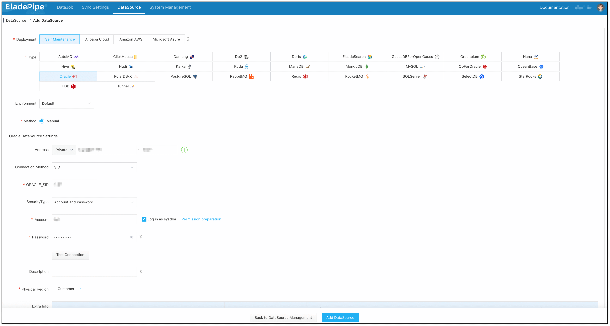
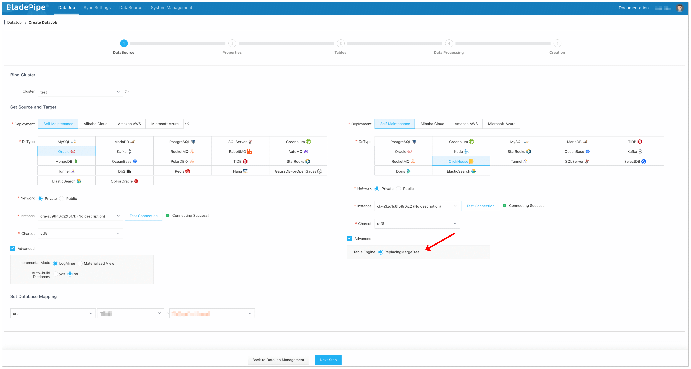
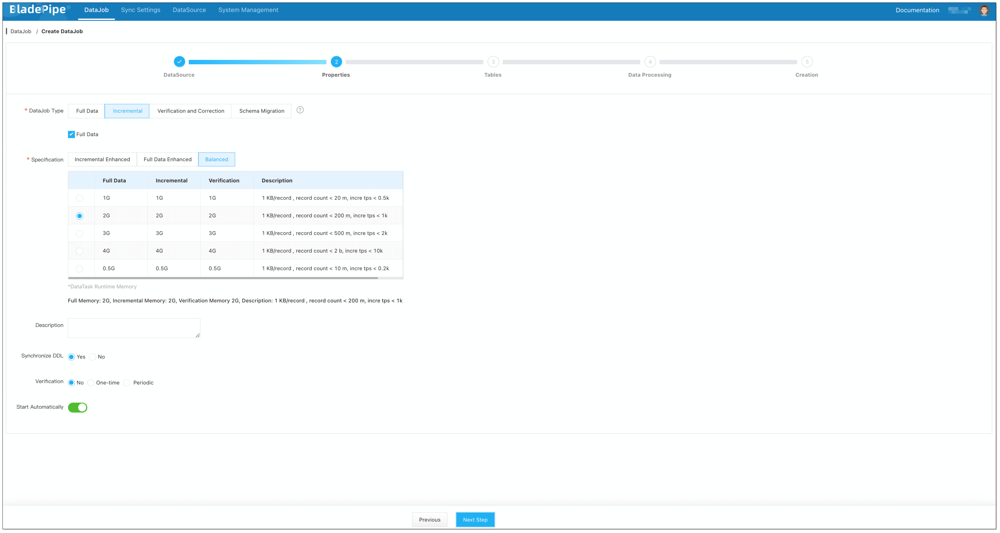
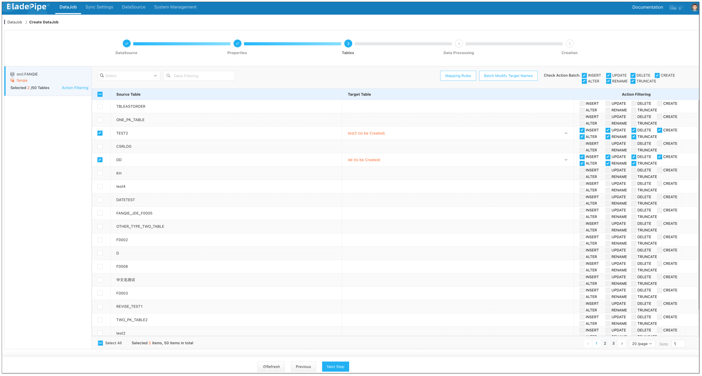
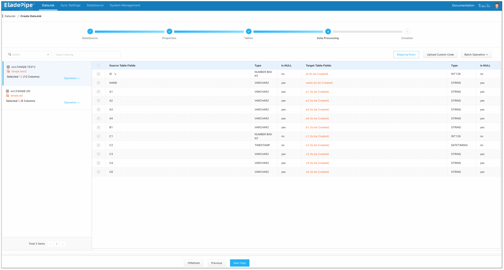
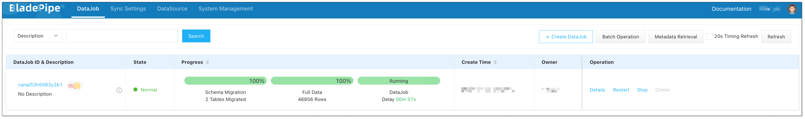
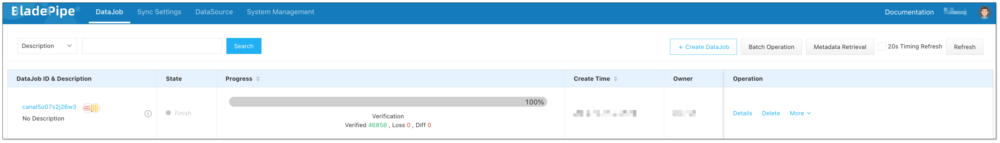

## Overview
ClickHouse is an open-source column-oriented database management system. It's excellent performance in real-time data processing significantly enhances data analysis and business insights. Moving data from Oracle to ClickHouse can multiply the data power in decision making that would not be possible with Oracle alone.

This tutorial describes how to move data from Oracle to ClickHouse with [BladePipe](https://www.bladepipe.com). By default, it uses ReplacingMergeTree as the ClickHouse table engine. The key features of the connection include:

- Add `_sign` and `_version` fields in ReplacingMergeTree table.
- Support for DDL synchronization.


## Highlights

### ReplacingMergeTree Optimization

In the early versions of BladePipe, when synchronizing data to ClickHouse's **ReplacingMergeTree** table, the following strategy was followed:

- Insert and Update statements were converted into **Insert** statements.

- Delete statements were separately processed using **ALTER TABLE DELETE** statements.

Though it was effective, the performance might be affected when there were a large number of **Delete** statements, leading to high latency.

In the latest version, BladePipe optimizes the synchronization logic, supporting `_sign` and `_version` fields in the **ReplacingMergeTree** table engine. All **Insert**, **Update**, and **Delete** statements are converted into **Insert** statements with version information.

### Schema Migration

When migrating schemas from Oracle to ClickHouse, BladePipe uses ReplacingMergeTree as the table engine by default and automatically adds `_sign` and `_version` fields to the table:

```sql
CREATE TABLE console.worker_stats (
    `id` Int64,
    `gmt_create` DateTime,
    `worker_id` Int64,
    `cpu_stat` String,
    `mem_stat` String,
    `disk_stat` String,
    `_sign` UInt8 DEFAULT 0,
    `_version` UInt64 DEFAULT 0,
    INDEX `_version_minmax_idx` (`_version`) TYPE minmax GRANULARITY 1
) ENGINE = ReplacingMergeTree(`_version`, `_sign`) ORDER BY `id`
```

### Data Writing

#### DML Conversion

During data writing, BladePipe adopts the following DML conversion strategy:

- Insert statements in Source:

    ```sql
    -- Insert new data, _sign value is set to 0
    INSERT INTO <schema>.<table> (columns, _sign, _version) VALUES (..., 0, <new_version>);
    ```

- Update statements in Source (converted into two Insert statements):

    ```sql
    -- Logically delete old data, _sign value is set to 1
    INSERT INTO <schema>.<table> (columns, _sign, _version) VALUES (..., 1, <new_version>);
    
    -- Insert new data, _sign value is set to 0
    INSERT INTO <schema>.<table> (columns, _sign, _version) VALUES (..., 0, <new_version>);
    ```

- Delete statements in Source:

    ```sql
    -- Logically delete old data, _sign value is set to 1
    INSERT INTO <schema>.<table> (columns, _sign, _version) VALUES (..., 1, <new_version>);
    ```
  
#### Data Version
When writing data, BladePipe maintains version information for each table:

- Version Initialization: During the first write, BladePipe retrieves the current table's latest version number by running:

    ```sql
    SELECT MAX(`_version`) FROM `console`.`worker_stats`;
    ```

- Version Increment: Each time new data is written, BladePipe increments the version number based on the previously retrieved maximum version number, ensuring each write operation has a unique and incrementing version number.

To ensure data accuracy in queries, add the **final** keyword to filter out the rows that are not deleted :

```sql
SELECT `id`, `gmt_create`, `worker_id`, `cpu_stat`, `mem_stat`, `disk_stat`
FROM `console`.`worker_stats` final;
```

## Procedure

### Step 1: Install BladePipe

Follow the instructions in [Install Worker (Docker)](https://www.bladepipe.com/docs/productOP/byoc/installation/install_worker_docker/) or [Install Worker (Binary)](https://www.bladepipe.com/docs/productOP/byoc/installation/install_worker_binary/) to download and install a BladePipe Worker.

### Step 2: Add DataSources

1. Log in to the [BladePipe Cloud](https://cloud.bladepipe.com).
2. Click **DataSource** > **Add DataSource**.
3. Select the source and target DataSource type, and fill out the setup form respectively.


### Step 3: Create a DataJob
1. Click **DataJob** > [**Create DataJob**](https://www.bladepipe.com/docs/operation/job_manage/create_job/create_full_incre_task/).
   
2. Select the source and target DataSources, and click **Test Connection** to ensure the connection to the source and target DataSources are both successful.
   
3. In the **Advanced** configuration of the target DataSource, choose the table engine as **ReplacingMergeTree** (or **ReplicatedReplacingMergeTree**).
   
   
4. Select **Incremental** for DataJob Type, together with the **Full Data** option.

   :::info
   In the **Specification** settings, make sure that you select a specification of at least **1 GB**.

   Allocating too little memory may result in Out of Memory (OOM) errors during DataJob execution.
   :::
   
5. Select the tables to be replicated.
   
   
6. Select the columns to be replicated.
   
   
7. Confirm the DataJob creation.
8. Now the DataJob is created and started. BladePipe will automatically run the following DataTasks:
   - **Schema Migration**: The schemas of the source tables will be migrated to ClickHouse.
   - **Full Data Migration**: All existing data from the source tables will be fully migrated to ClickHouse.
   - **Incremental Synchronization**: Ongoing data changes will be continuously synchronized to the target database.
   
   

### Step 4: Verify the Data

1. Stop data write in the Source database and wait for ClickHouse to merge data.
   :::info
   It's hard to know when ClickHouse merges data automatically, so you can manually trigger a merging by running the `optimize table xxx final` command. Note that there is a chance that this manual merging may not always succeed.

   Alternatively, you can run the `create view xxx_v as select * from xxx final` command to create a view and perform queries on the view to ensure the data is fully merged.
   :::

2. [Create a Verification DataJob](https://www.bladepipe.com/docs/operation/job_manage/create_job/create_period_verification_correction_job/). Once the Verification DataJob is completed, review the results to confirm that the data in ClickHouse is the same as that in Oracle.
   
   