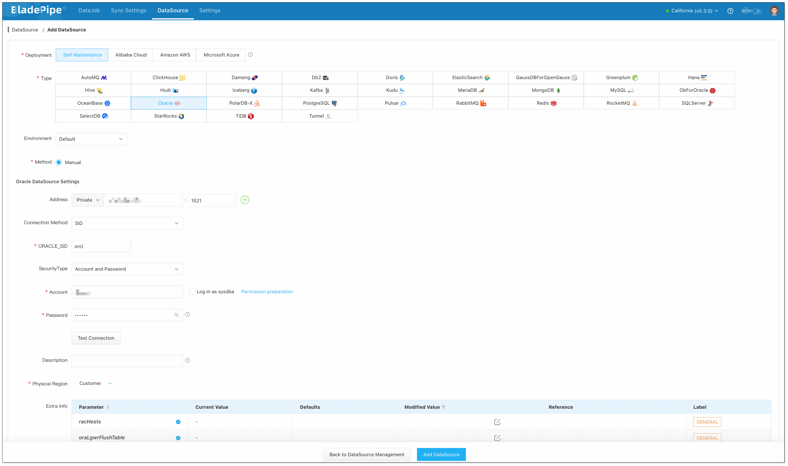
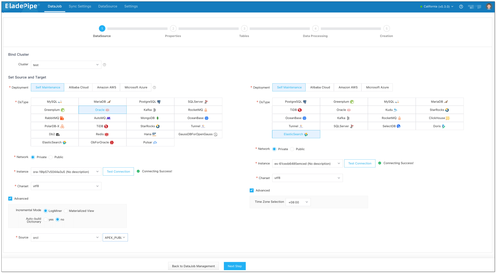
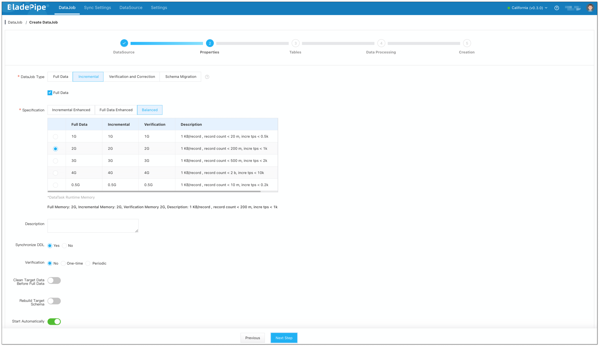
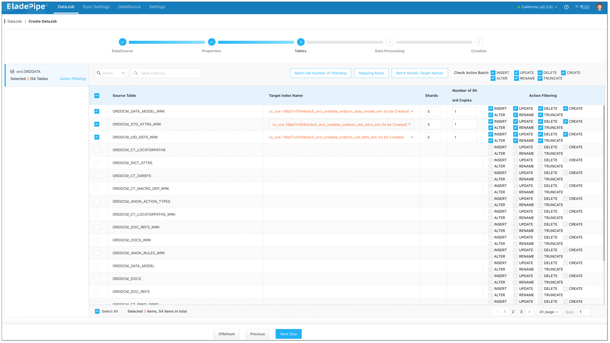
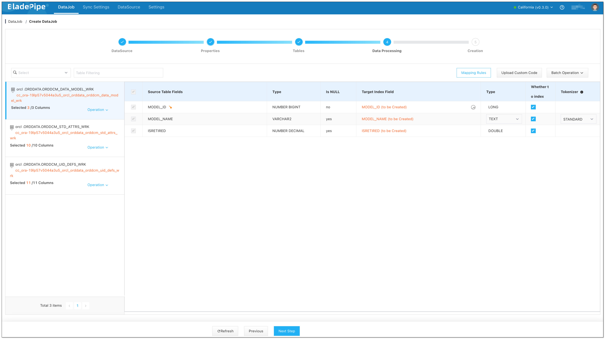
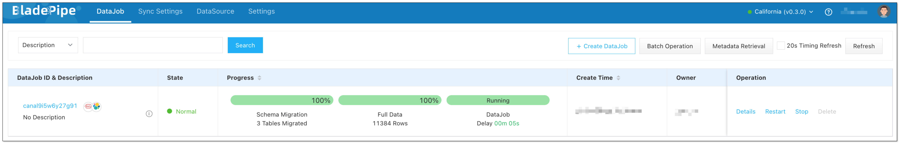

## Overview

**Oracle** is a widely-used relational database to handle large volumes of structured data, offering high performance and comprehensive support for complex transactions. With its rich ecosystem and compatibility with various applications, Oracle is often at the core of many organizations' data infrastructure.    

**Elasticsearch** is a highly scalable, open-source search and analytics engine designed to handle large volumes of data in real time. It is widely used for log analysis, real-time monitoring, and powering search functionalities in applications. 

In this tutorial, we’ll explore how to efficiently move data from Oracle to Elasticsearch with [BladePipe](https://www.bladepipe.com), to unlock real-time search capabilities and enhance data-driven decision-making.

## Highlights

### Sync Data Based on Oracle LogMiner

For real-time data sync from Oracle sources, BladePipe significantly improves its stability and efficiency by analyzing redo logs through LogMiner after multiple rounds of optimizations. These improvements have been validated in user production environments. Key features include:
- **Oracle RAC Support**: The optimization is tailored for Oracle RAC scenarios, ensuring data integrity and consistency.
- **Standardized LogMiner Parsing**: By default, LogMiner's standard method (ADD_FILE) is used to parse redo logs, and CONTINUOUS_MINE is a supplement (depending on the Oracle version).
- **Full Event Consumption Mode**: BladePipe supports full event consumption, ensuring stability during data sync.
- **Large Transaction Handling**: Large-scale change data is cached locally, making it capable of processing over a million changes in the source Oracle database.
- **Offset Resetting**: In case of consumption errors, you can reset the timestamps or SCN (System Change Number) to reconsume data, enhancing fault tolerance.
- **Data Verification and Correction**: BladePipe supports scheduled data verification and correction to ensure data consistency.

With these optimizations, BladePipe delivers more robust and reliable performance when moving data from Oracle sources, meeting various complex data sync requirements.

### Create Elasticsearch Index with Mapping Automatically

BladePipe supports automatical conversion of the source database table structure to Elasticsearch indexes. During this process, you can personalize the column-level index and mapping. What you can personalize include:
- Specifying whether each column needs to be indexed.
- Setting the tokenizer (e.g., standard tokenizer) in Elasticsearch mappings for **TEXT** type columns.
- Setting the number of index shards and replicas.

## Procedure

### Step 1: Install BladePipe

Follow the instructions in [Install Worker (Docker)](https://www.bladepipe.com/docs/productOP/byoc/installation/install_worker_docker) or [Install Worker (Binary)](https://www.bladepipe.com/docs/productOP/byoc/installation/install_worker_binary) to download and install a BladePipe Worker.

### Step 2: Add DataSources
1. Log in to the [BladePipe Cloud](https://cloud.bladepipe.com).
2. Click **DataSource** > **Add DataSource**.
3. Select the source and target DataSource type, and fill out the setup form respectively.
   

### Step 3: Create a DataJob

1. Click **DataJob** > [**Create DataJob**](https://doc.bladepipe.com/operation/job_manage/create_job/create_full_incre_task).
2. Configure the source and target DataSources.
   1. Select the source and target DataSources, and click **Test Connection** to ensure the connection to the source and target DataSources are both successful.
   2. Select the Incremental mode in **Advanced** setting under the source instance: **LogMiner** / **materialized view**.
   3. Select the time zone in **Advanced** setting under the target instance: **+08:00** by default.
  
    
3. Select **Incremental** for DataJob Type, together with the **Full Data** option.
   
    
4. Select the tables to be replicated.
   
    

5. Select the columns to be replicated.

   :::info
   If you need to select specific columns for synchronization, please create the corresponding indexes in the Target in advance.
   :::
    
6. Confirm the DataJob creation.

   :::info
   The DataJob creation process involves several steps. Click **Sync Settings** > [**ConsoleJob**](https://doc.bladepipe.com/operation/job_setting/console_job_manage), find the DataJob creation record, and click **Details** to view it.
   
   The DataJob creation with a source Oracle instance includes the following steps:
   - Schema migration
   - Initialization of table-level supplemental logging
   - Initialization of Oracle LogMiner offset
   - Allocation of DataJobs to BladePipe Workers 
   - Creation of DataJob FSM (Finite State Machine) 
   - Completion of DataJob creation
   :::
   
7. Now the DataJob is created and started. BladePipe will automatically run the following DataTasks:
   - **Schema Migration**: The schemas of the source tables will be migrated to the target instance. If the index with the same name exists in the target instance, the schema won't be migrated. 
   - **Full Data Migration**: All existing data from the source tables will be fully migrated to the target database.
   - **Incremental Synchronization**: Ongoing data changes will be continuously synchronized to the target database with ultra-low latency.
  
   

