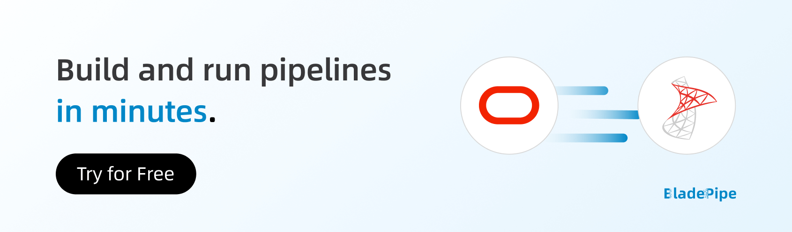
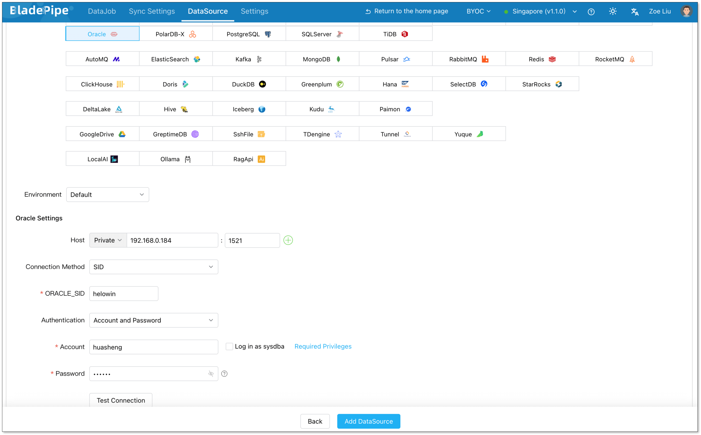
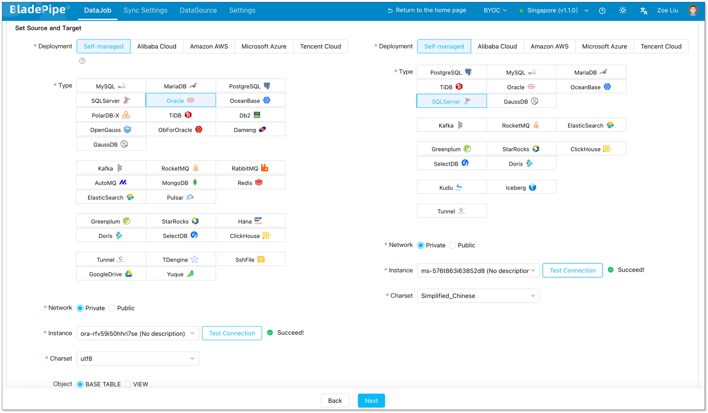
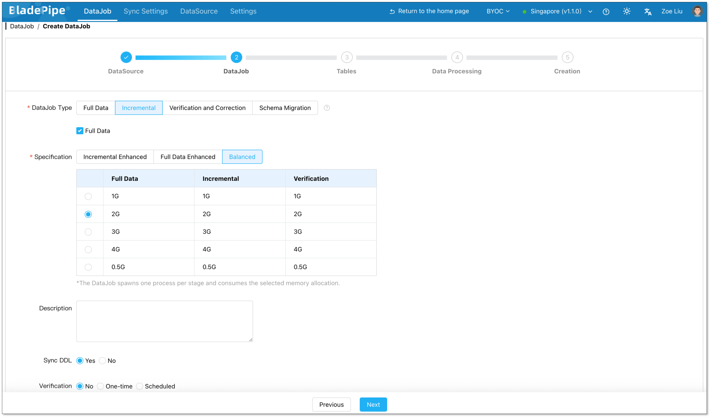
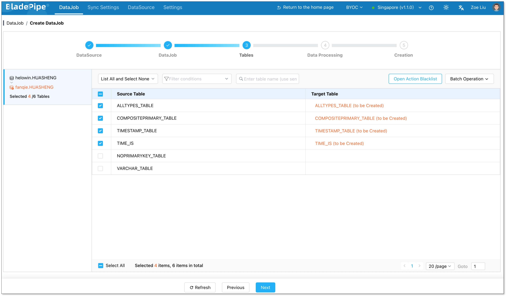
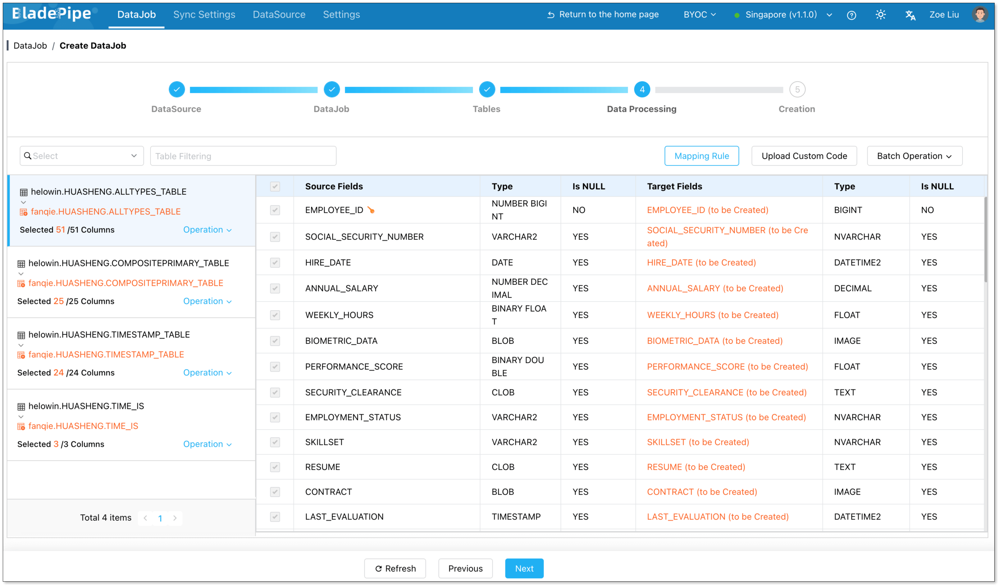
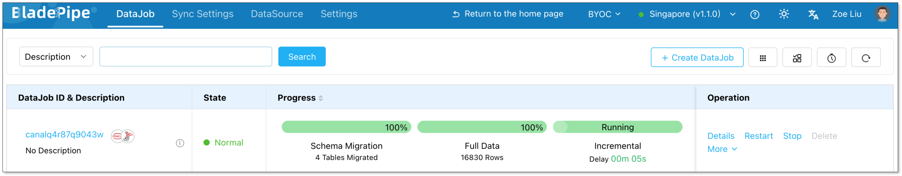

Oracle to SQL Server replication can be tricky. The two databases work differently, and moving large amounts of data without causing issues is not easy. On top of that, it's a challenge to make sure everything is accurate and downtime is minimal. 

In this article, we’ll look at the key challenges of Oracle to SQL Server replication, and two ways to get your data from Oracle to SQL Server.

## Why Move Data from Oracle to SQL Server?
Oracle and SQL Server are two of the most widely used enterprise databases, but they are usually used for very different things. Oracle often runs **core transactional systems** while SQL Server is commonly used for **reporting, analytics, and downstream applications**.

The decision to replicate data from Oracle to SQL Server is usually driven by the following factors:

+ **System decoupling:** Running large reports or Power BI dashboards directly on Oracle can slow down the business. Replicating data to SQL Server gives analysts and business users their own environment without putting pressure on transactional systems.
+ **Lower cost**: Oracle licensing and support are expensive. SQL Server is often more cost-effective for large volumes of queries, especially for BI and data warehousing use cases.
+ **Better integration with Microsoft**: Tools like Power BI, SSRS, and Azure-based analytics platforms work best when the data lives in SQL Server.

## Key Challenges 
Moving data between Oracle and SQL Server is tricky due to several hurdles:

+ **Data Type mismatches:** For example, Oracle’s `NUMBER` type is a catch-all that can be an integer or a floating-point, whereas SQL Server is much stricter (e.g., `INT`, `BIGINT`, `DECIMAL`). 
+ **Reliability issue**: A replication pipeline must handle network failures, database restarts, and schema changes without losing or duplicating data.
+ **Performance impact**: Heavy queries, exports, or triggers can affect production systems, which is usually unacceptable.
+ **Data consistency**: [Verifying row counts and data correctness](https://www.bladepipe.com/blog/data_insights/data_verification/) after migration is often manual and time-consuming.

## How to replicate Oracle to SQL Server
Here are two common ways to replicate Oracle to SQL Server.

+ [Automated way using BladePipe](#method-1-automated-way-using-bladepipe)
+ [Manual way using scripts](#method-2-manual-way-using-scripts)

### Method 1: Automated way using BladePipe
To migrate data from Oracle to SQL Server quickly and reliably, an automated approach is usually the safest place to start. This is where BladePipe fits in.   

[**BladePipe**](https://www.bladepipe.com/) is a [real-time,](https://www.bladepipe.com/real-time-analytics/) end-to-end data replication tool. It supports automated replication from [Oracle](https://www.bladepipe.com/docs/dataMigrationAndSync/connection/oracle2) to SQL Server in just a few clicks. 

With BladePipe, you can:

+ **Extract and load data automatically**: BladePipe supports [60+ out-of-the-box connectors](https://www.bladepipe.com/connector), including Oracle and SQL Server. All connector are ready for production environment.
+ **Transform data without effort**: Common data type conversions are handled automatically, reducing manual work. It also allows complex transformations using [custom code](https://www.bladepipe.com/docs/operation/job_manage/create_job/create_process_job).
+ **Enhance data consistency**: [Built-in data verification and correction](https://www.bladepipe.com/docs/operation/job_manage/create_job/create_period_verification_correction_job) function helps check data integrity and accuracy.
+ **Get always fresh data**: Seamlessly switch to incremental sync. Keep second-level latency to replicate data continuously.

[](https://www.bladepipe.com/login/)


**Step 1: Add DataSources**

Log in to [BladePipe Cloud](https://www.bladepipe.com/login/), and connect to both Oracle and SQL Server.

1. Go to **DataSource** > [**Add DataSource**](https://www.bladepipe.com/docs/operation/datasource_manage/add_self_maintain_ds).
2. Configure:  
    - **Deployment:** Self-managed  
    - **Type:** Oracle / SQL Server
    - **Host:** Database IP and host  
    - **Authentication:** Choose the method and fill in the info. 
3. Click **Add DataSource**.


**Step 2: Create a Pipeline**
1. Go to **DataJob** > [**Create DataJob**](https://doc.bladepipe.com/operation/job_manage/create_job/create_full_incre_task).
2. Select the source and target DataSources, and click **Test Connection** for both. 

3. For one-time migration, select **Full Data** for DataJob Type. For continuous replication, select **Incremental**, together with the **Full Data** option.

4. Select the tables to be replicated.

5. Select the columns to be replicated.

6. Confirm the DataJob creation, and start to run the DataJob.


**Learn more about:**
+ [Oracle to ClickHouse](https://www.bladepipe.com/blog/tech_share/oracle_clickhouse_sync/)
+ [Oracle to ElasticSearch](https://www.bladepipe.com/blog/tech_share/oracle_es_sync/)

### Method 2: Manual way using scripts
A common manual approach to replicate data from Oracle to SQL Server is based on Oracle Data Pump, combined with file-based data transfer and batch loading on the SQL Server side.

**Step 1: Export data from Oracle**

Use [Oracle Data Pump](https://docs.oracle.com/en/database/oracle/oracle-database/19/sutil/oracle-data-pump-export-utility.html) (`expdp`) to export tables or schemas into binary dump (`.dmp`) files.

```bash
expdp username/password@dbname
  schemas=schema_name
  directory=dpump_dir 
  dumpfile=oracle_export.dmp 
  logfile=export.log 
```

The exported data is in an Oracle-specific binary format, not directly consumable by SQL Server.

**Step 2: Convert data format**

Transform the exported data into an intermediate format, typically CSV or flat files.   
Convert Oracle-specific data types to SQL Server-compatible types. For example:

+ `NUMBER` > `DECIMAL`
+ `DATE` > `DATETIME`
+ `CLOB` > `NVARCHAR`
+ `VARCHAR2` > `VARCHAR`

**Step 3: Transfer files to SQL Server**

Transfer the generated CSV or text files to an environment accessible to SQL Server.

**Step 4: Load data into SQL Server**

On the SQL Server side, load data using batch tools such as `BULK INSERT` or SSIS.

```sql
BULK INSERT schema_name.table_name
FROM 'C:\data\oracle.csv'
WITH (
  FIELDTERMINATOR = ',',
  ROWTERMINATOR = '\n'
);
```

**Step 5: Check results**

Verify the data integrity and accuracy manually.

**Limitations:**

+ **Manual handling**: Oracle and SQL Server data types differ, and mappings must be handled and maintained by hand, which is error-prone.
+ **Limited monitoring and visibility**: There is no built-in way to track replication latency, data freshness, or data drift.
+ **Weak failure recovery**: Partial failures usually require restarting jobs or reprocessing entire datasets.
+ **Growing maintanence complexity**: Operational complexity increases rapidly as data volume grows.

### Comparison: Which way works for you?
|  | **Automated way using BladePipe** | **Manual way using scripts** |
| --- | --- | --- |
| **Initial Setup Effort** | **Low** | **Low to moderate** |
| **Operational complexity** | **Low** (just clicks) | **High** (many manual steps) |
| **Impact on Oracle** |  **Low** (optimized snapshot reading) | **Medium to high**(full scans and exports)  |
| **Data type handling** | **Automatic** Oracle → SQL Server mappings | **Manual** mapping and transformation |
| **Failure recovery** | **Resume** from last checkpoint | **Restart** from scratch |
| **Data consistency** | **Enhanced** with built-in validation function | **Hard** to ensure consistency across multiple related tables |
| **Observability** | **High** (Built-in monitoring and progress tracking) | **Low** (Logs and scripts) |
| **Ongoing maintenance** | **Easy** (GUI-based management) | **Hard** (coding/debugging) |
| **Post-migration capability** | Can seamlessly switch to continuous replication | Migration ends when import finishes |
| **Best for** | Mission-critical replication in production environment, zero-downtime migration | One-time replication/small, non-critical dev/test data |


## Conclusion
Migrating data from Oracle to SQL Server doesn’t have to be a painful, script-heavy project. Whether you’re planning a one-time migration or want the option to keep data in sync after cutover, choosing the right approach early can save a lot of time and headaches. Automated tools like BladePipe help reduce complexity, protect production systems, and let teams focus less on plumbing and more on building what matters.

## FAQ

**Q1: Can I replicate from Oracle to SQL Server in the cloud (AWS RDS or Azure)?** 

Yes. Most automated tools (including BladePipe) can connect to cloud-hosted instances as long as the proper network ports are open and log access is enabled.

**Q2: How do I handle schema changes (DDL) like adding a column?** 

Manual scripts require you to stop everything and update both sides. Advanced automated replication tools like BladePipe can automatically deliver the changes to the SQL Server target.