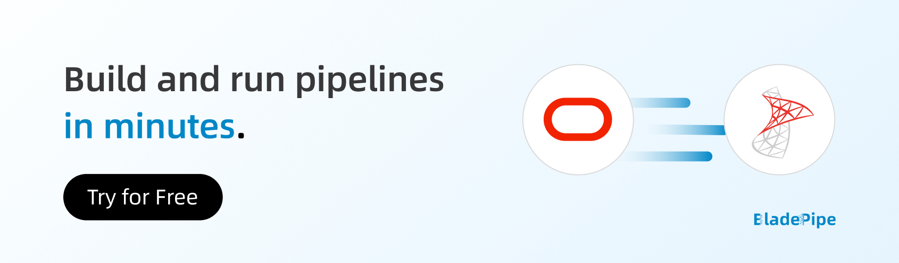
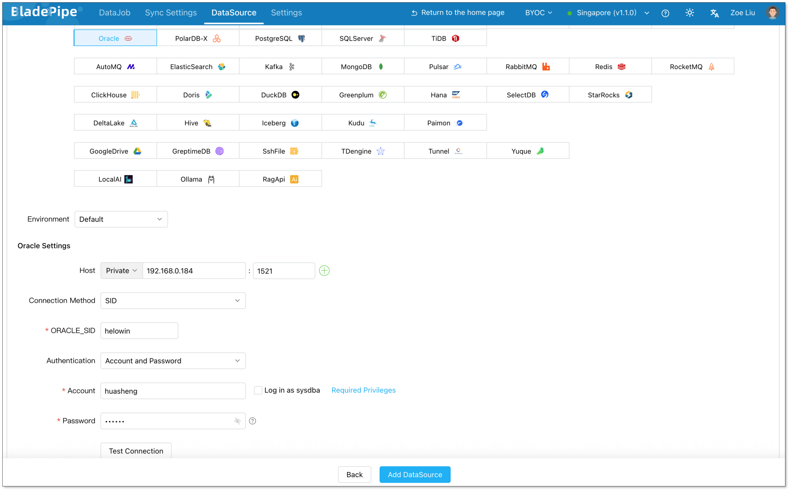
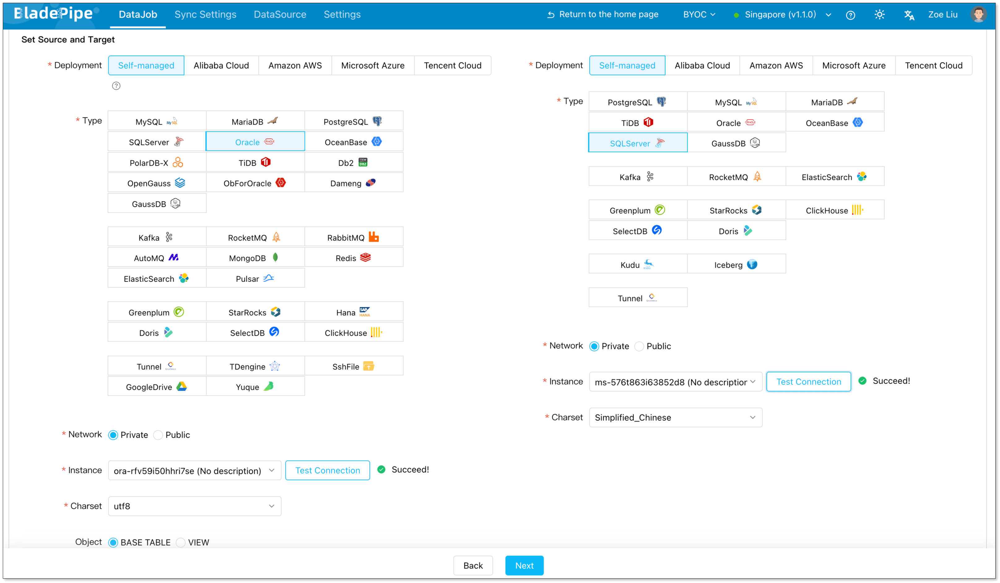
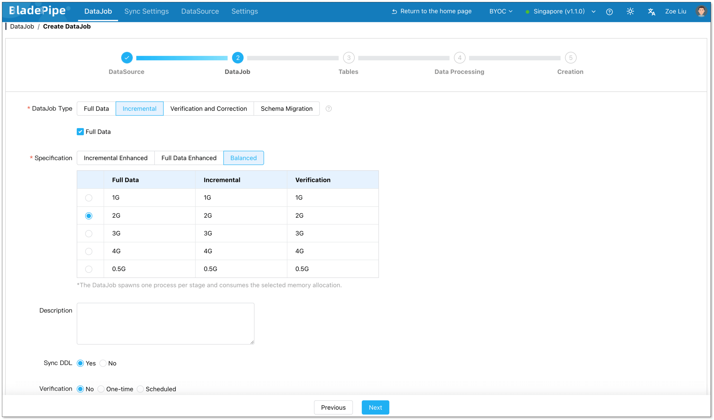
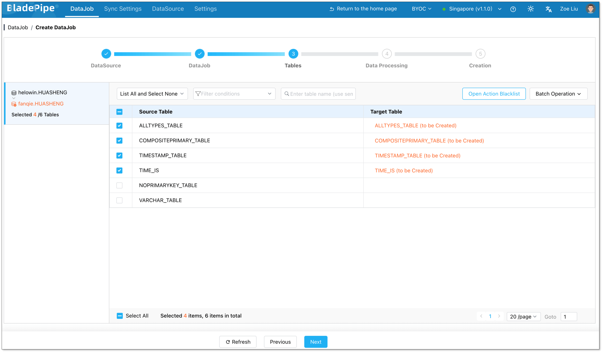
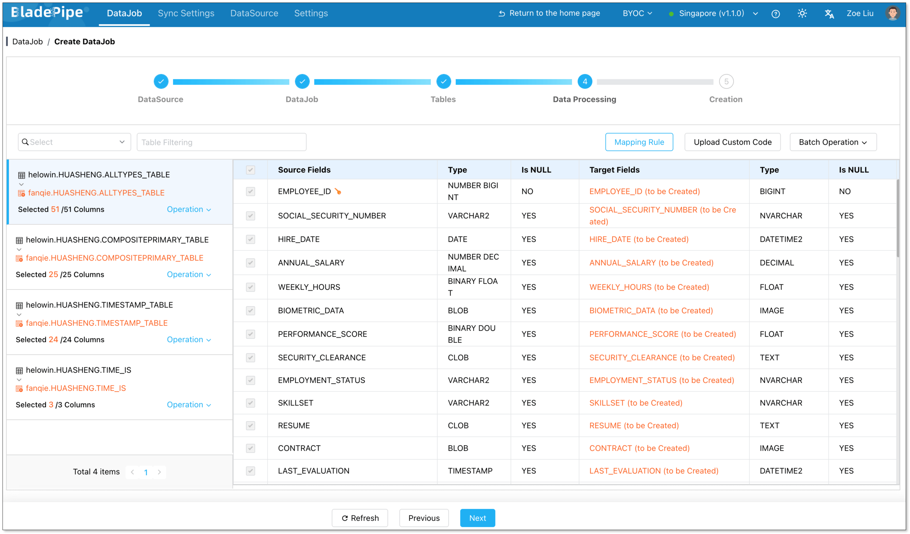
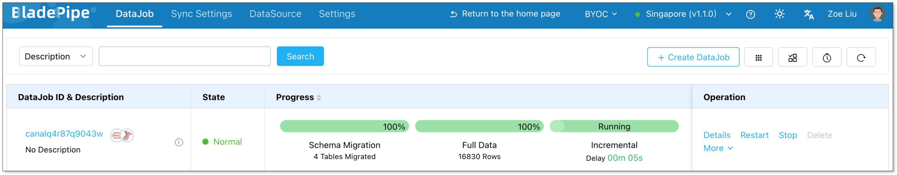

Migrating [Oracle](/connector/oracle/) to [SQL Server](/connector/sql-server/) requires schema conversion, data type mapping, full data load, change capture during the migration window, validation, and cutover planning.

For small static datasets, a one-time export and import may be enough. For production databases, the safer pattern is **full data load plus incremental CDC sync**: migrate historical data first, keep Oracle changes flowing into SQL Server, validate the target, then cut over with less downtime.

Below are three practical Oracle-to-SQL Server migration paths: Microsoft SSMA, manual scripts, and CDC-based migration with BladePipe.

<!-- truncate -->

## Quick Recommendation

| Scenario | Best Fit | Why |
| :--- | :--- | :--- |
| Schema assessment and conversion | Microsoft SSMA for Oracle | It is Microsoft's official Oracle-to-SQL Server migration assistant. |
| Small one-time table export | Manual CSV or flat-file scripts | Simple enough when data is small, stable, and downtime is acceptable. |
| Low-downtime production migration | CDC-based pipeline | Full load plus incremental sync keeps SQL Server current before cutover. |
| Ongoing Oracle-to-SQL Server replication | CDC-based pipeline | The target stays synchronized after the first migration finishes. |

## Why Migrate Oracle to SQL Server?

Oracle and SQL Server are both enterprise relational databases, but teams often move or replicate Oracle data into SQL Server for:

- **Reporting isolation**: Run Power BI, SSRS, or analytical queries without putting load on Oracle OLTP systems.
- **Cost control**: Reduce dependency on expensive Oracle workloads when SQL Server fits the downstream use case.
- **Microsoft ecosystem integration**: Serve SQL Server-based applications, BI tools, and Azure analytics services.
- **Modernization**: Move selected Oracle workloads into a SQL Server environment during an application or platform migration.
- **Low-downtime cutover**: Keep SQL Server synchronized while applications still write to Oracle.

If your goal is broader Oracle modernization, see [Oracle Database Alternatives](../data_insights/oracle_database_alternatives.md).

## Key Challenges in Oracle-to-SQL Server Migration

### Schema and SQL Conversion

Oracle and SQL Server differ in schemas, stored procedures, packages, triggers, sequences, indexes, constraints, and SQL dialects. Automated tools can convert many objects, but complex PL/SQL needs review.

### Data Type Mapping

Common mapping decisions include:

| Oracle Type | SQL Server Target | Notes |
| :--- | :--- | :--- |
| `NUMBER` | `DECIMAL`, `INT`, `BIGINT`, or `FLOAT` | Choose based on precision, scale, and business meaning. |
| `VARCHAR2` | `VARCHAR` or `NVARCHAR` | Use `NVARCHAR` when Unicode support is required. |
| `DATE` | `DATETIME2` | Oracle `DATE` includes time; avoid losing time components. |
| `TIMESTAMP` | `DATETIME2` | Check fractional-second precision. |
| `CLOB` | `VARCHAR(MAX)` or `NVARCHAR(MAX)` | Depends on encoding and consumer expectations. |
| `BLOB` | `VARBINARY(MAX)` | Test large object performance separately. |

### Initial Load and CDC Handoff

A low-downtime migration needs a clean handoff from full load to incremental sync. If the pipeline misses Oracle changes during the handoff, SQL Server may never match the source.

### Data Consistency

Row counts are not enough. Production validation should compare row counts, checksums, key ranges, sampled records, and business-critical tables. For ongoing sync, validation should run after the first load and during incremental replication. See [Data Verification](../data_insights/data_verification.md) for a deeper checklist.

### Performance Impact

Large exports, full-table scans, or trigger-based capture can slow production Oracle systems. Log-based [Oracle CDC](../data_insights/oracle_change_data_capture.md) has lower source impact than repeated queries or manual exports.

## Method 1: Use Microsoft SSMA for Oracle

[SQL Server Migration Assistant for Oracle](https://learn.microsoft.com/en-us/sql/ssma/oracle/sql-server-migration-assistant-for-oracle-oracletosql?view=sql-server-ver17) is Microsoft's migration tool for moving Oracle databases to SQL Server and Azure SQL.

SSMA is a strong first step when you need to assess and convert Oracle schemas before migration.

### Typical SSMA Workflow

1. Install SSMA for Oracle and the required Oracle provider.
2. Connect SSMA to the Oracle source.
3. Select the schemas and objects to migrate.
4. Generate an assessment report for conversion issues.
5. Review and adjust data type mappings.
6. Convert Oracle schema objects to SQL Server objects.
7. Synchronize the converted schema with SQL Server.
8. Migrate data and validate the result.

Microsoft's [Oracle to SQL Server migration guide](https://learn.microsoft.com/en-us/sql/sql-server/migrate/guides/oracle-to-sql-server?view=sql-server-ver17) also recommends pre-migration assessment, schema conversion, data migration, validation, and post-migration optimization.

### Where SSMA Works Well

- Schema discovery and assessment
- Data type mapping review
- Converting many Oracle objects to SQL Server
- One-time migration projects where downtime is acceptable
- Teams that want a Microsoft-supported starting point

### SSMA Limitations to Plan For

SSMA is not a continuous CDC replication platform. If applications keep writing to Oracle during a long migration, you still need a way to capture new changes, replay them into SQL Server, validate the target, and cut over safely.

## Method 2: Manual Export and Import

Manual migration can work for small, stable datasets. Instead of using Oracle Data Pump `.dmp` files as the main path, export query results into CSV or flat files that SQL Server can load.

Oracle Data Pump is useful inside the Oracle ecosystem, but its dump files are Oracle-specific. For Oracle-to-SQL Server migration, CSV, SQL scripts, SSIS, or custom ETL scripts are easier to load into SQL Server.

### Step 1: Export Oracle Data

Use SQL Developer, SQLcl, SQL*Plus, or custom scripts to export selected tables into CSV files.

```sql
SELECT *
FROM schema_name.orders
ORDER BY id;
```

For large tables, export in key ranges or time ranges so failed batches can resume without repeating the entire table.

### Step 2: Convert Data Types and Formats

Normalize values before loading:

- Convert dates and timestamps to a SQL Server-compatible format.
- Escape delimiters and quotes in text columns.
- Decide how to represent `NULL`.
- Convert `CLOB` and `BLOB` data carefully.
- Preserve numeric precision for `NUMBER` columns.

### Step 3: Create Target Tables in SQL Server

Create SQL Server tables with the chosen data type mappings, indexes, constraints, and identity or sequence strategy.

### Step 4: Load Data into SQL Server

Use `BULK INSERT`, `bcp`, or SSIS to load the exported files.

```sql
BULK INSERT dbo.orders
FROM 'C:\data\orders.csv'
WITH (
  FORMAT = 'CSV',
  FIRSTROW = 2,
  FIELDTERMINATOR = ',',
  ROWTERMINATOR = '0x0a'
);
```

### Step 5: Validate the Result

Compare Oracle and SQL Server by table counts, key ranges, checksums, and sampled records. Manual validation becomes harder as table count and data volume grow.

### Manual Method Limitations

- No built-in CDC for changes during migration
- Higher downtime for large databases
- Manual schema and data type handling
- Weak failure recovery
- Limited monitoring and drift detection
- More scripts to maintain as scope grows

## Method 3: CDC-Based Migration and Sync with BladePipe

For production migration, use a CDC pipeline when SQL Server must stay close to Oracle while the source remains online.

[BladePipe](https://www.bladepipe.com/) is a real-time data integration platform that supports Oracle-to-SQL Server migration and replication with full load, incremental sync, schema migration, data validation, monitoring, and recovery.

A CDC-based workflow can:

- Load historical Oracle data into SQL Server
- Capture Oracle changes after the full load starts
- Apply inserts, updates, and deletes to SQL Server
- Validate data before cutover
- Resume from checkpoints after interruption
- Continue replication if SQL Server remains a downstream system

[](https://www.bladepipe.com/login/)

### Step 1: Prepare Oracle and SQL Server

Before creating the pipeline, confirm network access, credentials, and source prerequisites.

- [Required privileges for Oracle](/docs/dataMigrationAndSync/datasource_func/Oracle/privs_for_oracle/)
- [Required privileges for SQL Server](/docs/dataMigrationAndSync/datasource_func/SqlServer/privs_for_sqlserver/)

### Step 2: Add Oracle and SQL Server DataSources

Log in to [BladePipe Cloud](https://www.bladepipe.com/login/) and connect both databases.

1. Go to **DataSource** > [**Add DataSource**](https://www.bladepipe.com/docs/operation/datasource_manage/add_self_maintain_ds/).
2. Configure the source and target:
   - **Deployment:** Self-managed
   - **Type:** Oracle / SQL Server
   - **Host:** Database host or IP
   - **Authentication:** Database user and password
3. Click **Add DataSource**.



### Step 3: Create the Oracle-to-SQL Server DataJob

1. Go to **DataJob** > [**Create DataJob**](https://www.bladepipe.com/docs/operation/job_manage/create_job/create_full_incre_task/).
2. Select Oracle as the source and SQL Server as the target.
3. Click **Test Connection** for both sides.



### Step 4: Choose Full Load Plus Incremental Sync

For one-time migration, select **Full Data**. For low-downtime migration or continuous replication, select **Incremental** together with **Full Data**.



This setup lets BladePipe load existing Oracle data first, then keep applying new Oracle changes to SQL Server.

### Step 5: Select Tables and Columns

Select the Oracle tables and columns to migrate.



Review the target column mappings and exclude columns that should not move.



### Step 6: Start and Monitor the DataJob

Confirm the DataJob and start the migration.



Monitor full load progress, incremental latency, errors, and validation results. If the job is interrupted, checkpoint-based recovery helps continue without restarting the whole migration.

## Oracle to SQL Server Migration Comparison

| Area | Microsoft SSMA | Manual Scripts | BladePipe CDC Pipeline |
| :--- | :--- | :--- | :--- |
| Best for | Schema assessment and one-time migration | Small static datasets | Low-downtime migration and ongoing replication |
| Schema conversion | Strong | Manual | Automated schema migration with mapping review |
| Full data load | Supported | Supported | Supported |
| Incremental CDC sync | Not the main focus | Not built in | Built in |
| Source impact | Depends on migration workload | Can be high for exports | Lower with log-based CDC |
| Failure recovery | Project and task dependent | Manual restart or rerun | Checkpoint-based resume |
| Validation | Reports and manual checks | Manual checks | Built-in verification and correction workflows |
| Operational effort | Medium | Medium to high | Lower after setup |

## Cutover Checklist

Before switching applications or reports to SQL Server, confirm:

- Target schemas, indexes, and constraints are ready.
- Full load is complete and incremental replication lag is close to zero.
- Inserts, updates, deletes, row counts, and checksums have been validated.
- Application SQL differences have been remediated.
- A rollback plan exists if cutover fails.

## FAQ

### What is the best way to migrate Oracle to SQL Server?

Use SSMA when schema conversion is the main task and downtime is acceptable. Use a CDC-based pipeline like BladePipe when you need low downtime, ongoing sync, recovery, and validation during migration.

### Can I migrate Oracle to SQL Server with low downtime?

Yes. The common pattern is full load plus incremental CDC. Historical rows are loaded first, new Oracle changes continue flowing into SQL Server, and cutover happens after validation and low replication lag.

### How do Oracle data types map to SQL Server?

Common mappings include `NUMBER` to `DECIMAL` or integer types, `VARCHAR2` to `VARCHAR` or `NVARCHAR`, `DATE` to `DATETIME2`, `CLOB` to `VARCHAR(MAX)` or `NVARCHAR(MAX)`, and `BLOB` to `VARBINARY(MAX)`. Review precision, encoding, and application behavior before migration.

### Can Oracle schema changes be synced to SQL Server?

Yes, but it depends on the tool and the DDL type. Manual scripts require manual changes on both sides. CDC-based tools can automate many schema changes, but production teams should still define which DDL operations are allowed during migration.

### Is Oracle to SQL Server replication the same as SQL Server CDC?

No. Oracle-to-SQL Server replication is the end-to-end movement of data from Oracle into SQL Server. SQL Server CDC is a SQL Server feature for capturing changes inside SQL Server itself.

**Related Oracle Migration Guides**

- [Oracle to ClickHouse](./oracle_clickhouse_sync.md)
- [Oracle to Elasticsearch](./oracle_es_sync.md)
- [Oracle to PostgreSQL](./migrate_oracle_to_postgresql.md)
- [Oracle to Kafka](./stream_data_from_oracle_to_kafka.md)
