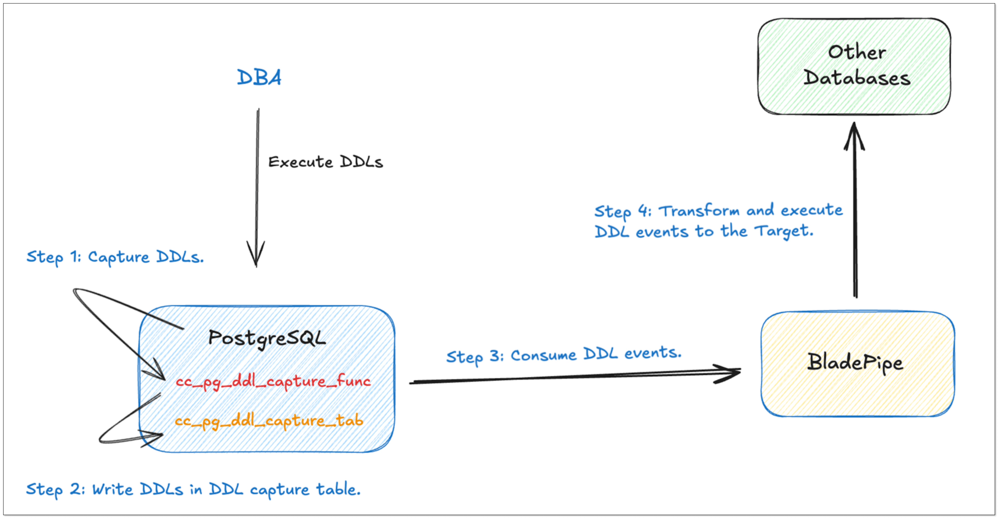
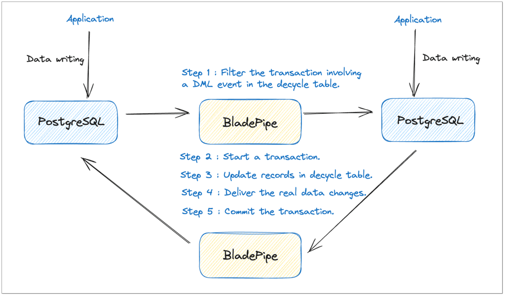
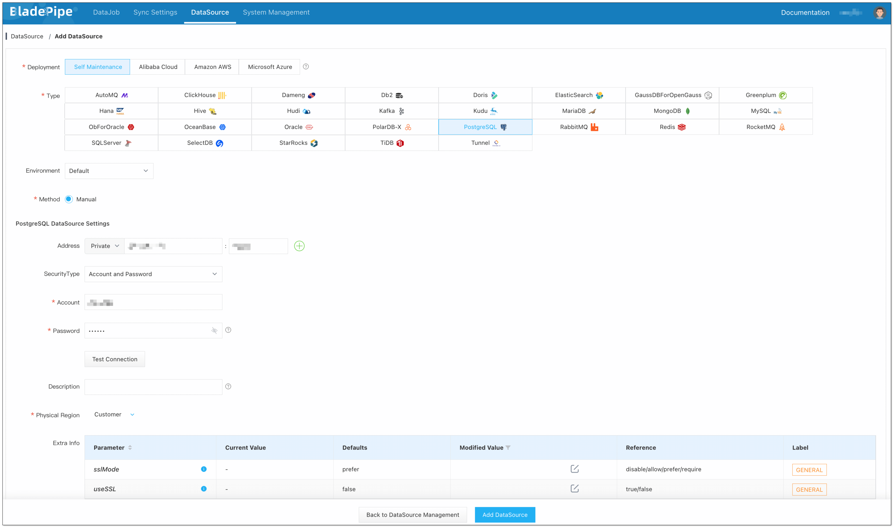
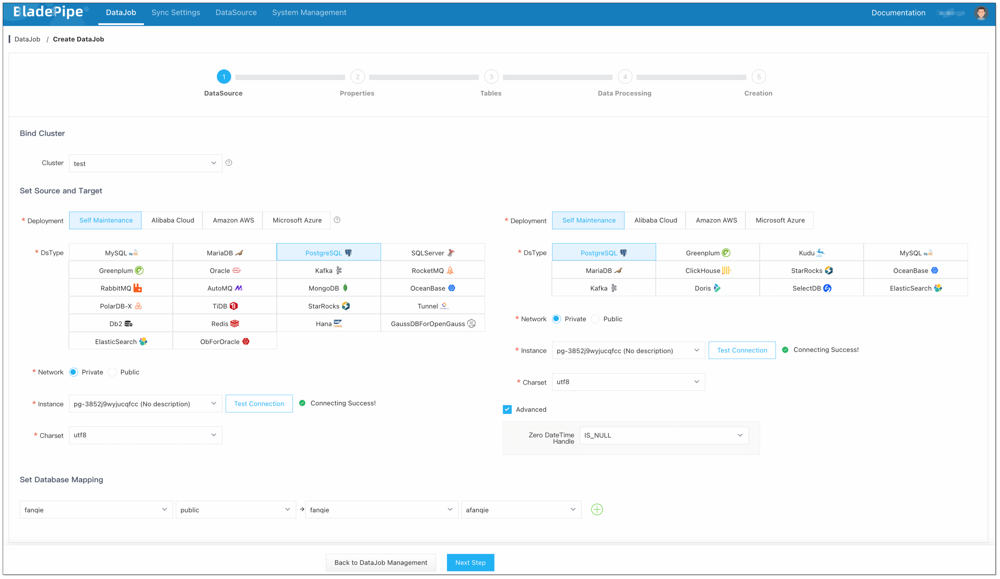
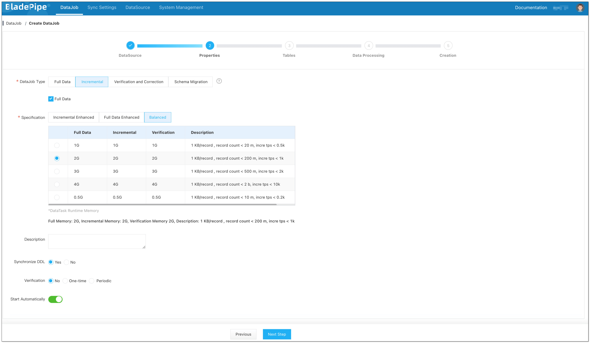
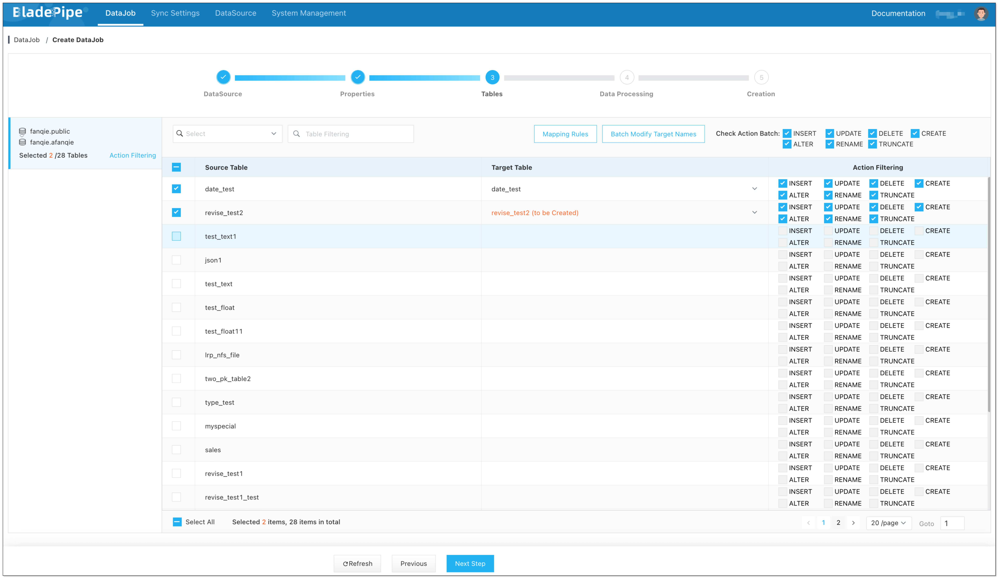
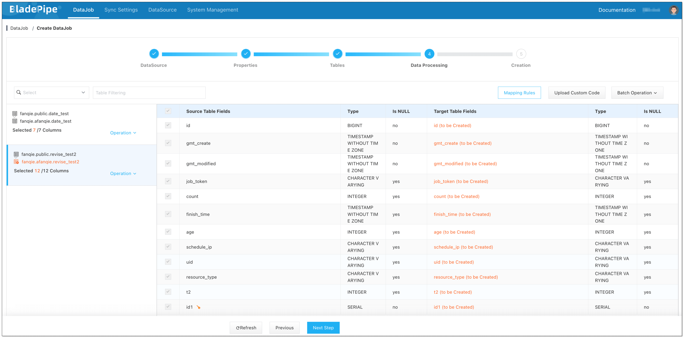
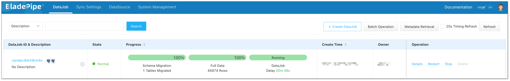

## Overview

PostgreSQL is a widely-used database system with over 35 years of development. It not only has the capabilities of a standard relational database, but also excels in executing complex SQL queries.

Users often utilize PostgreSQL for both online transaction processing (OLTP) and some data analysis tasks. This makes it important to move data from PostgreSQL to PostgreSQL.

This tutorial introduces how to sync data from PostgreSQL to PostgreSQL using [BladePipe](https://www.bladepipe.com) in minutes.

## Highlights

### PostgreSQL Logical Replication

BladePipe tracks the incremental data through the logical replication in PostgreSQL.

Publications are associated with all the tables involved in a DataJob. If the subscriptions of the DataJob are modified, the tables in the Publication are automatically changed accordingly.

### DDL Sync with Triggers

DDL synchronization is essential for online database disaster recovery and other use cases, but PostgreSQL logical replication does not involve the replication of DDLs.

To address this issue, we adopt a widely-used solution, that is to use triggers to capture DDL operations and automatically write them into a regular table `cc_pg_ddl_capture_tab`. BladePipe can subscribe to this table to obtain DDL operations. 

This mechanism is consistent with that of regular incremental DML sync, thus ensuring the correct order of DDLs and related DML events of the table.

### Bidirectional Sync Loop Prevention

When using online databases, active geo-redundancy is usually one of the mandatory requirements. For data movement tools, it is crucial to prevent circular data replication during data synchronization.

To avoid loops in the bidirectional data synchronization between PostgreSQL databases, we mark the DML operations of the same transaction.

An additional decycle table is created. When BladePipe writes data to the target database, the DML events of the same transaction are recorded in the decycle table.

If BladePipe retrieves the event from the decycle table in the PostgreSQL instance, it ignores all operations of the current transaction, thus preventing circular data replication.

## Procedure

### Step 1: Modify PostgreSQL wal_level

1. Please refer to [Permissions Required for PostgreSQL](https://www.bladepipe.com/docs/dataMigrationAndSync/datasource_func/PostgreSQL/privs_for_pg/) to create a user and grant the necessary permissions.
2. Set PostgreSQL's **wal_level** to **logical**.

   :::info
   For self-managed databases, you can modify the **postgresql.conf** file to set **wal_level=logical** and **wal_log_hints=on**.
   :::

3. Configure network permissions for the account.
  
   :::info
   For self-managed databases, you can modify the **pg_hba.conf** file and add the following configurations:
   - host replication &lt;sync_user&gt; &lt;CIDR_address&gt; md5 
   - host &lt;sync_database&gt; &lt;sync_user&gt; &lt;CIDR_address&gt; md5 
   - host postgres &lt;sync_user&gt; &lt;CIDR_address&gt; md5
   :::

4. Restart PostgreSQL to apply the changes.

### Step 2: Install BladePipe

Follow the instructions in [Install Worker (Docker)](https://www.bladepipe.com/docs/productOP/byoc/installation/install_worker_docker/) or [Install Worker (Binary)](https://www.bladepipe.com/docs/productOP/byoc/installation/install_worker_binary/) to download and install a BladePipe Worker.

### Step 3: Add DataSources

1. Log in to the [BladePipe Cloud](https://cloud.bladepipe.com).
2. Click **DataSource** > **Add DataSource**.
3. Select the source and target DataSource type, and fill out the setup form respectively.

### Step 4: Create a DataJob

1. Click **DataJob** > [**Create DataJob**](https://www.bladepipe.com/docs/operation/job_manage/create_job/create_full_incre_task/).
2. Select the source and target DataSources, and click **Test Connection** to ensure the connection to the source and target DataSources are both successful.
   
   
3. Select **Incremental** for DataJob Type, together with the **Full Data** option.
   
   
   :::info
   If you select **Sync DDL**, BladePipe will automatically create the corresponding DDL capture triggers and events, which requires privileged permissions.
   :::

4. Select the tables to be replicated.
   
   
5. Select the columns to be replicated.
   
   
   :::info
   If you need to select specific columns for synchronization, you can create the corresponding tables in the Target in advance.
   :::

6. Confirm the DataJob creation.
   
   :::info
   The DataJob creation process involves several steps. Click **Sync Settings** > [**ConsoleJob**](https://www.bladepipe.com/docs/operation/job_setting/console_job_manage/), find the DataJob creation record, and click **Details** to view it.
   
   The DataJob creation with a source PostgreSQL instance includes the following steps:
   - Schema migration 
   - Initialization of DDL capture triggers and tables 
   - Initialization of offset for PostgreSQL incremental data replication 
   - Allocation of DataJobs to BladePipe Workers 
   - Creation of DataJob FSM (Finite State Machine) 
   - Completion of DataJob creation
   :::

7. Now the DataJob is created and started. BladePipe will automatically run the following DataTasks:
    - **Schema Migration**: The schemas of the source tables will be migrated to the target database.
    - **Full Data Migration**: All existing data from the source tables will be fully migrated to the target database.
    - **Incremental Synchronization**: Ongoing data changes will be continuously synchronized to the target database with ultra-low latency.
  
   