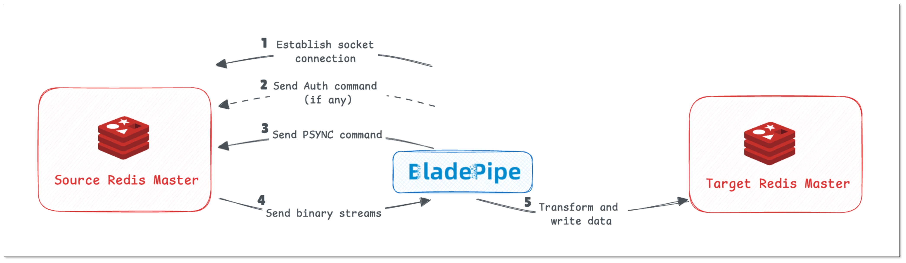
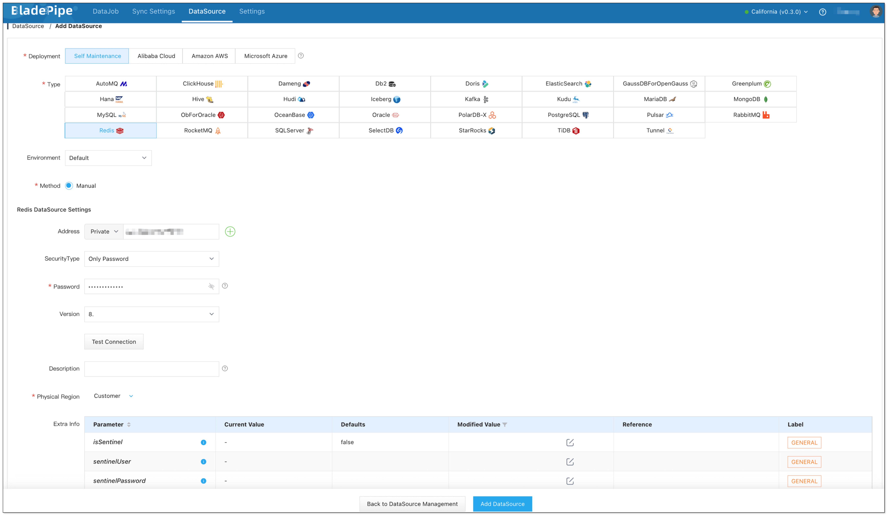
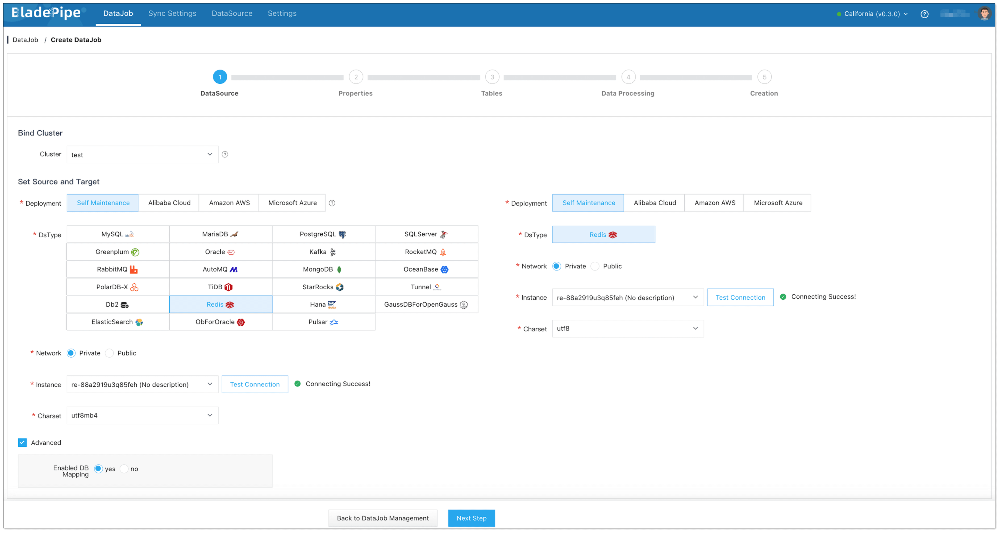
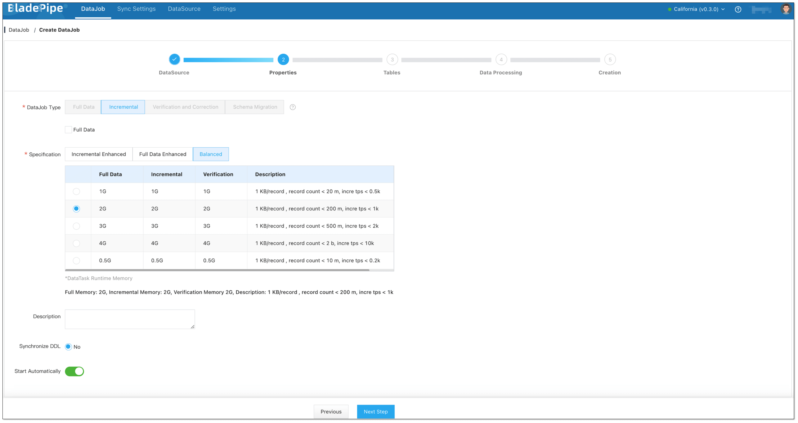
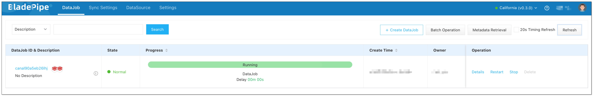

## Overview

Redis is an open-source, in-memory database for key-value pairs and data structure store. It is commonly used for caching, real-time data processing, and distributed locking. It supports persistence, master-slave replication, and high-availability, suitable for use cases requiring high-concurrency and low-latency.

In this tutorial, we depicts a no-code intuitive way to sync data from Redis to Redis using [BladePipe](https://www.bladepipe.com). With BladePipe, even a non-developer can finish Redis data replication in a few clicks.

## Principle

BladePipe realizes Redis-Redis data sync based on Redis PSYNC command. 

1. BladePipe establishes a Socket connection with a source Redis Master.
2. BladePipe sends an Auth command (if any).
3. BladePipe sends **PSYNC** commands to Redis Master, disguised as a **Redis Slave** node.
4. The Redis Master node continuously pushes **binary streams** to the Redis Slave node disguised by BladePipe.
5. BladePipe parses the binary streams into a Redis command and sends it to the target Redis for execution.

## Limitation
Cloud-hosted Redis data sync is not supported yet, because cloud-hosted Redis adopts the forward proxy, making the PSYNC command invalid.

## Procedure

### Step 1: Install BladePipe

Follow the instructions in [Install Worker (Docker)](https://www.bladepipe.com/docs/productOP/byoc/installation/install_worker_docker) or [Install Worker (Binary)](https://www.bladepipe.com/docs/productOP/byoc/installation/install_worker_binary) to download and install a BladePipe Worker.

### Step 2: Add DataSources

1. Log in to the [BladePipe Cloud](https://cloud.bladepipe.com).
2. Click **DataSource** > **Add DataSource**.
3. Select the source and target DataSource type, and fill out the setup form respectively.

### Step 3: Create a DataJob

1. Click **DataJob** > [**Create DataJob**](https://doc.bladepipe.com/operation/job_manage/create_job/create_full_incre_task).
2. Select the source and target DataSources, and click **Test Connection** to ensure the connection to the source and target DataSources are both successful.
3. In **Advanced** setting below the source instance, select **Enable DB Mapping**: yes / no.
    
   :::info
   If you enable DB mapping, please make sure that the number of DBs in the source instance and the target instance is the same.
   :::

   

4. Select **Incremental** for DataJob Type, together with the **Full Data** option.

    

5. Confirm the DataJob creation.
   
   :::info
   The DataJob creation process involves several steps. Click **Sync Settings** > [**ConsoleJob**](https://doc.bladepipe.com/operation/job_setting/console_job_manage), find the DataJob creation record, and click **Details** to view it.

   The DataJob creation with a source Redis instance includes the following steps:
    - Allocation of DataJobs to BladePipe Workers
    - Creation of DataJob FSM (Finite State Machine)
    - Completion of DataJob creation
   :::

6. Now the DataJob is created and started. BladePipe will automatically run the following DataTasks:
   - **Full Data Migration**: All existing data from the source instance will be fully migrated to the target instance.
   - **Incremental Synchronization**: Ongoing data changes will be continuously synchronized to the target database with ultra-low latency.
  
   

