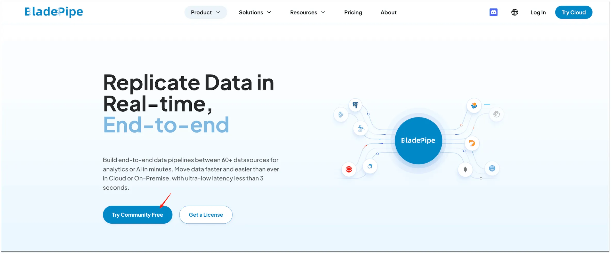
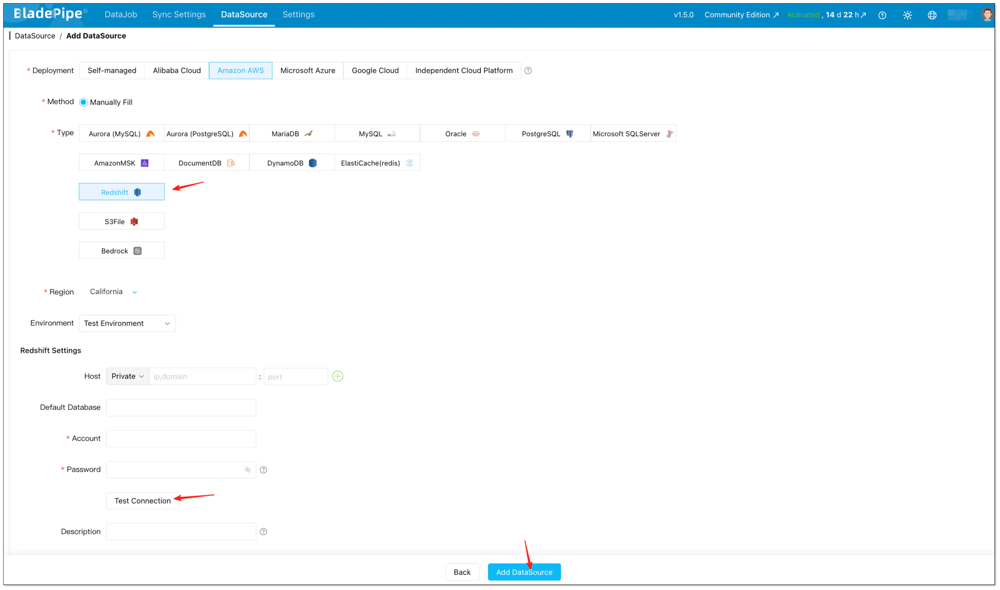
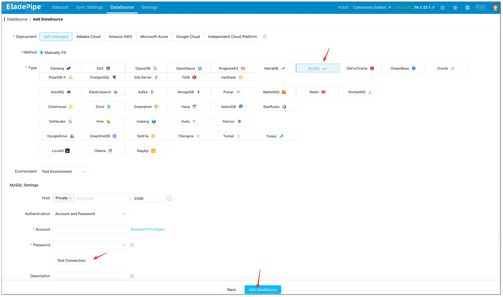
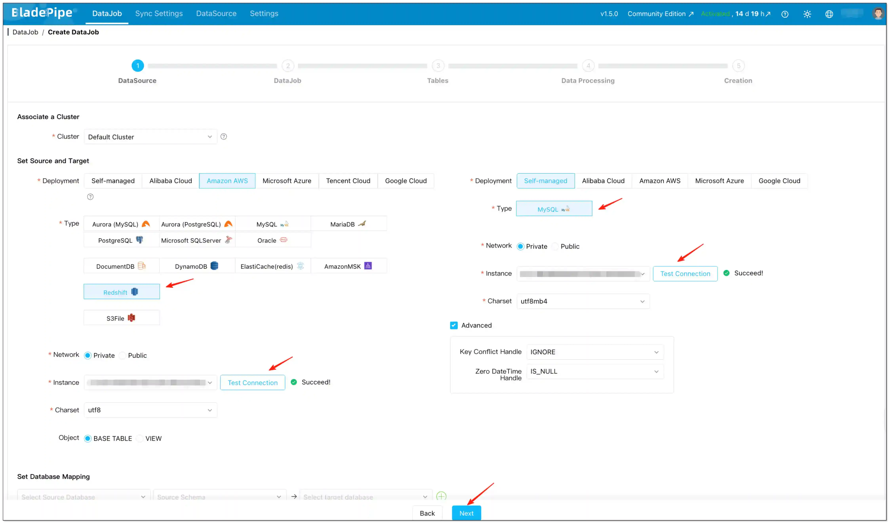
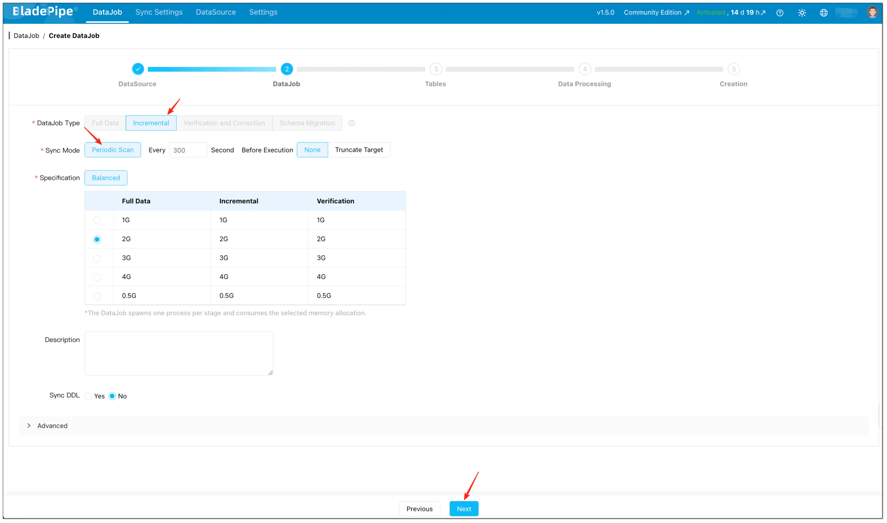
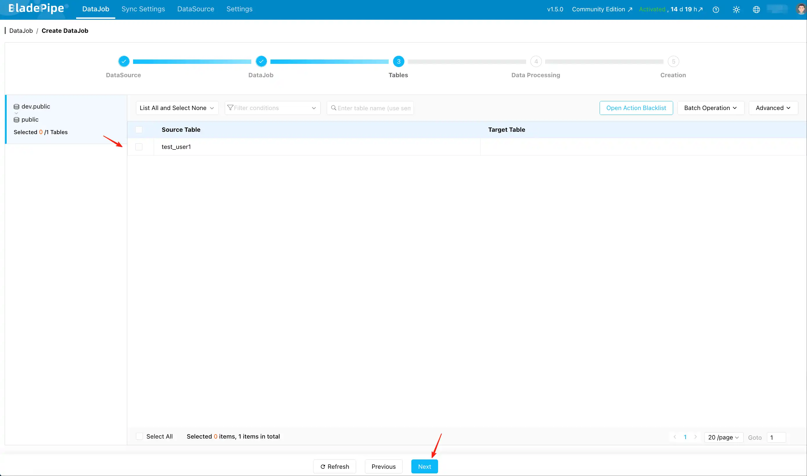
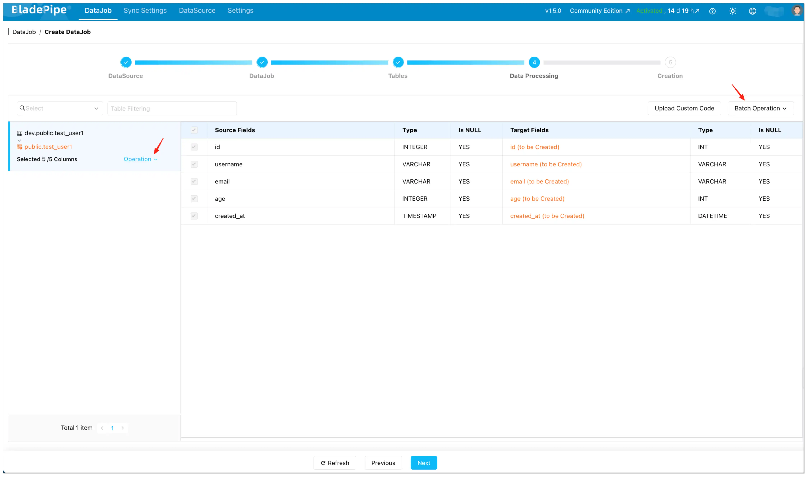
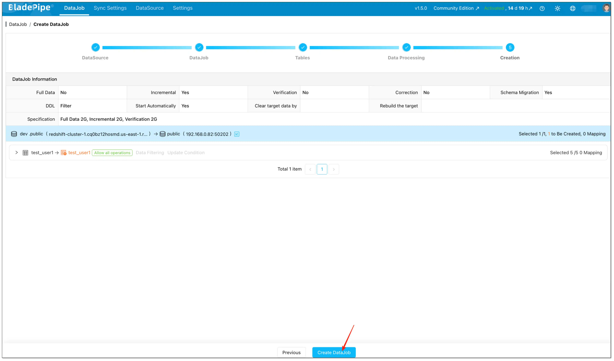

[**Reverse ETL**](../data_insights/reverse_etl.md) pushes curated data **from a data warehouse to an operational database** so downstream teams can actually use it—think CRMs, internal tools, feature stores, and MySQL-backed services.

This guide focuses on one of the most common Reverse ETL use cases: **syncing Amazon Redshift to MySQL incrementally**. With **BladePipe Scheduled Scan**, you can run a reliable **Redshift → MySQL data pipeline** on a fixed interval and keep MySQL refreshed without running a CDC stack.

In this tutorial, you'll set up a **Redshift to MySQL Reverse ETL** job end-to-end:

- Connect Amazon Redshift and MySQL as DataSources
- Create a Scheduled Scan (Periodic Scan) DataJob
- Enable incremental sync using a timestamp Incremental Field
- Apply settings that keep your Redshift → MySQL sync stable in production

## When Scheduled Scan is the right Reverse ETL?

Scheduled Scan is a strong fit for Redshift to MySQL incremental sync when:

- You want a **simple operational model** (scan on a schedule, write to MySQL).
- A small delay is fine (for example, refresh every 5 minutes).
- Your source tables have a reliable **timestamp column** you can use for incremental reads (for example, `updated_at`).

## What is "Scheduled Scan" in BladePipe?

[BladePipe **Scheduled Scan (Reverse ETL)**](https://www.bladepipe.com/docs/operation/job_manage/create_job/create_retl_job/) runs a scan on a fixed schedule and writes the scan results to the target. It's designed for:

- Source systems where CDC isn't available (or isn't worth operating).
- Workloads that refresh on a predictable cadence (every _N_ seconds or minutes).
- "Near real-time" sync where minute-level lag is acceptable.

If you want the full UI walkthrough, read the step-by-step guide following.

## How Scheduled Scan does Redshift → MySQL incremental sync

Scheduled Scan supports an **Incremental Field**:

- The Incremental Field is a **time column** that acts like a cursor.
- Each cycle, BladePipe reads rows whose time is **later than the last completed scan**, and writes those rows to MySQL.

Important limitation: an Incremental Field scan **does not capture hard deletes** from Redshift, because deletes remove rows and there is nothing left to scan.

Practical ways to handle "deletes" in Reverse ETL:

- **Soft delete**: add `is_deleted` or `deleted_at` and keep syncing incrementally.
- **Full refresh**: for small tables, use **Truncate Target** so MySQL becomes a periodic snapshot of Redshift.

## Before you start (Redshift → MySQL Reverse ETL checklist)

- Pick the **Incremental Field** in Redshift (usually `updated_at` or an ingestion timestamp).
  - It should be sortable, comparable, and updated on every change you want to push to MySQL.
- Decide how you want MySQL to behave:
  - **Incremental mirror** (fast, no hard deletes), or
  - **Periodic snapshot** (full refresh with Truncate Target).
- Start with a conservative **scan interval** and tighten later (300 seconds is a practical baseline).

## Step-by-step: Create a Redshift to MySQL Scheduled Scan DataJob

If you run into permission errors when connecting to MySQL, verify the required privileges for the MySQL DataSource: [Required Privileges for MySQL](https://www.bladepipe.com/docs/dataMigrationAndSync/datasource_func/MySQL/privs_for_mysql/).

### Step 1: Install BladePipe

If you haven't installed BladePipe yet, go to the [homepage](https://www.bladepipe.com/) and click **"Try Community Free"**：

### Step 2: Add Redshift and MySQL as DataSources

1. After installation, navigate to the on-premise console at `http://${ip}:8111`. To begin, log in with the following credentials:
   - Account: `walter.bp@bladepipe.com`
   - Password: `bp_onpremise_2024`
2. Go to **DataSource** → **Add DataSource**.
3. Add **Redshift** (source) and **MySQL** (target), then click **Test Connection** to validate connectivity.

### Step 3: Configure the DataJob (Scheduled Scan / rETL)

1. Go to **DataJob** and start creating a new DataJob.

2. Select:
   - **DataJob Type**: **Incremental**
   - **Sync Mode**: **Periodic Scan**
3. Set the key parameters:
   - **Interval**: how often the scan runs (default is **300 seconds**).
   - **Pre-execution Action**:
     - Choose **None** for incremental sync using an Incremental Field.
     - Choose **Truncate Target** if you want a full refresh per scan (useful when you need deletions reflected and the table is small enough).

### Step 4: Select tables

1. On the **Tables** page, select the Redshift tables you want to sync to MySQL.
2. (Optional) Use **Open Action Blacklist** if you need to filter specific operations.

### Step 5: Configure Incremental Field (the key to "incremental")

1. On the **Data Processing** page, select the columns you want to migrate.
2. Configure **Incremental Field**:
   - **Set individually**: **Operation** → **Incremental Field** (per table)
   - **Set in batches**: **Batch Operation** → **Incremental Field**

If you **skip** Incremental Field, BladePipe performs a **full table scan** on every cycle (useful for snapshot-style refreshes).

### Step 6: Confirm and create

1. On the **Creation** page, verify the settings.
2. Click **Create DataJob**.

## Recommended settings for Redshift → MySQL Reverse ETL

These settings keep your Redshift to MySQL incremental sync stable and easy to operate.

### Interval

- Start with **300 seconds** (or larger) and reduce gradually after the pipeline is stable.

### Pre-execution action

- Incremental Reverse ETL (with Incremental Field): choose **None**.
- Snapshot-style refresh each cycle: choose **Truncate Target** and skip Incremental Field.

### Incremental Field selection

Pick a time column that is:

- Updated on every relevant change (not just on inserts).
- Monotonically increasing _enough_ for your use case (avoid ambiguous timestamps if you update many rows at the same instant).
- Consistent in timezone and semantics (store UTC if possible).

## Common pitfalls in Redshift to MySQL incremental sync (and fixes)

### Incremental sync missed updates

Most of the time, the cause is the Incremental Field:

- It isn't updated on UPDATEs.
- It uses a time source with inconsistent timezone/precision.
- It is nullable or not strictly comparable across rows.

Fix: ensure `updated_at` (or your chosen time field) is set by the application/ETL reliably for every change that should be propagated.

### Deletes don't show up in MySQL

This is expected for Incremental Field scans: **hard deletes can't be discovered by scanning existing rows**.

Fix options:

- Implement soft deletes and sync the delete flag/time.
- Switch to **Truncate Target** full refresh per scan for small tables where deletes must be mirrored.

### The sync is correct, but downstream reads are inconsistent

This is typically a modeling/consumption concern:

- Use a dedicated target schema/table naming convention.
- Consider syncing into "shadow" tables then swapping at the application layer (if your serving architecture supports it).

### Late-arriving updates don't show up when you expect

If upstream pipelines write to Redshift in batches, updates may arrive after a scheduled scan has already run.

Fix options:

- Increase the scan interval to match upstream batch cadence.
- Ensure your Incremental Field reflects the **business update time** you care about (not an earlier event time).

## FAQs

### Why can't I see the "Incremental Field" option?

Either the selected pipeline doesn't support it, or the selected column type isn't supported for that pipeline. For Redshift → MySQL Scheduled Scan, the Incremental Field type is **Timestamp**.

### Can I run Scheduled Scan without an Incremental Field?

Yes. Without an Incremental Field, the job becomes a periodic full scan/refresh workflow.

### How do I know my DataJob is running in Scheduled Scan mode?

In the DataJob list and details page, Scheduled Scan jobs show a distinct "clock" icon so you can quickly identify the sync mode.

### Can I change the scan interval later without recreating the DataJob?

Yes. Scheduled Scan is designed around a configurable interval. Update the interval to tune freshness vs load after the pipeline is stable.

### Does Scheduled Scan require CDC on Redshift?

No. Scheduled Scan is a scan-based Reverse ETL approach: it reads data from Redshift on a schedule and writes to MySQL.
