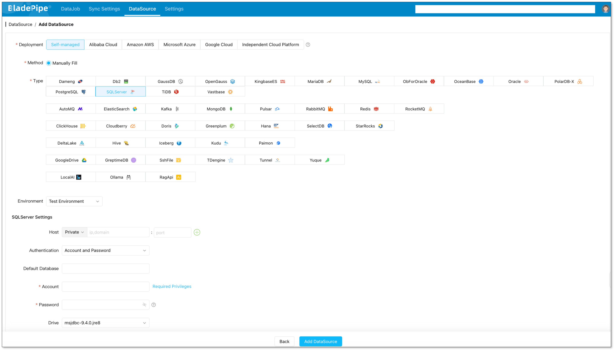
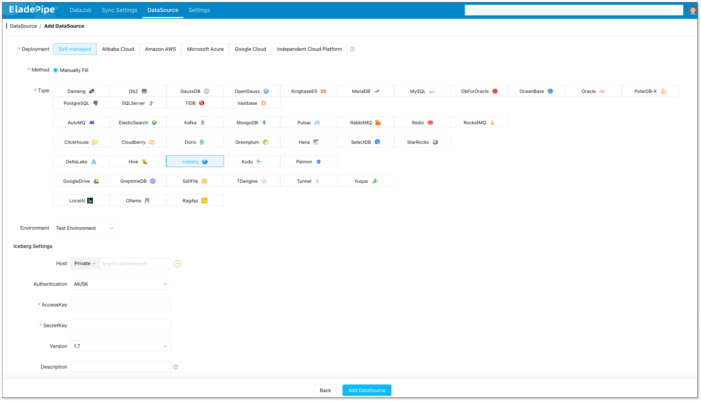
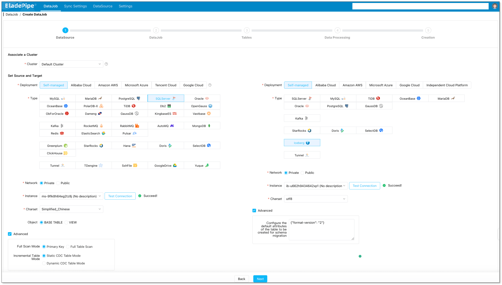
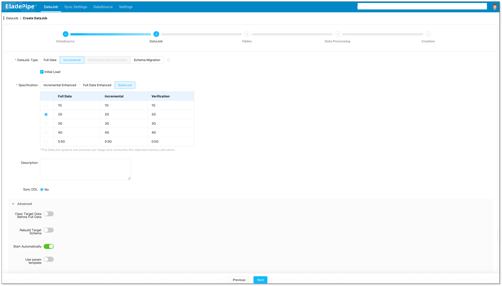
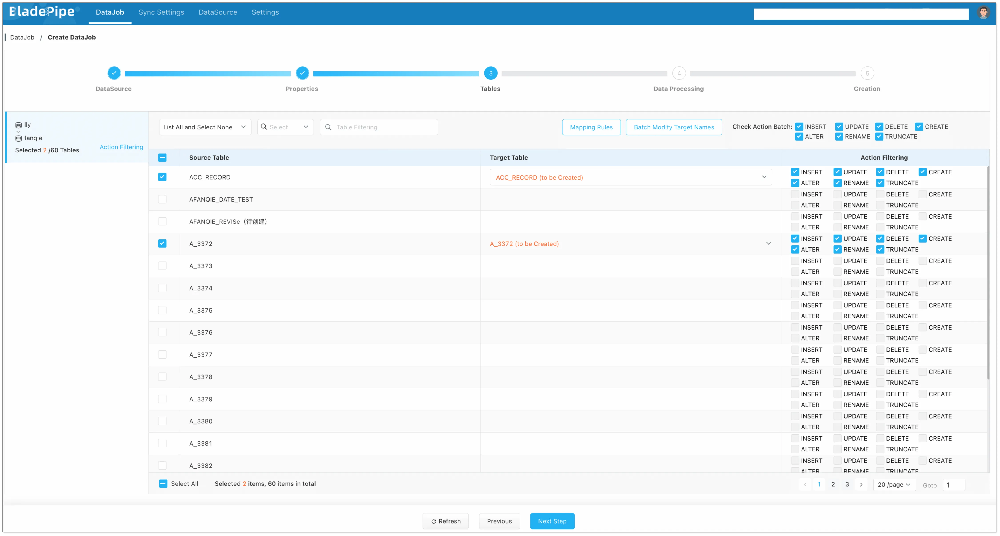

SQL Server is built for transactions. Apache Iceberg is built for modern analytics.

That is exactly why **SQL Server to Apache Iceberg** has become such a valuable pattern for teams building lakehouses, BI platforms, and low-latency analytics pipelines. The hard part is not whether the destination is useful. The hard part is moving live data without breaking schemas, losing updates, or forcing long downtime windows.

This guide shows how to sync SQL Server to Apache Iceberg in a way that is practical for production: start with a full load, keep changes flowing with CDC, validate the target, and cut over with confidence.

## Why Move SQL Server Data to Apache Iceberg?

Apache Iceberg is an open table format for large analytic datasets. Its strength is not just storage. It is the way it organizes metadata, supports schema evolution, and lets multiple engines query the same data consistently. If you want a deeper look at the table-format model, see the [Apache Iceberg homepage](https://iceberg.apache.org/) and its [schema evolution docs](https://iceberg.apache.org/docs/1.7.1/evolution/).

SQL Server, on the other hand, remains a strong OLTP database for applications that need transactions, consistency, and operational reliability. Many teams keep SQL Server exactly where it belongs: powering applications. They then send a copy of the data to Iceberg for analytics, reporting, and downstream processing.

That split is useful because it gives you:

* **Less load on SQL Server** for heavy BI and ad hoc queries
* **A shared analytics layer** that can be read by Spark, Trino, Flink, StarRocks, Doris, and other engines
* **More flexible data modeling** through Iceberg schema evolution
* **Lower lock-in** than a warehouse-only strategy
* **A cleaner path to lakehouse architectures** where one table format serves many compute engines

If your team wants SQL Server to remain the system of record while analytics move elsewhere, Iceberg is a very natural target.

## What Makes SQL Server to Iceberg Hard?

The migration is straightforward in concept, but the details matter.

### 1. SQL Server is transaction-first, Iceberg is analytics-first

SQL Server stores and serves data differently from Iceberg. SQL Server is optimized for row-level transactions. Iceberg stores data in table files and metadata layers so that analytics engines can query large datasets efficiently.

That means the migration is not just a copy job. It is a change in how the data will be consumed.

### 2. Updates and deletes must stay consistent

When users update a row in SQL Server, the target Iceberg table needs to reflect that change correctly. The same is true for deletes. A one-time export is not enough if the downstream analytics layer needs fresh data.

Microsoft’s SQL Server CDC is log-based, which is why it is often the right foundation for this kind of sync. You can review the official [SQL Server CDC documentation](https://learn.microsoft.com/en-us/sql/relational-databases/track-changes/about-change-data-capture-sql-server?view=sql-server-ver16) for the underlying mechanics.

### 3. Schema changes happen in real life

Columns get added. Types get widened. Nullable fields become required. Iceberg supports schema evolution, but your pipeline still needs to carry those changes cleanly from source to target.

### 4. File layout matters in Iceberg

If you dump data into Iceberg without thinking about write patterns, you can end up with poor file sizing, unnecessary metadata overhead, or slow downstream reads. The migration tool needs to write data in a way that is friendly to analytics engines.

### 5. Validation is not optional

For production workloads, row counts alone are not enough. You want a pipeline that helps you verify that the target is complete and consistent before you rely on it for business reporting.

## Three Ways to Build the Pipeline

There are three common ways to move SQL Server data into Apache Iceberg.

| Approach | Best For | Trade-off |
| --- | --- | --- |
| Batch export and import | One-time historical loads or test data | Simple, but you usually lose real-time freshness and may need downtime |
| DIY CDC stack with Kafka/Flink | Teams with strong platform engineering resources | Flexible, but operationally heavy and slower to maintain |
| BladePipe visual CDC pipeline | Production sync with lower operational overhead | Less custom plumbing, but much faster to ship and operate |

For most teams, the third option is the one that actually survives production.

## Why BladePipe Fits This Use Case

[BladePipe](https://www.bladepipe.com/) is designed for exactly the kind of workflow SQL Server to Iceberg needs: **full load plus incremental sync**, low operational overhead, and a visual setup flow that does not force your team to build and maintain an entire CDC stack.

BladePipe supports SQL Server source pipelines and Iceberg targets through the web console. In Managed mode, the console and worker are fully managed, so you only operate through the browser. See the [Managed quickstart](https://www.bladepipe.com/docs/quick/quick_start_mgr/) if you want the no-deployment path.

For this migration pattern, the most useful capabilities are:

* **Schema migration**: Create target structures from source metadata and mapping rules
* **Full data migration**: Load existing SQL Server tables into Iceberg in batches
* **Incremental sync**: Continuously capture INSERT, UPDATE, and DELETE changes
* **DDL sync**: Keep supported schema changes moving downstream
* **Table name mapping**: Control naming rules when source and target conventions differ
* **Target primary key settings**: Re-map keys when the target model needs a different aggregation or merge strategy

BladePipe’s SQL Server connector supports schema migration, full data migration, incremental sync, data verification, subscription modification, table name mapping, and DDL sync. Its Iceberg target supports schema migration, full data migration, incremental sync, subscription modification, table name mapping, and DDL sync for supported operations such as ADD COLUMN and DROP COLUMN.

If your team wants a visual pipeline instead of a hand-built CDC stack, that combination matters.

## Recommended Migration Flow

Here is the cleanest production path.

### Step 1: Decide what should move to Iceberg

Do not start by moving every table in SQL Server.

Start with workloads that benefit from Iceberg the most:

* Reporting tables
* BI datasets
* Historical fact tables
* Append-heavy operational feeds
* Data used by multiple analytics engines

Keep the transactional source system out of scope unless you really need it there.

### Step 2: Prepare SQL Server for CDC

Before you build the pipeline, make sure SQL Server is ready for log-based change capture.

At a minimum, confirm:

* The relevant tables have stable primary keys
* CDC or the required log access is enabled
* The source database can tolerate initial snapshot reads
* The network path from BladePipe to SQL Server is open

This is the point where many teams lose time. A clean source setup saves hours later.

### Step 3: Add SQL Server and Iceberg as DataSources

In [BladePipe](https://www.bladepipe.com/register/), go to **DataSource** > **Add DataSource**.

For SQL Server, use the SQL Server connector documentation as a reference: [SQL Server connector](https://www.bladepipe.com/docs/dataMigrationAndSync/connection/sqlserver2/).  



For Iceberg, use the target configuration page: [Add an Iceberg DataSource](https://www.bladepipe.com/docs/dataMigrationAndSync/datasource_func/Iceberg/props_for_iceberg_ds/).



For Iceberg, you will typically configure:

- **httpsEnabled**: Enable it to set the value as true.
- **catalogName**: Enter a meaningful name, such as glue_&lt;biz_name&gt;_catalog.
- **catalogType**: Fill in GLUE.
- **catalogWarehouse**: The place where metadata and files are stored, such as s3://&lt;biz_name&gt;_iceberg.
- **catalogProps**:
```json
{
  "io-impl": "org.apache.iceberg.aws.s3.S3FileIO",
  "s3.endpoint": "https://s3.<aws_s3_region_code>.amazonaws.com",
  "s3.access-key-id": "<aws_s3_iam_user_access_key>",
  "s3.secret-access-key": "<aws_s3_iam_user_secret_key>",
  "s3.path-style-access": "true",
  "client.region": "<aws_s3_region>",
  "client.credentials-provider.glue.access-key-id": "<aws_glue_iam_user_access_key>",
  "client.credentials-provider.glue.secret-access-key": "<aws_glue_iam_user_secret_key>",
  "client.credentials-provider": "com.amazonaws.glue.catalog.credentials.GlueAwsCredentialsProvider"
}
```

That sounds like a lot, but in practice it is a structured setup rather than a custom integration project.

### Step 4: Create the DataJob

Create a new **DataJob** and choose:



* **Source**: SQL Server
* **Target**: Apache Iceberg
* **Job type**: Full Data + Incremental



This is the key pattern for production migration.

The initial load gives you the historical data. The incremental sync keeps new changes flowing while you validate the target and prepare cutover.

### Step 5: Select tables and columns



Do not blindly sync everything.

Start with the tables that downstream users actually query, then expand once the first pipeline is stable. If you only need a subset of columns for analytics, select the columns that matter instead of moving unnecessary payload.

This reduces storage, speeds up the first sync, and makes validation easier.

### Step 6: Review the Iceberg target layout

Iceberg performs best when the table layout is intentional.

Before you go live, think through:

* Which columns are the right partition candidates
* Whether merge-on-read or similar write behavior fits your workload
* How large your target files should be
* Whether downstream engines need a specific naming convention

You do not need to over-engineer the first version. You do need a layout that is predictable and query-friendly.

### Step 7: Validate before cutover

Before you point users or jobs to the Iceberg target, verify:

* Row counts match expected results
* Sample records are identical
* Updates and deletes are flowing correctly
* Schema changes are being applied as expected

If possible, run the source and target in parallel for a short period so users can compare results safely.

### Step 8: Cut over and keep syncing

Once validation is complete, shift downstream consumers to Iceberg.

At that point, the pipeline stops being a migration tool and becomes part of your permanent data infrastructure. That is often the real win: the same sync flow that helps you migrate can continue to keep analytics fresh.

## Best Practices for SQL Server to Apache Iceberg

If you want this pipeline to age well, keep these rules in mind.

### Keep a stable primary key

Updates and deletes are much easier to reason about when the source tables have stable primary keys. If you are moving highly mutable data, make sure you know how the target should handle record identity.

### Treat schema evolution as a feature, not an afterthought

Iceberg is good at schema evolution, but only if your pipeline is configured to propagate changes intentionally. Do not assume every column change should be ignored. Decide what should pass through and what should be blocked.

### Use Iceberg for analytics, not as a transactional clone

Iceberg is powerful, but it is not SQL Server. The target is best used for analytics, reporting, and lakehouse workloads rather than direct OLTP replacement.

### Validate with real user queries

Row counts are useful. Real queries are better.

Check the queries your analysts and BI tools actually run. If those queries return the right results and perform well, your pipeline is doing its job.

### Keep the initial scope small

The easiest way to fail is to start too broad.

Begin with one business domain, one or two large tables, or a contained reporting workload. Once that works, expand the sync set.

## When This Pattern Is the Right Fit

This approach works especially well when you need one or more of the following:

* A modern analytics layer on top of SQL Server
* A lakehouse foundation that multiple engines can read
* Incremental data freshness without rebuilding the whole stack
* A lower-ops alternative to Kafka + Flink + custom sinks
* A visual or no-code pipeline that the team can maintain

If your real goal is to support BI, reporting, ML feature preparation, or long-term analytics storage, SQL Server to Iceberg is a strong architectural move.

## FAQ

### Why sync SQL Server to Apache Iceberg instead of querying SQL Server directly?

Because SQL Server is usually the operational system. Iceberg gives you an analytics-friendly layer that can serve multiple engines without putting the same pressure on the transactional database.

### Does Apache Iceberg support schema evolution?

Yes. Iceberg was designed to support schema evolution, which is one reason it works well as a long-term analytics table format.

### Can I keep SQL Server and Iceberg in sync in real time?

Yes. The common pattern is initial load plus CDC-based incremental sync, so Iceberg stays fresh while SQL Server continues serving applications.

### Is Iceberg a replacement for SQL Server?

Not for OLTP workloads. Iceberg is better viewed as an analytics and lakehouse target, while SQL Server remains the source of truth for transactional applications.

### What is the easiest way to build the pipeline?

For most teams, a visual CDC tool is the simplest option because it avoids building and maintaining Kafka, Flink, and custom Iceberg sinks from scratch.

## Conclusion

SQL Server to Apache Iceberg is a practical pattern when you want to move analytics off the transactional database and into an open lakehouse format.

The important part is not just copying data. It is keeping historical data, ongoing changes, and schema evolution aligned without turning the migration into a long infrastructure project.

If you want a faster path, BladePipe can handle the full load + incremental sync flow in a visual pipeline, so you can move from SQL Server to Iceberg without stitching together a custom CDC stack.

If you want to test the idea quickly, start with BladePipe’s managed experience and see how far you can get in a few clicks.
