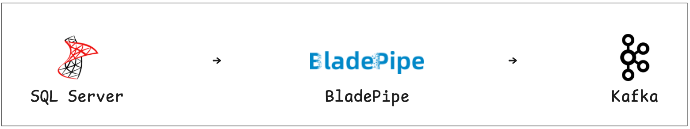
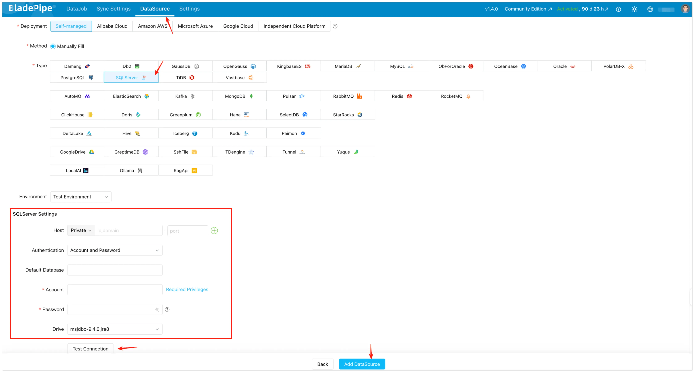
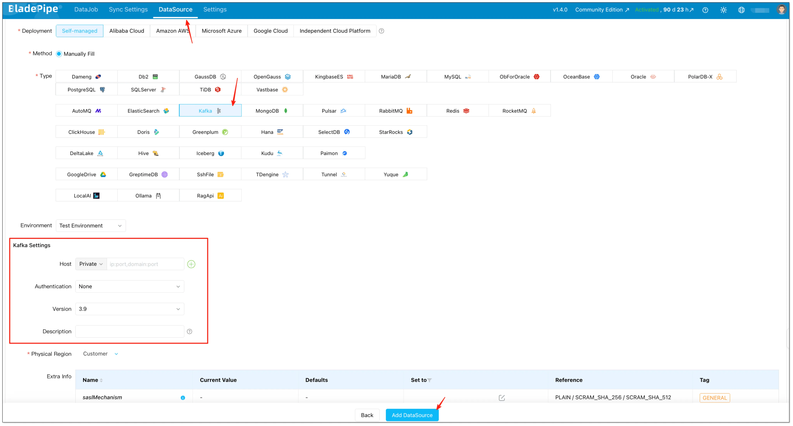
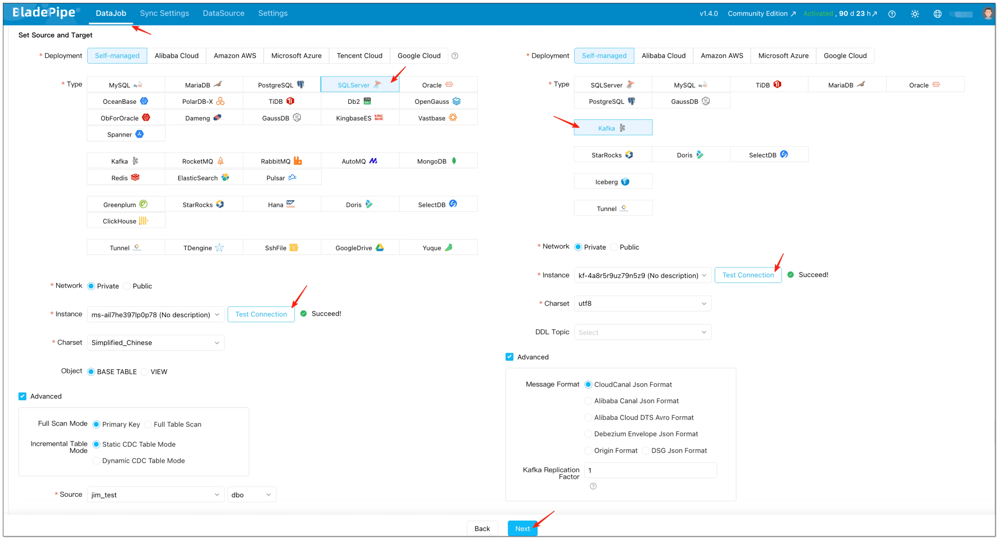
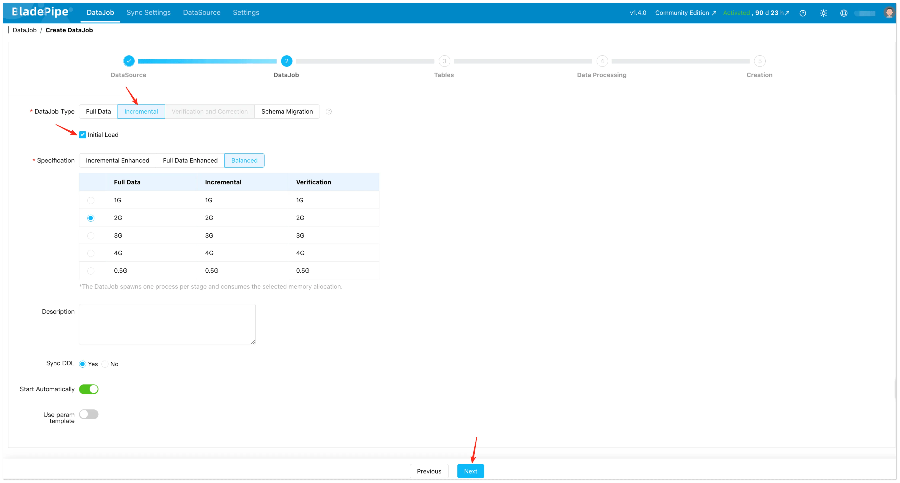
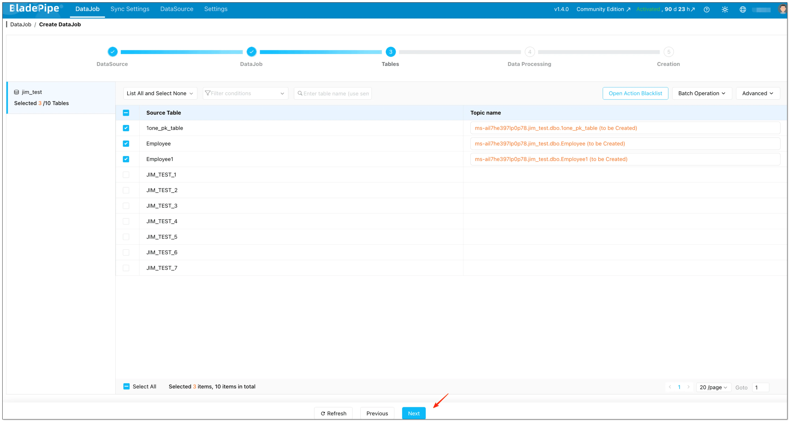
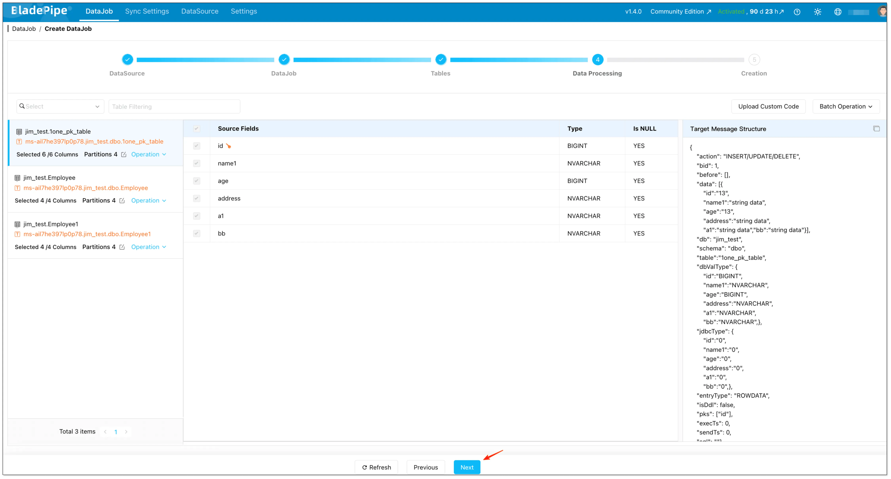
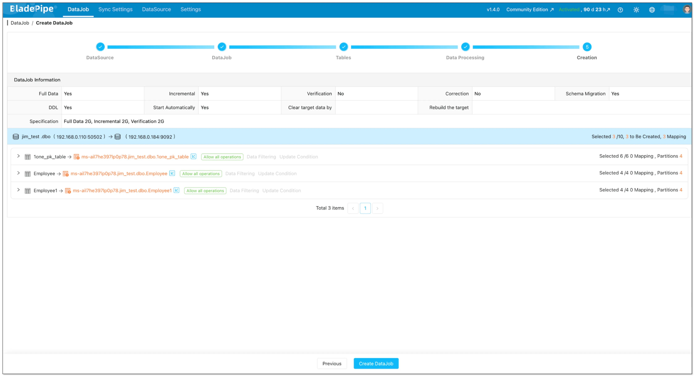
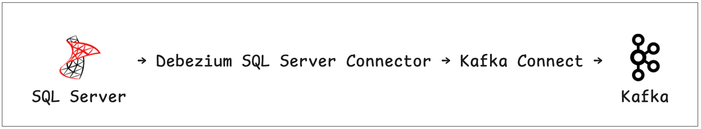

Your production SQL Server is struggling.

Every time the analytics team runs a heavy query, your transaction latency spikes. Every time someone needs "real-time" data, you think about giving them read-only access — until they accidentally run a 50GB join.

You tried read replicas.  
You tried scheduled ETL jobs.  
And none of them gave you real-time data without breaking production.

You're searching for "SQL Server CDC to Kafka" because you need near real-time Change Data Capture (CDC) without breaking production. **Good news:** there *is* a simpler way to do this. This guide covers two practical methods to get the job done:

- **Method 1 (Recommended for most teams):** BladePipe — a managed, no-code platform that handles full sync + incremental CDC in one pipeline
- **Method 2 (DIY reference):** Debezium SQL Server Connector + Kafka Connect — full control, full operational ownership

If you're new to SQL Server CDC itself, read: [SQL Server CDC: What Is It and How to Implement It](../data_insights/sql_server_change_data_capture.md).

## Method 1: Fully Managed CDC Platform (BladePipe)

**Why start here?** Unlike the DIY approach, BladePipe handles offset tracking, configurable and manageable DDL synchronization, and pipeline monitoring for you. You don't deploy Kafka Connect workers. You don't write connector configs. You configure the pipeline in a UI and click Start.

BladePipe runs a **full load + incremental CDC DataJob**: schema migration (optional) + initial snapshot + ongoing CDC.



### Prerequisites

**SQL Server side**

- Network access from BladePipe to SQL Server
- CDC enabled on the database and tables you want to replicate
- Correct permissions for the SQL Server account

From BladePipe docs:

- Enabling CDC at database level requires the **`sysadmin`** server role (DBA operation).
- The replication account typically needs **`db_owner`** on the source database to create CDC-related objects for a new job.

See: [Required Privileges for SQL Server](/docs/dataMigrationAndSync/datasource_func/SqlServer/privs_for_sqlserver/).

**Kafka side**

- A reachable Kafka cluster (self-hosted, MSK, Confluent Cloud, etc.)
- If you want topics auto-created, ensure the Kafka side allows it (or pre-create topics yourself)

**TLS compatibility (common gotcha)**

If you hit TLS errors when connecting to SQL Server, see: [SQL Server TLS10 Error](/docs/faq/solve_sqlserver_tls/).

**BladePipe Side**

A free BladePipe account:
- [Sign up for a fully-managed SaaS account](https://www.bladepipe.com/register/)
- [Deploy a self-hosted Community account](https://www.bladepipe.com/docs/productOP/onPremise/installation/install_all_in_one_docker/)


### Step-by-Step Setup (5 minutes)

#### Step 1: Add Source and Target

1. Log into BladePipe console → Click **"DataSource"** → Click **"+ Add DataSource"** → Choose SQL Server → Fill in the necessary information → Test Connection → Click **"Add DataSource"**

    

2. Return to BladePipe console → Click **"DataSource"** → Click **"+ Add DataSource"** → Choose Kafka → Fill in the necessary information → Click **"Add DataSource"**

    

#### Step 2: Create a Data Pipeline

1. Go to **"DataJob"** → Click **"Create DataJob"** → Select SQL Server as source and Kafka as Target → Select Instance and click **"Test Connection"** → Click **"Next"** after configuration

    :::info
    In advanced settings, you can also choose the **Kafka message format**. BladePipe supports multiple formats (including **CloudCanal JSON**, **Alibaba Canal JSON**, **Alibaba Cloud DTS Avro**, and **Debezium Envelope JSON**): [Message Format](/docs/reference/kafka_msg_format_type/).
    :::
    


2. Select **Incremental** for DataJob Type, together with the **Initial Load** option.

    

3. Select tables and (optional) configure things like mapping rules and table filtering.

    

4. Select the columns and (optional) configure options like uploading custom code and setting the target primary key.

    

5. Confirm and click the **Create DataJob**. Once started, BladePipe will:
    - Take a snapshot (full sync) of existing data
    - Stream ongoing changes (CDC) with sub-second latency

    

## Method 2: Manual with Debezium + Kafka Connect (DIY Reference)

If you prefer a DIY approach, here's the high-level architecture (SQL Server (CDC) → Debezium SQL Server Connector → Kafka Connect → Kafka):



### What you need

- SQL Server CDC enabled for the database and the tables you want to capture
- A Kafka Connect cluster (usually 2+ workers for HA)
- Kafka topics for data and Debezium schema history
- Operational tooling (metrics, restarts, upgrades, incident response)

### Enable SQL Server CDC (database + table)

Enabling CDC at the database level typically requires DBA involvement.

```sql
-- 1) Enable CDC at database level
USE YourDatabaseName;
EXEC sys.sp_cdc_enable_db;

-- 2) Enable CDC on each table you want to capture
EXEC sys.sp_cdc_enable_table
  @source_schema = N'dbo',
  @source_name   = N'Orders',
  @role_name     = NULL;
```

### Sample Debezium Connector Config

```json
{
  "name": "sqlserver-connector",
  "config": {
    "connector.class": "io.debezium.connector.sqlserver.SqlServerConnector",
    "database.hostname": "your-sql-server",
    "database.port": "1433",
    "database.user": "cdc_user",
    "database.password": "password",
    "database.dbname": "SalesDB",
    "table.include.list": "dbo.Orders,dbo.Customers",
    "topic.prefix": "sqlserver",
    "schema.history.internal.kafka.bootstrap.servers": "kafka:9092",
    "schema.history.internal.kafka.topic": "schema-changes.salesdb"
  }
}
```

### Production Notes (what usually bites teams)

- **Offsets and restarts**: plan for reprocessing and duplicate events; make consumers idempotent.
- **CDC retention**: if the cleanup job removes change rows before your connector reads them, you’ll get gaps.
- **Schema changes**: decide how to handle DDL (fail, ignore, or propagate) and how consumers evolve.
- **Snapshots**: understand initial snapshot behavior and what “consistency” means for your workload.

## Comparison: BladePipe vs Debezium vs Custom Script

| Dimension                | BladePipe                   | Debezium + Kafka Connect            | Custom Script         |
| :----------------------- | :-------------------------- | :---------------------------------- | :-------------------- |
| **Setup Time**           | 5 minutes                   | 2-5 days (cluster setup + config + testing)                            | 1-2 weeks             |
| **Operational Overhead** | None (fully managed)        | High (cluster management)           | Extreme (everything)  |
| **CDC Handling**         | Automatic                   | Manual configuration                | You build it          |
| **Schema Evolution**     | Automatic                   | Requires Schema Registry + planning | You handle it         |
| **Monitoring**           | Built-in dashboard + alerts | DIY (Prometheus + Grafana)          | Build from scratch    |
| **Hidden Costs**         | None                        | Requires on-call rotation for failures; connector upgrades can break pipelines | Engineering burnout   |
| **Cost Model**           | [Usage-based (starts free)](https://www.bladepipe.com/pricing/)   | Infrastructure + engineering        | Engineering time      |
| **Best For**             | Teams that want outcomes fast     | Teams that already run Kafka Connect well          | Proof-of-concept only |

**The math:** For a team of 2 engineers earning $150k/year, 2 days of Debezium setup + ongoing maintenance quickly exceeds BladePipe's subscription cost.

## Troubleshooting Common Issues

| Symptom                            | Likely Cause                        | Solution                                  |
| :--------------------------------- | :---------------------------------- | :---------------------------------------- |
| Pipeline stuck at 99%              | Large table snapshot taking time    | Check table size; consider splitting      |
| High CDC lag                       | SQL Server transaction log pressure | Increase log size, reduce retention       |
| Kafka messages missing             | Partition count too low             | Increase partitions, check consumer group |
| Connection timeout                 | Network firewall                    | Allow BladePipe IPs (provided in console) |
| "CDC cleanup deleted required LSN" | Retention too short                 | Increase CDC retention to 7+ days         |
| Out of order messages              | Multiple partitions + no key        | Use primary key as message key            |

If you encounter any problems that you can't solve, feel free to **get help**:

- [BladePipe documentation](https://bladepipe.com/docs/)
- [Discord chat support](https://discord.com/invite/HMnThuQMup) (response within 10 minutes)


## Get Started

Ready to stream SQL Server data to Kafka without the operational headache?

- [**→ Start your free trial**](https://bladepipe.com/register/)
- [**→ Request a demo**](https://cal.com/bladepipe-xxypci/30min) — you'll be paired with an experienced data engineer (20+ years in the field) for personalized setup support.

## FAQs

### What is SQL Server CDC?

SQL Server CDC (Change Data Capture) tracks inserts, updates, and deletes at the database level and stores them for downstream processing.

### Is SQL Server CDC real-time?

Near real-time. Typically seconds behind, depending on system load and configuration.

### Does SQL Server CDC impact performance?

Yes, slightly. It increases log usage, but is generally safe for production when configured properly.

### Can I use Kafka without CDC?

Yes, but it depends on your use case.

- Without CDC: you'll rely on batch jobs or periodic queries (not real-time)  
- With CDC: you get continuous, event-driven data streaming  

For real-time pipelines, CDC is strongly recommended.

### Can I skip Debezium?

Yes. Managed CDC tools eliminate the need for Debezium and Kafka Connect entirely.

### Do you really need Kafka?

Not always. Kafka is powerful, but it's not required for every data pipeline.

You probably **don’t need Kafka** if:
- You only run batch jobs (e.g. daily reports)
- You don’t need real-time updates
- Your system is relatively simple

You **should consider Kafka** if:
- You need real-time data streaming
- You're building event-driven systems
- Multiple services need to consume the same data

If you're unsure, read this guide: [Do You Really Need Kafka? When to Use and When Not To](../data_insights/do_you_really_need_kafka.md)
