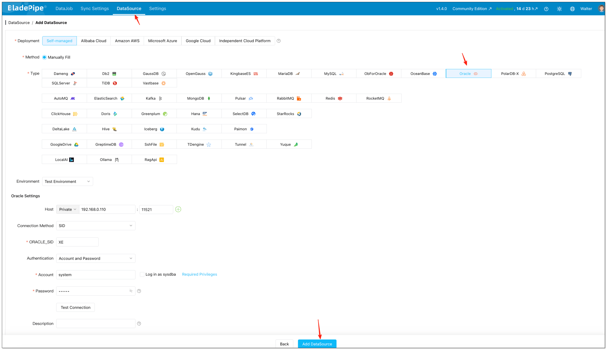
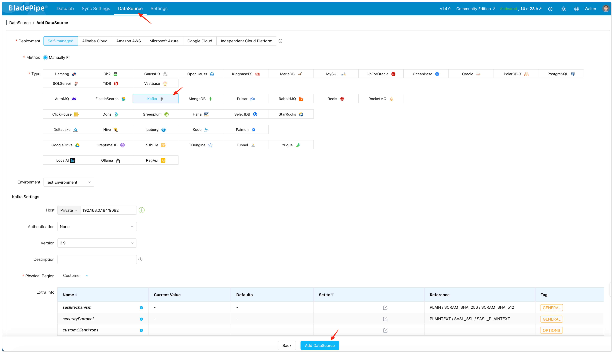
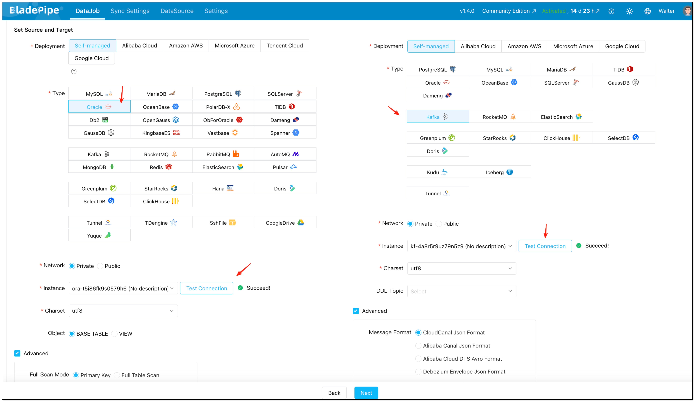
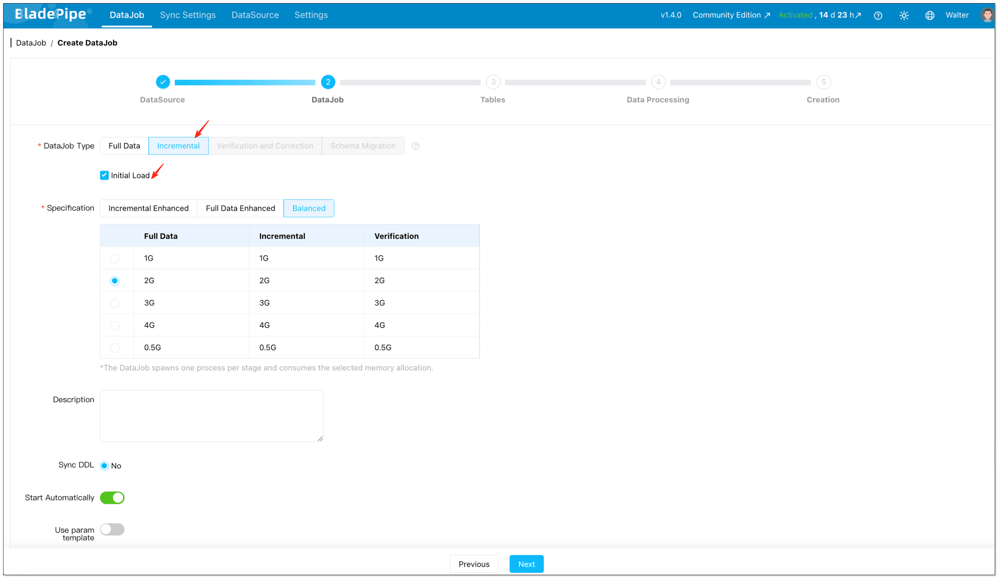
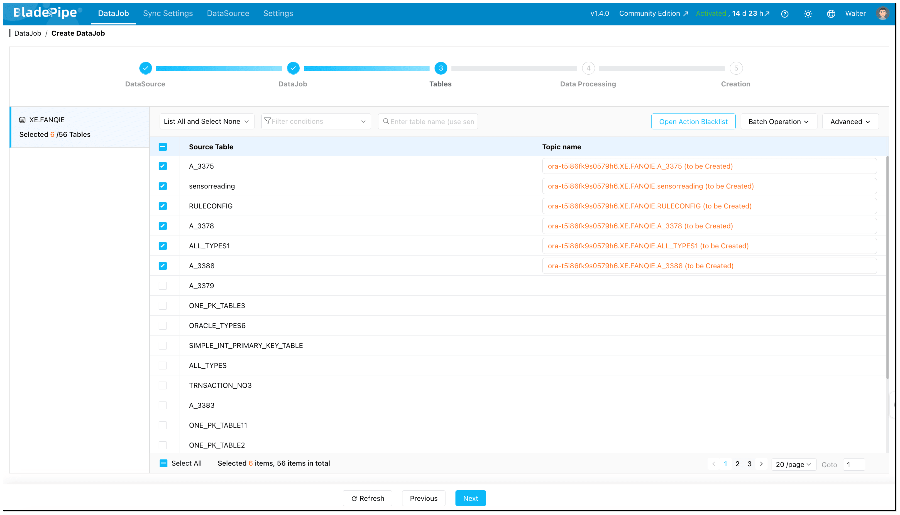
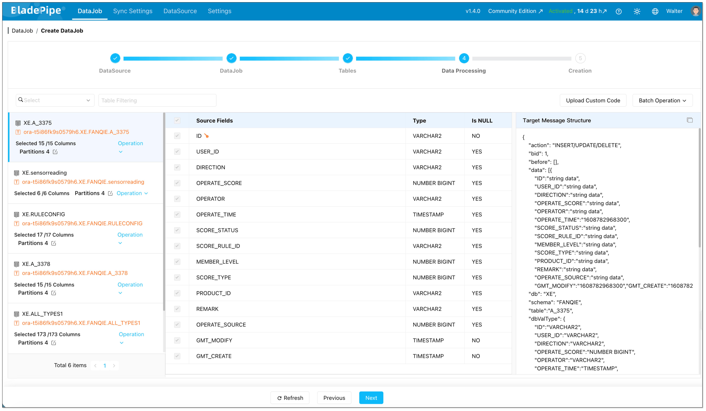
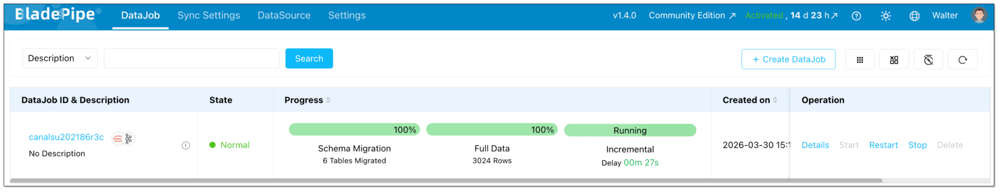

## Overview

If you need to move transactional data from Oracle into Kafka in real time, there are usually two questions behind the technical implementation:

- How do you [capture changes](../data_insights/change_data_capture_cdc.md) from Oracle reliably?
- How do you publish those changes to Kafka in a format downstream systems can actually use?

**Oracle to Kafka streaming** is a common topic in real-time analytics, event-driven architecture, cache synchronization, and AI data pipelines.

In this guide, we will look at **2 practical methods** for streaming data from Oracle to Kafka, compare their trade-offs, and walk through a simpler implementation path for production environments.

## Why Stream Oracle Data to Kafka?

Oracle often stores critical business data, while [Kafka](../data_insights/do_you_really_need_kafka.md) acts as the event backbone for downstream systems.

Streaming Oracle changes into Kafka helps teams:

- Build real-time analytics pipelines
- Feed search, cache, and microservices with fresh data
- Decouple transactional systems from downstream consumers
- Avoid repeated full loads and reduce sync latency

## Method 1: Build an Oracle CDC to Kafka Pipeline (Custom Way)

The first method is to build the pipeline yourself with Oracle's built-in LogMiner and a custom Kafka producer. It's suitable for learning purposes or small-scale scenarios with a few tables.

The pipeline consists of two phases:

- **Full load**: Take a consistent snapshot of existing data
- **Incremental CDC**: Capture ongoing changes from redo logs

### Step 1: Prepare Oracle for Log-based CDC

Before you can capture changes, Oracle must be configured for log-based CDC.

**Required Oracle Settings**

**Note**: The exact privileges can vary by Oracle version and deployment model, especially in CDB/PDB environments. The grants below are a simplified prototype-oriented example, not a universal least-privilege recipe.

```sql
-- 1. Enable ARCHIVELOG mode (requires database restart)
SHUTDOWN IMMEDIATE;
STARTUP MOUNT;
ALTER DATABASE ARCHIVELOG;
ALTER DATABASE OPEN;

-- 2. Enable supplemental logging for row-level changes
ALTER DATABASE ADD SUPPLEMENTAL LOG DATA;
-- For a simple CDC prototype, ALL COLUMNS is the easiest to reason about,
-- though it increases redo volume. In production, many teams choose a more
-- selective strategy such as PRIMARY KEY logging where possible.
ALTER DATABASE ADD SUPPLEMENTAL LOG DATA (ALL) COLUMNS;

-- 3. Create a CDC user with required privileges
CREATE USER cdc_user IDENTIFIED BY your_password;
GRANT CONNECT, RESOURCE TO cdc_user;
GRANT LOGMINING TO cdc_user;
GRANT EXECUTE_CATALOG_ROLE TO cdc_user;
GRANT SELECT ANY TABLE TO cdc_user;
GRANT SELECT ON V_$DATABASE TO cdc_user;
GRANT SELECT ON V_$LOGMNR_CONTENTS TO cdc_user;
GRANT SELECT ON V_$LOGFILE TO cdc_user;
GRANT SELECT ON V_$ARCHIVED_LOG TO cdc_user;
```

**Important**: `ARCHIVELOG` mode is effectively required for a reliable LogMiner-based CDC pipeline. Without archived redo logs, a reader that falls behind may miss changes after online redo logs rotate.

### Step 2: Run the Initial Full Load

Log-based CDC only captures changes that occur after it starts. To get existing data into Kafka, you first need a consistent snapshot.

**Record the Starting Point**

Before exporting any data, record the current Oracle System Change Number (SCN). Use that SCN for the snapshot query, then start incremental CDC from changes after that snapshot boundary.

```sql
SELECT DBMS_FLASHBACK.GET_SYSTEM_CHANGE_NUMBER FROM DUAL;
-- Example result: 1234567890
```

**Export Data Using Flashback Query**

Use Oracle Flashback Query to get a consistent view of each table at that SCN. This prevents data inconsistency during the export.

```java
// Example: Batch query with Flashback
String sql = "SELECT * FROM HR.ORDERS AS OF SCN ? WHERE ORDER_ID > ? ORDER BY ORDER_ID";

try (PreparedStatement ps = connection.prepareStatement(sql)) {
    ps.setLong(1, snapshotScn);
    ps.setLong(2, lastId);
    
    // Process in batches
    while (hasMore) {
        ResultSet rs = ps.executeQuery();
        List<Record> batch = extractBatch(rs);
        
        // Publish to Kafka
        for (Record record : batch) {
            String key = record.getPrimaryKey().toString();
            String value = convertToJson(record);
            producer.send(new ProducerRecord<>("hr.orders", key, value));
        }
        
        lastId = getLastId(batch);
        ps.setLong(2, lastId);
    }
}
```

**Batch Considerations**

| Parameter   | Recommended Setting | Reason                              |
| :---------- | :------------------ | :---------------------------------- |
| Batch size  | 1000–10000 rows     | Balance memory usage and throughput |
| Fetch size  | 5000 rows           | Reduce round trips to Oracle        |
| Parallelism | 1 table at a time   | Avoid overwhelming the source       |

After the full load completes, the incremental CDC should begin from changes after the recorded snapshot SCN.

### Step 3: Capture Oracle Changes with LogMiner

Once the full load is done, start the incremental CDC process from the recorded SCN.

**LogMiner Reader Core Logic**

```java
public class OracleLogMinerReader {
    private final Connection connection;
    private long currentScn;
    
    public void start(long startScn) {
        this.currentScn = startScn;
        startLogMinerSession(startScn);
    }
    
    private void startLogMinerSession(long scn) {
        // Add redo log files to the LogMiner session
        CallableStatement stmt = connection.prepareCall(
            "BEGIN DBMS_LOGMNR.ADD_LOGFILE(LOGFILENAME => ?, OPTIONS => DBMS_LOGMNR.NEW); END;"
        );
        // Add all archived log files after the start SCN...
        
        // Start LogMiner session
        stmt = connection.prepareCall(
            "BEGIN DBMS_LOGMNR.START_LOGMNR(" +
            "   STARTSCN => ?, " +
            "   OPTIONS => DBMS_LOGMNR.DICT_FROM_ONLINE_CATALOG + " +
            "              DBMS_LOGMNR.COMMITTED_DATA_ONLY); " +
            "END;"
        );
        stmt.setLong(1, scn);
        stmt.execute();
    }
    
    public List<ChangeEvent> poll() {
        String sql = """
            SELECT SCN, RS_ID, SSN, CSF, SEG_OWNER, TABLE_NAME, OPERATION,
                   SQL_REDO, REDO_VALUE, UNDO_VALUE, TIMESTAMP
            FROM V$LOGMNR_CONTENTS
            WHERE SCN > ?
              AND SEG_OWNER NOT IN ('SYS', 'SYSTEM')
              AND OPERATION IN ('INSERT', 'UPDATE', 'DELETE')
            ORDER BY SCN, RS_ID, SSN
            """;
        
        List<ChangeEvent> events = new ArrayList<>();
        try (PreparedStatement ps = connection.prepareStatement(sql)) {
            ps.setLong(1, currentScn);
            ps.setFetchSize(1000);
            
            try (ResultSet rs = ps.executeQuery()) {
                while (rs.next()) {
                    events.add(parseChangeEvent(rs));
                    currentScn = rs.getLong("SCN");
                }
            }
        }
        return events;
    }
    
    private ChangeEvent parseChangeEvent(ResultSet rs) throws SQLException {
        String operation = rs.getString("OPERATION");
        
        // In real implementations, prefer MINE_VALUE/COLUMN_PRESENT over parsing SQL text.
        // Also be prepared to reassemble rows when CSF = 1.
        return new ChangeEvent(
            rs.getLong("SCN"),
            rs.getString("SEG_OWNER"),
            rs.getString("TABLE_NAME"),
            operation,
            extractBeforeValues(rs, operation),
            extractAfterValues(rs, operation)
        );
    }
}
```

**Important Limitations of LogMiner**:

- `DBMS_LOGMNR.CONTINUOUS_MINE` is not available in modern Oracle releases such as 19c, so a custom reader must manage log ranges and session restarts itself.
- `SQL_REDO` parsing is fragile. For production use, prefer `DBMS_LOGMNR.MINE_VALUE()` together with `DBMS_LOGMNR.COLUMN_PRESENT()`, or use a mature CDC engine such as Debezium.
- Querying `V$LOGMNR_CONTENTS` row by row is not enough by itself. You must account for transaction boundaries and continuation rows (`CSF = 1`) before emitting Kafka events.
- In CDB/PDB deployments, LogMiner setup and access rules can differ from non-CDB databases. Validate the mining scope and required privileges against your Oracle version before using this flow in production.
- LogMiner performance degrades with high transaction volumes.
- Log files must be available; if your consumer falls behind, archived logs may be deleted before they're read.

### Step 4: Transform changes into Kafka messages

**Event Format**

Define a consistent JSON structure for all change events:

```json
{
  "schema": "HR",
  "table": "ORDERS",
  "op": "UPDATE",
  "ts_ms": 1700000000000,
  "scn": 1234567900,
  "pk": {"ORDER_ID": 1001},
  "before": {"STATUS": "PENDING", "AMOUNT": 100.00},
  "after": {"STATUS": "PAID", "AMOUNT": 100.00}
}
```

**Kafka Producer Configuration**

```properties
# Connection
bootstrap.servers=kafka-1:9092,kafka-2:9092,kafka-3:9092

# Serialization
key.serializer=org.apache.kafka.common.serialization.StringSerializer
value.serializer=org.apache.kafka.common.serialization.StringSerializer

# Durability
acks=all
enable.idempotence=true
retries=2147483647
max.in.flight.requests.per.connection=5

# Performance
compression.type=zstd
linger.ms=20
batch.size=131072
```

**Main CDC Loop with Offset Management**

```java
public class OracleToKafkaCdcApp {
    private final OracleLogMinerReader reader;
    private final KafkaProducer<String, String> producer;
    private final OffsetStore offsetStore;
    
    public void run() {
        // Load the last processed resume point from storage
        ResumePoint start = offsetStore.loadOrDefault();
        reader.start(start.scn());
        
        while (true) {
            // 1. Poll for changes
            List<ChangeEvent> events = reader.poll();
            if (events.isEmpty()) {
                Thread.sleep(1000);
                continue;
            }
            
            // 2. Send to Kafka with async callbacks
            CountDownLatch latch = new CountDownLatch(events.size());
            AtomicReference<ResumePoint> maxAcked = new AtomicReference<>(start);
            
            for (ChangeEvent event : events) {
                String topic = event.schema() + "." + event.table();
                String key = event.primaryKeyAsString();
                String value = event.toJson();
                
                producer.send(new ProducerRecord<>(topic, key, value), (metadata, exception) -> {
                    if (exception == null) {
                        maxAcked.updateAndGet(current ->
                            event.resumePoint().compareTo(current) > 0 ? event.resumePoint() : current
                        );
                    } else {
                        // Log error; retry logic would be needed
                    }
                    latch.countDown();
                });
            }
            
            // 3. Wait for all sends to complete
            latch.await(30, TimeUnit.SECONDS);
            
            // 4. Save the highest confirmed resume point
            offsetStore.save(maxAcked.get());
            start = maxAcked.get();
        }
    }
}
```

**Offset Storage**

Do not rely on `SCN` alone as the only resume token. A safer checkpoint stores the position within the mined stream, such as `SCN` together with identifiers like `RS_ID` and `SSN`.

```sql
CREATE TABLE cdc_offsets (
    pipeline_name VARCHAR(64) PRIMARY KEY,
    last_scn NUMBER(20) NOT NULL,
    last_rsid VARCHAR2(32),
    last_ssn NUMBER,
    updated_at TIMESTAMP DEFAULT SYSTIMESTAMP
);
```

**Critical rule**: Only advance the saved resume point after Kafka confirms successful writes. This reduces the risk of losing or skipping events on restart.

### Step 5: Operational Considerations

**What the Custom Approach Requires**

| Area                | Responsibility                                         |
| :------------------ | :----------------------------------------------------- |
| Oracle setup        | Enable archivelog, create users, manage permissions    |
| Full load           | Write batch export logic, handle consistency           |
| LogMiner management | Start/restart sessions, manage log files               |
| Offset storage      | Implement and maintain checkpoint table                |
| Error handling      | Handle Kafka failures, LogMiner errors, partial writes |
| Monitoring          | Build dashboards for lag, errors, throughput           |
| Schema changes      | Handle table alterations without breaking consumers    |

**Limitations to Be Aware Of**

1. **At-least-once semantics only** — Without distributed transactions, exactly-once is extremely difficult to achieve. Design consumers to be idempotent.
2. **LogMiner scaling limits** — For high-throughput systems (>10,000 changes/sec), LogMiner may become a bottleneck.
3. **Transaction handling complexity** — You must avoid emitting rolled-back or partial transactions and handle continuation rows correctly.
4. **Value extraction limitations** — `DBMS_LOGMNR.MINE_VALUE()` does not support every datatype. Common unsupported cases include `LONG`, `LOB`, object types, and collections.
5. **DDL changes** — Schema modifications require manual coordination between CDC process and downstream consumers.

### Quick Start Example

If you want to try this locally:

1. **Run Oracle in a container** with archivelog enabled
2. **Create the CDC user** with the permissions above
3. **Run a simple Python/Java script** that:
   - Polls `V$LOGMNR_CONTENTS` every second
   - Prints changes to console
   - Then extend to send to Kafka

This gives you a working prototype to understand the mechanics before adding production hardening.

For **larger** scale or **production-critical** pipelines, **consider Method 2**, which handles many of these complexities out of the box.

## Method 2: Use an On-Premise Managed Oracle-to-Kafka CDC Pipeline (Easier Way)

The second method is to use a **self-hosted CDC platform** that already supports Oracle as a source and Kafka as a target.

In this model, the platform handles the orchestration needed for:

- [Full load plus incremental sync](https://www.bladepipe.com/docs/operation/job_manage/create_job/create_full_incre_task/)
- Oracle CDC state management
- Kafka message formatting
- Topic creation and delivery
- Monitoring, restart, and observability

In the following procedure, we use [BladePipe](https://www.bladepipe.com) as an example to show how to create an Oracle-to-Kafka pipeline with less setup overhead.

*The deployment model here is [**On-Premise**](https://www.bladepipe.com/docs/quick/quick_start/), which fits both **Community** and **Enterprise** editions.*

:::info Edition Note
Both **Community** and **Enterprise** editions are self-hosted and use the same workflow for building Oracle-to-Kafka pipelines.

- **Community**: Free on-premise deployment
- **Enterprise**: On-premise deployment for larger-scale production use

See [Plans](https://www.bladepipe.com/docs/price/plans_diff/) for the detailed plan comparison.
:::

### Step 1: Prepare Oracle for CDC

Before connecting Oracle to Kafka, enable the Oracle CDC prerequisites needed for log-based capture.

You can refer to:

- [Oracle LogMiner](https://www.bladepipe.com/docs/dataMigrationAndSync/datasource_func/Oracle/prepare_for_oracle_logminer/)
- [Required Privileges for Oracle](https://www.bladepipe.com/docs/dataMigrationAndSync/datasource_func/Oracle/privs_for_oracle/)

### Step 2: Install BladePipe On-Premise

Install BladePipe. Choose one of these installation methods:

- [Install All-In-One (Docker)](https://www.bladepipe.com/docs/productOP/onPremise/installation/install_all_in_one_docker/)
- [Install All-In-One (Binary)](https://www.bladepipe.com/docs/productOP/onPremise/installation/install_all_in_one_binary/)
- [Install All-In-One (K8s)](https://www.bladepipe.com/docs/productOP/onPremise/installation/install_all_in_one_k8s/)

For fast evaluation, the Docker path is the shortest. After installation, open the on-premise console.

### Step 3: Add Oracle and Kafka DataSources

After the platform is installed, open the on-premise console and create the two endpoints used by the pipeline.

1. Open the local console, for example `http://{your-server-ip}:8111`.
2. Click **DataSource** > **Add DataSource**.
3. Add Oracle as the source.



4. Add Kafka as the target.



At this stage, fill in host, authentication details, and any advanced connection parameters required by your environment.

### Step 4: Create the Oracle-to-Kafka DataJob

With both DataSources in place, create the actual replication job in the on-premise console.

1. Click **DataJob** > [**Create DataJob**](https://www.bladepipe.com/docs/operation/job_manage/create_job/create_full_incre_task/).
2. Select Oracle as the source and Kafka as the target.
3. Click **Test Connection** for both sides.



4. Select **Incremental** together with **Initial Load** if you need both historical records and continuous changes. This setup is important because it lets the platform first move the existing data, then continue with incremental CDC from Oracle without requiring a separate snapshot script.



5. Select which Oracle tables should be streamed to Kafka.



6. Select which Oracle columns should be streamed to Kafka.



### Step 5: Start the Pipeline and Let the Platform Handle Orchestration



Once the DataJob is confirmed, the platform runs the required stages automatically.

For an Oracle-to-Kafka pipeline, that means:

- Initializing Oracle CDC offsets
- Running the full data load
- Switching to incremental synchronization
- Delivering change events continuously to Kafka

Instead of stitching those phases together yourself, you manage them as part of one on-premise DataJob.

### Step 6: Monitor Status, Latency, and Recovery

After the pipeline starts, the ongoing work is mostly operational rather than developmental.

You monitor:

- Job health
- Progress of full load
- Incremental sync status
- Delivery latency
- Errors and restart behavior

This is one of the biggest differences from the custom approach. The implementation effort moves away from maintaining CDC plumbing and toward validating business-level data flow.

### Why Teams Choose the Managed Approach

Compared with a custom stack, the on-premise managed model is easier when teams want to:

- Launch faster
- Reduce Oracle CDC maintenance work
- Standardize Kafka event delivery
- Support more tables without multiplying scripts and glue code
- Lower the chance of fragile snapshot-to-stream handoff logic

## Key Considerations Before You Start

Before implementing Oracle-to-Kafka streaming, pay attention to the following:

- **CDC method**: Oracle CDC in this article is based on LogMiner, and the custom approach assumes a modern LogMiner workflow rather than the deprecated `CONTINUOUS_MINE` option.
- **Permissions**: Oracle source users need the required privileges for log-based capture.
- **Kafka message format**: Downstream consumers can require different event formats.
- **DDL support**: If schema changes matter, confirm how DDL events are handled.
- **Recovery and replay**: Production pipelines need resumability and offset management.

## Comparison: Which Oracle-to-Kafka Method Fits Better?

|  | **Method 1: Custom CDC Components** | **Method 2: On-Premise Managed CDC Platform** |
| --- | --- | --- |
| **Initial setup** | Medium to high | Low to medium |
| **Full load implementation** | Requires separate snapshot scripts or jobs | Built into one pipeline |
| **Incremental CDC** | You manage LogMiner parsing, offsets, and replay | Platform manages CDC lifecycle |
| **Snapshot-to-stream handoff** | Must be designed and validated manually | Handled within the job workflow |
| **Kafka message formatting** | You define and maintain event schema yourself | Select from supported formats |
| **Topic management** | Manual or script-driven | Can be automated |
| **DDL handling** | Needs custom logic and consumer coordination | Managed in the platform workflow |
| **Failure recovery** | Reconnect, retry, and replay logic must be built | Built-in checkpointing and restart support |
| **Monitoring and alerting** | Logs, scripts, and custom dashboards | Built-in job visibility and status tracking |
| **Operational overhead** | High | Lower |
| **Flexibility** | Highest, but also most work | High enough for most production use cases |
| **Best for** | Teams that want maximum control and can own CDC engineering | Teams that want faster delivery with self-hosted control |

## Which Method Should You Choose?

Choose **Method 1** if:

- You need full control over event structure and pipeline internals
- Your team already operates CDC infrastructure comfortably
- You only have a limited number of pipelines and can afford custom maintenance

Choose **Method 2** if:

- You want to launch Oracle-to-Kafka streaming quickly
- You do not want to maintain separate snapshot, CDC, and recovery logic
- You expect the number of replicated tables or pipelines to grow over time

## Wrapping Up

There is more than one way to stream data from Oracle to Kafka, but the right choice depends on how much complexity your team is willing to own.

If your goal is to build a reliable **Oracle to Kafka real-time data pipeline** without stitching together multiple tools, BladePipe offers a more straightforward implementation path.

*Have questions about Oracle-to-Kafka streaming? [Reach out to us](https://cal.com/bladepipe-xxypci/30min)—we’ve helped dozens of teams get this right.*
