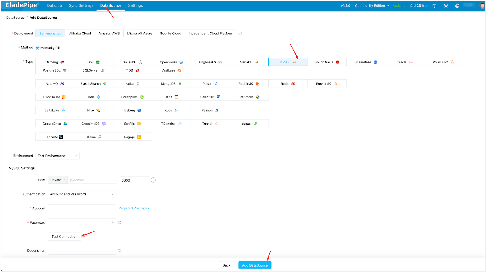
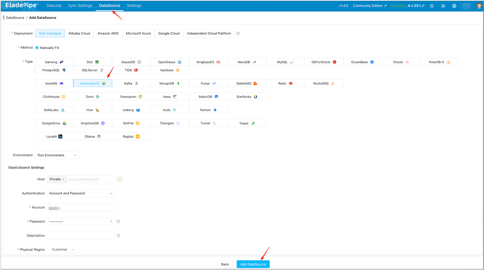
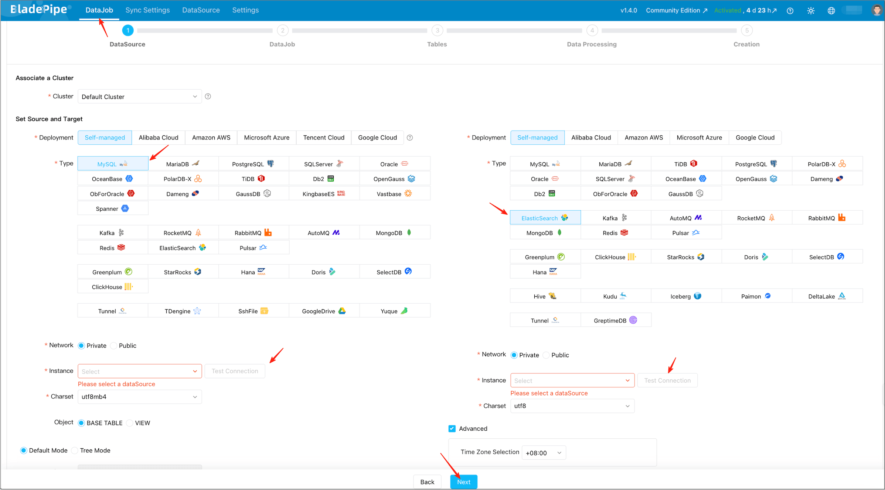
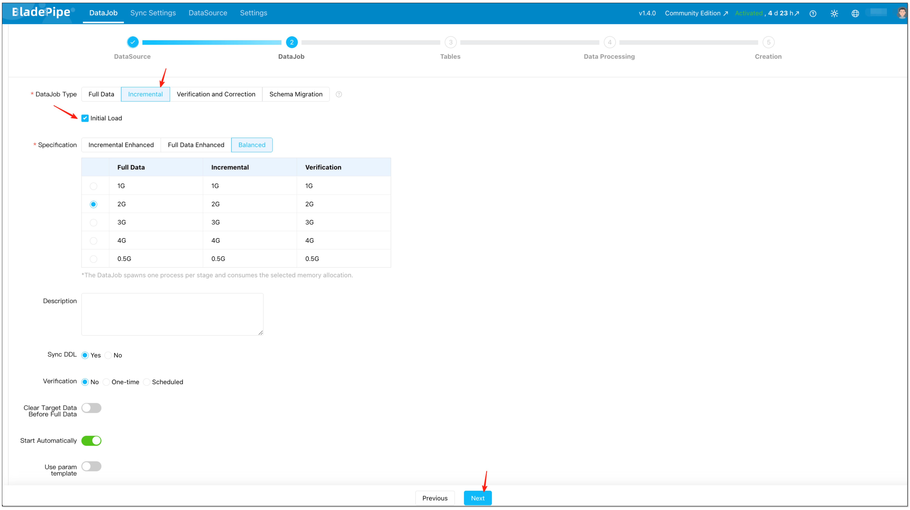
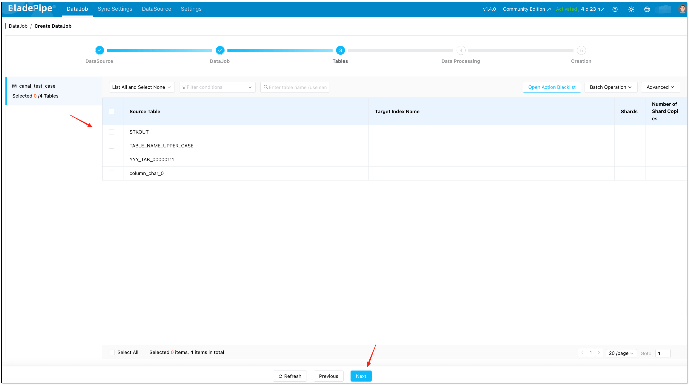
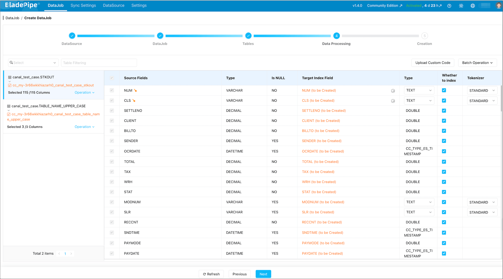
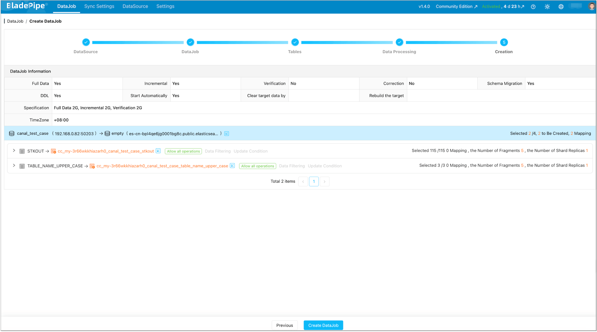
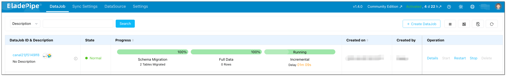

## Overview (Read This First)

If you want to sync **MySQL -> Elasticsearch** in real time *without Logstash*, there are 3 practical options:

- **Debezium + Kafka Connect (Elasticsearch sink)**: Most common DIY path if you already run Kafka Connect.
- **Flink CDC -> Elasticsearch**: Good if you already run Flink and want stream processing (joins, enrichments).
- **BladePipe (CDC-first, no Kafka/Logstash required)**: Simplest production path if you want fewer moving parts and operational overhead.

This tutorial gives you a minimal blueprint for **Debezium/Flink** so you can sanity-check the architecture quickly, then walks through a **step-by-step** setup using [BladePipe](https://www.bladepipe.com/) for a production-style pipeline (schema migration + full load + CDC incremental sync).

<!-- truncate -->

## TL;DR (30-Second Architecture)

### If You Already Use Kafka Connect

```
MySQL binlog  ->  Debezium (MySQL source connector)
             ->  Kafka topics
             ->  Elasticsearch sink connector
             ->  Elasticsearch index
```

### If You Want Fewer Components

```
MySQL  ->  BladePipe (schema + full + CDC)  ->  Elasticsearch
```

## Why Companies Sync MySQL to Elasticsearch

Elasticsearch is excellent at search and relevance, while MySQL is excellent at transactional writes. Syncing data from MySQL into Elasticsearch is common when you need:

- **Fast search** over product catalogs, knowledge bases, and user-generated content
- **Flexible querying** (text search + filters + aggregations) without adding pressure to MySQL
- **Near-real-time freshness** for user-facing experiences (search results update quickly after changes)

## What Usually Goes Wrong (So You Can Avoid It)

Before the how-to, here are the traps that make “MySQL -> Elasticsearch” projects unreliable:

- **No stable document ID**: Without a consistent `_id`, updates become duplicates and deletes do not land correctly.
- **Schema drift**: MySQL DDL changes can break mappings, ingest pipelines, or downstream assumptions.
- **Delete semantics**: Your pipeline must emit explicit delete events, not just “latest row snapshot”.
- **Backfill vs CDC cutover**: You need a clean “full load then CDC” handoff to avoid missing or duplicating changes.
- **Bulk sizing and refresh pressure**: Bad batching can cause `Request Entity Too Large`, high heap pressure, or indexing stalls.

## Option A: Debezium + Kafka Connect (Minimal Example)

This section is intentionally short: the goal is to show what “without Logstash” typically looks like, not to document every connector knob.

### 1. Debezium MySQL Source Connector (Example)

Key idea: Debezium reads **MySQL binlog** and writes change events into Kafka topics.

```json
{
  "name": "mysql-cdc",
  "config": {
    "connector.class": "io.debezium.connector.mysql.MySqlConnector",
    "database.hostname": "mysql-host",
    "database.port": "3306",
    "database.user": "cdc_user",
    "database.password": "cdc_password",
    "database.server.id": "184054",
    "topic.prefix": "mysql",
    "database.include.list": "app_db",
    "table.include.list": "app_db.products,app_db.users",
    "snapshot.mode": "initial"
  }
}
```

:::caution Production Reality Check
The configuration above is a minimal example. For production, you will also need to configure:

- Schema history topic (`schema.history.internal.kafka.topic`)
- Snapshot locking mode (`snapshot.locking.mode`)
- Converter serialization (`key.converter`, `value.converter`)
- Dead letter queue (DLQ) for poison pills
- Connector monitoring and alerting

If this is your first Kafka Connect deployment, budget **2-4 weeks** to harden it for schema evolution, restarts, and operational visibility.
:::

### 2. Kafka Connect Elasticsearch Sink (Example)

Key idea: the sink connector consumes Kafka events and writes to Elasticsearch in bulk.

```json
{
  "name": "es-sink",
  "config": {
    "connector.class": "io.confluent.connect.elasticsearch.ElasticsearchSinkConnector",
    "connection.url": "http://es-host:9200",
    "topics": "mysql.app_db.products,mysql.app_db.users",
    "key.ignore": "false",
    "schema.ignore": "true",
    "write.method": "upsert"
  }
}
```

### When This Approach Fits

- You already operate Kafka + Kafka Connect.
- You want a fully open-source-ish pipeline and accept higher day-2 ops.

### Typical Trade-offs

- More infrastructure (Kafka, Connect workers, connector lifecycle).
- More failure modes (connector restarts, topic retention, schema evolution handling).
- Time to production: Expect 2-4 weeks for a team new to Kafka Connect to harden this for schema evolution and monitoring.

## Option B: Flink CDC (Minimal Direction)

If you already run Flink, the pattern is: Flink reads MySQL binlog via CDC connector, optionally transforms data, then writes to Elasticsearch.

A minimal Flink SQL example:
```sql
-- MySQL CDC Source
CREATE TABLE mysql_orders (
  id INT,
  user_id INT,
  amount DECIMAL(10,2),
  PRIMARY KEY (id) NOT ENFORCED
) WITH (
  'connector' = 'mysql-cdc',
  'hostname' = 'mysql-host',
  'port' = '3306',
  'username' = 'cdc_user',
  'password' = 'cdc_password',
  'database-name' = 'mydb',
  'table-name' = 'orders'
);

-- Elasticsearch Sink
CREATE TABLE es_orders (
  id INT,
  user_id INT,
  amount DECIMAL(10,2),
  PRIMARY KEY (id) NOT ENFORCED
) WITH (
  'connector' = 'elasticsearch-7',
  'hosts' = 'http://es-host:9200',
  'index' = 'orders'
);

-- Continuous sync
INSERT INTO es_orders SELECT * FROM mysql_orders;
```

:::caution Production Reality Check
The SQL above is a minimal demo. In production, plan for:

- Checkpointing/state sizing and tuning (and safe restart semantics)
- Delivery guarantees (often at-least-once) and idempotency in the sink
- Backpressure, bulk sizing, and failure retry behavior when Elasticsearch slows down
- Schema evolution and mapping changes (type changes/analyzer changes often require reindexing)
- Monitoring and alerting (lag, checkpoint failures, sink error rates)
:::

### When This Approach Fits:

- You already operate Flink and have SQL expertise on the team.
- You need stream processing (joins, aggregations, enrichments) before indexing.

### Typical Trade-offs:

- Requires Flink cluster management and checkpoint tuning for production.
- You should pre-create the Elasticsearch index (mapping/analyzers/settings) to avoid “default mapping” surprises in production.
- Ensure a stable primary key maps to the Elasticsearch document `_id`, otherwise updates may become duplicates and deletes may not behave as expected.
- Composite primary keys and schema evolution need explicit design (for example, deterministic `_id` concatenation and a reindex strategy for breaking mapping changes).

## Option C (Recommended for This Tutorial): BladePipe Step-by-Step

[BladePipe](https://www.bladepipe.com/) is designed for **real-time CDC pipelines** with production features (schema migration, monitoring, and verification workflows). For MySQL -> Elasticsearch, the typical path is:

1. Migrate schema (create index + mapping)
2. Full load
3. Continuous incremental sync (CDC)

:::info Free Tier Note
BladePipe offers a **free Community** plan for self-hosted deployments. For initial trials, it’s free for long-term use and includes a **5-pipeline** license, with free reactivation **every 3 months**. The steps in this tutorial work within the Community plan for a typical evaluation pipeline.
:::

### Prerequisites

1. **MySQL user privileges**
   - See: [Required Privileges for MySQL](https://www.bladepipe.com/docs/dataMigrationAndSync/datasource_func/MySQL/privs_for_mysql/)
2. **Elasticsearch account privileges**
   - You typically need permissions to `create`, `delete`, `create_index`, `delete_index`, `read`, `write` on the target indices.
3. **A stable primary key**
   - BladePipe needs a stable identifier to map MySQL rows to Elasticsearch documents (`_id`). Make sure each table you sync has a clear primary key (or a unique key you can treat as one).

## Procedure

### Step 1: Install BladePipe

Go to the BladePipe homepage and click **Try Community Free** to start the Community installation (free for self-hosted evaluation). Then choose one method and follow the guide:

- [Install All-In-One (Docker)](https://www.bladepipe.com/docs/productOP/onPremise/installation/install_all_in_one_docker/) (recommended for the fastest start)
- [Install All-In-One (Binary)](https://www.bladepipe.com/docs/productOP/onPremise/installation/install_all_in_one_binary/)
- [Install All-In-One (K8s)](https://www.bladepipe.com/docs/productOP/onPremise/installation/install_all_in_one_k8s/)


After installation completes, you will see output like this:

  ```bash
  ███████╗██╗   ██╗ ██████╗ ██████╗███████╗███████╗███████╗
  ██╔════╝██║   ██║██╔════╝██╔════╝██╔════╝██╔════╝██╔════╝
  ███████╗██║   ██║██║     ██║     █████╗  ███████╗███████╗
  ╚════██║██║   ██║██║     ██║     ██╔══╝  ╚════██║╚════██║
  ███████║╚██████╔╝╚██████╗╚██████╗███████╗███████║███████║
  ╚══════╝ ╚═════╝  ╚═════╝ ╚═════╝╚══════╝╚══════╝╚══════╝
  ```

### Step 2: Add DataSources (MySQL + Elasticsearch)

1. After installation, open the local console, for example `http://{your-server-ip}:8111`.
2. Click **DataSource** > **Add DataSource**.
3. Add your **MySQL** DataSource (source) and **Elasticsearch** DataSource (target).

    
    
4. Click **Test Connection** for both.

    :::info
    If the target index already exists (with your desired mapping and analyzers), BladePipe can still sync data into it. If you want BladePipe to auto-create the index, grant it index creation permissions.
    :::

### Step 3: Create a Real-Time DataJob (Schema + Full + Incremental)

1. Click **DataJob** > [**Create DataJob**](https://www.bladepipe.com/docs/operation/job_manage/create_job/create_full_incre_task/).
2. Select the **MySQL** source and **Elasticsearch** target, and pass connection tests.

    
3. Select **Incremental** for DataJob Type, together with the **Initial Load** option.

    
4. Select the tables you want to sync.

    
5. Select the columns you want to sync.

    
6. Confirm and start the DataJob.

    

7. Once started, BladePipe typically runs:

    

    - **Schema Migration**: create index and mapping (when not already present)
    - **Full Data Migration**: backfill existing rows
    - **Incremental Synchronization**: stream ongoing INSERT/UPDATE/DELETE into Elasticsearch with low latency

    :::info Deletes and Updates (No “Zombie Docs”)
    The incremental stage captures **UPDATE** and **DELETE** operations, not just inserts. With a stable document `_id` mapping (typically based on your table primary key), updates overwrite the same document and deletes remove it, so Elasticsearch does not accumulate stale documents.
    :::

    :::info Schema Drift Note
    Schema drift is real in production. BladePipe performs schema migration when you create the DataJob, and you can keep the pipeline stable by treating schema changes explicitly:

    - **Additive changes (like adding columns)**: typically handled by updating the subscription/mapping and continuing CDC.
    - **Breaking changes (type changes, analyzer changes)**: usually require an Elasticsearch mapping strategy (often a reindex) rather than “just keep streaming”.
    :::

### Step 4: (Optional) Add Verification for Safer Cutover

If this pipeline is business-critical, add a scheduled verification job before you “switch traffic” to Elasticsearch-backed queries:

- [Create Periodic Verification & Correction Job](https://www.bladepipe.com/docs/operation/job_manage/create_job/create_period_verification_correction_job/)

## Tuning Notes (Elasticsearch Bulk Writes)

If you see bulk errors or unstable latency, the first knobs to check are batch sizing and flush behavior. In BladePipe’s Elasticsearch target settings, common parameters include:

- `maxBulkSizeMb`: cap a single bulk request size
- `totalDataInMemMb`: memory ceiling for buffered batch writes
- `asyncFlushIntervalSec`: force a flush if data is waiting too long

As a rule of thumb: start conservative (smaller bulks), confirm stability, then scale up.

## FAQ

### Does this support near-zero downtime indexing?

Yes, if you treat it as a **full load + CDC** cutover:

- Backfill everything
- Keep CDC running
- Switch your app search traffic after the lag is consistently small and verification looks good

### Will deletes in MySQL delete documents in Elasticsearch?

They should, as long as your pipeline captures DELETE operations and your document `_id` mapping is consistent.

### Do I need Kafka?

Not if you use BladePipe. If you choose Debezium + Kafka Connect, Kafka is part of the architecture.

### Which Elasticsearch versions are supported?

BladePipe supports Elasticsearch 6.8, 6.9, 6.10, 7.x, 8.0 ~ 8.15.

### Why should I move away from Logstash for MySQL → Elasticsearch?

Logstash is a great general-purpose ETL tool, but for MySQL CDC specifically, it has known pain points:

- JDBC input plugin uses polling (not true CDC), causing latency and database load
- Tracking column (:sql_last_value) can miss deletes and in-place updates
- JVM memory tuning is tricky for large backfills
- Restart recovery requires careful state management

If you're happy with Logstash, keep using it. But if you've hit these limits, the options in this guide are the logical next step.
