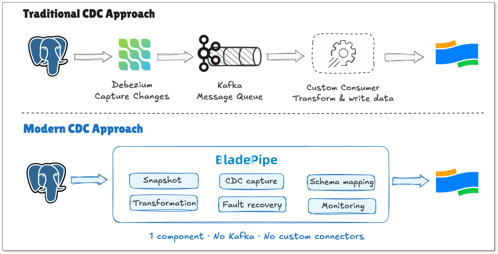
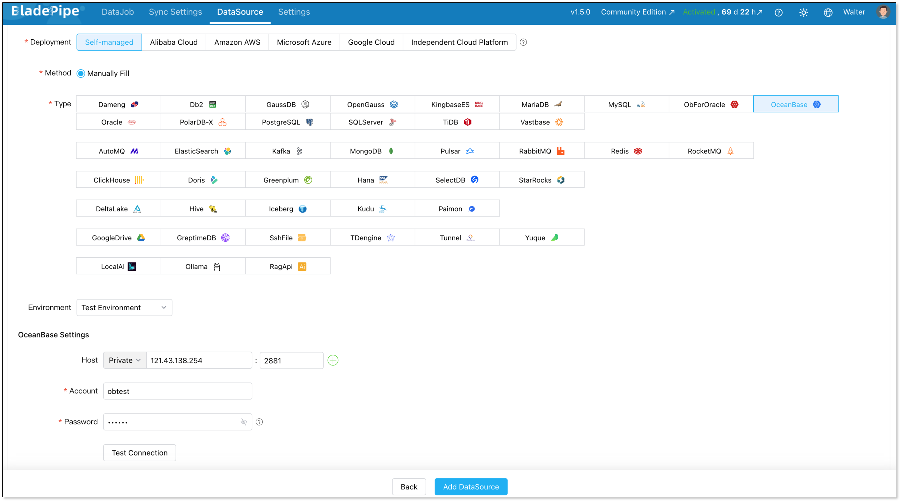
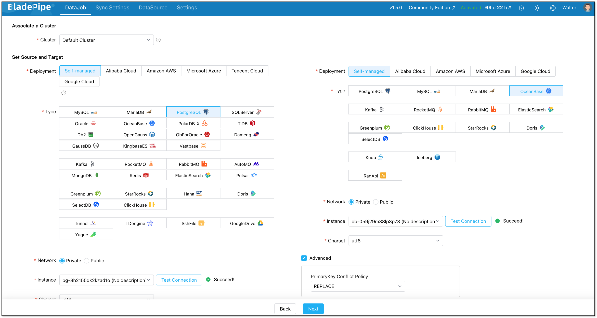
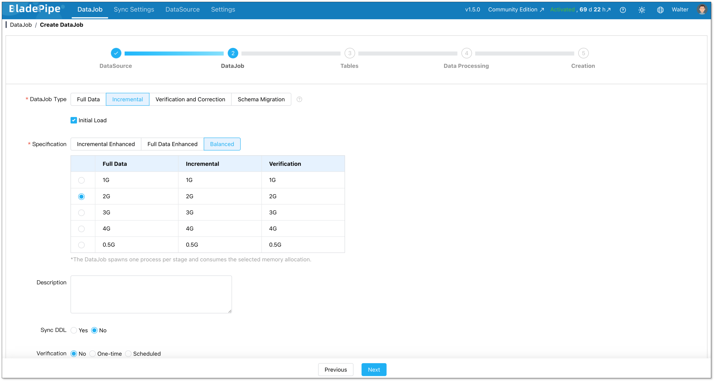
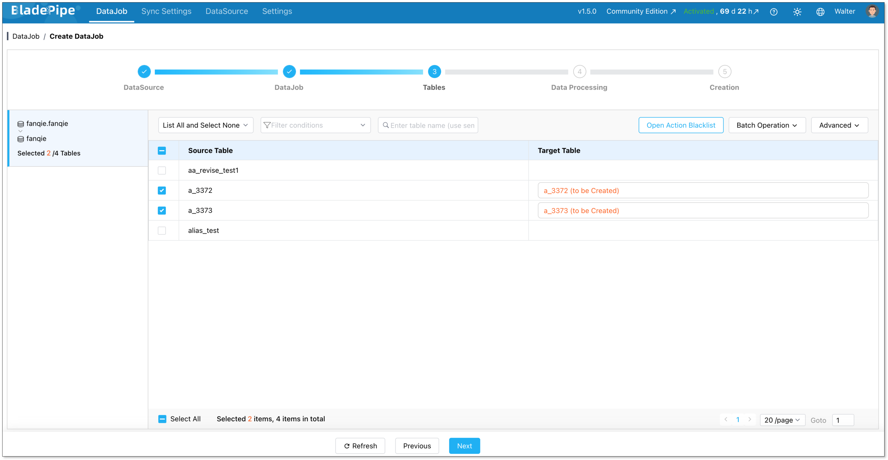
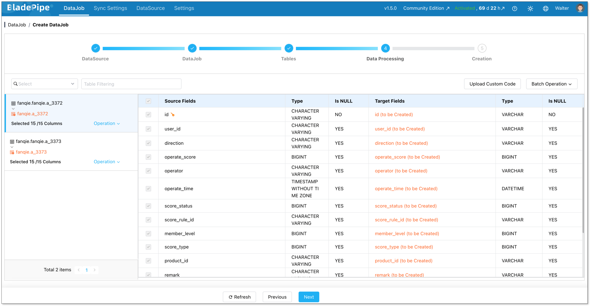
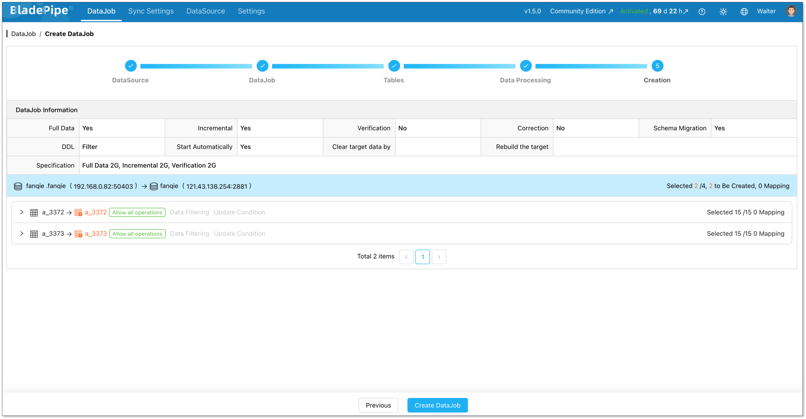
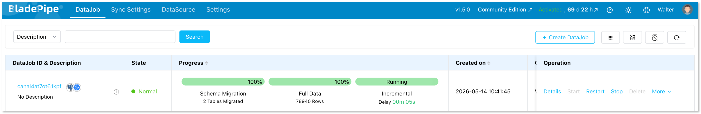

PostgreSQL is solid. But at some point, teams decide to migrate PostgreSQL to OceanBase because they need something it can't easily give: horizontal scale, built-in HA, or multi-region support.

This guide shows you how to do it with BladePipe. No Kafka, no custom scripts. Just a working pipeline.

## Key Takeaways
+ PostgreSQL is tested for OLTP, but horizontal scaling, high availability, and multi-region deployments push it to its limits.
+ OceanBase offers distributed SQL with native Paxos-based HA, multi-tenancy, and linear scalability, making it a strong migration target.
+ Traditional migration approaches (pg_dump + manual cutover, or self-built CDC stacks) are slow, fragile, and operationally expensive.
+ BladePipe simplifies the entire process: full data load + real-time CDC sync in one pipeline, with no Kafka, no Debezium, and no custom scripts.

## Why Migrate from PostgreSQL to OceanBase?
PostgreSQL works well for most use cases. But some problems are hard to solve without changing databases.

+ **Write scaling:** PostgreSQL is a single-node database at heart. Read replicas help with reads. But writes go to one primary. When that becomes the bottleneck, your options are limited.
+ **High availability:** A typical PostgreSQL HA setup needs streaming replication, a tool like Patroni, and a load balancer. Failover takes time and human attention. It works, but it's a lot to maintain.
+ **Multi-region:** Serving users across regions from one PostgreSQL cluster is difficult. You either accept high latency for some users, or build complex replication setups that are hard to keep consistent.
+ **Maintenance windows:** VACUUM, index rebuilds, ANALYZE. PostgreSQL's maintenance operations can cause performance degradation at the worst times, especially on large tables.

OceanBase addresses these pain points at the architecture level:

+ **Paxos-based HA**: Data is replicated across multiple replicas. If one node fails, the cluster elects a new leader in seconds. No manual steps needed.
+ **Horizontal scaling**: OceanBase distributes data across nodes with automatic sharding. Adding capacity is a matter of adding nodes, not rearchitecting your application.
+ **Multi-active zones**: Replicas can serve reads and writes from multiple zones simultaneously, making low-latency multi-region deployments practical.
+ **SQL compatibility**: OceanBase offers compatibility modes for both MySQL and PostgreSQL, so your existing SQL and most application code can work with minimal changes

If you are hitting any of these walls with PostgreSQL, OceanBase is worth a serious look.

## The Challenge: Why Migration Is Hard
Deciding to migrate is the easy part. Doing it safely is where things break down.

**The easy way: pg_dump and pray.** 

Dump your PostgreSQL database, load it into OceanBase, then switch your application. It works for small databases. But for production systems, it means downtime. Any writes during the migration window are lost unless you handle them manually. 

**The [CDC](https://www.bladepipe.com/blog/data_insights/top_cdc_tool/) way: build it yourself.** 

To avoid downtime, many teams reach for [Debezium](https://www.bladepipe.com/blog/data_insights/debezium_alternatives/) to capture changes from PostgreSQL's WAL, Kafka as a message buffer, and a custom consumer to transform and write data to OceanBase. This works. But it means:

+ 4 to 5 components to deploy, monitor, and maintain
+ Custom logic for offset tracking and fault recovery
+ Schema changes need manual handling on each side
+ Weeks of work before you can test anything in production

And after all that, you still need to map data types, validate consistency, and plan the cutover.

Migration should not take weeks to set up.

## BladePipe vs. The Traditional Approach
[**BladePipe**](https://www.bladepipe.com) is a CDC-based data integration tool that puts the whole pipeline in one place. It reads changes from PostgreSQL's logical replication, maps types automatically, and writes to OceanBase continuously.




Here's how the two approaches compare:

| | Traditional (pg_dump / Debezium + Kafka) | BladePipe |
| --- | --- | --- |
| Setup time | Days to weeks | Minutes |
| Components to maintain | 4 to 5 | 1 |
| Schema changes | Manual | Automated |
| Fault recovery | Custom offset management | Auto checkpoint |
| Monitoring | DIY | Built-in dashboard |
| Cutover risk | High | Low |


After the initial full load, BladePipe keeps reading changes from PostgreSQL and applying them to OceanBase in real time. Lag stays in the seconds range. When you are ready to cut over, wait for lag to hit zero, update your connection string, and you are done.

## Step-by-Step Tutorial: Migrating PostgreSQL to OceanBase
### Prerequisites
+ PostgreSQL 9.0 or later
+ A running OceanBase instance with MySQL or PostgreSQL compatibility mode enabled
+ BladePipe installed ([one Docker command to get started](https://www.bladepipe.com/docs/productOP/onPremise/installation/install_all_in_one_docker/))


### Step 1: Prepare Your PostgreSQL Database
BladePipe reads from PostgreSQL's logical replication. You need to enable it and create a sync user.

#### Enable Logical Replication
In `postgresql.conf`, set:

```plain
wal_level = logical
```

Restart PostgreSQL after making this change.

#### For Full Migration Only (No CDC)
```sql
-- Create the sync user
CREATE USER <your_account> WITH PASSWORD '<your_password>';

-- Grant read access
GRANT SELECT, REFERENCES ON ALL TABLES IN SCHEMA <target_schema> TO <your_account>;
```

#### For Incremental Sync (Recommended)
+ The **CREATE** permission on the databases to be synchronized.
+ The **OWNER** permission on the tables to be synchronized.
+ The **REPLICATION** permission on the user.

```sql
-- Create the sync user
CREATE USER <your_account> WITH PASSWORD '<your_password>';

-- Grant superuser role for replication management
GRANT postgres TO <your_account>;

-- Enable replication
ALTER USER <your_account> REPLICATION;
```

+ The permissions to create triggers and tables to enable **DDL synchronization** in DataJobs. 

```sql
-- Create a DDL capture table (bp_pg_ddl_capture_tab)
CREATE TABLE IF NOT EXISTS public.bp_pg_ddl_capture_tab(
  id bigserial primary key,
  biz_ddl text,
  biz_user character varying(64) default current_user,
  biz_txid character varying(16) default txid_current()::varchar(16),
  biz_tag character varying(64),
  biz_db character varying(64) default current_database(),
  biz_schema character varying(64) default current_schema,
  biz_client_addr character varying(64) default inet_client_addr(),
  biz_client_port integer default inet_client_port(),
  biz_event_time timestamp default current_timestamp
);
      
-- Create a DDL capture function (bp_pg_ddl_capture_func)
CREATE OR REPLACE FUNCTION public.bp_pg_ddl_capture_func() RETURNS event_trigger
  LANGUAGE plpgsql
  SECURITY INVOKER
AS $$
declare ddl text;
begin if (tg_tag in ('DROP INDEX','ALTER TABLE','DROP TABLE','CREATE INDEX','CREATE TABLE')) then
  select current_query() into ddl;
  insert into public.bp_pg_ddl_capture_tab(biz_ddl,biz_user,biz_txid,biz_tag,biz_db,biz_schema,biz_client_addr,biz_client_port,biz_event_time) values (ddl,current_user,cast(txid_current() as varchar(16)),tg_tag,current_database(),current_schema,inet_client_addr(),inet_client_port(),current_timestamp);
end if;
end;
$$
      
-- Grant the related permissions
GRANT USAGE ON SCHEMA public TO public;
GRANT SELECT,INSERT,DELETE ON TABLE public.bp_pg_ddl_capture_tab TO public;
GRANT SELECT,USAGE ON SEQUENCE public.bp_pg_ddl_capture_tab_id_seq TO public;
GRANT EXECUTE ON FUNCTION public.bp_pg_ddl_capture_func() TO public;
      
-- Create a DDL event trigger (bp_pg_ddl_capture_event)
CREATE EVENT TRIGGER bp_pg_ddl_capture_event ON ddl_command_end EXECUTE PROCEDURE public.bp_pg_ddl_capture_func();
ALTER EVENT TRIGGER bp_pg_ddl_capture_event ENABLE always;
```

**Note:** If you are using a managed PostgreSQL service like RDS or Cloud SQL, check the provider docs for enabling logical replication. The steps vary slightly.

### Step 2: Add DataSources in BladePipe
Log in to the BladePipe Console. Go to **DataSource** > **Add DataSource**.

**PostgreSQL source:**

+ Type: PostgreSQL
+ Host: your PostgreSQL connection details
+ Username and Password: the credentials to connect to your PostgreSQL

**OceanBase target:**

+ Type: OceanBase
+ Host: your OceanBase connection details
+ Username and Password: the credentials to connect to your OceanBase

Click **Test Connection** for both before moving on.



### Step 4: Create a DataJob
Go to **DataJob** > **Create DataJob**. Select PostgreSQL as the source and OceanBase as the target.



Pick your job type:

+ **Full Data**: one-time migration with a planned cutover window.
+ **Incremental + Initial Load**: BladePipe does a full load first, then switches to CDC automatically. This is the right choice for most production migrations.



Select the tables you want to sync. 



You can filter by column too.



Create the job. BladePipe starts the full load right away. Check progress from the **DataJob List** page.



Once the full load is done, BladePipe switches to incremental sync on its own. Watch the lag number in the dashboard drop toward zero.



## Key Technical Considerations
### Data Type Mapping
BladePipe handles most type conversions automatically. Here is a quick reference:

| PostgreSQL | OceanBase |
| --- | --- |
| `INTEGER` | `INT` |
| `BIGINT` | `BIGINT` |
| `NUMERIC` / `DECIMAL` | `DECIMAL` |
| `VARCHAR` | `VARCHAR` |
| `TEXT` | `LONGTEXT` |
| `BOOLEAN` | `TINYINT(1)` |
| `UUID` | `VARCHAR(36)` |
| `JSONB` / `JSON` | `JSON` |
| `TIMESTAMP WITHOUT TIME ZONE` | `DATETIME` |
| `TIMESTAMP WITH TIME ZONE` | `DATETIME` |
| `DATE` | `DATE` |
| `BYTEA` | `BLOB` |


### DDL Sync
What happens if you add a column to a PostgreSQL table while the job is running?

BladePipe picks it up. It supports automatic DDL sync for `ALTER TABLE`, `ADD COLUMN`, and similar changes. For PostgreSQL, DDL sync uses triggers. Make sure the sync user has trigger permissions before you start. See the [Required Privileges for PostgreSQL](https://www.bladepipe.com/docs/dataMigrationAndSync/datasource_func/PostgreSQL/privs_for_pg/) for details.

### Replication Slot Management
BladePipe uses a PostgreSQL replication slot to track its position in the WAL. This stops PostgreSQL from discarding WAL data that BladePipe hasn't read yet.

If BladePipe is paused for a long time, WAL data piles up and eats disk space. Keep an eye on it:

```sql
SELECT slot_name, pg_size_pretty(pg_wal_lsn_diff(pg_current_wal_lsn(), restart_lsn)) AS lag
FROM pg_replication_slots;
```

Set `max_slot_wal_keep_size` in `postgresql.conf` to put a cap on how much WAL is kept.

## Best Practices
Here are a few things that will save you headaches:

+ **Start small**: Pick one non-critical table first. Run the full pipeline end to end, validate the data, then expand to more tables. Do not try to migrate everything at once.
+ **Run a compatibility check early**: OceanBase's PostgreSQL mode covers most common SQL, but not every extension or feature. Check your schema for custom types, stored procedures, and any extensions you rely on before you start.
+ **Use Incremental + Initial Load**: Unless you have a scheduled maintenance window, always choose this mode over a one-time dump. It keeps your app running during migration and gives you a clean cutover moment.
+ **Validate before you cut over**: Do a row count check on every table. Spot-check a few rows on critical tables. Do not flip the connection string until you are confident the data matches.
+ **Monitor your replication slot**: If BladePipe stops for any reason, WAL builds up on the PostgreSQL side. Set `max_slot_wal_keep_size` and keep an eye on slot lag during the migration.

## Wrapping Up
PostgreSQL is a good database. But if you need distributed scale, better HA, or multi-region support, OceanBase is a practical next step.

BladePipe makes the move much simpler. Connect your sources, create a job, and let it run. Start with one non-critical table to get familiar with the flow. Once it works end to end, scaling to your full schema is straightforward.

[**Try BladePipe for free**](https://www.bladepipe.com/pricing/).

## FAQ
**Q: Does migration require downtime?**

Not with Incremental + Initial Load mode. BladePipe does the full load while your app keeps running. You only need a short pause at cutover, typically a few seconds.

**Q: Which OceanBase compatibility mode should I use?**

Use PostgreSQL compatibility mode. It gives you the closest SQL behavior and reduces the number of changes needed in your app. Not all PostgreSQL extensions are supported, so check OceanBase's compatibility docs before you start.

**Q: Can I sync only some tables?**

Yes. You pick which tables and columns to include when creating the DataJob. You do not have to migrate everything at once.
