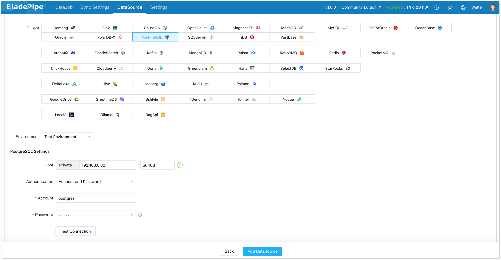
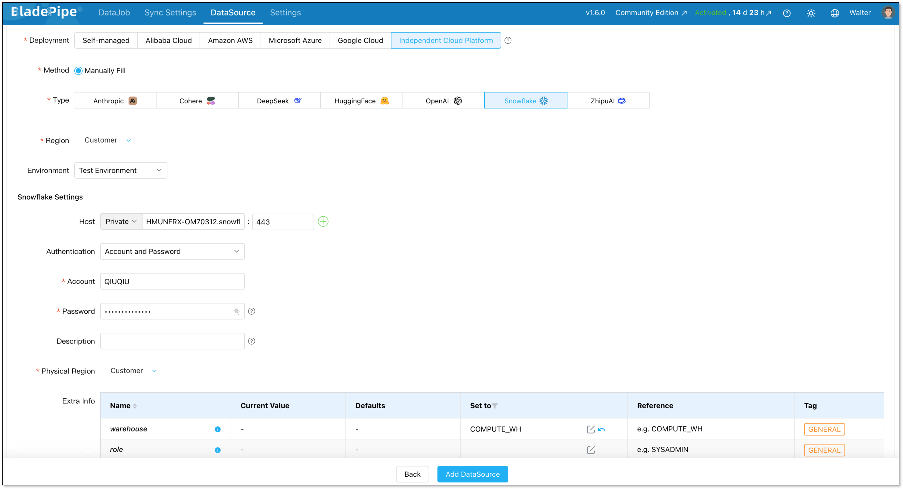
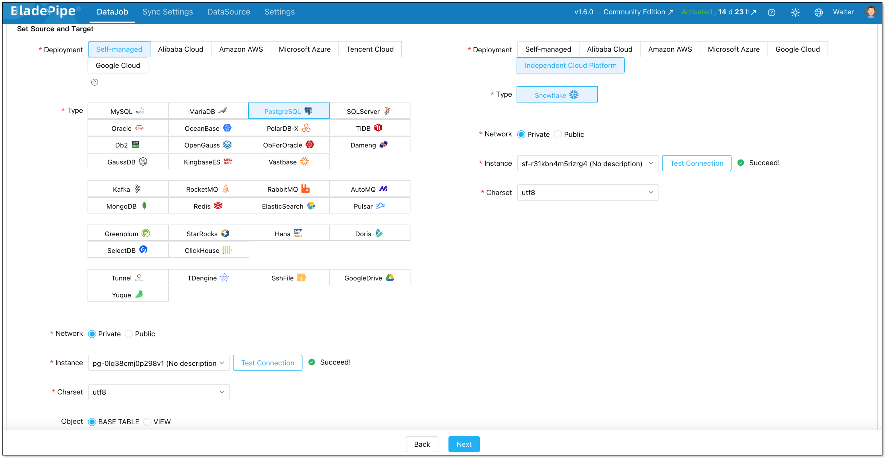
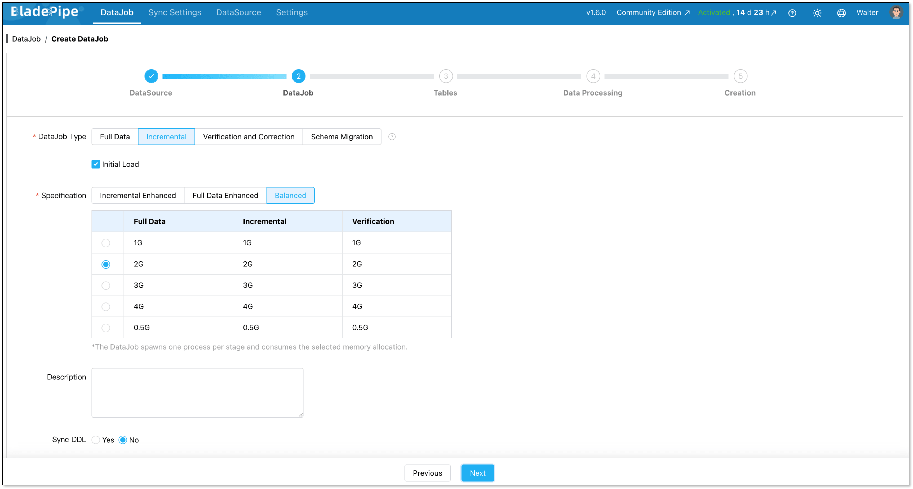
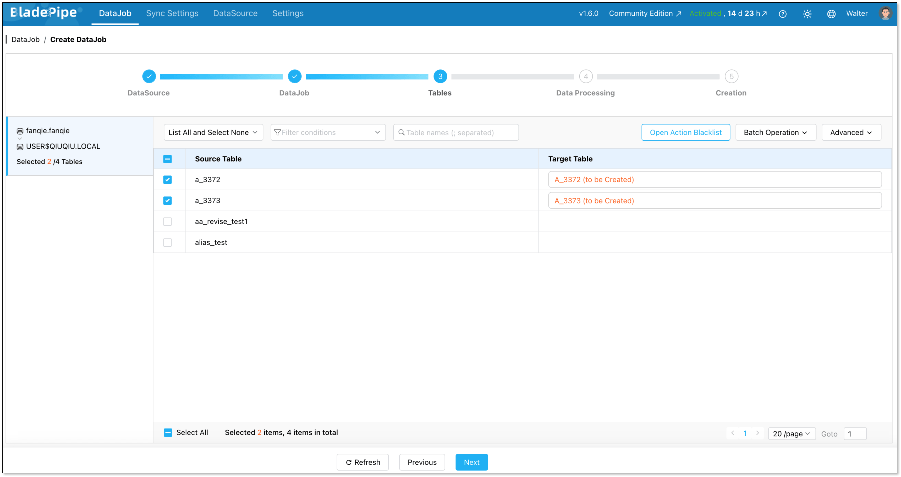
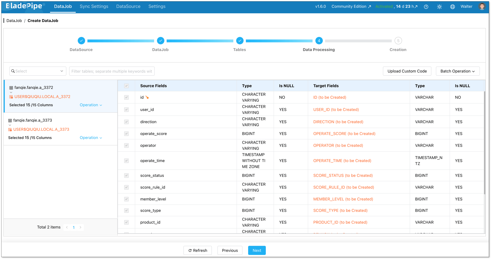
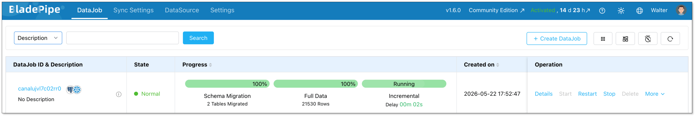

Moving data from PostgreSQL to Snowflake is a common need for data teams.

PostgreSQL is great for running your app. It's not great for running analytics on millions of rows.

When your BI team starts hammering the same database your users write to, things slow down fast. Queries time out. Engineers get paged. Everyone's unhappy.

Snowflake solves this. It's built for analytics, featuring columnar storage, elastic compute, fast parallel queries. Moving your data there is the right call.

The tricky part is how you do it. This guide covers the main options and walks through the full process using BladePipe, a CDC-based pipeline tool that keeps PostgreSQL and Snowflake in sync in real time.

## Key Takeaways
+ PostgreSQL is built for transactions, not analytics. Running heavy queries on your production database hurts everyone.
+ Snowflake handles analytical workloads well. Its columnar storage, parallel execution, and elastic compute make a real difference at scale.
+ Manual CSV and custom scripts work for one-time migrations. They break down when you need ongoing, real-time sync.
+ Debezium + Kafka gives you real-time CDC but comes with serious operational overhead. Only worth it if you already run Kafka.
+ BladePipe gives you real-time CDC without the complexity. Full load, then live sync, with automatic schema changes and built-in verification.
+ The two databases work well together. Keep PostgreSQL for your app, use Snowflake for analytics, and let BladePipe keep them in sync.

## Why Move from PostgreSQL to Snowflake?
It handles transactions well. It supports strong consistency. It works well for application backends. Many engineering teams trust it for core business systems.

The problem shows up when your analytics team starts using it too.

Complex queries on large tables slow everything down. A multi-table aggregation that scans millions of rows competes for the same CPU and I/O your application needs. Row-based storage means the database reads far more data off disk than the query actually needs. Add a few analysts running reports at the same time, and your production database starts feeling it.

Scaling helps, but it's expensive. PostgreSQL couples compute and storage together, so scaling for analytics means scaling the whole server. You're paying for more capacity just to handle queries that shouldn't be running there in the first place.

Snowflake solves a different problem.

It separates compute from storage, so you can scale them independently. It uses columnar storage, so analytical queries only read the data they actually need. And it runs queries in parallel across many nodes, so the heavy aggregations that crawl on PostgreSQL finish in seconds. When your analysis job is done, you suspend compute and stop paying for it.

In most cases, teams do not move everything out of PostgreSQL. They keep PostgreSQL for application writes. Then they replicate data into Snowflake for analytical reads. It's a clean split, and each database does what it's good at.

The only question is how to keep the two in sync.

## 4 Methods for PostgreSQL to Snowflake Migration
There are a few ways to get data from PostgreSQL into Snowflake. Each has real trade-offs.

### Method 1: Manual CSV Export
The simplest method is to export data from PostgreSQL as CSV files, upload them to a stage, and load them into Snowflake with `COPY INTO`.

This method is easy to understand. It does not require a complex pipeline. It can work well for a small one time migration.

But it has clear limits. A CSV export is only a snapshot. Once the export is complete, the source data may already have changed. New inserts, updates, and deletes do not automatically reach Snowflake.

You also need to handle schema changes yourself. If a source column changes, the export and load process may break. If you run exports on a schedule, you need to manage incremental logic, file naming, retries, and duplicate handling.

CSV export is a good starting point for small datasets. It is not a good fit for continuous PostgreSQL to Snowflake replication.

### Method 2: Custom Python Script
Another option is to write a script that reads from PostgreSQL and writes to Snowflake.

A typical script reads rows in batches. It may use an `updated_at` column to find changed records. Then it inserts or updates those records in Snowflake.

This gives you more control than CSV export. You can add custom logic. You can add transformation logic, filter rows, handle type conversions.

But the hidden cost is maintenance. You need to handle retries, failures, type conversion, schema changes, duplicate records, and data validation. You also need to decide how to process deletes. If a row is deleted in PostgreSQL, a timestamp based script may not detect it unless you build extra logic.

Custom scripts can work for simple batch sync jobs. They are harder to maintain when the pipeline becomes business critical.

### Method 3: Debezium + Kafka
[Debezium](https://www.bladepipe.com/blog/data_insights/debezium_alternatives/) is a popular open source CDC tool. It can read changes from PostgreSQL logical replication and publish them to Kafka. Then a Kafka connector can write those change events into Snowflake.  

This approach supports near real time data replication. It can capture inserts, updates, and deletes. It is a strong option for teams that already run Kafka in production.  

The tradeoff is complexity. You need to manage PostgreSQL logical replication, Debezium, Kafka, Kafka Connect, the Snowflake sink connector, offsets, schemas, monitoring, and failure recovery. 

You also need to monitor replication lag carefully. If a CDC connector falls behind and PostgreSQL keeps WAL files for the replication slot, disk usage can grow. This needs proper configuration and monitoring.  

Debezium with Kafka is usually best for teams that already have Kafka expertise and want to build a broader event streaming architecture.

### Method 4: BladePipe
[BladePipe](https://www.bladepipe.com/) is another way to build PostgreSQL to Snowflake replication.

It is designed for data migration, data sync, and real-time data replication. For this use case, BladePipe can help you move existing PostgreSQL data to Snowflake and keep the target updated with incremental changes.

The main value is that it puts the key steps into one workflow.

You can finish schema replication, initial data load, incremental data sync, and even data verification in one platform. This reduces the need to build and maintain a complex [CDC](https://www.bladepipe.com/blog/data_insights/change_data_capture_cdc/) stack by yourself.  
BladePipe is useful when you want PostgreSQL to Snowflake replication without managing Debezium, Kafka, and custom verification scripts as separate systems.  

### PostgreSQL to Snowflake Migration Method Comparison
| Method | Best For | Latency | CDC Support | Handles Deletes | Schema Change Handling | Engineering Effort | Data Verification |
| --- | --- | --- | --- | --- | --- | --- | --- |
| CSV export | Small one time migration | Manual | No | No | Manual | Low at first | Manual |
| Custom scripts | Simple batch sync | Minutes to hours | Limited | Usually custom | Custom | Medium to high | Custom |
| Debezium with Kafka | Kafka based teams | Seconds to minutes | Yes | Yes | Depends on setup | High | Custom |
| BladePipe | End to end migration and replication | Near real time | Yes | Yes | DDL sync for common changes | Low to medium | Built in |

## Step-by-Step Guide: PostgreSQL to Snowflake Using BladePipe
Now let’s walk through the basic process.

The exact settings may depend on your environment. But the main flow is usually the same.

### Prerequisites
**PostgreSQL**

It works with self-hosted PostgreSQL, RDS, Aurora, and Azure Database for PostgreSQL.

Grant privileges according to [Required Privileges for PostgreSQL](https://www.bladepipe.com/docs/dataMigrationAndSync/datasource_func/PostgreSQL/privs_for_pg/).

**BladePipe**

You can choose [Cloud](https://www.bladepipe.com/docs/quick/quick_start_mgr/) version or [Community](https://www.bladepipe.com/docs/quick/quick_start/) version.

+ Cloud: fully managed. 90-day free trial.
+ Community: self-hosted and fully free. [One-command deployment](https://www.bladepipe.com/docs/productOP/onPremise/installation/install_all_in_one_docker/).

### Step 1: Add DataSources
Log in to BladePipe. Go to **DataSources** > **Add DataSource**. 

Add **PostgreSQL**.

+ Deployment: Self-managed
+ Type: PostgreSQL
+ Host: Host and port to connect to the instance
+ Account & Password: Credentials to log in to your PostgreSQL

Click **Add DataSource**.

Add **Snowflake**.

+ Deployment: Independent Cloud Platform
+ Type: Snowflake
+ Host: Host and port to connect to the instance
+ Account & Password: Credentials to log in to your Snowflake 
+ Extra Info _**warehouse**_: The name of virtual warehouse used for query execution

Click **Add DataSource**.

### Step 2: Create a DataJob
Go to **DataJobs** > **Create DataJob**.

Select your PostgreSQL source and Snowflake target.

Choose DataJob type: **Incremental** plus **initial load**. This is the right choice for most cases. Initial Load handles existing data. CDC takes over after that.

Select which tables to sync. You can include everything or pick specific ones.

Select the columns to sync. Here you can process data, like filtering and transformation.

Click **Create DataJob**, and the pipeline will start running. 

## PostgreSQL-Snowflake Migration Best Practices
### Review Data Types Carefully
PostgreSQL and Snowflake do not use identical data types. Most common fields can be mapped, but some require review.

Here are common examples:

| PostgreSQL Type | Snowflake Type |
| --- | --- |
| `integer` | `NUMBER` |
| `bigint` | `NUMBER` |
| `numeric` / `decimal` | `NUMBER` |
| `real` / `double precision` | `FLOAT` |
| `boolean` | `BOOLEAN` |
| `text` / `varchar` | `VARCHAR` |
| `date` | `DATE` |
| `timestamp without time zone` | `TIMESTAMP_NTZ` |
| `timestamp with time zone` | `TIMESTAMP_TZ` |
| `json` / `jsonb` | `VARIANT` |
| `array` | `VARIANT` |
| `uuid` | `VARCHAR` |
| `bytea` | `BINARY` or `VARCHAR` |
| `enum` | `VARCHAR` |
| `inet` / `cidr` | `VARCHAR` |
| `serial` / `bigserial` | `NUMBER` |

### Migrate in phases for large databases
Don't try to move everything at once. Start with the 10-20 tables your analytics team needs most. Validate them. Let dashboards start using Snowflake. Then add more tables incrementally.

BladePipe lets you add tables to a running DataJob without restarting anything.

### Monitor PostgreSQL WAL Usage
When CDC is enabled, PostgreSQL needs to retain change data long enough for the replication process to read it. If the CDC process falls behind, WAL files may accumulate. This can create pressure on the source database if it is not monitored.

Before production migration, make sure your team understands WAL retention, replication slots, disk usage, and alerting.

### Control Snowflake Cost
Snowflake is powerful, but cost still needs attention.

Choose the right warehouse size. Avoid unnecessary full reloads. Monitor warehouse usage.

For large systems, you may also separate loading workloads from query workloads. This helps keep both performance and cost under control.

## Conclusion
PostgreSQL and Snowflake are good at different things. Running both is a common and sensible setup.

BladePipe provides a direct way to build a PostgreSQL to Snowflake replication pipeline.

It helps teams move data into Snowflake and keep it updated with less operational overhead.

For teams that want fresh PostgreSQL data in Snowflake for analytics, reporting, or AI workloads, this can be a practical choice.

If you want to try it, you can choose what works for you. the [Cloud](https://www.bladepipe.com/login/) has a 90-day free trial. The [Community Edition](https://www.bladepipe.com/pricing/) is fully free and runs in Docker, Kubernetes or through binary package.

## FAQ
**Q: What is the best way to migrate PostgreSQL to Snowflake?**

It depends on your use case.

For a small one time migration, CSV export may be enough.

For simple batch sync, a custom script can work.

For real time CDC with an existing Kafka stack, Debezium with Kafka is a strong option.

For end to end migration and continuous replication with less operational work, BladePipe is a practical choice.

**Q: Which PostgreSQL versions does BladePipe support?**

PostgreSQL 10 and above. Works with self-hosted, AWS RDS, Amazon Aurora, GCP Cloud SQL, and Azure Database for PostgreSQL.

**Q: Does the migration require downtime?**

In most cases, a CDC based migration can be done without planned application downtime.  
The source PostgreSQL database can keep running while the initial load and incremental sync are in progress.  
Still, you should test the impact of the initial load, network usage, replication settings, and source database load before running the migration in production.

**Q: What if my schema changes during sync?**

With DDL sync enabled, BladePipe picks up schema changes from the WAL and applies them to Snowflake automatically. You can add a column or drop one without restarting the pipeline.

**Q: Can I sync only specific tables or rows?**

Yes. You choose which tables to include when creating a DataJob. For rows, you can add filter conditions. For example, only sync orders from the past two years, or skip archived records.