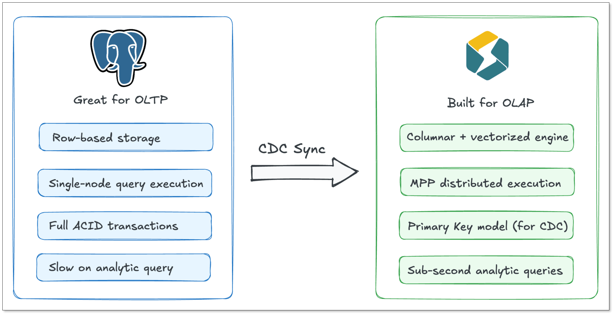
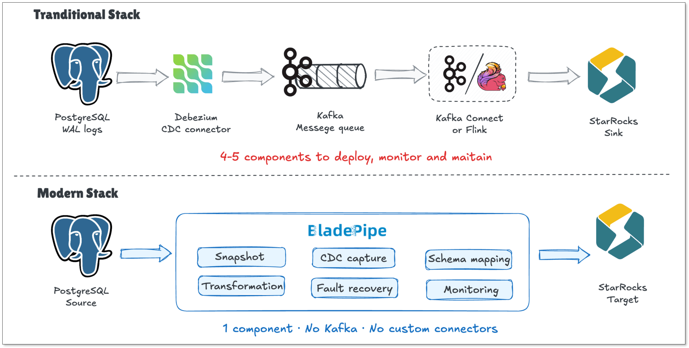
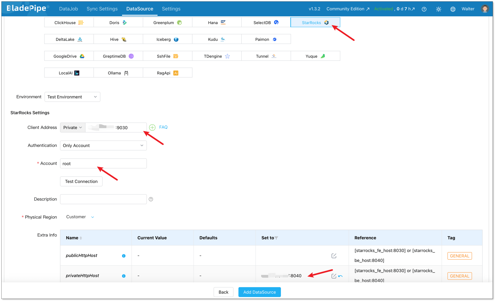
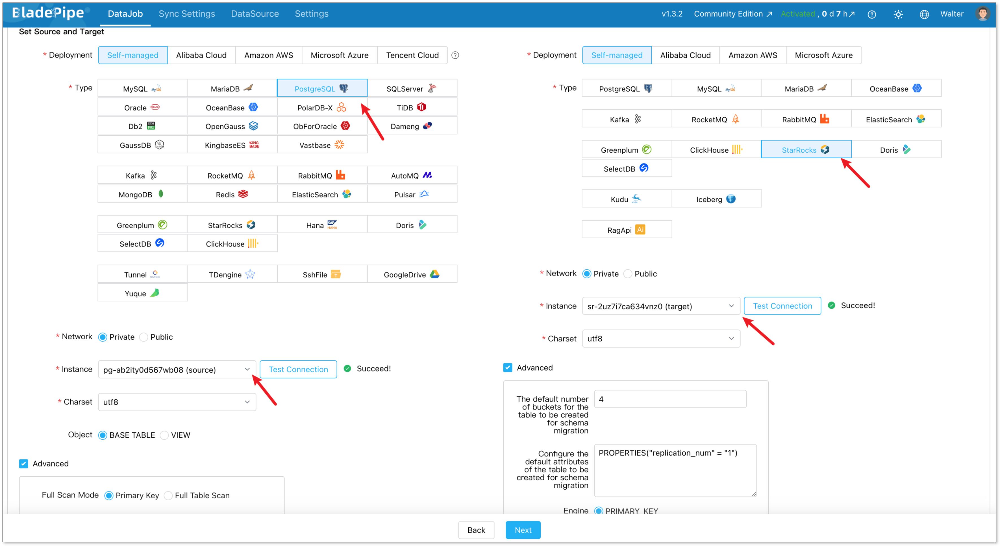
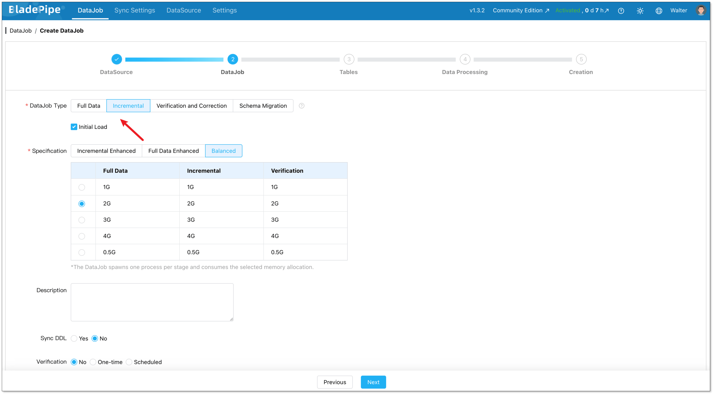
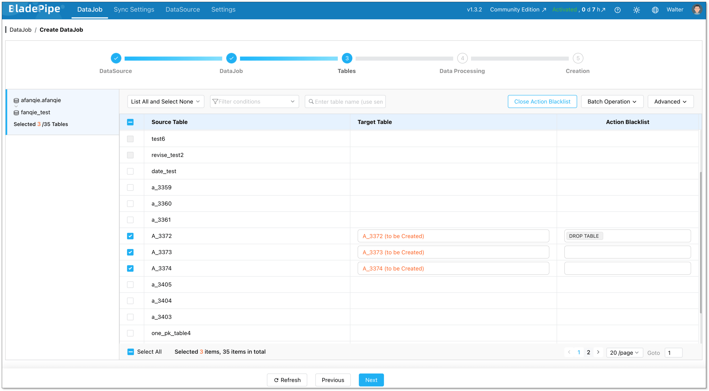
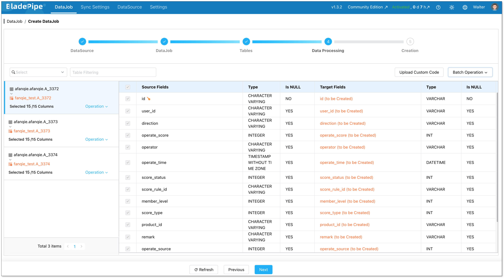
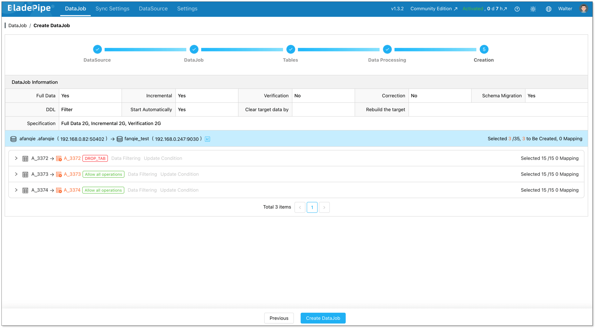
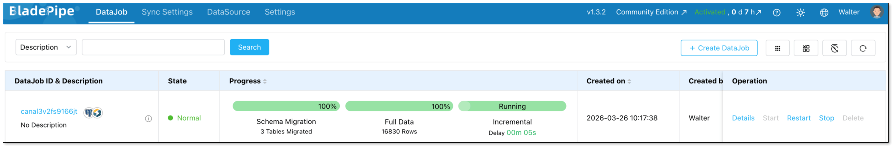

PostgreSQL is a great transactional database. It handles writes well, enforces data integrity, and has been a reliable workhorse for applications for decades. But when your analytics queries start slowing down, you know it's time to offload that work somewhere else.

That's where StarRocks comes in. It's a high-performance OLAP delivering sub-second analytic queries.

And getting your PostgreSQL data into StarRocks doesn't have to be a complex, multi-week engineering project.

In this guide, we'll walk through how to sync PostgreSQL to StarRocks using BladePipe, a CDC-based data integration tool that handles the heavy lifting for you. By the end, you'll have a real-time pipeline running with no custom code required.

## Key Takeaways
+ PostgreSQL is great for transactions, not analytics, while StarRocks delivers fast, real-time analytical queries at scale.
+ Traditional pipelines (Debezium + Kafka + Flink) are complex and costly.
+ Modern tools like BladePipe simplify everything into one pipeline, with no extra infrastructure.
+ BladePipe setup process takes only minutes, and it handles full load + incremental sync automatically.

## Why Move Data from PostgreSQL to StarRocks?
PostgreSQL is a perfect OLTP, but it is not good at analytics. 

When your app inserts orders and updates records, it handles that beautifully. But when your BI team needs the revenue by region for the last 90 days, that query has to scan millions of rows while competing with your live application traffic for the same resources. Everyone loses.

StarRocks is built specifically for [analytics workloads](https://www.bladepipe.com/real-time-analytics/). Here's what makes it a natural fit as a read layer on top of PostgreSQL:

+ **Columnar storage & vectorized engine**: Columnar storage reads only the columns your query touches; the vectorized engine processes them with minimal CPU overhead
+ **MPP architecture**: Query execution is distributed across nodes in parallel, so performance scales with your data
+ **Primary Key model**: Natively supports `UPDATE` and `DELETE`, so CDC changes from PostgreSQL map cleanly with no workarounds
+ **Real-time materialized views**: Pre-aggregate data as it lands, dashboards read from pre-computed results instead of recalculating every time
+ **MySQL-compatible protocol**: Your existing BI tools and SQL clients connect without any changes




Now, the only question is how to keep them in sync without a ton of operational overhead. That's where BladePipe comes in.

## BladePipe vs. The Traditional Approach
For Postgres-StarRocks data movement, the [traditional way](https://www.bladepipe.com/blog/data_insights/iceberg_cdc_pipeline/) usually means stitching together several tools: Debezium to capture changes from [PostgreSQL's WAL](https://www.bladepipe.com/blog/data_insights/mysql_cdc_vs_postgres_cdc/) (Write-Ahead Log), Kafka as a message buffer, and Flink or a custom consumer to transform and load data.

[BladePipe](https://www.bladepipe.com/), as a modern data integration tool, collapses all of that into a single pipeline. No Kafka, no connector JARs, no Flink job. Just set the source and destination, pick your tables, and it handles CDC capture, schema mapping, retries, and checkpointing out of the box.

And it doesn't trade speed for simplicity. End-to-end latency stays under 3 seconds. Changes written to PostgreSQL show up in StarRocks almost immediately.



Here's how the two approaches compare at a glance:

| | Traditional Way | BladePipe |
| --- | --- | --- |
| Setup time | Days | Minutes |
| Components to maintain | 4-5 | 1 |
| Schema evolution | Manual | Automated |
| Fault recovery | Custom offset management | Auto checkpoint |
| Monitoring | DIY (JMX, Grafana, etc.) | Built-in dashboard |


## Step-by-Step Tutorial: Syncing Postgres to StarRocks
Next, let’s walk through the actual setup step by step.

### Prerequisites
+ A running PostgreSQL instance 
+ A running StarRocks instance
+ Install BladePipe using one command (instructions are available at [Install All-in-One (Docker)](https://www.bladepipe.com/docs/productOP/onPremise/installation/install_all_in_one_docker/))

### Step 1: Prepare Your PostgreSQL Database
Before BladePipe can sync your data, you need to create a dedicated sync user and grant it the right permissions.

#### For Full Migration (ETL)
Create a user and grant `SELECT` and `REFERENCES` on the tables you want to migrate:

```sql
-- Create the sync user
CREATE USER <your_account> WITH PASSWORD '<your_password>';

-- Grant access to the target schema
GRANT SELECT, REFERENCES ON ALL TABLES IN SCHEMA <target_schema> TO <your_account>;
```

#### For Incremental Sync (CDC)
This is where most people are headed — capturing ongoing changes in real time. You'll need a bit more:

```sql
-- Create the sync user
CREATE USER <your_account> WITH PASSWORD '<your_password>';

-- Grant the table owner's role so the user can manage replication
GRANT postgres TO <your_account>;

-- Enable replication for this user
ALTER USER <your_account> REPLICATION;
```

### Step 2: Add Your Connectors
Log in to BladePipe Console and go to **DataSource** > [**Add DataSource**](https://www.bladepipe.com/docs/operation/datasource_manage/add_self_maintain_ds/).

**Add PostgreSQL:**

+ Type: PostgreSQL
+ Fill in your host, port, and credentials

**Add StarRocks:**

+ Type: StarRocks
+ Client Address: the IP and port StarRocks provided to MySQL Client.
+ Account: a StarRocks user with INSERT permission
+ Parameter _privateHttpHost_: change the value to the IP and port of the FE/BE node.



### Step 3: Build a Pipeline
Next, create a new data replication job.

Go to **DataJob** > [**Create DataJob**](https://www.bladepipe.com/docs/operation/job_manage/create_job/create_full_incre_task/). Then select the source and target DataSources, and click **Test Connection** for both.




For one-time migration, select **Full Data** for DataJob Type. For continuous replication, select **Incremental**, together with the **Initial Load** option.



Select the tables you want to replicate. **Note that the target StarRocks tables automatically created after Schema Migration have primary keys, so source tables without primary keys are not supported currently**.



Choose the columns to sync.       



Confirm and create the DataJob.     



Now the pipeline is running. You can check the status of the pipeline in the **DataJob List** page.  



## Key Technical Considerations
### How BladePipe Writes to StarRocks
Under the hood, BladePipe loads data via StarRocks [Stream Load](https://docs.starrocks.io/docs/sql-reference/sql-statements/loading_unloading/STREAM_LOAD/), converting existing data and change events into byte streams transferred via HTTP for bulk writes. It automatically converts INSERT, UPDATE, and DELETE operations into INSERT statements and fills in the `__op` value (a delete identifier), enabling StarRocks to merge data correctly. 

This is important to understand: everything goes through Stream Load, which is fast and efficient but requires your tables to have primary keys in StarRocks.

### DDL Sync
One of the most painful parts of any CDC pipeline is handling schema changes. If you add a column in PostgreSQL, does it automatically appear in StarRocks? With BladePipe, yes. Automatic DDL sync keeps downstream tables always in sync whenever schema changes occur. 

For PostgreSQL source, DDL sync is achieved via triggers. You have to grant certain permissions before building a pipeline following the [instructions](https://www.bladepipe.com/docs/dataMigrationAndSync/datasource_func/PostgreSQL/privs_for_pg/).

### Data Type Mapping
PostgreSQL and StarRocks don't share the same type system, but BladePipe helps map most common data types cleanly with no extra work. Some of the mapping relations are:

| PostgreSQL | StarRocks |
| --- | --- |
| INTEGER | INT |
| NUMERIC | DECIMAL |
| UUID | VARCHAR |
| JSONB | JSON |
| TIMESTAMP_WITHOUT_TIME_ZONE | DATETIME |
| TIMESTAMP_WITH_TIME_ZONE | DATETIME |


### Replication Slot Management
PostgreSQL's [logical replication](https://www.postgresql.org/docs/current/logical-replication.html) uses replication slots to track which WAL segments the consumer has processed. These slots can accumulate WAL data indefinitely if the consumer falls behind or disconnects. Keep an eye on your `pg_replication_slots` view in production, and set `max_slot_wal_keep_size` in PostgreSQL to cap storage usage.

## Conclusion
Syncing PostgreSQL to StarRocks turns your database architecture from a slow batch setup into a real-time powerhouse. You get the reliability of PostgreSQL for your transactions and the fast speed of StarRocks for your analytics workloads.

BladePipe makes the setup fast and low-friction. Instead of building and maintaining a custom Debezium-Kafka-Flink stack, you connect your sources, create a DataJob, and let it run.

[**Ready to try it out?**](https://www.bladepipe.com/login/) Start with a small table, follow the steps above, and see how fast your dashboards feel when they're powered by an MPP engine.

## FAQ
**Q: Does BladePipe support all PostgreSQL versions?** 

BladePipe supports PostgreSQL's logical replication, which has been available since PostgreSQL 9.4. Most modern [PostgreSQL deployments (10+)](https://www.bladepipe.com/docs/dataMigrationAndSync/datasource_version/) are fully supported.

**Q: Can I sync only specific tables or columns?** 

Yes. When creating a DataJob, you choose exactly which tables and columns to replicate. You're not forced to sync your entire database.

**Q: How does StarRocks handle concurrent analytics queries while data is being ingested?** 

StarRocks is designed for exactly this. Its real-time update model can perform upsert and delete operations based on the primary key while achieving efficient query performance during concurrent updates. Reads and writes don't block each other.

**Q: Is BladePipe free?** 

Yes, BladePipe has a **free Community** version. For the details of various plans, you can check the [pricing page](https://www.bladepipe.com/pricing/).

> **Suggested Reading:**
> - [MySQL to StarRocks](https://www.bladepipe.com/blog/tech_share/mysql_starrocks_sync/)
> - [PostgreSQL to PostgreSQL](https://www.bladepipe.com/blog/tech_share/pg_pg_sync/)
