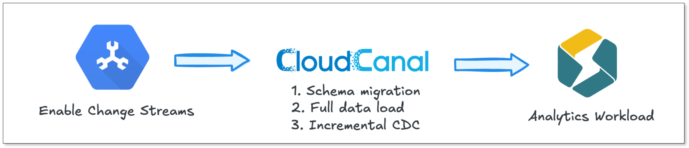
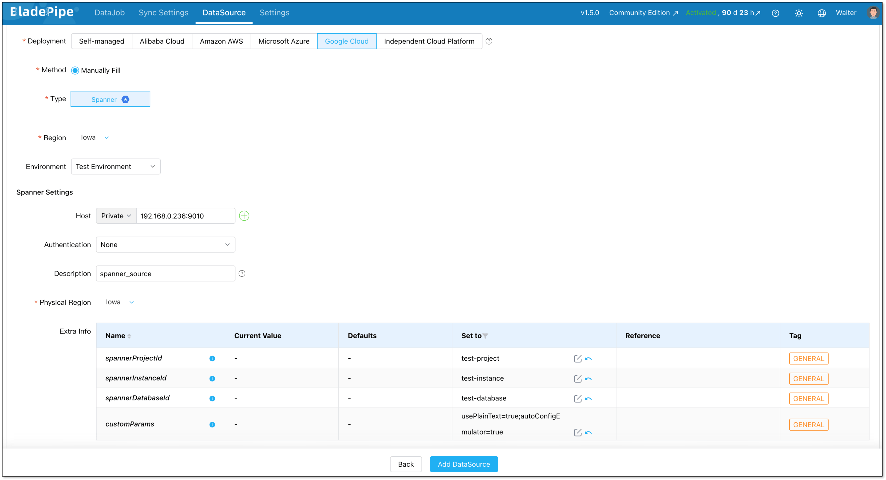
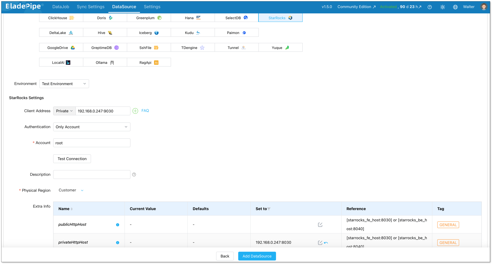
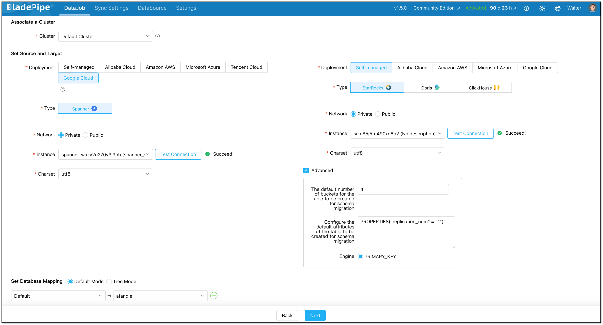
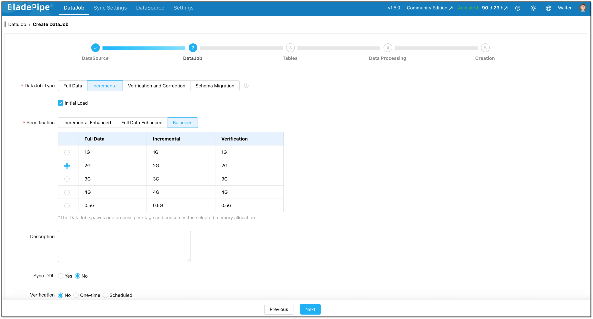
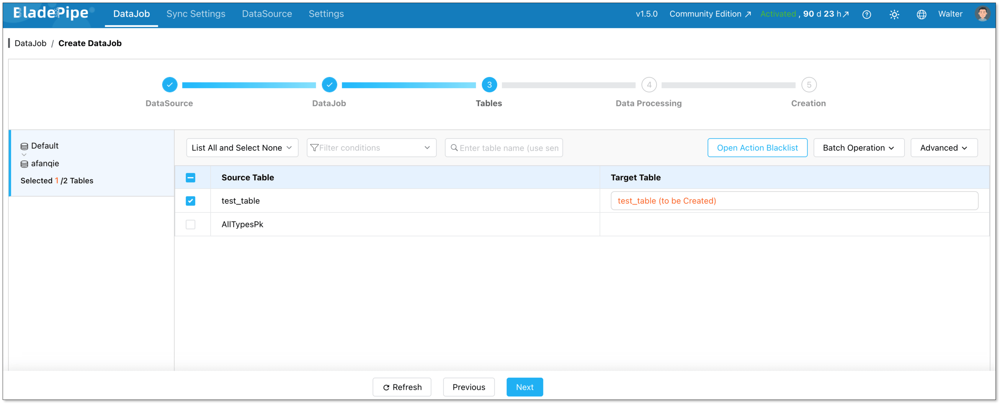
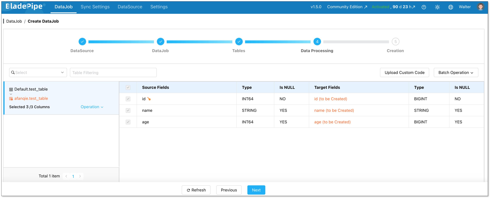
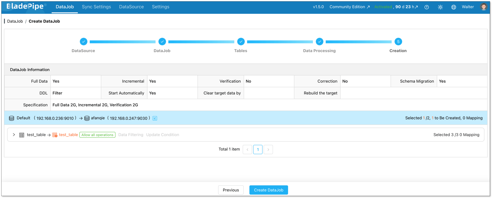
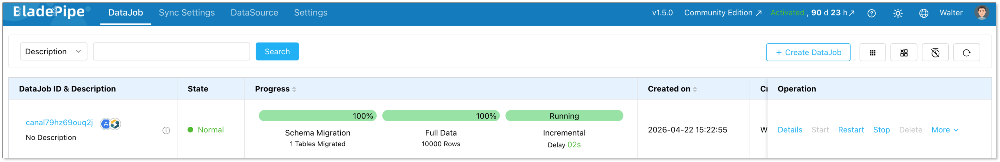

Teams cut the analytics cloud bill by 80% without changing a single line of application code. The same data, moved to the right system, can cost a fraction of what you're paying today. 

Here's how teams are using real-time data replication to slash analytics costs without sacrificing performance.

## Key Takeaways

- **Running OLAP workloads on Google Spanner is expensive by design**. Spanner's pricing model is built around OLTP transactions, not analytical queries.
- **Migrating analytics to StarRocks can reduce costs by 70–80%**, thanks to its columnar storage, vectorized execution engine, and storage-compute separation architecture.
- **Data replication from Spanner to StarRocks enables decoupled architecture**. Spanner handles transactions, StarRocks handles analytics, and each system does what it does best.
- **BladePipe offers a no-code path** to set up a full data pipeline, including full load migration and CDC incremental sync — in a matter of minutes.
- **End-to-end sync latency under 3 seconds** makes this architecture suitable for real-time OLAP dashboards and reporting.

## The Real Cost of Running Analytics on Google Spanner

The same data, stored in different systems, can cost several times more depending on where it lives. This isn't theoretical. Teams migrating from Google Spanner to StarRocks for their analytics workloads are reporting cost reductions of **70–80%**. That's a significant delta, and understanding why requires a look at what Spanner is actually designed for.

Google Spanner is a globally distributed relational database built for strong consistency, cross-region transactions, and high availability. For core business-critical workloads, like financial transactions, order management systems, multi-region data consistency, Spanner is an excellent choice. It was engineered for exactly those scenarios.

But when analytical queries start piling up on top of Spanner, the cracks begin to show.

### Why Spanner Struggles with OLAP

At the technical level, Spanner is an [OLTP](https://www.bladepipe.com/blog/data_insights/olap_vs_oltp_key_differences/) system. It uses row-based storage and is heavily optimized for distributed transactions, which is the right trade-off for transactional writes, but a poor fit for the kinds of operations that define analytical workloads, such as large-scale scans, wide-table aggregations, and complex multi-table joins.

In practice, reporting queries that should return in under a second can take tens of seconds on Spanner, and timeouts aren't uncommon during peak analytics load.

### The Cost Problem Is Even Worse

Spanner bills continuously by Processing Unit (approximately $0.90/hour per node). Those meters run whether or not queries are executing. During analytics peaks, teams typically need to pre-scale nodes to prevent query degradation from spilling over into their transactional workloads, and those scaled-up nodes sit mostly idle during off-peak hours, quietly accumulating cost.

To put this in concrete terms: a 2TB dataset on 3 Spanner nodes dedicated to analytics workloads runs close to **$2,400/month** in baseline costs (roughly $1,850 in compute and $550 in storage). Under heavier analytics load, scaling to 5–6 nodes pushes that figure past **$3,800/month** with ease.

The fundamental problem: **Spanner isn't designed for analytical workloads.** Running OLAP on it means paying a premium for performance that isn't there.

## Why StarRocks Is the Right OLAP Target

StarRocks is a cloud-native, high-performance OLAP database built for real-time analytics. Moving your analytical data synchronization pipeline to StarRocks addresses both the performance and cost problems simultaneously.

**Query performance:** StarRocks uses columnar storage paired with a vectorized execution engine, which is purpose-built for aggregation, wide-table scans, and complex joins. Analytical queries that take tens of seconds on Spanner typically run in under a second on StarRocks.

**Cost efficiency:** StarRocks supports a storage-compute separation architecture, meaning cold data can be offloaded to object storage (GCS, S3, or similar). Compute nodes can be scaled down or spun up based on actual query demand, eliminating the cost of idle capacity. Compared to running the same OLAP workloads on Spanner, organizations consistently report **cost reductions in the 70–80% range**.

The architectural model that emerges is clean. Spanner continues to own transactional data and core business writes; StarRocks serves analytical queries via continuous data replication. Each system operates within its strengths.

## Data Synchronization Options: Picking the Right Approach

Once the destination is clear, the next question is how to get data from Spanner into StarRocks reliably. Several approaches exist, each with meaningful trade-offs.

### Scheduled Export and Import

The most straightforward option: export Spanner data periodically to object storage (such as GCS), then import into StarRocks on a schedule. 

This approach is simple to implement and works well for offline analytics or one-time migrations, but data freshness is limited to the export interval, which is often hours. For teams that need near-real-time data in their OLAP layer, this falls short.

### Google Dataflow with Change Streams

Spanner's Change Streams feature enables Dataflow to capture incremental changes and write them downstream. 

This approach is technically sound but comes with significant development overhead and a longer implementation timeline. It also adds Dataflow's own GCP billing to the equation, which can undercut the cost savings you're trying to achieve.

### Custom CDC Pipeline

Building a custom Change Data Capture pipeline on top of Spanner's Change Streams gives you the most control. You can pull change events, parse them into a standardized format, and write to StarRocks. 

The flexibility is real, but so is the scope. You'll need to handle data ordering, transactional consistency, checkpoint recovery, and ongoing maintenance. For most teams, this is more infrastructure than the problem warrants.

### Using BladePipe for No-Code Data Replication

If the goal is a production-ready data synchronization pipeline without the engineering investment, **BladePipe** is purpose-built for this. 

BladePipe is one of the few data replication platforms with native support for Google Spanner as a source, and it handles the full pipeline: schema migration, full load, and CDC incremental synchronization, all within a single managed pipeline.

The complete data flow looks like this:

Under normal write volumes, sync latency stays consistently **under 3 seconds**, sufficient for the vast majority of real-time OLAP use cases.

## Step-by-Step: Setting Up Spanner-to-StarRocks Pipeline with BladePipe

Here's how to get a live replication pipeline running in under 10 minutes using BladePipe.

### Step 1: Install BladePipe

Go to the [BladePipe website](https://www.bladepipe.com/) and download the free Community Edition.

Follow the [Docker installation guide](https://www.bladepipe.com/docs/productOP/onPremise/installation/install_all_in_one_docker/) to deploy BladePipe on your own infrastructure. Once installed, log in to the console using the default credentials.

### Step 2: Add Your DataSources

Navigate to **DataSource** > **Add DataSource** and configure both Google Spanner and StarRocks as connectors.

**Configure Google Spanner**

- Deployment: Google Cloud
- Type: Spanner
- Host: IP and host for your Spanner instance
- Authentication: Select the appropriate method

Set the following parameters:

- *spannerProjectId*: your Google Cloud project ID
- *spannerInstanceId*: your Spanner instance ID
- *spannerDatabaseId*: your Spanner database ID
- *customParams*: any custom JDBC parameters for your Spanner connection

**Configure StarRocks**

- Deployment: Self-hosted
- Type: StarRocks
- Client address: IP and host for your StarRocks instance
- Authentication: Select the appropriate method

Set the following parameter:

- *privateHttpHost*: IP and host of your FE/BE nodes

### Step 3: Create the Sync Pipeline

Go to **DataJob** > **Create DataJob** to open the pipeline creation wizard.

Select your source (Spanner) and destination (StarRocks) data sources, then click **Test Connection** to verify both are reachable.

On the DataJob step, set the **DataJob Type** to **Incremental** and enable **Initial Load**. This ensures your historical data is migrated first, followed by ongoing CDC-based data synchronization.

On the Tables step, select the tables you want to include in the replication pipeline.

On the Data Processing step, choose the columns to include. BladePipe automatically handles type mapping between Spanner and StarRocks data types.

Review the configuration summary, then click **Create DataJob**.

BladePipe will automatically start the pipeline. You can monitor progress directly from the DataJob list.

## Wrapping Up

Offloading analytical workloads from Spanner to StarRocks solves more than a cost problem. It resolves an architectural mismatch. Spanner was never meant to be an OLAP engine. StarRocks was built for exactly that role. Connecting them through a reliable data replication layer means each system operates in its area of strength.

BladePipe serves as the data synchronization bridge between the two: continuous, low-latency, and requiring no custom code to maintain. Grab the [BladePipe Community Edition](https://www.bladepipe.com/pricing/) for free, point it at your Spanner instance, and have a live replication pipeline running to StarRocks before your coffee gets cold. Your cloud bill will thank you.

## FAQ

**Q: Will setting up data replication from Spanner to StarRocks impact my production Spanner performance?**

Spanner's Change Streams feature is designed to have minimal impact on your production workload. It reads change events from a dedicated stream rather than querying your transactional tables directly. In practice, teams report no measurable effect on Spanner latency or throughput during replication.

**Q: Does BladePipe handle schema changes (DDL) automatically?**

BladePipe supports DDL synchronization as a configurable option. When enabled, schema changes made in Spanner can be automatically propagated to the StarRocks destination. You can also choose to manage schema changes manually if your architecture requires tighter control over the target schema.

**Q: What happens if the replication pipeline fails or loses connection?**

BladePipe supports checkpoint-based resumption. If a sync task is interrupted due to a network failure, restart, or other issue, it picks up from the last confirmed checkpoint rather than restarting the full migration. 

**Q: Do I need to keep running Spanner after migrating analytics to StarRocks?**

Yes, and that's by design. This architecture isn't a full Spanner replacement. It's a workload separation strategy. Spanner continues to serve as your transactional database of record. StarRocks takes over the analytical query layer via continuous data synchronization. Both systems run in parallel, and you only pay for Spanner's transactional capacity rather than over-provisioning it for analytics.

**Q: What other OLAP databases can I replicate Spanner data into, besides StarRocks?**

BladePipe supports a wide range of destination systems beyond StarRocks, including ClickHouse and  Doris. If your analytics stack already includes one of these systems, you can use the same Spanner source with a different destination in the pipeline configuration.
