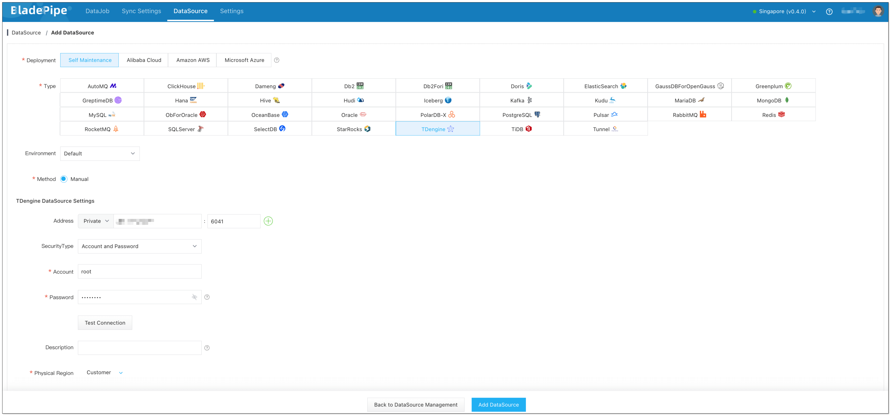
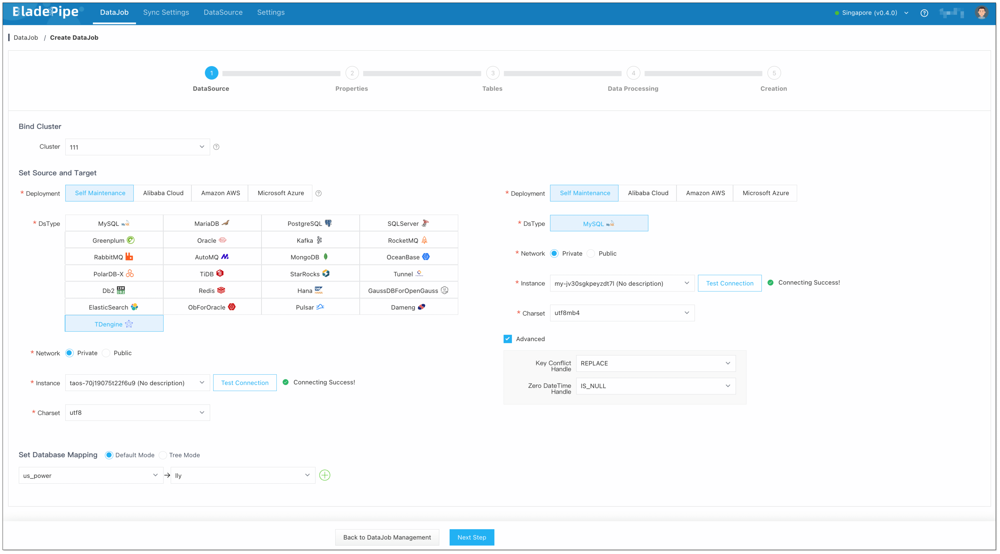
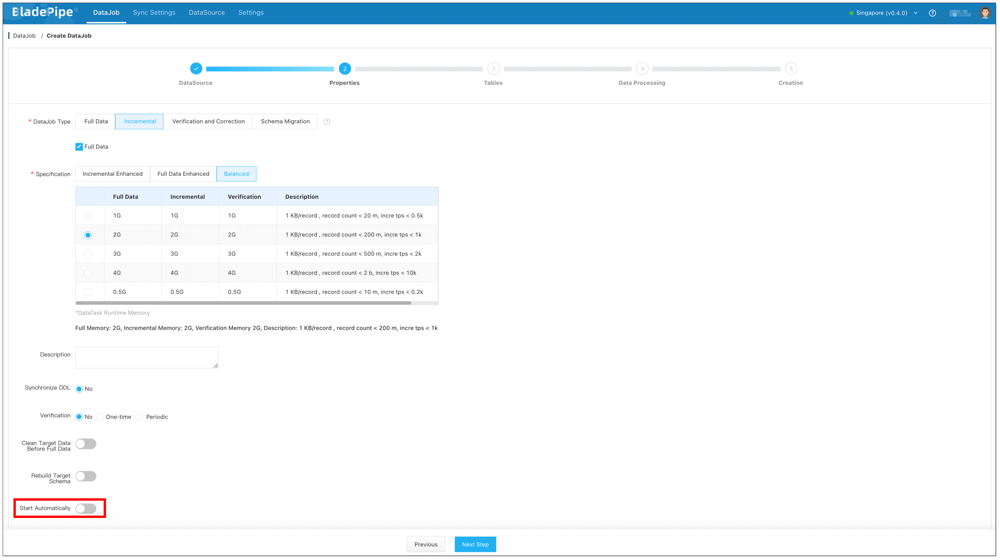
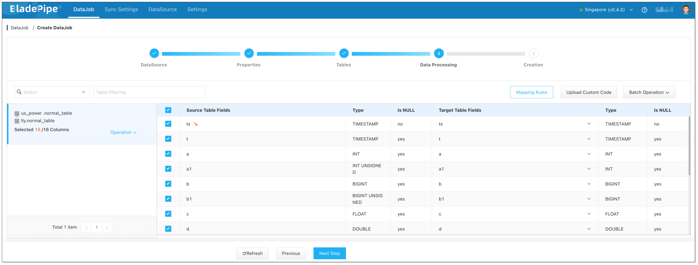
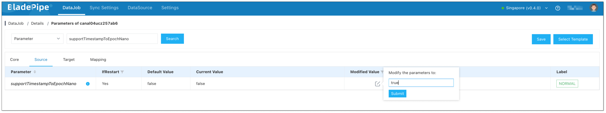
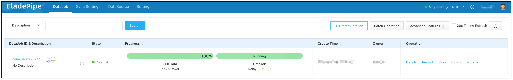

## Overview

**TDengine** is an open-source, high-performance, cloud-native time series database designed for IoT, IoV, IIoT, finance, IT operations and other scenarios. In the era of industry 4.0, time series databases are widely used in power, rail, smart manufacturing and other fields.

**MySQL** is an open-source relational database widely used around the world. It can efficiently handle large amounts of data and complex queries, and has strong stability and reliability.

This tutorial introduces how to sync data from TDengine to MySQL using [BladePipe](https://www.bladepipe.com) in minutes.

## Use Cases
- **Data Backup and Archiving**: Migrate TDengine data to MySQL as backup, or move legacy TDengine data to MySQL for long-term storage, improving data security and high availability.
- **Complex Query**: MySQL supports complex SQL queries and transaction processing. Moving data from TDengine to MySQL is necessary when in-depth analysis or complex queries of time series data are needed.
- **Data Integration and Sharing**: In an organization, multiple databases are usually used at the same time to satisfy different purposes. Replicating TDengine data to MySQL can facilitate the associated analysis of time series data with other business data.
- **Data Analysis**: After synchronizing TDengine data to MySQL, the data can be further moved to other OLAPs or data warehouses through BladePipe for more complex data analysis and operations, thus maximizing data value and meeting diverse business needs.

## Procedure

### Step 1: Install BladePipe

Follow the instructions in [Install Worker (Docker)](https://www.bladepipe.com/docs/productOP/byoc/installation/install_worker_docker) or [Install Worker (Binary)](https://www.bladepipe.com/docs/productOP/byoc/installation/install_worker_binary) to download and install a BladePipe Worker.

### Step 2: Add DataSources

1. Log in to the [BladePipe Cloud](https://cloud.bladepipe.com).
2. Click **DataSource** > **Add DataSource**.
3. Select the source and target DataSource type, and fill out the setup form respectively.
  

### Step 3: Create a DataJob

1. Click **DataJob** > [**Create DataJob**](https://doc.bladepipe.com/operation/job_manage/create_job/create_full_incre_task).
2. Select the source and target DataSources, and click **Test Connection** to ensure the connection to the source and target DataSources are both successful.
   
   
3. Select **Incremental** for DataJob Type, together with the **Full Data** option.
   :::info
   Don't enable **Start Automatically** now, as the values of some parameters may need to be modified later.
   :::
   
4. Select the tables to be replicated.
5. Select the columns to be replicated.

   :::info
   If you need to sync data from a super table, please click **Operation > Filtering** to set the filtering conditions for subtable subscription. All subtables are subscribed by default. For more details, please refer to [TDengine Query Topic](https://docs.tdengine.com/advanced-features/data-subscription/#query-topic). 

   If you need to replicate nanosecond timestamp, please manually create a table at the target instance. The Timestamp column at the source instance will be mapped to the BIGINT type column at the target instance.
   :::
   
6. Confirm the DataJob creation.

   :::info
   The DataJob creation process involves several steps. Click **Sync Settings** > [**ConsoleJob**](https://doc.bladepipe.com/operation/job_setting/console_job_manage), find the DataJob creation record, and click **Details** to view it.

   The DataJob creation with a source TDengine instance includes the following steps:
   - Allocation of DataJobs to BladePipe Workers 
   - Creation of DataJob FSM (Finite State Machine) 
   - Completion of DataJob creation
   :::

7. Go to the DataJob Details page. Click **Functions** > **[Modify DataJob Params](https://doc.bladepipe.com/operation/job_manage/job_op/job_params)** in the upper-right corner, and modify the values of the following parameters if needed.   
   - **srcTimezone** (source parameter): It represents the time zone of the source data source. UTC by default. Please make sure that the time zone here is consistent with the exact time zone of the source data source. 
   - **supportTimestampToEpochNano** (source parameter): Choose whether to enable Timestamp-Number conversion. False by default. 
   - **dstTimezone** (target parameter): It represents the time zone of the target data source. Please make sure that the time zone here is consistent with the exact time zone of the target data source. 
  
   
  
8. Now the DataJob is created and started. BladePipe will automatically run the following DataTasks:
    - **Full Data Migration**: All existing data from the source tables will be fully migrated to the target database.
    - **Incremental Synchronization**: Ongoing data changes will be continuously synchronized to the target database with ultra-low latency.
  
   
